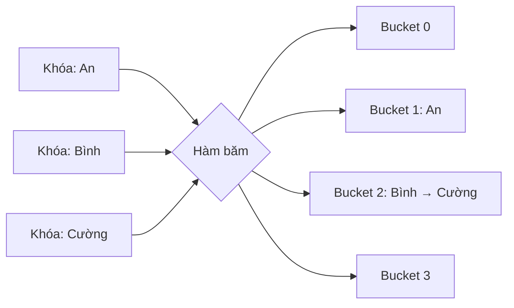
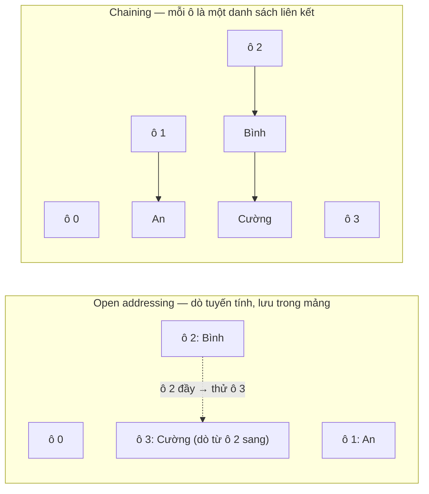

# Bảng băm (Hash Table)

## Khái niệm

Bảng băm (hash table, còn gọi hash map) là một cấu trúc dữ liệu ánh xạ **khóa (key)** tới **giá trị (value)** cho phép tra cứu, chèn và xóa với thời gian **trung bình O(1)**. Cốt lõi là một **hàm băm (hash function)** chuyển khóa thành một chỉ số trong mảng chứa dữ liệu (gọi là *bucket* — ô chứa). Đây là cấu trúc đứng sau `dict` của Python, `HashMap` của Java, đối tượng của JavaScript.

Hàm băm ánh xạ khóa vào các bucket; hai khóa trùng ô tạo va chạm (giải quyết bằng chuỗi móc nối):



## Khi nào dùng / Vì sao quan trọng

Dùng bảng băm khi cần **tra cứu theo khóa cực nhanh**:

- Từ điển, bộ nhớ đệm (cache), đếm tần suất, khử trùng lặp (deduplication).
- Kiểm tra một phần tử có tồn tại không trong O(1) (tập hợp — set).
- Lập chỉ mục, bảng ký hiệu của trình biên dịch, định tuyến.

## Cách hoạt động

### Hàm băm (hash function)

Hàm băm nhận khóa và trả về một số nguyên, rồi lấy dư cho kích thước mảng để ra chỉ số: `index = hash(key) % capacity`. Một hàm băm tốt cần:

- **Xác định (deterministic):** cùng khóa luôn cho cùng kết quả.
- **Phân bố đều (uniform):** rải khóa đều khắp các ô để giảm va chạm.
- **Nhanh** để tính toán.

### Va chạm (collision)

Khi hai khóa khác nhau băm ra cùng một chỉ số → **va chạm**. Vì số khóa có thể lớn hơn số ô, va chạm là không thể tránh khỏi. Có hai chiến lược xử lý chính:

#### 1. Nối chuỗi (chaining / separate chaining)

Mỗi ô chứa một **danh sách liên kết** (hoặc cây) các cặp khóa–giá trị cùng băm vào đó. Khi va chạm, thêm vào danh sách của ô. Đơn giản, chịu được hệ số tải cao, nhưng tốn bộ nhớ con trỏ.

#### 2. Địa chỉ mở (open addressing)

Mọi phần tử lưu ngay trong mảng; khi ô đã đầy thì **dò (probing)** tìm ô trống khác:

- **Dò tuyến tính (linear probing):** thử ô kế tiếp `(i+1), (i+2)...` — dễ bị cụm (clustering).
- **Dò bậc hai (quadratic probing):** thử `i+1², i+2²...` — giảm cụm.
- **Băm kép (double hashing):** dùng hàm băm thứ hai để quyết định bước nhảy.

Hai chiến lược xử lý cùng một va chạm (khóa "Bình" và "Cường" đều băm vào ô 2) theo hai cách khác nhau — chaining nối ra ngoài, open addressing dò sang ô trống kế tiếp:



### Hệ số tải & tái băm (load factor & rehashing)

**Hệ số tải** = số phần tử / số ô. Khi vượt ngưỡng (thường 0.7), bảng **tái băm (rehash)**: cấp phát mảng lớn hơn rồi băm lại toàn bộ khóa để giữ hiệu năng O(1).

## Thử ngay: bảng băm với chaining in va chạm

!!! tip "Chạy được ngay trong trình duyệt"
    Bấm **▶ Chạy** để chèn các cặp khóa–giá trị vào một bảng băm tự cài (chaining) với **mảng chỉ 4 ô** — cố ý nhỏ để dễ thấy va chạm. Đoạn mã in ra ô đích của từng khóa, báo va chạm, rồi vẽ trạng thái các ô. Thử thêm khóa hoặc đổi `capacity`.

<div class="js-demo" data-title="Bảng băm (chaining) — theo dõi va chạm">
<textarea class="js-demo-src">
class HashTable {
  constructor(capacity = 4) {
    this.capacity = capacity;
    this.size = 0;
    this.buckets = Array.from({ length: capacity }, () => []); // mỗi ô là 1 danh sách
  }

  // Hàm băm chuỗi kiểu djb2 rồi lấy dư cho số ô
  _hash(key) {
    let h = 5381;
    for (const ch of String(key)) h = ((h * 33) ^ ch.charCodeAt(0)) >>> 0;
    return h % this.capacity;
  }

  put(key, value) {
    const idx = this._hash(key);
    const bucket = this.buckets[idx];
    if (bucket.length > 0 && !bucket.some(([k]) => k === key)) {
      // Ô đã có khóa khác → đây là một va chạm
      print(`⚠ Va chạm tại ô ${idx}: "${key}" đụng ${bucket.map(([k]) => `"${k}"`).join(', ')}`);
    }
    for (const pair of bucket) {
      if (pair[0] === key) { pair[1] = value; return; }   // cập nhật nếu đã có
    }
    bucket.push([key, value]);                             // nối vào cuối danh sách
    this.size++;
    print(`+ Chèn "${key}"=${value} vào ô ${idx}`);
  }

  get(key) {
    const bucket = this.buckets[this._hash(key)];
    for (const [k, v] of bucket) if (k === key) return v;
    return undefined;
  }

  dump() {
    print('--- Trạng thái các ô ---');
    this.buckets.forEach((b, i) => {
      const content = b.length ? b.map(([k, v]) => `${k}=${v}`).join(' → ') : '(trống)';
      print(`ô ${i}: ${content}`);
    });
    print(`Hệ số tải = ${this.size}/${this.capacity} = ${(this.size / this.capacity).toFixed(2)}`);
  }
}

const ht = new HashTable(4);
for (const [k, v] of [['An', 1], ['Bình', 2], ['Cường', 3], ['Dũng', 4], ['An', 99]]) {
  ht.put(k, v);
}
print('');
ht.dump();
print('');
print('get("Cường") =', ht.get('Cường'));
print('get("An")    =', ht.get('An'), '(đã cập nhật)');
</textarea>
</div>

## Ví dụ

### Dùng cấu trúc có sẵn

=== "JavaScript"
    ```js
    const phone = new Map();
    phone.set("An", "0901");        // chèn
    phone.set("Bình", "0902");
    console.log(phone.get("An"));    // tra cứu → 0901
    console.log(phone.has("Bình"));  // kiểm tra tồn tại → true
    phone.delete("An");              // xóa
    ```

=== "Python"
    ```python
    phone = {}
    phone["An"] = "0901"         # chèn
    phone["Bình"] = "0902"
    print(phone["An"])            # tra cứu → 0901
    print("Bình" in phone)        # kiểm tra tồn tại → True
    del phone["An"]               # xóa
    ```

### Tự cài bảng băm với chaining

=== "JavaScript"
    ```js
    class HashTable {
      constructor(capacity = 8) {
        this.capacity = capacity;
        this.buckets = Array.from({ length: capacity }, () => []); // mỗi ô là 1 list
      }

      _index(key) {
        let h = 5381;
        for (const ch of String(key)) h = ((h * 33) ^ ch.charCodeAt(0)) >>> 0;
        return h % this.capacity;                 // hàm băm → chỉ số
      }

      put(key, value) {
        const bucket = this.buckets[this._index(key)];
        for (const pair of bucket) {
          if (pair[0] === key) { pair[1] = value; return; }  // cập nhật nếu đã có
        }
        bucket.push([key, value]);                // va chạm → nối vào list
      }

      get(key) {
        const bucket = this.buckets[this._index(key)];
        for (const [k, v] of bucket) if (k === key) return v;
        throw new Error("KeyError: " + key);
      }
    }

    const ht = new HashTable();
    ht.put("x", 10);
    ht.put("y", 20);
    console.log(ht.get("x"));   // 10
    ```

=== "Python"
    ```python
    class HashTable:
        def __init__(self, capacity=8):
            self.capacity = capacity
            self.buckets = [[] for _ in range(capacity)]  # mỗi ô là 1 list

        def _index(self, key):
            return hash(key) % self.capacity   # hàm băm → chỉ số

        def put(self, key, value):
            bucket = self.buckets[self._index(key)]
            for i, (k, _) in enumerate(bucket):
                if k == key:
                    bucket[i] = (key, value)   # cập nhật nếu đã có
                    return
            bucket.append((key, value))        # va chạm → nối vào list

        def get(self, key):
            bucket = self.buckets[self._index(key)]
            for k, v in bucket:
                if k == key:
                    return v
            raise KeyError(key)

    ht = HashTable()
    ht.put("x", 10)
    ht.put("y", 20)
    print(ht.get("x"))   # 10
    ```

### Ứng dụng: đếm tần suất

```python
from collections import defaultdict

def count_words(text):
    freq = defaultdict(int)
    for w in text.split():
        freq[w] += 1          # tra cứu + cập nhật O(1)
    return dict(freq)

print(count_words("mèo chó mèo cá mèo"))
# {'mèo': 3, 'chó': 1, 'cá': 1}
```

### Bloom filter (bộ lọc xác suất)

Bloom filter là cấu trúc dựa trên ý tưởng băm, dùng để kiểm tra "phần tử **có thể** thuộc tập hợp" với bộ nhớ cực ít. Nó có thể báo **dương tính giả (false positive)** nhưng **không bao giờ âm tính giả** — nếu nói "không có" thì chắc chắn không có.

```python
class BloomFilter:
    def __init__(self, size=100, num_hashes=3):
        self.size = size
        self.num_hashes = num_hashes
        self.bits = [0] * size

    def _hashes(self, item):
        for i in range(self.num_hashes):
            yield hash((i, item)) % self.size   # nhiều hàm băm

    def add(self, item):
        for h in self._hashes(item):
            self.bits[h] = 1          # bật các bit tương ứng

    def might_contain(self, item):
        return all(self.bits[h] for h in self._hashes(item))

bf = BloomFilter()
bf.add("mèo")
print(bf.might_contain("mèo"))  # True (chắc đã thêm)
print(bf.might_contain("chó"))  # thường False; có thể True (dương tính giả)
```

## Độ phức tạp

| Thao tác | Trung bình | Xấu nhất |
|----------|-----------|----------|
| Tra cứu (get) | O(1) | O(n) |
| Chèn (put) | O(1) | O(n) |
| Xóa (delete) | O(1) | O(n) |
| Bộ nhớ | O(n) | O(n) |

Trường hợp xấu nhất O(n) xảy ra khi mọi khóa va chạm vào cùng một ô (hàm băm kém). Bloom filter: thêm/kiểm tra đều O(k) với k là số hàm băm.

### Vì sao có các con số này?

!!! question "Tại sao tra cứu trung bình là O(1) nhưng xấu nhất lại O(n)?"
    Bảng băm có một "đường tắt": hàm băm **tính thẳng** ra chỉ số ô từ khóa (`index = hash(key) % capacity`) — một phép tính, không phải dò tìm. Nhảy tới ô đó là O(1). Nhưng đó mới là bước tìm **ô**; bên trong ô còn phải khớp đúng khóa.

    - **Trung bình O(1):** khi hàm băm rải khóa **đều** và số ô đủ lớn, mỗi ô trung bình chỉ chứa rất ít phần tử (khoảng bằng hệ số tải, ví dụ ~0.7). Vậy sau khi nhảy tới ô, ta chỉ phải so vài phần tử — coi như hằng số → O(1).
    - **Xấu nhất O(n):** nếu hàm băm kém (hoặc kẻ tấn công cố tình chọn khóa), **mọi khóa dồn hết vào một ô**. Ô đó biến thành một **danh sách liên kết dài n phần tử** (chaining) hoặc một dải ô bị dò liên tục (open addressing). Lúc này tra cứu phải quét tuyến tính cả `n` phần tử trong ô → O(n), y hệt tìm kiếm trên danh sách. Bảng băm đánh mất hoàn toàn lợi thế.

    Nói cách khác: O(1) là **lời hứa có điều kiện** — nó chỉ đúng khi va chạm được giữ ở mức thấp. Con số "trung bình" giả định phân bố đều; con số "xấu nhất" là khi giả định đó sụp đổ.

!!! question "Tại sao cần hàm băm tốt và phải kiểm soát hệ số tải?"
    Hai yếu tố này chính là thứ **giữ cho lời hứa O(1) không bị phá vỡ** — mỗi cái chặn một nguyên nhân làm ô bị dồn:

    - **Hàm băm tốt** lo phần **phân bố**: nếu nó rải khóa đều khắp các ô, không ô nào bị quá tải, độ dài mỗi chuỗi va chạm ở mức nhỏ. Hàm băm kém (ví dụ luôn trả cùng một số) dồn mọi khóa vào một ô → tụt về O(n) dù bảng còn trống mênh mông. Vì thế hàm băm cần **phân bố đều** và **xác định**.
    - **Hệ số tải** (số phần tử / số ô) lo phần **mật độ**: dù hàm băm hoàn hảo, nếu nhét quá nhiều phần tử vào quá ít ô thì va chạm vẫn tăng chỉ vì "hết chỗ" (nguyên lý chuồng bồ câu). Khi hệ số tải vượt ngưỡng (thường ~0.7), bảng **tái băm (rehash)**: cấp mảng lớn gấp đôi rồi băm lại toàn bộ khóa, kéo mật độ xuống để mỗi ô lại thưa. Rehash một lần tốn O(n), nhưng chia đều cho rất nhiều lần chèn nên chi phí mỗi lần chèn vẫn là **O(1) khấu hao (amortized)**.

    Ẩn dụ: hàm băm tốt = xếp khách đều ra nhiều bàn; hệ số tải thấp = có đủ bàn để không bàn nào chật. Thiếu một trong hai, "phục vụ tức thì" biến thành "xếp hàng dài".

!!! question "Tại sao chaining và open addressing lại đánh đổi khác nhau?"
    Cả hai giải quyết cùng một vấn đề (va chạm) nhưng chọn **nơi cất phần tử dư**, và lựa chọn đó kéo theo các hệ quả trái ngược:

    - **Chaining (nối chuỗi):** phần tử va chạm được **cất ra ngoài mảng** trong một danh sách liên kết gắn vào ô. Ưu: đơn giản, **chịu được hệ số tải cao** (thậm chí > 1) mà không "vỡ trận", xóa dễ. Nhược: tốn thêm bộ nhớ cho **con trỏ** của mỗi nút, và các nút nằm rải rác khắp bộ nhớ nên **kém thân thiện với cache** của CPU.
    - **Open addressing (địa chỉ mở):** không có danh sách ngoài — mọi phần tử **nằm ngay trong mảng**; khi ô đầy thì **dò (probing)** sang ô trống kế tiếp. Ưu: không tốn con trỏ, dữ liệu **liền kề nên tận dụng cache tốt**, thường nhanh hơn khi bảng còn thưa. Nhược: **rất nhạy với hệ số tải** — khi bảng gần đầy, chuỗi dò dài ra nhanh chóng (đặc biệt dò tuyến tính gây **cụm — clustering**), nên phải giữ hệ số tải thấp hơn (thường < 0.7) và **rehash sớm hơn**; xóa cũng phức tạp (phải đánh dấu "đã xóa" để không làm đứt chuỗi dò).

    Tóm lại đánh đổi cốt lõi: chaining đổi **thêm bộ nhớ con trỏ** lấy **sự bền bỉ trước tải cao**; open addressing đổi **sự nhạy cảm với tải** lấy **bộ nhớ gọn và cache tốt**.

## Ưu / nhược điểm

- **Ưu:**
  - Tra cứu/chèn/xóa trung bình O(1) — nhanh nhất cho tra cứu theo khóa.
  - Linh hoạt với mọi kiểu khóa băm được.
- **Nhược:**
  - Không giữ thứ tự phần tử (dùng cây nếu cần thứ tự).
  - Hiệu năng phụ thuộc hàm băm; va chạm nhiều làm chậm về O(n).
  - Tốn bộ nhớ dư (ô trống) và chi phí tái băm khi mở rộng.

## Câu hỏi phỏng vấn thường gặp

1. **Hàm băm tốt cần tính chất gì?** Xác định, phân bố đều, tính nhanh, ít va chạm.
2. **Va chạm là gì và xử lý thế nào?** Hai khóa băm ra cùng chỉ số; xử lý bằng chaining (nối danh sách) hoặc open addressing (dò ô trống).
3. **Chaining và open addressing khác nhau ra sao?** Chaining lưu ngoài ô bằng danh sách; open addressing lưu trong mảng, tìm ô trống khi va chạm.
4. **Hệ số tải (load factor) là gì?** Tỉ lệ số phần tử trên số ô; vượt ngưỡng thì tái băm để giữ O(1).
5. **Vì sao tra cứu trung bình O(1) nhưng xấu nhất O(n)?** Xấu nhất khi mọi khóa va chạm vào một ô, biến tra cứu thành duyệt danh sách.
6. **Bloom filter dùng khi nào?** Khi cần kiểm tra tồn tại với bộ nhớ cực nhỏ và chấp nhận dương tính giả (ví dụ lọc URL, kiểm tra cache).
7. **Khi nào nên dùng cây thay vì bảng băm?** Khi cần dữ liệu có thứ tự hoặc truy vấn khoảng (range query) — bảng băm không bảo toàn thứ tự.

## Tham khảo

- Nội dung được biên dịch và điều chỉnh từ tài liệu cấu trúc dữ liệu của dự án.
