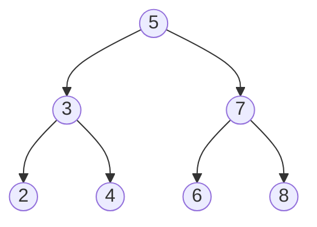

# Cây (Tree)

## Khái niệm

Cây (tree) là một cấu trúc dữ liệu **phi tuyến tính (non-linear)** gồm các nút (node) được tổ chức theo quan hệ cha–con, tạo thành thứ bậc. Một cây có đúng một **gốc (root)**; mỗi nút có thể có nhiều **con (children)** nhưng chỉ một **cha (parent)**; nút không có con gọi là **lá (leaf)**. Không có chu trình — giữa hai nút bất kỳ chỉ có một đường đi duy nhất.

Ví dụ một cây nhị phân với gốc là 5:



## Khi nào dùng / Vì sao quan trọng

Cây biểu diễn dữ liệu phân cấp và cho phép tìm kiếm/chèn/xóa hiệu quả:

- Hệ thống tệp, cây DOM của HTML, cây cú pháp của trình biên dịch.
- Tìm kiếm có thứ tự với **cây tìm kiếm nhị phân (BST)** và các biến thể tự cân bằng.
- Chỉ mục cơ sở dữ liệu và hệ thống tệp với **B-tree / B+ tree**.
- Hàng đợi ưu tiên với **heap**; tìm tiền tố/từ điển với **trie**.

## Cách hoạt động

### Thuật ngữ cơ bản

- **Độ sâu (depth):** số cạnh từ gốc tới nút đó. **Chiều cao (height):** số cạnh dài nhất từ nút tới lá.
- **Cây nhị phân (binary tree):** mỗi nút có tối đa 2 con (trái/phải).
- **Duyệt cây:** trung thứ tự (in-order), tiền thứ tự (pre-order), hậu thứ tự (post-order), theo mức (level-order/BFS).

### Cây tìm kiếm nhị phân (Binary Search Tree — BST)

Với mỗi nút: mọi giá trị ở cây con trái **nhỏ hơn** nút, mọi giá trị ở cây con phải **lớn hơn**. Nhờ đó tìm kiếm/chèn/xóa trung bình O(log n) — mỗi bước so sánh loại được một nửa cây còn lại, y hệt tìm kiếm nhị phân trên mảng. Điểm mấu chốt: **duyệt in-order một BST luôn cho dãy tăng dần**, đó là bất biến (invariant) dùng để kiểm tra một cây có phải BST hợp lệ hay không.

Ba thao tác cốt lõi:

- **Tìm kiếm:** so khóa với nút hiện tại, nhỏ hơn thì sang trái, lớn hơn thì sang phải, tới khi trùng hoặc chạm `null`.
- **Chèn:** đi xuống như tìm kiếm tới vị trí trống rồi gắn nút mới vào đó.
- **Xóa:** ba tình huống — nút lá (bỏ trực tiếp), nút có một con (nối con lên thay cha), nút có hai con (thay bằng **kế vị in-order** — nút nhỏ nhất của cây con phải — rồi xóa nút kế vị đó).

Điểm yếu chí mạng: nếu chèn dữ liệu **đã sắp xếp** (1, 2, 3, 4...), mỗi nút chỉ có con phải, cây suy biến thành danh sách liên kết → mọi thao tác thành O(n). Đây chính là lý do tồn tại của cây tự cân bằng.

### Cây tự cân bằng (self-balancing trees)

Để tránh suy biến, cây tự cân bằng tự động điều chỉnh sau mỗi lần chèn/xóa để giữ chiều cao ~ O(log n):

- **Cây AVL:** với mỗi nút, **hệ số cân bằng** = chiều cao(cây con trái) − chiều cao(cây con phải) phải nằm trong {−1, 0, +1}. Khi chèn/xóa làm lệch quá ngưỡng, ta khôi phục bằng bốn kiểu **xoay (rotation)**: LL (xoay phải), RR (xoay trái), LR và RL (xoay kép). Vì cân bằng rất chặt (chiều cao ≤ 1.44·log₂n), tìm kiếm cực nhanh — thích hợp khi **đọc nhiều, ghi ít** (từ điển tra cứu, cơ sở dữ liệu chỉ đọc).
- **Cây đỏ-đen (Red-Black tree):** mỗi nút tô màu đỏ hoặc đen theo 5 quy tắc (gốc đen, lá `null` đen, không có hai nút đỏ liền nhau, mọi đường từ một nút xuống lá có cùng số nút đen...). Các quy tắc này bảo đảm đường dài nhất không quá gấp đôi đường ngắn nhất → chiều cao ≤ 2·log₂(n+1). Cân bằng **lỏng hơn AVL** nên mỗi lần chèn/xóa cần ít phép xoay hơn (tối đa 2–3 lần xoay), phù hợp khi **ghi nhiều**. Đây là cấu trúc đứng sau `std::map`/`std::set` (C++), `TreeMap`/`TreeSet` (Java) và bộ lập lịch CFS của nhân Linux.

Tóm lại: AVL cân bằng chặt hơn → tìm kiếm nhanh hơn một chút; Red-Black ghi nhanh hơn → phổ biến trong thư viện chuẩn.

### B-tree

Cây đa nhánh: mỗi nút chứa **nhiều khóa** (ví dụ hàng trăm) và **nhiều con**, khiến cây **thấp và rất rộng**. Một B-tree bậc `m` có mỗi nút tối đa `m−1` khóa và `m` con; các khóa trong một nút sắp tăng dần, con giữa hai khóa chứa các giá trị nằm giữa. Vì mỗi lần đọc đĩa/SSD tải được cả một trang (page) dữ liệu lớn, gom nhiều khóa vào một nút giúp **giảm số lần truy cập đĩa** — chỉ số cây có chiều cao 3–4 đủ chứa hàng triệu bản ghi. Đây là nền tảng của chỉ mục cơ sở dữ liệu (MySQL InnoDB, PostgreSQL) và hệ thống tệp (NTFS, HFS+). Biến thể **B+ tree** lưu toàn bộ dữ liệu **chỉ ở lá** và **nối các lá thành danh sách liên kết**, nên vừa tra cứu điểm nhanh vừa **quét khoảng (range scan)** cực hiệu quả — quét tuần tự các lá liền kề mà không cần quay lại nút trong.

### Heap (min-heap / max-heap)

Cây nhị phân **gần hoàn chỉnh (complete)** — mọi mức được lấp đầy trừ mức cuối lấp từ trái sang — thỏa **tính chất heap**: trong **max-heap**, cha ≥ con; trong **min-heap**, cha ≤ con. Gốc luôn là phần tử lớn/nhỏ nhất. Nhờ tính chất "gần hoàn chỉnh", heap lưu gọn trong **mảng** không cần con trỏ: con của nút `i` là `2i+1` và `2i+2`, cha là `(i−1)//2`. Hai thao tác chính đều O(log n): **sift-up** (đẩy phần tử mới lên khi chèn) và **sift-down** (kéo gốc xuống sau khi lấy phần tử cực trị). Ứng dụng: hàng đợi ưu tiên, thuật toán Dijkstra/Prim, heapsort, tìm top-k phần tử.

### Trie (cây tiền tố)

Cây lưu chuỗi theo **từng ký tự**: mỗi cạnh gắn một ký tự, đường đi từ gốc tới một nút tạo thành một tiền tố; nút được đánh dấu `is_end` khi tiền tố đó là một từ hoàn chỉnh. Tra cứu hoặc tìm mọi từ theo tiền tố chỉ tốn O(L) với L là độ dài chuỗi — **không phụ thuộc số lượng từ đã lưu**. Nhờ đó trie mạnh cho gợi ý từ (autocomplete), kiểm tra chính tả, tìm từ chung tiền tố dài nhất và **định tuyến IP** (longest prefix match). Đánh đổi: tốn nhiều bộ nhớ vì mỗi nút giữ một bảng con cho các ký tự (có thể tối ưu bằng **radix tree / Patricia trie** — nén các chuỗi cạnh chỉ có một con).

## Thử ngay: xây BST và duyệt cây

!!! tip "Chạy được ngay trong trình duyệt"
    Bấm **▶ Chạy**. Đoạn mã chèn các số vào một BST rồi in ba kiểu duyệt. Hãy đổi mảng `values` (ví dụ thêm số trùng, hoặc nhập dãy đã sắp để thấy cây suy biến) rồi chạy lại.

<div class="js-demo" data-title="Cây tìm kiếm nhị phân — chèn & duyệt in/pre/post-order">
<textarea class="js-demo-src">
class TreeNode {
  constructor(val) { this.val = val; this.left = null; this.right = null; }
}

function insert(root, val) {
  if (root === null) return new TreeNode(val);   // ô trống → tạo nút
  if (val < root.val) root.left = insert(root.left, val);   // nhỏ hơn → sang trái
  else if (val > root.val) root.right = insert(root.right, val); // lớn hơn → sang phải
  // val === root.val: bỏ qua trùng lặp
  return root;
}

function inorder(root, out) {        // trái → gốc → phải  ⇒ dãy tăng dần
  if (!root) return;
  inorder(root.left, out);
  out.push(root.val);
  inorder(root.right, out);
}
function preorder(root, out) {       // gốc → trái → phải  (dùng để sao chép cây)
  if (!root) return;
  out.push(root.val);
  preorder(root.left, out);
  preorder(root.right, out);
}
function postorder(root, out) {      // trái → phải → gốc  (dùng để xóa/giải phóng cây)
  if (!root) return;
  postorder(root.left, out);
  postorder(root.right, out);
  out.push(root.val);
}

function search(root, val) {
  let buoc = 0;
  while (root) {
    buoc++;
    if (val === root.val) { print(`Tìm ${val}: thấy sau ${buoc} bước`); return true; }
    root = val < root.val ? root.left : root.right;
  }
  print(`Tìm ${val}: không thấy sau ${buoc} bước`);
  return false;
}

const values = [5, 3, 7, 2, 4, 6, 8];
let root = null;
for (const v of values) root = insert(root, v);
print('Chèn theo thứ tự:', values.join(' '));

const io = []; inorder(root, io);
const pre = []; preorder(root, pre);
const post = []; postorder(root, post);
print('In-order   :', io.join(' '), '  ← luôn tăng dần');
print('Pre-order  :', pre.join(' '));
print('Post-order :', post.join(' '));

search(root, 4);
search(root, 9);
</textarea>
</div>

## Ví dụ

### Cây tìm kiếm nhị phân (BST)

=== "JavaScript"
    ```js
    class TreeNode {
      constructor(val) { this.val = val; this.left = null; this.right = null; }
    }

    function insert(root, val) {
      if (root === null) return new TreeNode(val);        // vị trí trống → tạo nút
      if (val < root.val) root.left = insert(root.left, val);   // nhỏ hơn → sang trái
      else root.right = insert(root.right, val);               // lớn hơn → sang phải
      return root;
    }

    function search(root, val) {
      if (root === null || root.val === val) return root;
      return val < root.val ? search(root.left, val) : search(root.right, val);
    }

    function inorder(root, out = []) {   // trả về dãy đã sắp xếp tăng dần
      if (root) { inorder(root.left, out); out.push(root.val); inorder(root.right, out); }
      return out;
    }

    let root = null;
    for (const x of [5, 3, 7, 2, 4, 6]) root = insert(root, x);
    console.log(inorder(root).join(" "));   // 2 3 4 5 6 7
    ```

=== "Python"
    ```python
    class TreeNode:
        def __init__(self, val):
            self.val = val
            self.left = None
            self.right = None

    def insert(root, val):
        if root is None:
            return TreeNode(val)          # vị trí trống → tạo nút
        if val < root.val:
            root.left = insert(root.left, val)   # nhỏ hơn → sang trái
        else:
            root.right = insert(root.right, val) # lớn hơn → sang phải
        return root

    def search(root, val):
        if root is None or root.val == val:
            return root
        if val < root.val:
            return search(root.left, val)
        return search(root.right, val)

    def inorder(root):                    # trả về dãy đã sắp xếp tăng dần
        if root:
            inorder(root.left)
            print(root.val, end=" ")
            inorder(root.right)

    root = None
    for x in [5, 3, 7, 2, 4, 6]:
        root = insert(root, x)
    inorder(root)   # 2 3 4 5 6 7
    ```

### Min-heap

=== "JavaScript"
    ```js
    // JS không có heap sẵn — cài min-heap gọn bằng mảng
    class MinHeap {
      constructor() { this.h = []; }
      push(x) {
        this.h.push(x);
        let i = this.h.length - 1;
        while (i > 0) {                       // sift-up: đẩy phần tử nhỏ lên
          const p = (i - 1) >> 1;
          if (this.h[p] <= this.h[i]) break;
          [this.h[p], this.h[i]] = [this.h[i], this.h[p]];
          i = p;
        }
      }
      pop() {
        const top = this.h[0], last = this.h.pop();
        if (this.h.length) {
          this.h[0] = last;
          let i = 0, n = this.h.length;
          while (true) {                       // sift-down: kéo gốc xuống
            let s = i, l = 2*i+1, r = 2*i+2;
            if (l < n && this.h[l] < this.h[s]) s = l;
            if (r < n && this.h[r] < this.h[s]) s = r;
            if (s === i) break;
            [this.h[s], this.h[i]] = [this.h[i], this.h[s]];
            i = s;
          }
        }
        return top;
      }
    }

    const h = new MinHeap();
    for (const x of [5, 1, 8, 3]) h.push(x);   // O(log n) mỗi lần
    console.log(h.pop());                        // 1 — phần tử nhỏ nhất
    ```

=== "Python"
    ```python
    import heapq

    h = []
    for x in [5, 1, 8, 3]:
        heapq.heappush(h, x)      # O(log n) mỗi lần
    print(heapq.heappop(h))       # 1 — phần tử nhỏ nhất luôn ở gốc
    ```

### Trie (cây tiền tố)

=== "JavaScript"
    ```js
    class Trie {
      constructor() { this.root = { children: {}, isEnd: false }; }
      insert(word) {
        let node = this.root;
        for (const ch of word) {
          if (!node.children[ch]) node.children[ch] = { children: {}, isEnd: false };
          node = node.children[ch];
        }
        node.isEnd = true;
      }
      search(word) {
        let node = this.root;
        for (const ch of word) {
          if (!node.children[ch]) return false;
          node = node.children[ch];
        }
        return node.isEnd;
      }
    }

    const t = new Trie();
    t.insert("mèo");
    console.log(t.search("mèo"));  // true
    console.log(t.search("mè"));   // false — chỉ là tiền tố
    ```

=== "Python"
    ```python
    class TrieNode:
        def __init__(self):
            self.children = {}        # ký tự → nút con
            self.is_end = False       # đánh dấu kết thúc một từ

    class Trie:
        def __init__(self):
            self.root = TrieNode()

        def insert(self, word):
            node = self.root
            for ch in word:
                node = node.children.setdefault(ch, TrieNode())
            node.is_end = True

        def search(self, word):
            node = self.root
            for ch in word:
                if ch not in node.children:
                    return False
                node = node.children[ch]
            return node.is_end

    t = Trie()
    t.insert("mèo")
    print(t.search("mèo"))  # True
    print(t.search("mè"))   # False
    ```

## Độ phức tạp

| Cấu trúc | Tìm kiếm | Chèn | Xóa | Ghi chú |
|----------|----------|------|-----|---------|
| BST (trung bình) | O(log n) | O(log n) | O(log n) | Xấu nhất O(n) nếu lệch |
| AVL / Đỏ-đen | O(log n) | O(log n) | O(log n) | Luôn cân bằng |
| B-tree | O(log n) | O(log n) | O(log n) | Tối ưu I/O đĩa |
| Heap | O(n) tìm | O(log n) | O(log n) | Lấy min/max O(1) |
| Trie | O(L) | O(L) | O(L) | L = độ dài chuỗi |

Bộ nhớ nhìn chung O(n); trie tốn nhiều bộ nhớ hơn do lưu con trỏ cho mỗi ký tự.

## Ưu / nhược điểm

- **Ưu:**
  - Biểu diễn dữ liệu phân cấp tự nhiên.
  - Cây cân bằng cho tìm/chèn/xóa O(log n).
  - Heap lấy phần tử cực trị O(1); trie tra cứu theo tiền tố cực nhanh.
- **Nhược:**
  - BST không cân bằng có thể suy biến thành O(n).
  - Cây tự cân bằng phức tạp để cài đặt (xoay, tô màu).
  - Tốn bộ nhớ cho con trỏ; trie đặc biệt tốn bộ nhớ.

## Câu hỏi phỏng vấn thường gặp

1. **Phân biệt cây nhị phân và BST.** Cây nhị phân: mỗi nút ≤ 2 con; BST: thêm ràng buộc trái < nút < phải.
2. **Vì sao cần cây tự cân bằng?** Để tránh BST suy biến thành danh sách, giữ chiều cao O(log n).
3. **AVL và Red-Black khác nhau thế nào?** AVL cân bằng chặt hơn (tìm kiếm nhanh hơn); Red-Black cân bằng lỏng hơn (chèn/xóa ít xoay hơn).
4. **Các kiểu duyệt cây?** In-order (cho BST ra dãy tăng dần), pre-order, post-order, level-order (BFS).
5. **Heap là gì và dùng để làm gì?** Cây nhị phân gần hoàn chỉnh thỏa tính chất cha–con; dùng cho hàng đợi ưu tiên và heapsort.
6. **Vì sao cơ sở dữ liệu dùng B-tree thay vì BST?** B-tree thấp và rộng, giảm số lần truy cập đĩa — tối ưu cho lưu trữ ngoài.
7. **Trie dùng để làm gì?** Autocomplete, kiểm tra chính tả, tìm theo tiền tố, định tuyến IP.

## Tham khảo

- Nội dung được biên dịch và điều chỉnh từ tài liệu cấu trúc dữ liệu của dự án.
