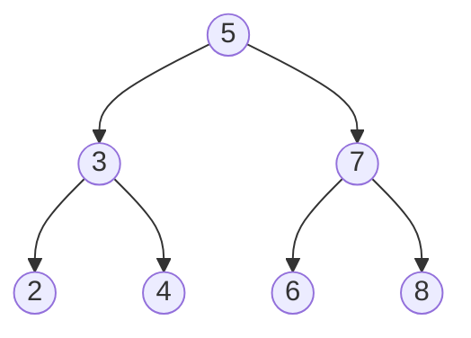

# Cây (Tree)

## Khái niệm

Cây (tree) là một cấu trúc dữ liệu **phi tuyến tính (non-linear)** gồm các nút (node) được tổ chức theo quan hệ cha–con, tạo thành thứ bậc. Một cây có đúng một **gốc (root)**; mỗi nút có thể có nhiều **con (children)** nhưng chỉ một **cha (parent)**; nút không có con gọi là **lá (leaf)**. Không có chu trình — giữa hai nút bất kỳ chỉ có một đường đi duy nhất.

Ví dụ một cây nhị phân với gốc là 5:



## Khi nào dùng / Vì sao quan trọng

Cây biểu diễn dữ liệu phân cấp và cho phép tìm kiếm/chèn/xóa hiệu quả:

- Hệ thống tệp, cây DOM của HTML, cây cú pháp của trình biên dịch.
- Tìm kiếm có thứ tự với **cây tìm kiếm nhị phân (BST)** và các biến thể tự cân bằng.
- Chỉ mục cơ sở dữ liệu và hệ thống tệp với **B-tree / B+ tree**.
- Hàng đợi ưu tiên với **heap**; tìm tiền tố/từ điển với **trie**.

## Cách hoạt động

### Thuật ngữ cơ bản

- **Độ sâu (depth):** số cạnh từ gốc tới nút đó. **Chiều cao (height):** số cạnh dài nhất từ nút tới lá.
- **Cây nhị phân (binary tree):** mỗi nút có tối đa 2 con (trái/phải).
- **Duyệt cây:** trung thứ tự (in-order), tiền thứ tự (pre-order), hậu thứ tự (post-order), theo mức (level-order/BFS).

### Cây tìm kiếm nhị phân (Binary Search Tree — BST)

Với mỗi nút: mọi giá trị ở cây con trái **nhỏ hơn** nút, mọi giá trị ở cây con phải **lớn hơn**. Nhờ đó tìm kiếm/chèn/xóa trung bình O(log n). Nhưng nếu chèn dữ liệu đã sắp xếp, cây suy biến thành danh sách → O(n).

### Cây tự cân bằng (self-balancing trees)

Để tránh suy biến, cây tự cân bằng giữ chiều cao ~ O(log n):

- **Cây AVL:** với mỗi nút, chênh lệch chiều cao hai cây con (hệ số cân bằng) ≤ 1. Cân bằng chặt nhờ phép **xoay (rotation)** → tìm kiếm rất nhanh, nhưng chèn/xóa tốn nhiều phép xoay.
- **Cây đỏ-đen (Red-Black tree):** mỗi nút tô màu đỏ/đen theo các quy tắc đảm bảo đường đi dài nhất không quá gấp đôi đường ngắn nhất. Cân bằng lỏng hơn AVL nên chèn/xóa nhanh hơn; dùng trong `std::map` (C++), `TreeMap` (Java).

### B-tree

Cây đa nhánh (mỗi nút nhiều khóa và nhiều con), **thấp và rộng**, tối ưu cho lưu trữ trên đĩa — giảm số lần đọc đĩa. Là nền tảng của chỉ mục cơ sở dữ liệu và hệ thống tệp. **B+ tree** lưu toàn bộ dữ liệu ở lá và nối các lá lại để quét khoảng (range scan) hiệu quả.

### Heap (min-heap / max-heap)

Cây nhị phân **gần hoàn chỉnh (complete)** thỏa tính chất heap: trong **max-heap**, cha ≥ con; trong **min-heap**, cha ≤ con. Gốc luôn là phần tử lớn/nhỏ nhất. Thường lưu bằng mảng: con của nút `i` là `2i+1` và `2i+2`. Dùng cho hàng đợi ưu tiên và heapsort.

### Trie (cây tiền tố)

Cây lưu chuỗi theo ký tự: mỗi cạnh là một ký tự, đường đi từ gốc tạo thành tiền tố. Tra cứu/tìm tiền tố rất nhanh O(độ dài chuỗi), dùng cho gợi ý từ (autocomplete), kiểm tra chính tả, bộ định tuyến IP.

## Ví dụ

### Cây tìm kiếm nhị phân (BST)

```python
class TreeNode:
    def __init__(self, val):
        self.val = val
        self.left = None
        self.right = None

def insert(root, val):
    if root is None:
        return TreeNode(val)          # vị trí trống → tạo nút
    if val < root.val:
        root.left = insert(root.left, val)   # nhỏ hơn → sang trái
    else:
        root.right = insert(root.right, val) # lớn hơn → sang phải
    return root

def search(root, val):
    if root is None or root.val == val:
        return root
    if val < root.val:
        return search(root.left, val)
    return search(root.right, val)

def inorder(root):                    # trả về dãy đã sắp xếp tăng dần
    if root:
        inorder(root.left)
        print(root.val, end=" ")
        inorder(root.right)

root = None
for x in [5, 3, 7, 2, 4, 6]:
    root = insert(root, x)
inorder(root)   # 2 3 4 5 6 7
```

### Min-heap bằng heapq

```python
import heapq

h = []
for x in [5, 1, 8, 3]:
    heapq.heappush(h, x)      # O(log n) mỗi lần
print(heapq.heappop(h))       # 1 — phần tử nhỏ nhất luôn ở gốc
```

### Trie (cây tiền tố)

```python
class TrieNode:
    def __init__(self):
        self.children = {}        # ký tự → nút con
        self.is_end = False       # đánh dấu kết thúc một từ

class Trie:
    def __init__(self):
        self.root = TrieNode()

    def insert(self, word):
        node = self.root
        for ch in word:
            node = node.children.setdefault(ch, TrieNode())
        node.is_end = True

    def search(self, word):
        node = self.root
        for ch in word:
            if ch not in node.children:
                return False
            node = node.children[ch]
        return node.is_end

t = Trie()
t.insert("mèo")
print(t.search("mèo"))  # True
print(t.search("mè"))   # False
```

## Độ phức tạp

| Cấu trúc | Tìm kiếm | Chèn | Xóa | Ghi chú |
|----------|----------|------|-----|---------|
| BST (trung bình) | O(log n) | O(log n) | O(log n) | Xấu nhất O(n) nếu lệch |
| AVL / Đỏ-đen | O(log n) | O(log n) | O(log n) | Luôn cân bằng |
| B-tree | O(log n) | O(log n) | O(log n) | Tối ưu I/O đĩa |
| Heap | O(n) tìm | O(log n) | O(log n) | Lấy min/max O(1) |
| Trie | O(L) | O(L) | O(L) | L = độ dài chuỗi |

Bộ nhớ nhìn chung O(n); trie tốn nhiều bộ nhớ hơn do lưu con trỏ cho mỗi ký tự.

## Ưu / nhược điểm

- **Ưu:**
  - Biểu diễn dữ liệu phân cấp tự nhiên.
  - Cây cân bằng cho tìm/chèn/xóa O(log n).
  - Heap lấy phần tử cực trị O(1); trie tra cứu theo tiền tố cực nhanh.
- **Nhược:**
  - BST không cân bằng có thể suy biến thành O(n).
  - Cây tự cân bằng phức tạp để cài đặt (xoay, tô màu).
  - Tốn bộ nhớ cho con trỏ; trie đặc biệt tốn bộ nhớ.

## Câu hỏi phỏng vấn thường gặp

1. **Phân biệt cây nhị phân và BST.** Cây nhị phân: mỗi nút ≤ 2 con; BST: thêm ràng buộc trái < nút < phải.
2. **Vì sao cần cây tự cân bằng?** Để tránh BST suy biến thành danh sách, giữ chiều cao O(log n).
3. **AVL và Red-Black khác nhau thế nào?** AVL cân bằng chặt hơn (tìm kiếm nhanh hơn); Red-Black cân bằng lỏng hơn (chèn/xóa ít xoay hơn).
4. **Các kiểu duyệt cây?** In-order (cho BST ra dãy tăng dần), pre-order, post-order, level-order (BFS).
5. **Heap là gì và dùng để làm gì?** Cây nhị phân gần hoàn chỉnh thỏa tính chất cha–con; dùng cho hàng đợi ưu tiên và heapsort.
6. **Vì sao cơ sở dữ liệu dùng B-tree thay vì BST?** B-tree thấp và rộng, giảm số lần truy cập đĩa — tối ưu cho lưu trữ ngoài.
7. **Trie dùng để làm gì?** Autocomplete, kiểm tra chính tả, tìm theo tiền tố, định tuyến IP.

## Tham khảo

- Nội dung được biên dịch và điều chỉnh từ tài liệu cấu trúc dữ liệu của dự án.
