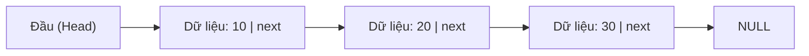
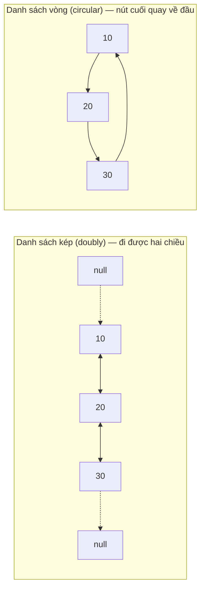
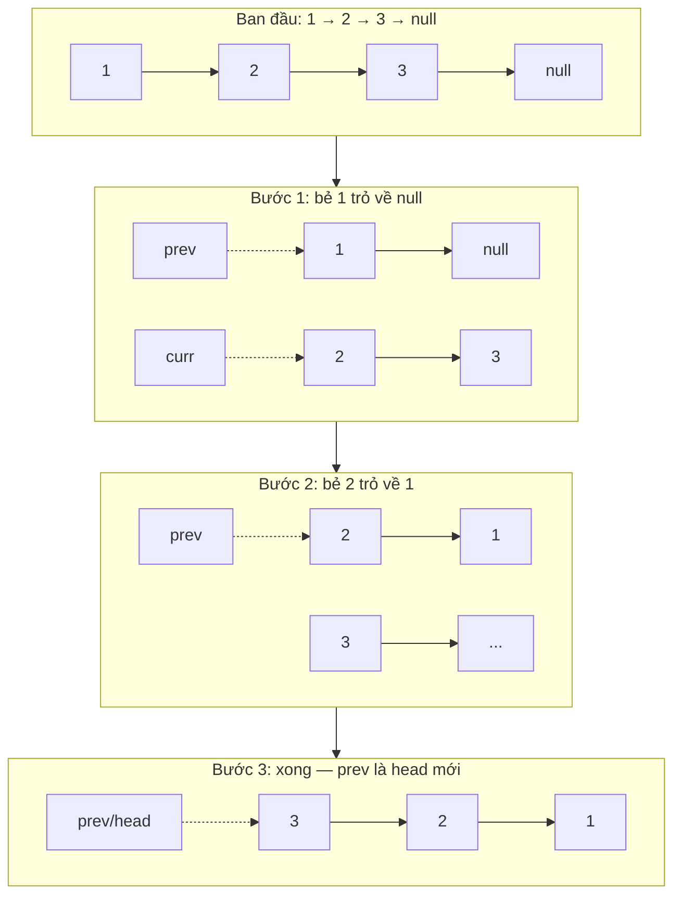

# Danh sách liên kết (Linked List)

## Khái niệm

Danh sách liên kết (linked list) là một cấu trúc dữ liệu tuyến tính trong đó các phần tử **không** được lưu ở các vị trí bộ nhớ liền kề. Thay vào đó, mỗi phần tử — gọi là nút (node) — chứa hai phần: dữ liệu và một tham chiếu (con trỏ) tới nút kế tiếp trong dãy. Nhờ cách liên kết này, việc chèn và xóa phần tử trở nên rất hiệu quả mà không cần dịch chuyển các phần tử khác như mảng.

Mỗi nút trỏ tới nút kế tiếp; nút cuối trỏ tới NULL:



## Khi nào dùng / Vì sao quan trọng

Dùng danh sách liên kết khi:

- Kích thước dữ liệu thay đổi nhiều, không biết trước — danh sách liên kết co giãn linh hoạt lúc chạy.
- Cần **chèn/xóa thường xuyên** ở đầu danh sách hoặc tại vị trí đã biết con trỏ (chi phí O(1)).
- Không cần truy cập ngẫu nhiên theo chỉ số.

Danh sách liên kết là nền tảng để cài đặt ngăn xếp (stack), hàng đợi (queue), đồ thị (dùng danh sách kề), xử lý va chạm trong bảng băm (chaining), và các chức năng như hoàn tác (undo/redo).

## Cách hoạt động

### Thành phần

1. **Nút (node):** Viên gạch cơ bản, gồm:
   - **Data:** giá trị lưu trong nút.
   - **Next:** con trỏ/tham chiếu tới nút kế tiếp.
2. **Head:** nút đầu tiên, là điểm vào của danh sách. Mọi thao tác (như duyệt) đều bắt đầu từ head.
3. **Tail:** nút cuối cùng (tùy chọn ở danh sách đơn, phổ biến ở danh sách kép và vòng). Trong danh sách đơn, `next` của tail trỏ tới `None`/`null`.

### Các loại danh sách liên kết

1. **Danh sách liên kết đơn (singly linked list):** mỗi nút có một con trỏ trỏ tới nút kế tiếp — chỉ duyệt được theo một chiều.
2. **Danh sách liên kết kép (doubly linked list):** mỗi nút có hai con trỏ, một trỏ tới nút sau và một trỏ tới nút trước — duyệt được cả hai chiều.
3. **Danh sách liên kết vòng (circular linked list):** nút cuối trỏ ngược về nút đầu, tạo thành vòng khép kín.

**Danh sách kép** cho phép đi cả hai chiều nhờ con trỏ `prev`; **danh sách vòng** không có `null` ở cuối mà quay lại đầu:



### Các thao tác cơ bản

- **Duyệt (traversal):** bắt đầu từ head, đi theo con trỏ `next` cho tới khi gặp `None` (hoặc quay lại head với danh sách vòng).
- **Chèn (insertion):** ở đầu (điều chỉnh `next` của nút mới trỏ về head rồi cập nhật head), ở cuối (duyệt tới nút cuối rồi nối), hoặc ở giữa (điều chỉnh con trỏ tại vị trí mong muốn).
- **Xóa (deletion):** ở đầu (dời head sang nút thứ hai), ở cuối (duyệt tới nút áp cuối và bỏ con trỏ), hoặc ở giữa (bỏ qua nút cần xóa bằng cách nối con trỏ của nút trước).
- **Tìm kiếm (searching):** duyệt tuần tự để tìm nút có giá trị mong muốn.
- **Cập nhật (updating):** thay đổi giá trị của một nút mà vẫn giữ nguyên cấu trúc liên kết.

### Sơ đồ minh họa danh sách đơn

```
[head] → [1|•] → [2|•] → [3|None]
```

Mỗi ô gồm dữ liệu và con trỏ `next`; con trỏ của nút cuối trỏ tới `None`.

## Ví dụ

Dưới đây là các ví dụ minh họa (bằng Python) cho các thao tác cốt lõi trên danh sách liên kết đơn, được biên dịch từ mã nguồn kèm theo của dự án.

### Định nghĩa nút và tạo danh sách

```python
class ListNode:
    def __init__(self, data):
        self.data = data      # Dữ liệu lưu trong nút
        self.next = None      # Con trỏ tới nút kế tiếp, mặc định None

# Tạo ba nút và nối chúng lại thành danh sách 1 -> 2 -> 3
one = ListNode(1)
two = ListNode(2)
three = ListNode(3)

head = one          # head trỏ tới nút đầu
one.next = two      # nối nút 1 -> nút 2
two.next = three    # nối nút 2 -> nút 3
tail = three        # tail trỏ tới nút cuối

print(head.data, one.data, two.data, three.data, tail.data)  # Kết quả: 1 1 2 3 3
print(head.next.data, one.next.data, two.next.data, three.next)  # Kết quả: 2 2 3 None
```

### Duyệt: tính tổng tất cả giá trị

```python
ans = 0
current = head
while current:              # Đi cho tới khi hết danh sách
    ans += current.data
    current = current.next
print(ans)  # Kết quả: 6
```

### Chèn vào đầu danh sách

```python
def add_node_start(val):
    global head
    new_node = ListNode(val)
    new_node.next = head    # Nút mới trỏ vào head hiện tại
    head = new_node         # Cập nhật head thành nút mới

add_node_start(8)
print(head.data, head.next.data)  # Kết quả: 8 1
```

### Chèn sau một nút cho trước

```python
def add_node_after(prev_node, val):
    new_node = ListNode(val)
    new_node.next = prev_node.next  # Nút mới nối vào nút phía sau prev_node
    prev_node.next = new_node       # prev_node nối vào nút mới

add_node_after(two, 10)  # Chèn 10 ngay sau nút có giá trị 2
```

### Chèn vào cuối danh sách

```python
def add_elem_end(val):
    new_node = ListNode(val)
    current = head
    while current.next:      # Duyệt tới nút cuối cùng
        current = current.next
    current.next = new_node  # Nối nút cuối với nút mới

add_elem_end(12)
```

### Tìm kiếm một phần tử

```python
def search_elem(val):
    current = head
    while current:                 # Duyệt toàn bộ danh sách
        if current.data == val:
            return True            # Tìm thấy
        current = current.next
    return False                   # Không tìm thấy

print(search_elem(12))
```

### Tìm độ dài danh sách

```python
def find_length_of_ll():
    length = 0
    current = head
    while current:
        length += 1
        current = current.next
    return length

print(find_length_of_ll())
```

### Định nghĩa nút & đảo ngược (đa ngôn ngữ)

Đảo ngược danh sách liên kết là câu hỏi phỏng vấn kinh điển: duyệt một lượt, tại mỗi nút "bẻ" con trỏ `next` trỏ ngược về nút trước.

Ba con trỏ `prev`, `curr`, `next` dịch dần qua danh sách `1 → 2 → 3`; mỗi bước bẻ một mũi tên:



=== "JavaScript"
    ```js
    class ListNode {
      constructor(data) {
        this.data = data;   // dữ liệu
        this.next = null;   // con trỏ tới nút kế tiếp
      }
    }

    // Đảo ngược danh sách đơn — O(n) thời gian, O(1) bộ nhớ
    function reverse(head) {
      let prev = null, curr = head;
      while (curr) {
        const nextNode = curr.next; // lưu nút kế tiếp
        curr.next = prev;           // bẻ con trỏ về sau
        prev = curr;                // tiến prev
        curr = nextNode;            // tiến curr
      }
      return prev;                  // head mới
    }
    ```
=== "Python"
    ```python
    class ListNode:
        def __init__(self, data):
            self.data = data   # dữ liệu
            self.next = None   # con trỏ tới nút kế tiếp

    # Đảo ngược danh sách đơn — O(n) thời gian, O(1) bộ nhớ
    def reverse(head):
        prev, curr = None, head
        while curr:
            next_node = curr.next  # lưu nút kế tiếp
            curr.next = prev       # bẻ con trỏ về sau
            prev = curr            # tiến prev
            curr = next_node       # tiến curr
        return prev                # head mới
    ```

### Thử ngay: xây danh sách & đảo ngược

!!! tip "Thử ngay (chạy được)"
    Đoạn dưới xây danh sách từ một mảng, in ra, rồi đảo ngược và in từng bước bẻ con trỏ.

<div class="js-demo" data-title="Danh sách liên kết — xây & đảo ngược (in từng bước)">
<textarea class="js-demo-src">
// Nút của danh sách liên kết đơn
class ListNode {
  constructor(data) { this.data = data; this.next = null; }
}

// Xây danh sách từ mảng, trả về head
function build(values) {
  let head = null, tail = null;
  for (const v of values) {
    const node = new ListNode(v);
    if (!head) { head = tail = node; }
    else { tail.next = node; tail = node; }
  }
  return head;
}

// Chuyển danh sách thành chuỗi "1 -> 2 -> 3 -> null"
function toStr(head) {
  const parts = [];
  let curr = head;
  while (curr) { parts.push(curr.data); curr = curr.next; }
  parts.push('null');
  return parts.join(' -> ');
}

let head = build([10, 20, 30, 40]);
print('Ban đầu: ', toStr(head));

// Đảo ngược có in từng bước
let prev = null, curr = head, buoc = 0;
while (curr) {
  buoc++;
  const nextNode = curr.next;
  curr.next = prev;
  print(`Bước ${buoc}: bẻ nút ${curr.data} trỏ về ${prev ? prev.data : 'null'}`);
  prev = curr;
  curr = nextNode;
}
head = prev;
print('Sau khi đảo: ', toStr(head));
</textarea>
</div>

## Độ phức tạp

| Thao tác | Thời gian | Ghi chú |
|----------|-----------|---------|
| Chèn/xóa ở đầu | O(1) | Chỉ cần đổi con trỏ head |
| Chèn/xóa ở cuối | O(n) | O(1) nếu giữ tham chiếu tail (danh sách đơn); O(1) với danh sách kép |
| Chèn/xóa tại vị trí đã biết con trỏ | O(1) | Với danh sách kép có sẵn con trỏ nút |
| Duyệt / Tìm kiếm | O(n) | Phải đi tuần tự từ head |
| Truy cập theo chỉ số | O(n) | Không có truy cập ngẫu nhiên như mảng |

Về bộ nhớ, danh sách liên kết dùng O(n) cho n nút, cộng thêm chi phí cho con trỏ ở mỗi nút.

## Ưu / nhược điểm

- **Ưu:**
  - **Kích thước động (dynamic size):** co giãn linh hoạt lúc chạy, không cố định như mảng.
  - **Chèn/xóa hiệu quả:** O(1) ở đầu hoặc tại vị trí đã biết con trỏ, không cần dịch chuyển phần tử.
- **Nhược:**
  - **Tốn bộ nhớ phụ (memory overhead):** mỗi nút cần thêm chỗ lưu con trỏ.
  - **Truy cập tuần tự (sequential access):** không truy cập trực tiếp theo chỉ số, phải duyệt từ head.
  - **Hiệu năng cache kém:** do bộ nhớ không liền kề, tận dụng cache kém hơn mảng.

## Câu hỏi phỏng vấn thường gặp

1. **Danh sách liên kết là gì và khác mảng ở điểm nào?** Là cấu trúc tuyến tính gồm các nút nối bằng con trỏ, bộ nhớ không liền kề; khác mảng ở chỗ chèn/xóa O(1) tại vị trí đã biết nhưng truy cập O(n).
2. **Có những loại danh sách liên kết nào?** Đơn (singly), kép (doubly), vòng (circular) và vòng kép (circular doubly).
3. **Độ phức tạp tìm kiếm một phần tử là bao nhiêu?** O(n), vì phải duyệt tuần tự.
4. **So sánh danh sách đơn và danh sách kép.** Danh sách kép có thêm con trỏ `prev` cho phép duyệt hai chiều và xóa dễ hơn, nhưng tốn thêm bộ nhớ.
5. **Nút lính canh (sentinel/dummy node) là gì?** Một nút phụ không mang dữ liệu thật, giúp đơn giản hóa xử lý biên (đầu/cuối danh sách).
6. **Làm sao phát hiện chu trình (cycle) trong danh sách liên kết?** Dùng thuật toán Floyd (rùa và thỏ — Tortoise and Hare): hai con trỏ đi tốc độ khác nhau, nếu gặp nhau thì có chu trình.
7. **Danh sách liên kết cài đặt ngăn xếp và hàng đợi thế nào?** Ngăn xếp: đẩy/lấy tại head. Hàng đợi: giữ con trỏ front và rear, thêm ở rear, lấy ở front.
8. **Danh sách liên kết vòng dùng ở đâu?** Lập lịch vòng tròn (round-robin), bộ đệm (buffer), hệ thống thời gian thực.
9. **Skip list là gì?** Cấu trúc nhiều tầng danh sách liên kết, mỗi tầng cao là "làn tốc hành" bỏ qua nhiều phần tử, đưa tìm kiếm về O(log n).
10. **Cấu trúc tự tham chiếu (self-referential structure) là gì?** Cấu trúc chứa con trỏ tới chính kiểu của nó — mỗi nút danh sách liên kết là một ví dụ vì nó trỏ tới nút cùng kiểu.

## Tham khảo

- Nội dung được biên dịch và điều chỉnh từ `Data Structures/LinkedList.md` và mã nguồn `Data Structures/LinkedList.py` của dự án.
