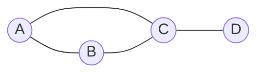

# Đồ thị (Graph)

## Khái niệm

Đồ thị (graph) là một cấu trúc dữ liệu phi tuyến tính gồm một tập **đỉnh (vertices/nodes)** và một tập **cạnh (edges)** nối các đỉnh lại với nhau. Khác với cây, đồ thị có thể chứa chu trình (cycle) và mỗi đỉnh có thể nối tới nhiều đỉnh khác mà không cần quan hệ cha–con. Đồ thị mô hình hóa mọi quan hệ "nối kết": mạng xã hội, bản đồ đường đi, mạng máy tính, phụ thuộc tác vụ.

Ví dụ một đồ thị vô hướng đơn giản gồm 4 đỉnh:



## Khi nào dùng / Vì sao quan trọng

- **Mạng xã hội:** đỉnh = người dùng, cạnh = quan hệ bạn bè.
- **Bản đồ & định tuyến:** đỉnh = địa điểm, cạnh có trọng số = khoảng cách/thời gian (Google Maps, GPS).
- **Mạng máy tính, web:** đỉnh = trang/máy chủ, cạnh = liên kết.
- **Lập lịch & phụ thuộc:** sắp xếp topo (topological sort) cho các tác vụ phụ thuộc nhau.

## Cách hoạt động

### Phân loại đồ thị

- **Vô hướng (undirected):** cạnh không có chiều (quan hệ hai chiều, như bạn bè).
- **Có hướng (directed/digraph):** cạnh có chiều (A → B, như người theo dõi trên Twitter).
- **Có trọng số (weighted):** mỗi cạnh mang một giá trị (khoảng cách, chi phí).
- **Không trọng số (unweighted):** mọi cạnh như nhau.

### Hai cách biểu diễn

1. **Ma trận kề (adjacency matrix):** mảng 2 chiều `M[i][j]` = 1 (hoặc trọng số) nếu có cạnh i→j. Kiểm tra cạnh tồn tại O(1), nhưng tốn O(V²) bộ nhớ — lãng phí với đồ thị thưa (sparse).
2. **Danh sách kề (adjacency list):** mỗi đỉnh giữ một danh sách các đỉnh kề. Tiết kiệm bộ nhớ O(V + E), duyệt hàng xóm hiệu quả — lựa chọn phổ biến cho đồ thị thưa.

So sánh: đồ thị **dày (dense)** → dùng ma trận; đồ thị **thưa** → dùng danh sách kề.

### Duyệt đồ thị

- **DFS (Depth-First Search):** đi sâu theo một nhánh tới cùng rồi mới quay lui. Cài bằng đệ quy hoặc ngăn xếp. Dùng để phát hiện chu trình, sắp xếp topo, tìm thành phần liên thông.
- **BFS (Breadth-First Search):** duyệt theo từng lớp khoảng cách, dùng hàng đợi. Tìm đường đi ngắn nhất theo **số cạnh** trên đồ thị không trọng số.

### Cây khung nhỏ nhất (Minimum Spanning Tree — MST)

Trên đồ thị liên thông có trọng số, MST là tập cạnh nối tất cả đỉnh với **tổng trọng số nhỏ nhất** và không tạo chu trình. Hai thuật toán kinh điển:

- **Kruskal:** sắp cạnh theo trọng số tăng dần, lần lượt thêm cạnh nếu không tạo chu trình (dùng Union-Find). O(E log E).
- **Prim:** lớn dần từ một đỉnh, mỗi bước thêm cạnh rẻ nhất nối ra ngoài cây (dùng heap). O(E log V).

## Ví dụ

### Biểu diễn bằng danh sách kề

```python
# Đồ thị vô hướng: đỉnh → danh sách hàng xóm
graph = {
    'A': ['B', 'C'],
    'B': ['A', 'D'],
    'C': ['A', 'D'],
    'D': ['B', 'C'],
}
```

### DFS (đệ quy)

```python
def dfs(graph, node, visited=None):
    if visited is None:
        visited = set()
    visited.add(node)
    print(node, end=" ")
    for nxt in graph[node]:
        if nxt not in visited:      # chỉ thăm đỉnh chưa duyệt
            dfs(graph, nxt, visited)

dfs(graph, 'A')   # ví dụ: A B D C
```

### BFS (dùng hàng đợi)

```python
from collections import deque

def bfs(graph, start):
    visited = {start}
    q = deque([start])
    while q:
        node = q.popleft()          # lấy theo FIFO → duyệt theo lớp
        print(node, end=" ")
        for nxt in graph[node]:
            if nxt not in visited:
                visited.add(nxt)
                q.append(nxt)

bfs(graph, 'A')   # A B C D
```

### MST bằng thuật toán Kruskal (với Union-Find)

```python
def kruskal(n, edges):
    # edges: danh sách (trọng_số, u, v)
    parent = list(range(n))

    def find(x):                      # tìm gốc tập hợp
        while parent[x] != x:
            parent[x] = parent[parent[x]]   # nén đường
            x = parent[x]
        return x

    mst, total = [], 0
    for w, u, v in sorted(edges):     # xét cạnh theo trọng số tăng
        ru, rv = find(u), find(v)
        if ru != rv:                  # không tạo chu trình
            parent[ru] = rv
            mst.append((u, v, w))
            total += w
    return mst, total

edges = [(1, 0, 1), (3, 1, 2), (2, 0, 2), (4, 2, 3)]
print(kruskal(4, edges))   # cây khung và tổng trọng số
```

## Độ phức tạp

| Thao tác / thuật toán | Ma trận kề | Danh sách kề |
|-----------------------|------------|--------------|
| Bộ nhớ | O(V²) | O(V + E) |
| Kiểm tra cạnh (u,v) | O(1) | O(bậc của u) |
| Duyệt hàng xóm của u | O(V) | O(bậc của u) |
| DFS / BFS | O(V²) | O(V + E) |
| MST Kruskal | — | O(E log E) |
| MST Prim (heap) | — | O(E log V) |

(V = số đỉnh, E = số cạnh.)

## Ưu / nhược điểm

- **Ưu:**
  - Mô hình hóa linh hoạt mọi quan hệ kết nối phức tạp.
  - Danh sách kề tiết kiệm bộ nhớ cho đồ thị thưa.
  - Nhiều thuật toán mạnh: đường đi ngắn nhất, MST, luồng cực đại, sắp xếp topo.
- **Nhược:**
  - Ma trận kề tốn O(V²) bộ nhớ dù đồ thị thưa.
  - Nhiều thuật toán phức tạp, dễ sai khi xử lý chu trình/đỉnh chưa thăm.
  - Đồ thị lớn tốn nhiều tài nguyên tính toán.

## Câu hỏi phỏng vấn thường gặp

1. **So sánh ma trận kề và danh sách kề.** Ma trận: kiểm tra cạnh O(1), bộ nhớ O(V²); danh sách: bộ nhớ O(V+E), phù hợp đồ thị thưa.
2. **DFS và BFS khác nhau thế nào?** DFS đi sâu (dùng stack/đệ quy); BFS đi theo lớp (dùng queue), tìm đường ngắn nhất trên đồ thị không trọng số.
3. **Làm sao phát hiện chu trình?** Đồ thị vô hướng: Union-Find hoặc DFS; có hướng: DFS với đánh dấu đỉnh đang trong ngăn xếp đệ quy.
4. **Sắp xếp topo (topological sort) là gì?** Sắp các đỉnh của đồ thị có hướng không chu trình (DAG) sao cho mọi cạnh u→v thì u đứng trước v.
5. **Dijkstra dùng để làm gì?** Tìm đường đi ngắn nhất từ một nguồn trên đồ thị trọng số không âm, dùng hàng đợi ưu tiên.
6. **Kruskal và Prim khác nhau ra sao?** Cả hai tìm MST; Kruskal sắp cạnh + Union-Find, Prim lớn dần từ một đỉnh dùng heap.
7. **Thành phần liên thông (connected component) là gì?** Tập đỉnh mà giữa hai đỉnh bất kỳ đều có đường đi; tìm bằng DFS/BFS hoặc Union-Find.

## Tham khảo

- Nội dung được biên dịch và điều chỉnh từ tài liệu cấu trúc dữ liệu của dự án.
