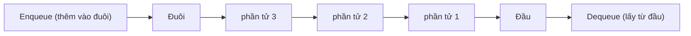
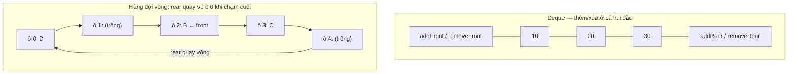

# Hàng đợi (Queue)

## Khái niệm

Hàng đợi (queue) là một cấu trúc dữ liệu tuyến tính tuân theo nguyên tắc **FIFO (First In, First Out)** — phần tử vào trước sẽ được lấy ra trước, giống như hàng người xếp hàng mua vé. Phần tử được thêm vào ở một đầu gọi là **đuôi (rear/back)** và lấy ra ở đầu kia gọi là **đầu (front)**.

Nguyên tắc FIFO: thêm ở đuôi, lấy ra ở đầu.



## Khi nào dùng / Vì sao quan trọng

Dùng hàng đợi khi cần xử lý dữ liệu **theo đúng thứ tự đến**:

- **Lập lịch (scheduling):** hàng đợi tác vụ của CPU, hàng đợi in ấn, hàng đợi yêu cầu web.
- **Duyệt theo chiều rộng BFS (breadth-first search)** trên cây và đồ thị.
- **Bộ đệm (buffering)** luồng dữ liệu, truyền thông giữa tiến trình (message queue).
- **Hàng đợi ưu tiên (priority queue)** khi cần lấy phần tử "quan trọng nhất" trước (Dijkstra, A*, nén Huffman).

## Cách hoạt động

### Các thao tác cơ bản

- **enqueue(x):** thêm `x` vào đuôi.
- **dequeue():** lấy và trả về phần tử ở đầu.
- **front()/peek():** xem phần tử ở đầu.
- **is_empty():** kiểm tra rỗng.

### Các biến thể

1. **Hàng đợi đơn giản (simple queue):** FIFO cơ bản, thêm ở đuôi, lấy ở đầu.
2. **Hàng đợi vòng (circular queue):** dùng mảng cố định với chỉ số `front`/`rear` quay vòng nhờ phép chia dư (modulo). Tránh lãng phí chỗ trống mà hàng đợi tuyến tính gặp phải khi `front` dịch dần về cuối mảng.
3. **Hàng đợi hai đầu (deque — double-ended queue):** cho phép thêm/xóa ở **cả hai đầu**. Là tổng quát của cả stack lẫn queue.
4. **Hàng đợi ưu tiên (priority queue):** mỗi phần tử có độ ưu tiên; phần tử ưu tiên cao nhất ra trước, bất kể thứ tự vào. Thường cài bằng **heap** → enqueue/dequeue O(log n).

### Sơ đồ hàng đợi vòng

```
Mảng [_, A, B, C, _]   front=1, rear=4
dequeue() → A          front=2
enqueue(D) → rear quay về 0:  [D, _, B, C, _]  rear=1
```

**Hàng đợi vòng** coi mảng như một vòng tròn: khi `rear` chạm cuối mảng, nó quay về ô 0 (nhờ phép chia dư) để tái dùng chỗ trống phía đầu. **Deque** thì thao tác được ở cả hai đầu:



## Ví dụ

### Hàng đợi đơn giản bằng collections.deque

```python
from collections import deque

q = deque()
q.append(1)        # enqueue vào đuôi
q.append(2)
q.append(3)
print(q.popleft()) # dequeue từ đầu → 1
print(q[0])        # front → 2
```

> Lưu ý: `deque` cho phép thêm/xóa hai đầu với O(1), nên nó vừa làm queue vừa làm deque.

### Hàng đợi vòng bằng mảng cố định

```python
class CircularQueue:
    def __init__(self, capacity):
        self.q = [None] * capacity
        self.cap = capacity
        self.front = 0
        self.size = 0

    def enqueue(self, x):
        if self.size == self.cap:
            raise OverflowError("Hàng đợi đầy")
        rear = (self.front + self.size) % self.cap  # quay vòng
        self.q[rear] = x
        self.size += 1

    def dequeue(self):
        if self.size == 0:
            raise IndexError("Hàng đợi rỗng")
        x = self.q[self.front]
        self.front = (self.front + 1) % self.cap    # dịch vòng
        self.size -= 1
        return x

cq = CircularQueue(3)
cq.enqueue(10); cq.enqueue(20)
print(cq.dequeue())  # 10
cq.enqueue(30); cq.enqueue(40)  # tái sử dụng ô trống
```

### Hàng đợi ưu tiên bằng heapq

```python
import heapq

pq = []
heapq.heappush(pq, (2, "viết báo cáo"))  # (độ ưu tiên, việc)
heapq.heappush(pq, (1, "sửa lỗi khẩn"))
heapq.heappush(pq, (3, "dọn dẹp code"))

while pq:
    prio, task = heapq.heappop(pq)       # lấy ưu tiên nhỏ nhất trước
    print(prio, task)
# 1 sửa lỗi khẩn / 2 viết báo cáo / 3 dọn dẹp code
```

### Ứng dụng: BFS trên đồ thị

```python
from collections import deque

def bfs(graph, start):
    visited = {start}
    q = deque([start])
    order = []
    while q:
        node = q.popleft()      # lấy theo FIFO
        order.append(node)
        for nxt in graph[node]:
            if nxt not in visited:
                visited.add(nxt)
                q.append(nxt)   # thêm hàng xóm vào đuôi
    return order

g = {1: [2, 3], 2: [4], 3: [4], 4: []}
print(bfs(g, 1))  # [1, 2, 3, 4]
```

### Thao tác hàng đợi & deque (đa ngôn ngữ)

=== "JavaScript"
    ```js
    // Hàng đợi FIFO bằng mảng (shift là O(n) — chỉ để minh họa)
    const q = [];
    q.push(1);            // enqueue vào đuôi
    q.push(2);
    const front = q[0];   // xem đầu = 1
    const x = q.shift();  // dequeue từ đầu = 1

    // Deque: thêm/xóa ở cả hai đầu
    const dq = [];
    dq.push(2);           // thêm đuôi
    dq.unshift(1);        // thêm đầu  -> [1, 2]
    dq.pop();             // xóa đuôi
    dq.shift();           // xóa đầu
    ```
=== "Python"
    ```python
    from collections import deque

    # Hàng đợi FIFO
    q = deque()
    q.append(1)           # enqueue vào đuôi
    q.append(2)
    front = q[0]          # xem đầu = 1
    x = q.popleft()       # dequeue từ đầu = 1

    # Deque: thêm/xóa ở cả hai đầu (đều O(1))
    dq = deque()
    dq.append(2)          # thêm đuôi
    dq.appendleft(1)      # thêm đầu -> deque([1, 2])
    dq.pop()              # xóa đuôi
    dq.popleft()          # xóa đầu
    ```

### Thử ngay: hàng đợi FIFO & deque hai đầu

!!! tip "Thử ngay (chạy được)"
    Đoạn dưới mô phỏng hàng đợi FIFO rồi deque (thêm/xóa hai đầu), in từng bước để thấy thứ tự ra/vào.

<div class="js-demo" data-title="Hàng đợi & Deque — enqueue/dequeue (in từng bước)">
<textarea class="js-demo-src">
// Phần 1: Hàng đợi FIFO
const q = [];
for (const v of [10, 20, 30]) {
  q.push(v);
  print(`enqueue(${v}) -> hàng đợi = ${JSON.stringify(q)}`);
}
while (q.length) {
  const x = q.shift();  // lấy từ đầu (FIFO)
  print(`dequeue() -> ${x} (còn lại ${JSON.stringify(q)})`);
}

print('\n--- Deque hai đầu ---');
// Phần 2: Deque — thêm/xóa ở cả hai đầu
const dq = [];
dq.push(2);      print(`push(2) [thêm đuôi]   -> ${JSON.stringify(dq)}`);
dq.unshift(1);   print(`unshift(1) [thêm đầu] -> ${JSON.stringify(dq)}`);
dq.push(3);      print(`push(3) [thêm đuôi]   -> ${JSON.stringify(dq)}`);
print(`pop() [xóa đuôi]   -> ${dq.pop()} (còn ${JSON.stringify(dq)})`);
print(`shift() [xóa đầu]  -> ${dq.shift()} (còn ${JSON.stringify(dq)})`);
</textarea>
</div>

## Độ phức tạp

| Thao tác | Hàng đợi thường | Hàng đợi ưu tiên (heap) |
|----------|-----------------|--------------------------|
| enqueue | O(1) | O(log n) |
| dequeue | O(1) | O(log n) |
| front / peek | O(1) | O(1) |
| Tìm kiếm | O(n) | O(n) |
| Bộ nhớ | O(n) | O(n) |

## Ưu / nhược điểm

- **Ưu:**
  - Bảo toàn thứ tự đến — lý tưởng cho lập lịch và BFS.
  - enqueue/dequeue O(1) với hàng đợi thường và deque.
  - Hàng đợi vòng tái sử dụng bộ nhớ hiệu quả.
- **Nhược:**
  - Không truy cập ngẫu nhiên phần tử ở giữa.
  - Hàng đợi vòng bằng mảng có dung lượng cố định (có thể đầy).
  - Hàng đợi ưu tiên có chi phí O(log n) cho mỗi thao tác.

## Câu hỏi phỏng vấn thường gặp

1. **Queue và Stack khác nhau ở đâu?** Queue là FIFO (vào trước ra trước), Stack là LIFO (vào sau ra trước).
2. **Vì sao dùng hàng đợi vòng?** Để tái sử dụng ô trống phía đầu mảng, tránh lãng phí khi `front` dịch về cuối.
3. **Deque là gì?** Hàng đợi hai đầu, thêm/xóa được ở cả hai phía; tổng quát của stack và queue.
4. **Hàng đợi ưu tiên cài bằng gì và độ phức tạp?** Thường bằng binary heap; chèn và lấy phần tử ưu tiên nhất đều O(log n).
5. **Làm sao cài hàng đợi bằng hai ngăn xếp?** Ngăn "vào" để enqueue; khi dequeue mà ngăn "ra" rỗng thì đổ toàn bộ từ ngăn vào sang (đảo thứ tự).
6. **BFS dùng cấu trúc nào?** Hàng đợi — để duyệt theo từng lớp khoảng cách.
7. **Ứng dụng thực tế của queue?** Lập lịch CPU, hàng đợi in, message queue, bộ đệm streaming, cân bằng tải.

## Tham khảo

- Nội dung được biên dịch và điều chỉnh từ tài liệu cấu trúc dữ liệu của dự án.
