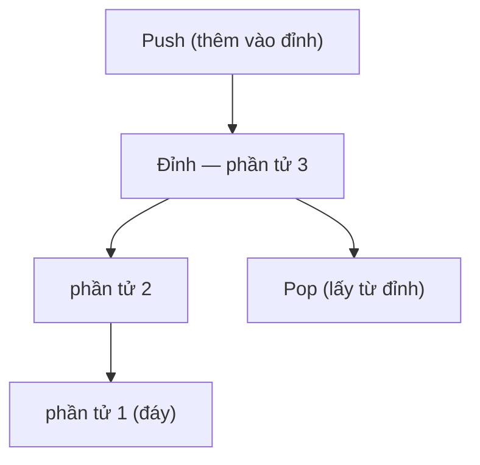

# Ngăn xếp (Stack)

## Khái niệm

Ngăn xếp (stack) là một cấu trúc dữ liệu tuyến tính tuân theo nguyên tắc **LIFO (Last In, First Out)** — phần tử vào sau cùng sẽ được lấy ra đầu tiên. Hãy hình dung một chồng đĩa: bạn chỉ có thể đặt đĩa lên trên và lấy đĩa từ trên xuống. Mọi thao tác thêm/xóa đều diễn ra tại một đầu duy nhất gọi là **đỉnh (top)**.

Nguyên tắc LIFO: phần tử vào sau cùng nằm ở đỉnh và được lấy ra trước nhất.



## Khi nào dùng / Vì sao quan trọng

Dùng ngăn xếp khi bạn cần truy cập dữ liệu theo thứ tự ngược với lúc đưa vào, hoặc cần "ghi nhớ trạng thái để quay lại sau". Các tình huống điển hình:

- **Đánh giá biểu thức (expression evaluation)** và chuyển đổi hậu tố/tiền tố.
- **Quay lui (backtracking)** và lời gọi đệ quy — máy tính dùng *call stack* để lưu ngữ cảnh mỗi hàm.
- **Hoàn tác/làm lại (undo/redo)**, duyệt lịch sử trình duyệt (nút Back).
- Kiểm tra cặp dấu ngoặc cân bằng, duyệt DFS (depth-first search).

## Cách hoạt động

### Các thao tác cơ bản

- **push(x):** đẩy phần tử `x` lên đỉnh.
- **pop():** lấy ra và trả về phần tử ở đỉnh.
- **peek()/top():** xem phần tử ở đỉnh mà không xóa.
- **is_empty():** kiểm tra ngăn xếp rỗng.

Tất cả các thao tác trên đều chạy trong thời gian hằng số O(1).

### Sơ đồ minh họa

```
push(3)      top → [3]
push(7)      top → [7][3]
pop() → 7    top → [3]
```

Phần tử 7 vào sau nên ra trước — đúng nguyên tắc LIFO.

### Hai cách cài đặt

1. **Dùng mảng (array):** giữ một chỉ số `top`. Push = ghi vào `top+1`; pop = đọc rồi giảm `top`. Đơn giản, tận dụng cache tốt, nhưng mảng tĩnh có thể tràn (overflow).
2. **Dùng danh sách liên kết (linked list):** mỗi lần push tạo một nút mới ở đầu danh sách, pop xóa nút đầu. Kích thước động, không lo tràn, nhưng tốn thêm bộ nhớ cho con trỏ.

## Ví dụ

### Cài đặt bằng mảng (list của Python)

```python
class ArrayStack:
    def __init__(self):
        self._data = []          # dùng list làm kho chứa

    def push(self, x):
        self._data.append(x)     # thêm vào cuối = đỉnh

    def pop(self):
        if self.is_empty():
            raise IndexError("Ngăn xếp rỗng")
        return self._data.pop()  # lấy phần tử cuối

    def peek(self):
        return self._data[-1]    # xem đỉnh, không xóa

    def is_empty(self):
        return len(self._data) == 0

s = ArrayStack()
s.push(1); s.push(2); s.push(3)
print(s.pop())   # Kết quả: 3
print(s.peek())  # Kết quả: 2
```

### Cài đặt bằng danh sách liên kết

```python
class Node:
    def __init__(self, data):
        self.data = data
        self.next = None

class LinkedStack:
    def __init__(self):
        self.top = None          # đỉnh là nút đầu danh sách

    def push(self, x):
        node = Node(x)
        node.next = self.top     # nút mới trỏ vào đỉnh cũ
        self.top = node          # cập nhật đỉnh

    def pop(self):
        if self.top is None:
            raise IndexError("Ngăn xếp rỗng")
        x = self.top.data
        self.top = self.top.next # bỏ nút đầu
        return x
```

### Ứng dụng: kiểm tra dấu ngoặc cân bằng

```python
def is_balanced(s):
    pairs = {')': '(', ']': '[', '}': '{'}
    stack = []
    for ch in s:
        if ch in '([{':
            stack.append(ch)             # gặp ngoặc mở → push
        elif ch in ')]}':
            if not stack or stack.pop() != pairs[ch]:
                return False             # không khớp
    return not stack                     # rỗng = cân bằng

print(is_balanced("{[()]}"))  # True
print(is_balanced("{[(])}"))  # False
```

### Ứng dụng: đánh giá biểu thức hậu tố (postfix / RPN)

```python
def eval_postfix(tokens):
    stack = []
    for t in tokens:
        if t.lstrip('-').isdigit():
            stack.append(int(t))         # số → push
        else:
            b = stack.pop(); a = stack.pop()  # lấy 2 toán hạng
            stack.append({'+': a+b, '-': a-b,
                          '*': a*b, '/': int(a/b)}[t])
    return stack.pop()

print(eval_postfix(["2", "3", "+", "4", "*"]))  # (2+3)*4 = 20
```

## Độ phức tạp

| Thao tác | Thời gian | Bộ nhớ |
|----------|-----------|--------|
| push | O(1) | — |
| pop | O(1) | — |
| peek / top | O(1) | — |
| is_empty | O(1) | — |
| Tìm kiếm phần tử | O(n) | — |
| Toàn bộ ngăn xếp | — | O(n) |

Lưu ý: với mảng động, push có thể là O(n) trong lần cấp phát lại bộ nhớ, nhưng O(1) khấu hao (amortized).

## Ưu / nhược điểm

- **Ưu:**
  - Thao tác push/pop/peek đều O(1), cực nhanh.
  - Mô hình đơn giản, dễ suy luận, phù hợp nhiều bài toán quay lui/đệ quy.
- **Nhược:**
  - Chỉ truy cập được phần tử ở đỉnh; không có truy cập ngẫu nhiên.
  - Cài bằng mảng tĩnh có thể tràn; cài bằng danh sách liên kết tốn bộ nhớ con trỏ.

## Câu hỏi phỏng vấn thường gặp

1. **Ngăn xếp hoạt động theo nguyên tắc nào?** LIFO — vào sau, ra trước.
2. **So sánh cài đặt bằng mảng và danh sách liên kết.** Mảng: cache tốt, có thể tràn; danh sách liên kết: kích thước động, tốn bộ nhớ con trỏ.
3. **Call stack là gì?** Vùng nhớ lưu ngữ cảnh (biến cục bộ, địa chỉ trả về) của các lời gọi hàm; tràn gây *stack overflow*.
4. **Làm sao cài hàng đợi bằng hai ngăn xếp?** Một ngăn để nạp (push), một ngăn để lấy; khi ngăn lấy rỗng thì đổ toàn bộ từ ngăn nạp sang (đảo thứ tự).
5. **Thiết kế ngăn xếp lấy min trong O(1)?** Dùng thêm một ngăn phụ lưu giá trị nhỏ nhất hiện tại tại mỗi mức.
6. **Ứng dụng thực tế của ngăn xếp?** Undo/redo, nút Back trình duyệt, đánh giá biểu thức, DFS, xử lý đệ quy.
7. **Chuyển biểu thức trung tố sang hậu tố dùng gì?** Thuật toán Shunting-yard của Dijkstra, dựa trên ngăn xếp toán tử.

## Tham khảo

- Nội dung được biên dịch và điều chỉnh từ tài liệu cấu trúc dữ liệu của dự án.
