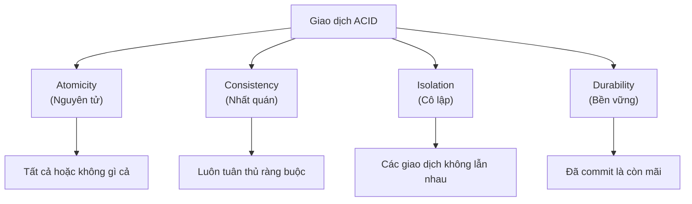
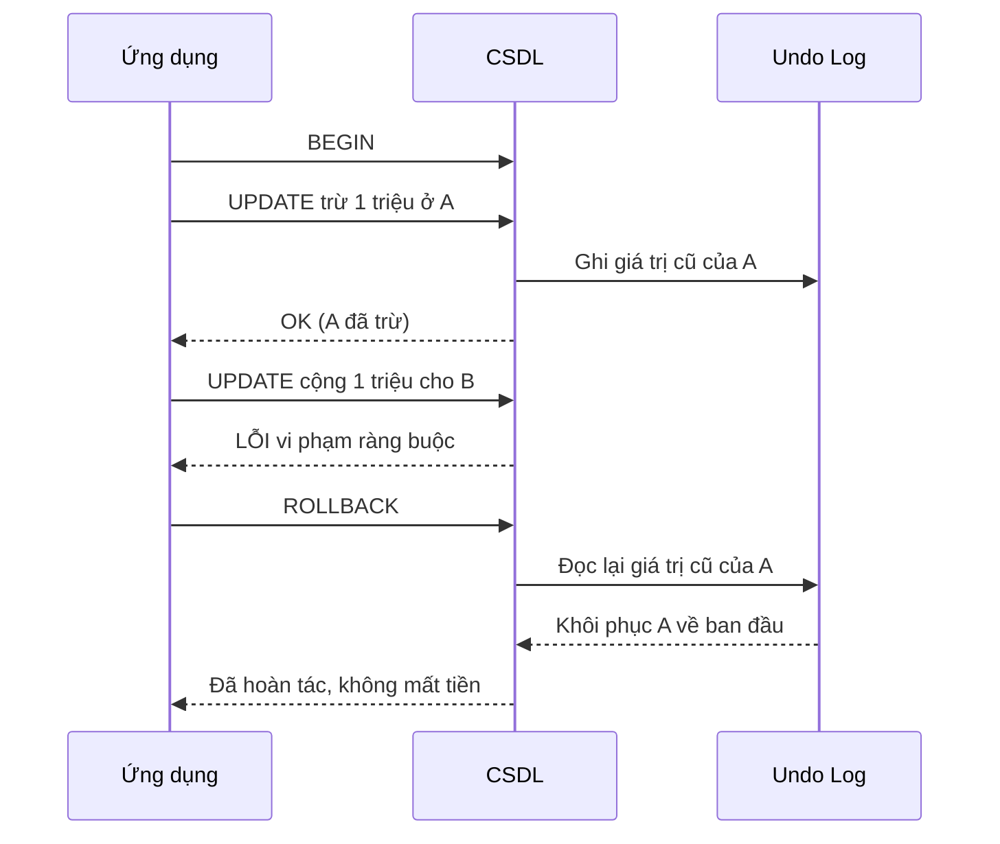

# Tính chất ACID (ACID Properties)

## Khái niệm
ACID là bốn tính chất đảm bảo giao dịch (transaction) của cơ sở dữ liệu chạy tin cậy, ngay cả khi có lỗi, mất điện hay truy cập đồng thời: **A**tomicity (nguyên tử), **C**onsistency (nhất quán), **I**solation (cô lập), **D**urability (bền vững).

## Khi nào dùng / Vì sao quan trọng
ACID là nền tảng cho mọi hệ thống mà dữ liệu sai gây hậu quả nghiêm trọng: chuyển tiền ngân hàng, đặt vé, quản lý kho, thanh toán. Hiểu ACID giúp trả lời "vì sao chuyển khoản không bao giờ bị mất tiền giữa chừng".

## Cách hoạt động — Bốn tính chất

### A — Atomicity (Tính nguyên tử)
Giao dịch là một khối "tất cả hoặc không có gì" (all-or-nothing): mọi thao tác đều thành công, hoặc toàn bộ bị hoàn tác (rollback). Không có trạng thái nửa vời.

```sql
BEGIN;
UPDATE tai_khoan SET so_du = so_du - 1000000 WHERE id = 'A';  -- trừ tiền A
UPDATE tai_khoan SET so_du = so_du + 1000000 WHERE id = 'B';  -- cộng tiền B
COMMIT;
-- Nếu lệnh thứ hai lỗi → ROLLBACK → tiền A không bị trừ oan
```

### C — Consistency (Tính nhất quán)
Giao dịch đưa CSDL từ một trạng thái hợp lệ sang một trạng thái hợp lệ khác, tôn trọng mọi ràng buộc (constraint, khoá ngoại, trigger). Ví dụ: tổng số dư hai tài khoản trước và sau khi chuyển phải bằng nhau; số dư không được âm nếu có ràng buộc `CHECK`.

### I — Isolation (Tính cô lập)
Các giao dịch chạy đồng thời không được làm nhiễu lẫn nhau; kết quả phải như thể chúng chạy tuần tự. Mức độ cô lập được điều chỉnh qua các **mức cô lập (isolation levels)** — đánh đổi giữa tính đúng đắn và hiệu năng.

```text
Giao dịch T1 và T2 cùng sửa 1 hàng:
Không cô lập  → dữ liệu bẩn (dirty read), mất cập nhật (lost update)
Có cô lập     → T2 chờ hoặc thấy dữ liệu ổn định của T1
```
> Chi tiết các mức cô lập và hiện tượng lỗi: xem trang [Giao dịch & mức cô lập](giao-dich.md).

### D — Durability (Tính bền vững)
Khi đã `COMMIT`, dữ liệu được ghi bền vững (thường qua write-ahead log — WAL) và tồn tại kể cả khi mất điện hay hệ thống sập. Sau khi khôi phục, kết quả vẫn còn nguyên.

!!! question "Tại sao cần MỖI tính chất? (điều gì hỏng nếu thiếu)"
    Lấy đúng ví dụ chuyển 1 triệu từ A sang B (trừ A, cộng B) để thấy **thiếu từng chữ thì hỏng thế nào**:

    - **Thiếu Atomicity (A):** hệ thống sập **ngay sau khi trừ A nhưng trước khi cộng B**. Không có "tất cả hoặc không gì" → tiền của A **bốc hơi**: trừ rồi mà B không nhận. Atomicity đảm bảo hoặc cả hai bước cùng xảy ra, hoặc không bước nào xảy ra (rollback về như cũ).
    - **Thiếu Consistency (C):** giả sử có ràng buộc "số dư ≥ 0" và "tổng tiền toàn hệ không đổi". Không có C, một giao dịch có thể để A **âm tiền**, hoặc trừ A 1 triệu nhưng cộng B 2 triệu → **tự sinh tiền từ hư không**. C bắt mọi ràng buộc (CHECK, khoá ngoại, trigger) luôn đúng trước và sau giao dịch.
    - **Thiếu Isolation (I):** hai giao dịch chạy đồng thời cùng đọc số dư A = 1 triệu, cả hai cùng trừ → **lost update**, một lần trừ biến mất; hoặc giao dịch khác đọc trúng trạng thái "A đã trừ nhưng B chưa cộng" và tưởng hệ thống **thiếu tiền**. I làm các giao dịch chạy như thể **lần lượt**, không giẫm lên nhau.
    - **Thiếu Durability (D):** ứng dụng đã báo "chuyển thành công" cho khách, nhưng dữ liệu mới nằm trong RAM chưa kịp xuống đĩa thì **mất điện** → tỉnh dậy giao dịch **biến mất** dù đã báo thành công. D đảm bảo cái gì đã `COMMIT` thì tồn tại qua cả sập nguồn (nhờ ghi WAL ra đĩa trước khi báo thành công).

    Trực giác: **A** giữ toàn vẹn *trong một* giao dịch, **I** giữ toàn vẹn *giữa các* giao dịch đồng thời, **C** giữ đúng *luật dữ liệu*, còn **D** giữ kết quả *sống sót qua sự cố*. Bỏ bất kỳ chữ nào là mở ra một kiểu mất/hỏng tiền khác nhau.

## Bảng tóm tắt
| Tính chất | Đảm bảo | Cơ chế điển hình |
|-----------|---------|------------------|
| Atomicity | Tất cả hoặc không gì | Nhật ký hoàn tác (undo log), rollback |
| Consistency | Ràng buộc luôn đúng | Constraint, trigger, khoá |
| Isolation | Giao dịch không nhiễu nhau | Khoá (lock), MVCC, mức cô lập |
| Durability | Dữ liệu committed không mất | WAL, ghi đĩa, sao lưu |

## Ví dụ xuyên suốt: chuyển khoản ngân hàng
Xét chuyển 1 triệu từ tài khoản A sang B. Bốn tính chất phối hợp ra sao:

```sql
BEGIN;
UPDATE tai_khoan SET so_du = so_du - 1000000 WHERE id = 'A';
UPDATE tai_khoan SET so_du = so_du + 1000000 WHERE id = 'B';
COMMIT;
```
| Tính chất | Vai trò trong ví dụ này |
|-----------|-------------------------|
| Atomicity | Nếu cộng tiền B lỗi → cả trừ tiền A bị hoàn tác; không mất tiền |
| Consistency | Ràng buộc "số dư ≥ 0" và "tổng tiền không đổi" luôn được giữ |
| Isolation | Giao dịch khác không thấy trạng thái A đã trừ nhưng B chưa cộng |
| Durability | Sau `COMMIT`, dù mất điện ngay lập tức, tiền vẫn đã chuyển |

### Cơ chế đằng sau
- **Atomicity** thường dựa trên **undo log**: ghi lại giá trị cũ để có thể khôi phục khi rollback.
- **Durability** dựa trên **write-ahead log (WAL)**: ghi nhật ký ra đĩa **trước** khi báo commit thành công; khi khởi động lại, hệ thống phát lại (replay) log để khôi phục.
- **Isolation** dựa trên khoá (lock) hoặc MVCC (multi-version concurrency control).

## So sánh ACID và BASE
Nhiều hệ NoSQL phân tán chọn mô hình **BASE** thay vì ACID để ưu tiên sẵn sàng và khả năng mở rộng.

| | ACID | BASE |
|-|------|------|
| Ý nghĩa | Atomicity, Consistency, Isolation, Durability | **B**asically **A**vailable, **S**oft state, **E**ventual consistency |
| Ưu tiên | Nhất quán mạnh (strong consistency) | Tính sẵn sàng (availability) |
| Nhất quán | Ngay lập tức | Cuối cùng (eventual) — dữ liệu hội tụ sau một thời gian |
| Điển hình | RDBMS: PostgreSQL, MySQL | NoSQL phân tán: Cassandra, DynamoDB |

### Liên hệ định lý CAP
Định lý CAP nói một hệ phân tán chỉ chọn được 2 trong 3: Consistency, Availability, Partition tolerance. Vì mạng phân tán luôn có thể phân mảnh (P là bắt buộc), thực tế là chọn giữa **C** (giống ACID) và **A** (giống BASE).

### Định lý CAP một cách trực quan
Khi mạng bị phân mảnh (partition) và hai nhóm nút không liên lạc được:
```text
Nếu vẫn cho phép ghi ở cả hai phía → chọn A (Availability), dữ liệu có thể lệch nhau tạm thời
Nếu từ chối ghi để giữ đồng nhất  → chọn C (Consistency), một phía tạm ngừng phục vụ
```
Không có hệ nào bỏ được P trong thực tế phân tán, nên đây luôn là lựa chọn giữa C và A cho từng thao tác.

## Ưu / nhược điểm
- **ACID — Ưu:** an toàn dữ liệu tuyệt đối, dễ suy luận về tính đúng đắn; phù hợp giao dịch tài chính. **Nhược:** khó scale ngang, độ trễ cao hơn khi phân tán, phối hợp giao dịch xuyên nút phức tạp (2-phase commit).
- **BASE — Ưu:** sẵn sàng cao, scale ngang tốt, độ trễ thấp. **Nhược:** có thể đọc dữ liệu cũ tạm thời, logic ứng dụng phải tự xử lý xung đột và bù trừ.

## Độ phức tạp (nếu có)
| Mô hình | Đọc theo khoá | Truy vấn quan hệ nhiều tầng |
|---------|:-------------:|:---------------------------:|
| ACID (RDBMS) | O(log n) qua chỉ mục | Mạnh nhờ JOIN |
| BASE (NoSQL phân tán) | O(1) trung bình theo khoá | Yếu, thường phải phi chuẩn hoá |

## Sai lầm thường gặp về ACID
- Nhầm **Consistency của ACID** (giữ ràng buộc dữ liệu) với **Consistency của CAP** (mọi nút thấy cùng dữ liệu) — đây là hai khái niệm khác nhau.
- Tưởng ACID chỉ có ở SQL: nhiều NoSQL hiện đại (MongoDB từ 4.0, một số cấu hình Cassandra) hỗ trợ giao dịch ACID ở mức nào đó.
- Cho rằng bật `SERIALIZABLE` là "miễn phí": mức cô lập cao trả giá bằng khoá và giảm thông lượng.

## Vì sao gọi là "ACID"
Thuật ngữ do Andreas Reuter và Theo Härder đặt năm 1983, hệ thống hoá các bảo đảm mà hệ giao dịch cần có. Đến nay nó vẫn là tiêu chuẩn vàng để đánh giá độ tin cậy của một hệ quản trị CSDL giao dịch (OLTP).

## Câu hỏi phỏng vấn thường gặp
1. Giải thích từng chữ trong ACID kèm ví dụ chuyển khoản.
2. Consistency trong ACID khác Consistency trong CAP như thế nào?
3. Atomicity được đảm bảo bằng cơ chế nào?
4. So sánh ACID và BASE — khi nào chọn cái nào?
5. Durability đạt được ra sao khi hệ thống có thể sập bất cứ lúc nào?

## Playground: mô phỏng Atomicity (rollback khi lỗi)

Demo mô phỏng chuyển khoản có **giao dịch nguyên tử**: nếu bất kỳ bước nào lỗi (số dư âm), toàn bộ thay đổi bị hoàn tác (rollback) và tài khoản trở về trạng thái ban đầu. Thử đổi `soTien` thành số lớn hơn số dư của A để thấy rollback.

<div class="js-demo" data-title="Atomicity: rollback khi giao dịch lỗi">
<textarea class="js-demo-src">
// Trạng thái tài khoản ban đầu
let taiKhoan = { A: 1000000, B: 500000 };

function inTrangThai(nhan) {
  print(`${nhan}: A = ${taiKhoan.A.toLocaleString()}đ, B = ${taiKhoan.B.toLocaleString()}đ`);
}

// Chuyển khoản NGUYÊN TỬ: chụp lại trạng thái, nếu lỗi thì khôi phục
function chuyenKhoanAtomic(tu, den, soTien) {
  const snapshot = { ...taiKhoan };   // undo log: lưu giá trị cũ
  try {
    taiKhoan[tu] -= soTien;                    // bước 1: trừ tiền
    if (taiKhoan[tu] < 0) throw new Error('Số dư không đủ!'); // ràng buộc
    taiKhoan[den] += soTien;                   // bước 2: cộng tiền
    print(`✓ COMMIT: chuyển ${soTien.toLocaleString()}đ từ ${tu} sang ${den}`);
  } catch (e) {
    taiKhoan = snapshot;                        // ROLLBACK toàn bộ
    print(`✗ LỖI (${e.message}) → ROLLBACK, mọi thay đổi bị huỷ`);
  }
}

inTrangThai('Ban đầu');
print('--- Giao dịch 1: chuyển 300.000đ (hợp lệ) ---');
chuyenKhoanAtomic('A', 'B', 300000);
inTrangThai('Sau GD1');

print('--- Giao dịch 2: chuyển 5.000.000đ (quá số dư) ---');
chuyenKhoanAtomic('A', 'B', 5000000);
inTrangThai('Sau GD2');   // A không bị trừ oan nhờ atomicity

const tong = taiKhoan.A + taiKhoan.B;
print(`\nTổng tiền luôn bảo toàn: ${tong.toLocaleString()}đ (consistency)`);
</textarea>
</div>

## Sơ đồ bốn tính chất ACID



## Sơ đồ tuần tự: chuyển khoản có rollback

Sơ đồ minh hoạ một giao dịch chuyển khoản: khi bước cộng tiền cho B thất bại (ví dụ vi phạm ràng buộc), CSDL dùng undo log để hoàn tác (rollback) bước trừ tiền A đã thực hiện — đảm bảo tính nguyên tử.



- Nhờ **atomicity**, không tồn tại trạng thái nửa vời "A đã trừ nhưng B chưa cộng".
- **Undo log** lưu giá trị cũ để khôi phục khi rollback; nếu commit thành công thì log này được bỏ đi.

## Tham khảo
- Xem thêm: [Giao dịch & mức cô lập](giao-dich.md), [NoSQL](nosql.md), [SQL](sql.md)
