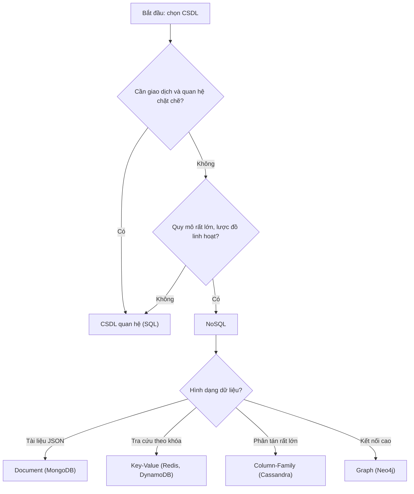
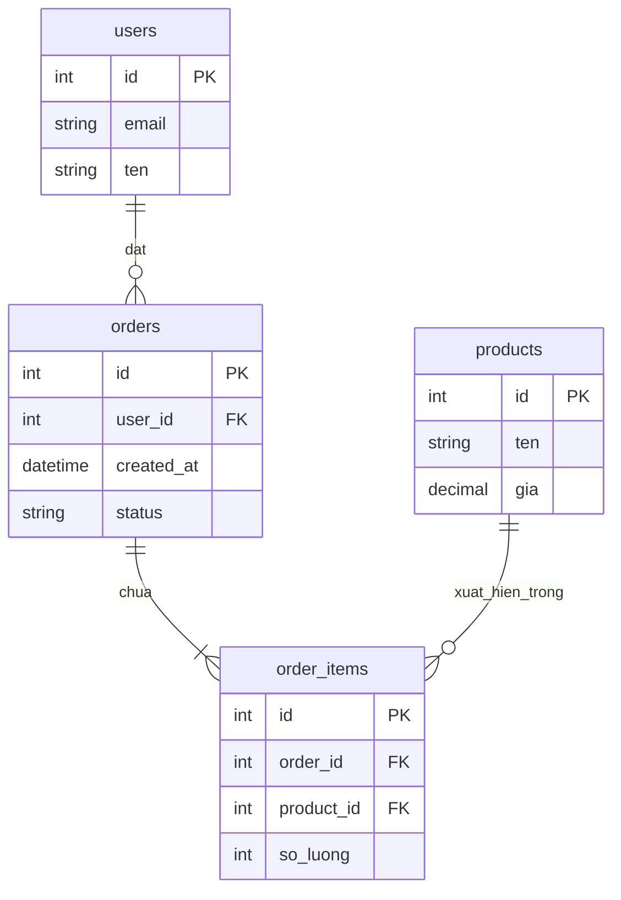
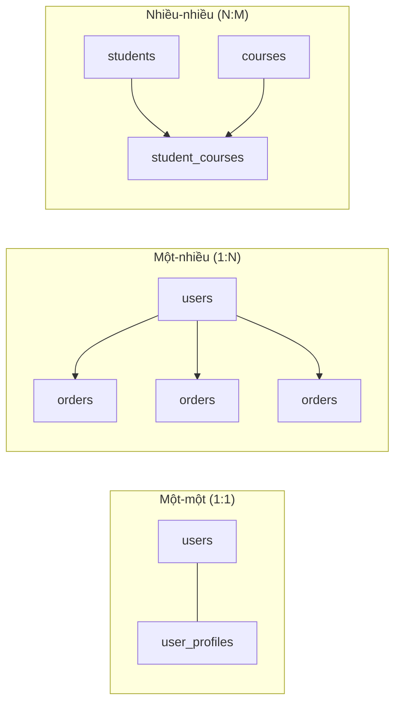
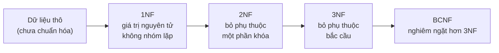
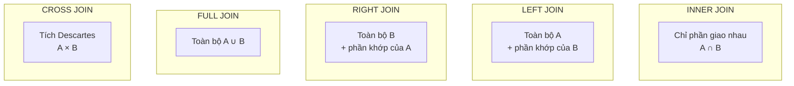
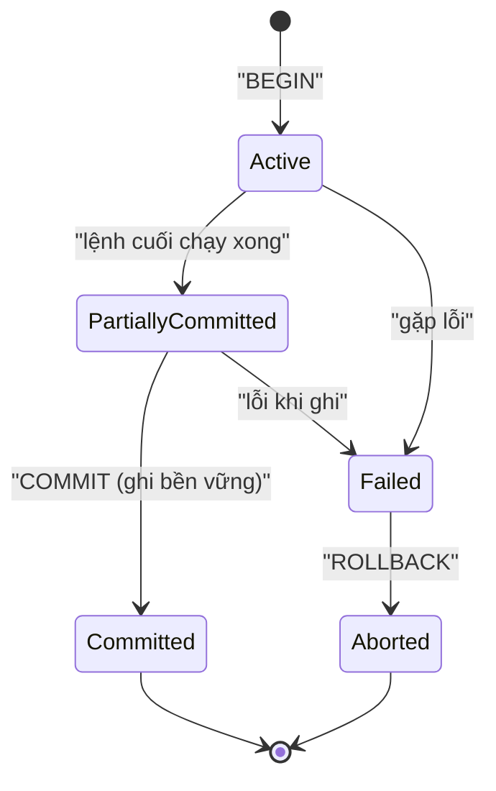
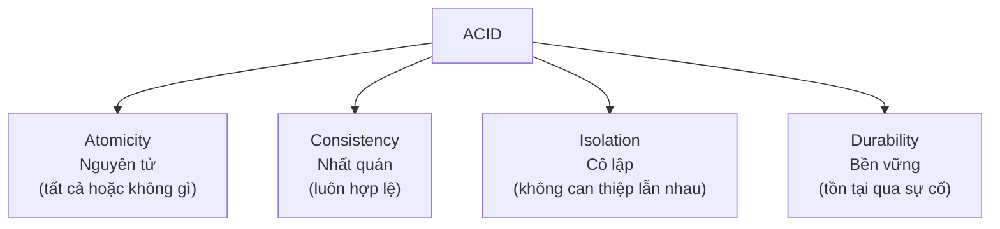
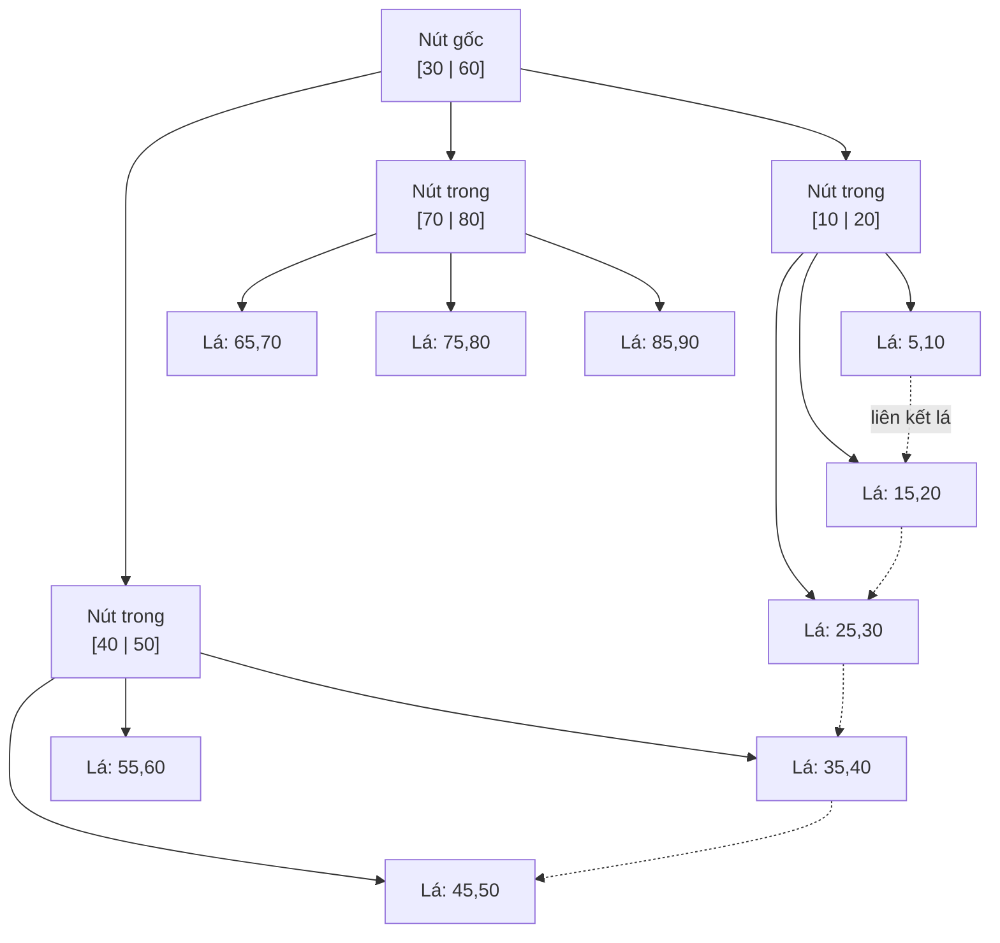
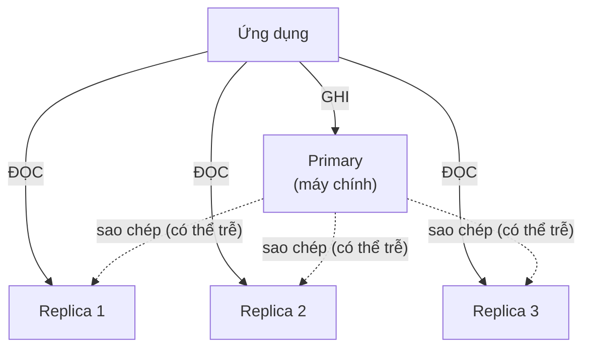
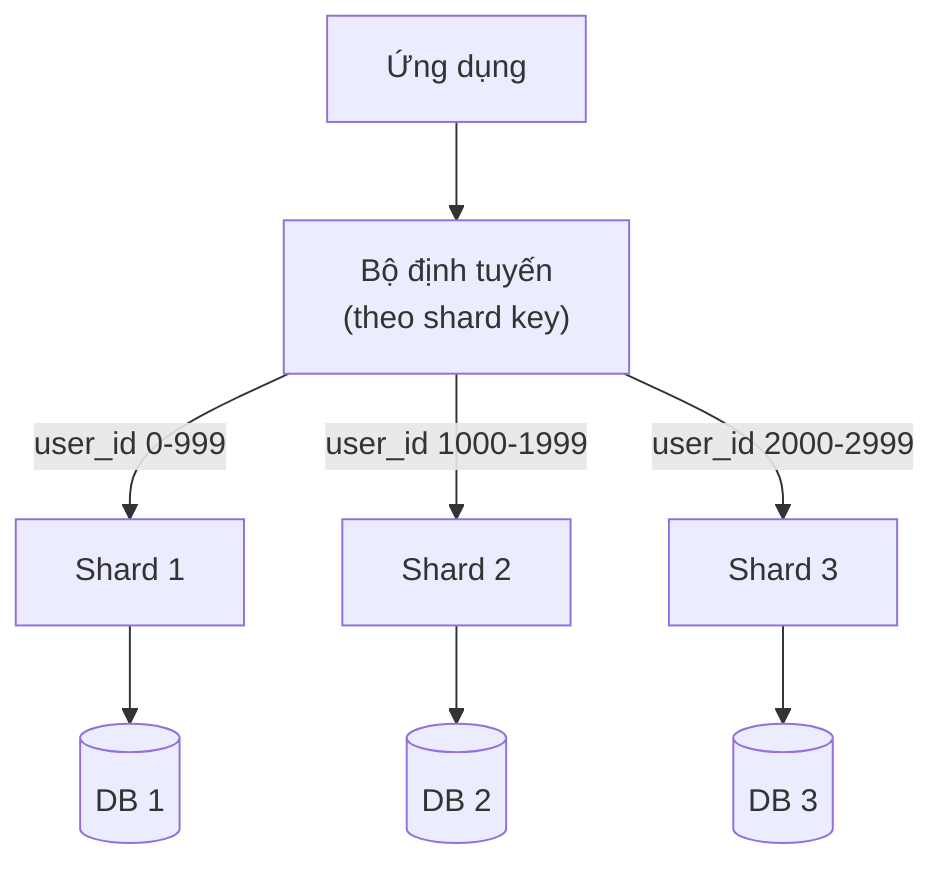

# Cẩm nang ôn thi phỏng vấn Cơ sở dữ liệu

## Tổng quan

Cẩm nang này được xây dựng như một tài liệu tham khảo về cơ sở dữ liệu (database) thực tế, tập trung vào phỏng vấn.
Nó bao quát cả kiến thức nền tảng lẫn những đánh đổi (tradeoff) mà nhà phỏng vấn mong bạn hiểu trong các buổi phỏng vấn backend, full-stack và thiết kế hệ thống (system design).

Tài liệu được viết một cách chủ đích: diễn giải bằng ngôn ngữ dễ hiểu trước, rồi bổ sung chi tiết kỹ thuật sau.

---

## 1. Cơ sở dữ liệu là gì

Cơ sở dữ liệu (database) là một cách tổ chức có hệ thống để lưu trữ, truy xuất, cập nhật và quản lý dữ liệu.

Trong các hệ thống thực tế, cơ sở dữ liệu thường đi kèm với một hệ quản trị cơ sở dữ liệu (DBMS — Database Management System):

- Cơ sở dữ liệu = phần dữ liệu thực sự được lưu trữ
- DBMS = phần mềm quản lý dữ liệu đó

Ví dụ về các DBMS:

- PostgreSQL
- MySQL
- SQLite
- MongoDB
- Redis
- DynamoDB
- Cassandra

Những việc chính mà cơ sở dữ liệu giúp bạn làm:

- lưu trữ dữ liệu an toàn
- tìm kiếm dữ liệu hiệu quả
- cập nhật dữ liệu nhất quán
- xử lý nhiều người dùng cùng lúc
- bảo vệ dữ liệu
- phục hồi sau sự cố

---

## 2. Cơ sở dữ liệu quan hệ (Relational) và NoSQL

### Cơ sở dữ liệu quan hệ

Cơ sở dữ liệu quan hệ (relational database) lưu dữ liệu trong các bảng (table) gồm hàng (row) và cột (column).

Ví dụ:

- PostgreSQL
- MySQL
- SQL Server
- Oracle

Phù hợp với:

- dữ liệu có cấu trúc
- các mối quan hệ rõ ràng
- giao dịch (transaction)
- phép nối bảng (join)
- báo cáo
- tính nhất quán mạnh (strong consistency)

Ví dụ:

- `users` (người dùng)
- `orders` (đơn hàng)
- `payments` (thanh toán)
- `invoices` (hóa đơn)

Các thực thể (entity) này thường liên hệ chặt chẽ với nhau, khiến cơ sở dữ liệu quan hệ là lựa chọn rất phù hợp.

### Cơ sở dữ liệu NoSQL

NoSQL là một nhóm rộng. Nó bao gồm:

- cơ sở dữ liệu tài liệu (document database)
- cơ sở dữ liệu khóa-giá trị (key-value database)
- cơ sở dữ liệu họ cột (column-family database)
- cơ sở dữ liệu đồ thị (graph database)

Ví dụ:

- MongoDB
- Redis
- DynamoDB
- Cassandra
- Neo4j

Phù hợp với:

- lược đồ (schema) linh hoạt
- quy mô rất lớn
- mẫu truy cập (access pattern) đơn giản
- các dạng khối lượng công việc (workload) đặc thù

### Tóm tắt cho phỏng vấn

Dùng cơ sở dữ liệu quan hệ khi bạn cần:

- giao dịch
- các mối quan hệ
- báo cáo
- tính toàn vẹn dữ liệu (data integrity)

Dùng NoSQL khi bạn cần:

- quy mô cực lớn
- tính linh hoạt của lược đồ
- truy cập đơn giản dựa trên khóa
- các mô hình dữ liệu đặc biệt

Đừng nói rằng cái này luôn tốt hơn cái kia.
Hãy nói rằng lựa chọn phụ thuộc vào:

- hình dạng dữ liệu (data shape)
- nhu cầu về tính nhất quán
- mẫu truy vấn (query pattern)
- quy mô
- mức độ quen thuộc của đội ngũ

Sơ đồ quyết định chọn loại cơ sở dữ liệu:

---

## 3. Kiến thức SQL cơ bản

SQL là viết tắt của Structured Query Language (Ngôn ngữ truy vấn có cấu trúc).

Các nhóm lệnh phổ biến:

- DDL = Data Definition Language (Ngôn ngữ định nghĩa dữ liệu)
- DML = Data Manipulation Language (Ngôn ngữ thao tác dữ liệu)
- DCL = Data Control Language (Ngôn ngữ điều khiển dữ liệu)
- DQL = Data Query Language (Ngôn ngữ truy vấn dữ liệu)
- TCL = Transaction Control Language (Ngôn ngữ điều khiển giao dịch)

### DDL

Dùng để định nghĩa cấu trúc.

Ví dụ:

- `CREATE`
- `ALTER`
- `DROP`
- `TRUNCATE`

### DML

Dùng để thay đổi dữ liệu.

Ví dụ:

- `SELECT` thường được bàn riêng trong phần truy vấn, nhưng một số danh sách kiểm tra (checklist) phỏng vấn vẫn liệt kê nó cùng với các thao tác SQL cốt lõi
- `INSERT`
- `UPDATE`
- `DELETE`
- `MERGE`
- `UPSERT`

### DQL

Dùng để truy vấn dữ liệu.

Ví dụ:

- `SELECT`
- lọc dữ liệu với `WHERE`
- sắp xếp với `ORDER BY`
- gom nhóm với `GROUP BY`
- các hàm tổng hợp (aggregate) như `COUNT`, `SUM`, `AVG`
- truy vấn con (subquery)
- hàm cửa sổ (window function)

### DCL

Dùng để kiểm soát quyền truy cập.

Ví dụ:

- `GRANT`
- `REVOKE`

### TCL

Dùng để điều khiển giao dịch.

Ví dụ:

- `BEGIN`
- `COMMIT`
- `ROLLBACK`

### Giao dịch tường minh và giao dịch ngầm định

Giao dịch tường minh (explicit transaction) là giao dịch mà bạn chủ động bắt đầu và kết thúc.

Ví dụ:

- `BEGIN`
- `UPDATE ...`
- `COMMIT`

Giao dịch ngầm định (implicit transaction) được khởi tạo tự động bởi cơ sở dữ liệu hoặc hành vi của client.

Tóm tắt cho phỏng vấn:

- giao dịch tường minh cho bạn nhiều quyền kiểm soát hơn
- giao dịch ngầm định đơn giản hơn, nhưng dễ bị bỏ sót khi gỡ lỗi (debug) hành vi ghi dữ liệu

### Ngôn ngữ điều khiển luồng (Control-of-Flow)

Một số phương ngữ (dialect) SQL và phần mở rộng SQL thủ tục (procedural SQL) hỗ trợ điều khiển luồng như:

- `CASE`
- `IF`
- `IF-ELSE`

Chúng thường được dùng trong:

- thủ tục lưu trữ (stored procedure)
- hàm (function)
- logic biến đổi dữ liệu phức tạp

---

## 4. Thiết kế lược đồ (Schema Design)

Thiết kế lược đồ là cách bạn tổ chức các bảng và mối quan hệ.

Các ý chính:

- chọn đúng các thực thể
- định nghĩa các mối quan hệ rõ ràng
- tránh trùng lặp dữ liệu trừ khi có lý do chính đáng
- chọn đúng kiểu dữ liệu (data type)
- áp đặt các ràng buộc (constraint) khi có thể

Những câu hỏi cần đặt ra:

- Các thực thể cốt lõi là gì?
- Chúng liên hệ với nhau thế nào?
- Trường (field) nào là bắt buộc?
- Trường nào phải là duy nhất (unique)?
- Những truy vấn nào sẽ xảy ra thường xuyên nhất?

Ví dụ:

- `users`
- `orders`
- `order_items`
- `products`

Đây là một mô hình quan hệ vì:

- một người dùng có thể có nhiều đơn hàng
- một đơn hàng có thể có nhiều mục hàng (item)
- một sản phẩm có thể xuất hiện trong nhiều đơn hàng

Sơ đồ quan hệ thực thể (ERD) cho mô hình trên:

---

## 5. Khóa và ràng buộc (Keys and Constraints)

### Khóa chính (Primary Key)

Khóa chính (primary key) định danh duy nhất một hàng.

Ví dụ:

- `id`
- `user_id`
- UUID

Tính chất:

- duy nhất (unique)
- không rỗng (not null)

### Khóa ngoại (Foreign Key)

Khóa ngoại (foreign key) liên kết một bảng với một bảng khác.

Ví dụ:

- `orders.user_id -> users.id`

Điều này áp đặt tính toàn vẹn tham chiếu (referential integrity).

### Ràng buộc duy nhất (Unique Constraint)

Đảm bảo một giá trị chỉ xuất hiện một lần.

Ví dụ:

- email
- username (tên đăng nhập)
- tham chiếu thanh toán bên ngoài (external payment reference)
- khóa bất biến (idempotency key)

### Ràng buộc kiểm tra (Check Constraint)

Đảm bảo dữ liệu tuân theo một quy tắc.

Ví dụ:

- amount > 0
- status nằm trong các giá trị được phép

### Ràng buộc giá trị mặc định (Default Constraint)

Cung cấp một giá trị mặc định nếu không có giá trị nào được đưa vào.

Ví dụ:

- created_at = dấu thời gian hiện tại (current timestamp)
- status = pending (đang chờ)

### Tóm tắt cho phỏng vấn

Ràng buộc không chỉ để đảm bảo tính đúng đắn.
Chúng còn giảm lỗi và làm cho dữ liệu khó bị hỏng hơn.

---

## 6. Các mối quan hệ (Relationships)

### Một-một (One-to-One)

Một hàng trong bảng này khớp với một hàng trong bảng khác.

Ví dụ:

- `users` và `user_profiles`

### Một-nhiều (One-to-Many)

Một hàng liên hệ với nhiều hàng.

Ví dụ:

- một người dùng có nhiều đơn hàng

### Nhiều-nhiều (Many-to-Many)

Nhiều hàng trong bảng này liên hệ với nhiều hàng trong bảng khác.

Ví dụ:

- `students` (học viên) và `courses` (khóa học)

Thường được mô hình hóa bằng một bảng nối (join table):

- `student_courses`

Sơ đồ ba loại quan hệ:

---

## 7. Chuẩn hóa (Normalization)

Chuẩn hóa (normalization) là quá trình tổ chức dữ liệu để giảm dư thừa (redundancy) và cải thiện tính nhất quán.

### 1NF

Dạng chuẩn thứ nhất (First Normal Form) nghĩa là:

- mỗi cột chứa giá trị nguyên tử (atomic)
- không có nhóm lặp lại (repeating group)

### 2NF

Dạng chuẩn thứ hai (Second Normal Form) nghĩa là:

- đã ở 1NF
- các cột không phải khóa phụ thuộc vào toàn bộ khóa chính

### 3NF

Dạng chuẩn thứ ba (Third Normal Form) nghĩa là:

- đã ở 2NF
- các cột không phải khóa chỉ phụ thuộc vào khóa, không phụ thuộc vào các cột không phải khóa khác

### BCNF

Dạng chuẩn Boyce-Codd (Boyce-Codd Normal Form) là một phiên bản nghiêm ngặt hơn của 3NF.

Quy trình chuẩn hóa tuần tự:

### Vì sao chuẩn hóa quan trọng

Nó giúp giảm:

- dữ liệu trùng lặp
- cập nhật không nhất quán
- bất thường khi chèn (insertion anomaly)
- bất thường khi xóa (deletion anomaly)

### Khi nào nên khử chuẩn hóa (Denormalize)

Đôi khi bạn cố ý trùng lặp một số dữ liệu để:

- tăng hiệu năng
- đọc dữ liệu đơn giản hơn
- phục vụ phân tích (analytics)
- có mẫu truy cập giống như cache

Câu trả lời cho phỏng vấn:

Chuẩn hóa trước để đảm bảo tính đúng đắn, khử chuẩn hóa một cách có chủ đích để tăng hiệu năng khi cần.

---

## 8. Phép nối bảng (Joins)

Phép nối (join) kết hợp các hàng từ nhiều bảng.

### Inner Join (Nối trong)

Chỉ trả về các hàng khớp từ cả hai bảng.

### Left Join (Nối trái)

Trả về tất cả các hàng từ bảng bên trái và các hàng khớp từ bảng bên phải.

### Right Join (Nối phải)

Trả về tất cả các hàng từ bảng bên phải và các hàng khớp từ bảng bên trái.

### Full Join (Nối đầy đủ)

Trả về tất cả các hàng từ cả hai bảng, khớp lại nơi có thể.

### Cross Join (Nối chéo)

Trả về tích Descartes (Cartesian product).
Thường nguy hiểm trừ khi cố ý dùng.

### Mẹo phỏng vấn

Hãy biết khi nào phép nối hữu ích, nhưng cũng cần biết rằng quá nhiều phép nối trên bảng lớn có thể trở nên tốn kém.

### Tóm tắt nhanh về phép nối

- inner join = chỉ các hàng khớp
- left join = tất cả hàng từ bảng trái cộng các hàng khớp từ bảng phải
- right join = tất cả hàng từ bảng phải cộng các hàng khớp từ bảng trái
- full join = tất cả hàng từ cả hai bảng
- cross join = mỗi hàng ghép với mọi hàng khác

Sơ đồ trực quan các loại phép nối (phần tô đậm là kết quả trả về):

---

## 9. Giao dịch (Transactions)

Giao dịch (transaction) là một đơn vị công việc phải thành công hoàn toàn hoặc thất bại hoàn toàn.

Ví dụ:

- tạo đơn hàng
- thu tiền thanh toán
- giảm tồn kho (inventory)
- ghi nhật ký kiểm toán (audit log)

Nếu bước 3 thất bại, bạn có thể muốn hoàn tác (rollback) các bước trước đó.

Đó chính là điều mà giao dịch giúp bạn làm.

### Các lệnh phổ biến

- `BEGIN`
- `COMMIT`
- `ROLLBACK`

Vòng đời của một giao dịch:

---

## 10. Các thuộc tính ACID

Bốn thuộc tính đảm bảo độ tin cậy của giao dịch:

### Tính nguyên tử (Atomicity)

Tất cả hoặc không gì cả (all or nothing).

### Tính nhất quán (Consistency)

Cơ sở dữ liệu vẫn hợp lệ trước và sau giao dịch.

### Tính cô lập (Isolation)

Các giao dịch đồng thời (concurrent) không được can thiệp lẫn nhau một cách sai lệch.

### Tính bền vững (Durability)

Một khi đã được commit, dữ liệu phải tồn tại qua các sự cố (crash).

### Tóm tắt cho phỏng vấn

ACID đặc biệt quan trọng với:

- thanh toán
- đơn hàng
- hệ thống tài chính
- tồn kho
- chuyển trạng thái quy trình (workflow state transition)

---

## 11. Các mức cô lập (Isolation Levels)

Các mức cô lập (isolation level) kiểm soát cách các giao dịch tương tác với nhau.

### Read Uncommitted (Đọc chưa commit)

Mức yếu nhất.
Có thể đọc các thay đổi chưa được commit.

Vấn đề:

- đọc bẩn (dirty read)

### Read Committed (Đọc đã commit)

Mặc định phổ biến trong nhiều hệ thống.
Chỉ đọc dữ liệu đã được commit.

Vẫn có thể xảy ra:

- đọc không lặp lại (non-repeatable read)

### Repeatable Read (Đọc lặp lại được)

Nếu bạn đọc cùng một hàng hai lần trong một giao dịch, bạn sẽ nhận được kết quả như nhau.

Vẫn có thể xảy ra:

- đọc bóng ma (phantom read) tùy theo hành vi của cơ sở dữ liệu

### Serializable (Tuần tự hóa)

Mức mạnh nhất.
Các giao dịch hành xử như thể được chạy lần lượt từng cái một.

Đánh đổi:

- giảm khả năng xử lý đồng thời (concurrency)
- nhiều khóa (lock) hoặc nhiều lần thử lại (retry) hơn

### Các bất thường thường gặp trong phỏng vấn

- đọc bẩn (dirty read)
- đọc không lặp lại (non-repeatable read)
- đọc bóng ma (phantom read)
- mất cập nhật (lost update)

### Bảng mức cô lập so với hiện tượng bất thường

Bảng dưới cho biết mỗi mức cô lập có ngăn được hiện tượng bất thường tương ứng hay không:

| Mức cô lập | Đọc bẩn | Đọc không lặp lại | Đọc bóng ma |
|---|---|---|---|
| Read Uncommitted | Có thể xảy ra | Có thể xảy ra | Có thể xảy ra |
| Read Committed | Ngăn được | Có thể xảy ra | Có thể xảy ra |
| Repeatable Read | Ngăn được | Ngăn được | Có thể xảy ra |
| Serializable | Ngăn được | Ngăn được | Ngăn được |

---

## 12. Đánh chỉ mục (Indexing)

Chỉ mục (index) giúp việc tra cứu nhanh hơn.

Không có chỉ mục, cơ sở dữ liệu có thể phải quét (scan) rất nhiều hàng.

Có chỉ mục, nó có thể định vị các hàng khớp nhanh hơn nhiều.

### Các loại chỉ mục phổ biến

- B-tree (cây B)
- B+ tree (cây B+)
- bitmap index (chỉ mục bitmap)
- hash index (chỉ mục băm)

### B-tree

Chỉ mục B-tree là loại chỉ mục đa dụng phổ biến nhất trong cơ sở dữ liệu quan hệ.
Nó hoạt động tốt với:

- tra cứu bằng (equality lookup)
- truy vấn khoảng (range query)
- quét có thứ tự (ordered scan)

### B+ tree

B+ tree có quan hệ gần với B-tree và thường được các engine cơ sở dữ liệu dùng bên trong, vì các nút lá (leaf node) đặc biệt phù hợp cho truy cập tuần tự.

Cấu trúc một cây B+ tree (dữ liệu nằm ở lá, các lá liên kết thành chuỗi để quét khoảng):

### Đánh chỉ mục bitmap (Bitmap Indexing)

Chỉ mục bitmap hữu ích khi:

- một cột có độ phân biệt thấp (low cardinality)
- các lần quét phân tích (analytical scan) lớn là phổ biến

Ví dụ:

- status
- cờ boolean (boolean flag)
- các nhóm cố định nhỏ

### Ví dụ thực tế

Các ứng viên tốt để đánh chỉ mục:

- khóa chính
- khóa ngoại
- email
- username
- created_at nếu thường được sắp xếp
- status nếu bị lọc nhiều

### Đánh đổi

Chỉ mục cải thiện:

- đọc (read)
- tìm kiếm
- lọc
- sắp xếp

Chỉ mục gây hại cho:

- ghi (write)
- tốc độ insert/update/delete
- mức sử dụng dung lượng lưu trữ

### Tóm tắt cho phỏng vấn

Đừng nói "đánh chỉ mục mọi thứ".
Hãy nói:

- đánh chỉ mục các cột bạn truy vấn thường xuyên
- tránh các chỉ mục không cần thiết
- cân bằng chi phí đọc và ghi

---

## 13. Tối ưu và tinh chỉnh truy vấn (Query Optimization and Tuning)

Truy vấn chậm thường đến từ:

- thiếu chỉ mục
- chọn quá nhiều cột
- quá nhiều phép nối
- quét không giới hạn (unbounded scan)
- thứ tự lọc kém
- mẫu truy vấn N+1 (N+1 query pattern)

### Các cải thiện phổ biến

- thêm chỉ mục phù hợp
- tránh `SELECT *`
- giảm kích thước kết quả với `LIMIT`
- phân trang (paginate)
- viết lại phép nối
- kiểm tra kế hoạch truy vấn (query plan)
- tính toán trước (precompute) các view tốn kém khi cần

### Những điều cần biết

- `EXPLAIN`
- kiến thức cơ bản về kế hoạch truy vấn
- quét (scan) so với tra cứu chỉ mục (index lookup)
- chi phí sắp xếp (sort cost)
- chi phí phép nối (join cost)

### Truy vấn con (Subqueries)

Truy vấn con (subquery) là một truy vấn nằm bên trong một truy vấn khác.

Công dụng phổ biến:

- lọc dựa trên các giá trị từ một tập kết quả khác
- so sánh với các giá trị tổng hợp
- kiểm tra tương quan (correlated) từng hàng một

Lưu ý cho phỏng vấn:

- biết khi nào một phép nối rõ ràng hơn một truy vấn con
- biết rằng truy vấn con tương quan (correlated subquery) có thể trở nên tốn kém

### Hàm tổng hợp (Aggregate Functions)

Các hàm tổng hợp phổ biến bao gồm:

- `COUNT`
- `SUM`
- `AVG`
- `MIN`
- `MAX`

### GROUP BY và HAVING

`GROUP BY` được dùng để gom nhóm các hàng trước khi tổng hợp.

`HAVING` được dùng để lọc các kết quả đã gom nhóm sau khi tổng hợp.

Phân biệt đơn giản:

- `WHERE` lọc các hàng trước khi gom nhóm
- `HAVING` lọc các nhóm sau khi gom nhóm

---

## 14. View và View vật chất hóa (Views and Materialized Views)

### View

Một truy vấn được lưu trữ, hành xử như một bảng ảo (virtual table).

Phù hợp để:

- đơn giản hóa các truy vấn lặp đi lặp lại
- phơi bày các dạng dữ liệu bị giới hạn

### Materialized View (View vật chất hóa)

Lưu trữ kết quả đã tính toán một cách vật lý.

Phù hợp với:

- báo cáo nặng về đọc (read-heavy) và tốn kém

Đánh đổi:

- phải được làm mới (refresh)

### Ưu điểm và trường hợp sử dụng

#### View thông thường

Phù hợp để:

- đơn giản hóa các truy vấn lặp lại
- phơi bày một tập con dữ liệu bị giới hạn
- làm cho các phép nối phức tạp có thể tái sử dụng

#### Materialized View

Phù hợp với:

- bảng điều khiển (dashboard)
- báo cáo
- tổng hợp tính toán trước (precomputed aggregation)
- các truy vấn tốn kém, nặng về đọc

---

## 15. Thủ tục lưu trữ, hàm và trigger (Stored Procedures, Functions, and Triggers)

### Thủ tục lưu trữ (Stored Procedures)

Các thủ tục được lưu trong cơ sở dữ liệu và thực thi ngay tại đó.

Những điều chính cần biết:

- cách tạo (creation)
- cách thực thi (execution)
- tham số (parameter)

### Hàm (Functions)

Logic có thể tái sử dụng, trả về một giá trị hoặc một tập giá trị.

Những điều chính cần biết:

- cách tạo
- cách thực thi
- tham số
- giá trị trả về (return value)

### Trigger

Logic chạy tự động:

- trước khi insert (before insert)
- sau khi insert (after insert)
- trước khi update (before update)
- sau khi delete (after delete)

### Các loại trigger

Các loại trigger phổ biến bao gồm:

- `BEFORE`
- `AFTER`

Chúng thường áp dụng cho:

- `INSERT`
- `UPDATE`
- `DELETE`

### Thứ tự thực thi trigger

Câu trả lời cho phỏng vấn:

- thứ tự thực thi trigger phụ thuộc vào engine cơ sở dữ liệu
- nếu tồn tại nhiều trigger cho cùng một sự kiện, engine có thể định nghĩa các quy tắc về thứ tự
- tránh giấu quá nhiều logic nghiệp vụ (business logic) bên trong trigger

### Hướng dẫn cho phỏng vấn

Hãy biết chúng là gì, nhưng tránh nói rằng mọi thứ đều thuộc về cơ sở dữ liệu.

Câu trả lời tốt:

- dùng chúng khi chúng đơn giản hóa tính nhất quán hoặc hành vi kiểm toán (audit)
- đừng lạm dụng chúng để giấu quá nhiều logic nghiệp vụ

---

## 16. Các chủ đề truy vấn SQL cần nắm

### Kỹ năng truy vấn cốt lõi

- lọc với `WHERE`
- sắp xếp với `ORDER BY`
- gom nhóm với `GROUP BY`
- lọc các nhóm với `HAVING`
- truy vấn con (subquery)
- CTE (Common Table Expression — biểu thức bảng chung)
- hàm cửa sổ (window function)
- hàm tổng hợp (aggregate)

### Hàm cửa sổ (Window Functions)

Quan trọng với các câu hỏi phỏng vấn nâng cao.

Ví dụ:

- `ROW_NUMBER()`
- `RANK()`
- `DENSE_RANK()`
- tổng lũy tiến (running total)

### Upsert

Chèn nếu chưa tồn tại, ngược lại thì cập nhật.

Rất hữu ích trong:

- hệ thống đồng bộ (sync system)
- ghi bất biến (idempotent write)
- tác vụ nền (background job)

---

## 17. Các loại NoSQL

### Cơ sở dữ liệu tài liệu (Document Databases)

Lưu trữ các tài liệu dạng JSON.

Ví dụ:

- MongoDB

Phù hợp với:

- lược đồ linh hoạt
- dữ liệu có hình dạng tài liệu (document-shaped)

### Cơ sở dữ liệu khóa-giá trị (Key-Value Databases)

Lưu trữ các giá trị theo khóa.

Ví dụ:

- Redis
- DynamoDB

Phù hợp với:

- tra cứu nhanh
- phiên làm việc (session)
- bộ nhớ đệm (cache)
- mẫu truy cập đơn giản

### Cơ sở dữ liệu họ cột (Column-Family Databases)

Ví dụ:

- Cassandra
- HBase

Phù hợp với:

- các khối lượng công việc phân tán rất lớn

### Cơ sở dữ liệu đồ thị (Graph Databases)

Ví dụ:

- Neo4j

Phù hợp với:

- dữ liệu có tính kết nối cao
- các truy vấn nặng về quan hệ

### Ví dụ

- dựa trên tài liệu: MongoDB
- khóa-giá trị: Redis, DynamoDB
- họ cột: Cassandra, HBase
- đồ thị: Neo4j

### Câu hỏi phỏng vấn về MongoDB

Các câu hỏi phỏng vấn MongoDB thường gặp bao gồm:

- Khi nào bạn sẽ chọn MongoDB thay vì PostgreSQL?
- Điều gì làm cho mô hình tài liệu (document model) hữu ích?
- Collection và document là gì?
- Đánh chỉ mục trong MongoDB hoạt động thế nào?
- Những đánh đổi của tính linh hoạt lược đồ là gì?
- Khi nào tài liệu nhúng (embedded document) tốt hơn tham chiếu (reference)?

### Câu hỏi phỏng vấn về Redis

Các câu hỏi phỏng vấn Redis thường gặp bao gồm:

- Redis là loại cơ sở dữ liệu nào?
- Khi nào bạn sẽ dùng Redis thay vì PostgreSQL?
- Redis hỗ trợ những cấu trúc dữ liệu nào?
- Redis được dùng cho bộ nhớ đệm như thế nào?
- Redis được dùng cho hàng đợi (queue), pub-sub, hoặc giới hạn tần suất (rate limiting) như thế nào?
- Rủi ro của việc đặt quá nhiều trạng thái quan trọng chỉ trong cache là gì?

---

## 18. CAP, BASE và tính nhất quán cuối cùng (Eventual Consistency)

### Định lý CAP (CAP Theorem)

Trong một hệ thống phân tán, bạn thường cân nhắc về:

- Tính nhất quán (Consistency)
- Tính sẵn sàng (Availability)
- Khả năng chịu phân vùng (Partition tolerance)

Bạn không thể tối ưu hoàn toàn cả ba khi có phân vùng mạng (network partition).

### BASE

- Basically Available (Về cơ bản là sẵn sàng)
- Soft state (Trạng thái mềm)
- Eventual consistency (Nhất quán cuối cùng)

Các hệ thống BASE thường đánh đổi tính nhất quán nghiêm ngặt để lấy tính sẵn sàng và khả năng mở rộng.

### Tính nhất quán cuối cùng (Eventual Consistency)

Các lần đọc có thể tạm thời trễ so với các lần ghi, nhưng hệ thống sẽ hội tụ theo thời gian.

Lưu ý cho phỏng vấn:

Tính nhất quán cuối cùng có thể chấp nhận được với:

- bảng tin (feed)
- phân tích (analytics)
- các mô hình đọc được sao chép (replicated read model)

Nó ít chấp nhận được hơn với:

- thanh toán
- cập nhật số dư (balance update)
- các trạng thái quy trình quan trọng

---

## 19. Sao chép (Replication)

Sao chép (replication) nghĩa là giữ các bản sao dữ liệu trên nhiều máy.

### Vì sao dùng nó

- mở rộng khả năng đọc tốt hơn
- dự phòng (redundancy)
- chuyển đổi dự phòng (failover)

### Mô hình Primary/Replica

- primary (máy chính) xử lý các thao tác ghi
- replica (bản sao) thường phục vụ các thao tác đọc

Kiến trúc sao chép primary-replica (master-slave):

### Đánh đổi

- replica có thể bị trễ (lag)
- các thao tác ghi gần đây có thể không xuất hiện ngay lập tức

Câu trả lời cho phỏng vấn:

Dùng replica khi lưu lượng đọc cao, nhưng hãy hiểu về độ trễ sao chép (replication lag).

---

## 20. Phân vùng và phân mảnh (Partitioning and Sharding)

### Phân vùng (Partitioning)

Chia dữ liệu thành các phần nhỏ hơn để dễ quản lý hoặc tăng hiệu năng.

### Phân mảnh (Sharding)

Phân phối dữ liệu trên nhiều thực thể (instance) cơ sở dữ liệu.

Sơ đồ phân mảnh dữ liệu theo khóa định tuyến (shard key):

### Vì sao làm điều đó

- mở rộng vượt ra ngoài một máy
- giảm điểm nóng (hot spot)
- cải thiện thông lượng (throughput)

### Các vấn đề

- phép nối xuyên mảnh (cross-shard join) trở nên khó
- tái cân bằng (rebalancing) khó
- độ phức tạp vận hành tăng lên

Hướng dẫn cho phỏng vấn:

Đừng đề xuất phân mảnh quá sớm trừ khi quy mô thực sự đòi hỏi.

## 20A. Thiết kế và tối ưu cơ sở dữ liệu

Thiết kế và tối ưu cơ sở dữ liệu thường bao gồm:

- thiết kế lược đồ
- chuẩn hóa và khử chuẩn hóa
- đánh chỉ mục
- tinh chỉnh truy vấn
- phân vùng
- view vật chất hóa
- chọn đúng các ràng buộc
- chọn đúng cơ sở dữ liệu cho khối lượng công việc

Tóm tắt cho phỏng vấn:

- thiết kế đúng phải đến trước
- tối ưu đi theo các mẫu khối lượng công việc thực tế

---

## 21. Ra quyết định giữa quan hệ và NoSQL

Đây là một câu hỏi phỏng vấn rất phổ biến.

### Chọn SQL khi:

- lược đồ có cấu trúc
- giao dịch quan trọng
- tính nhất quán quan trọng
- phép nối quan trọng
- báo cáo quan trọng

### Chọn NoSQL khi:

- lược đồ thay đổi thường xuyên
- quy mô rất lớn
- các mẫu truy cập đơn giản và đã biết
- khử chuẩn hóa là chấp nhận được
- truy cập khóa độ trễ thấp (low-latency) quan trọng

### Ngôn ngữ tốt cho phỏng vấn

Đừng chỉ trả lời bằng sở thích cá nhân.
Hãy nói:

- "Tôi sẽ chọn dựa trên các mẫu truy cập, nhu cầu nhất quán, hình dạng lược đồ và độ phức tạp vận hành."

---

## 22. PostgreSQL và DynamoDB

Đây là một phép so sánh thực tế hữu ích.

### PostgreSQL

Tốt nhất cho:

- các quy trình quan hệ
- giao dịch
- phép nối
- báo cáo
- ràng buộc
- truy vấn linh hoạt

### DynamoDB

Tốt nhất cho:

- quy mô rất lớn
- các mẫu truy cập đơn giản, dễ đoán
- tra cứu dựa trên khóa
- các kiến trúc thân thiện với serverless

### Vì sao PostgreSQL thường thắng ở giai đoạn đầu

- dễ lý giải hơn
- dễ truy vấn hơn
- tốt hơn khi yêu cầu sản phẩm thay đổi
- là lựa chọn mặc định mạnh hơn cho các hệ thống vận hành

### Vì sao DynamoDB có thể thắng

- quy mô khổng lồ
- khối lượng công việc đơn giản
- chi phí vận hành thấp nếu được mô hình hóa tốt

### Tóm tắt cho phỏng vấn

Dùng PostgreSQL cho:

- các hệ thống sản phẩm
- bảng điều khiển quản trị (admin dashboard)
- các engine quy trình (workflow engine)
- báo cáo

Dùng DynamoDB cho:

- các khối lượng công việc ưu tiên mẫu truy cập (access-pattern-first)
- quy mô cực lớn
- các hệ thống nặng về khóa-giá trị

---

## 23. Khóa chính, ràng buộc duy nhất, tính bất biến và thử lại (Idempotency and Retries)

Điều này rất quan trọng với các buổi phỏng vấn backend.

### Khóa chính (Primary Keys)

Dùng để định danh duy nhất các hàng.

### Ràng buộc duy nhất (Unique Constraints)

Dùng để ngăn chặn trùng lặp.

Rất hữu ích cho:

- email
- username
- các tham chiếu bên ngoài
- khóa bất biến (idempotency key)

### Tính bất biến (Idempotency)

Nếu một yêu cầu bị thử lại, nó không nên vô tình tạo ra các hiệu ứng phụ (side effect) trùng lặp.

Ví dụ:

- tạo thanh toán
- tạo đơn hàng
- xử lý webhook

### Hỗ trợ của cơ sở dữ liệu cho tính bất biến

Bạn thường dùng:

- một ràng buộc duy nhất
- một bảng khóa bất biến (idempotency key table)
- logic tra cứu và chèn an toàn theo giao dịch (transaction-safe)

### Vì sao thử lại cần tính bất biến

Vì các hệ thống phân tán thử lại khi:

- hết thời gian chờ (timeout)
- lỗi tạm thời
- trạng thái phản hồi không rõ (unknown response state)

Không có tính bất biến:

- tính phí trùng lặp
- đơn hàng trùng lặp
- webhook trùng lặp

Tóm tắt cho phỏng vấn:

- thử lại phải đi kèm với tính bất biến
- cơ sở dữ liệu thường giúp áp đặt điều đó thông qua các ràng buộc duy nhất

---

## 24. ACID và tính nhất quán trong các hệ thống backend thực tế

Ví dụ:

Tạo một đơn hàng có thể yêu cầu:

- chèn hàng đơn hàng (order row)
- giữ chỗ tồn kho (reserve inventory)
- chèn bản ghi thanh toán (payment record)
- chèn nhật ký kiểm toán (audit log)

Vì sao ACID quan trọng:

- nếu một bước thất bại, trạng thái không được trở nên hỏng

### Các câu hỏi thực tế về tính nhất quán

Hãy hỏi:

- việc này có cần nhất quán mạnh (strongly consistent) không?
- việc này có thể nhất quán cuối cùng (eventually consistent) không?
- tôi có thể dùng một giao dịch không?
- tôi có cần mẫu outbox/event (outbox/event pattern) không?

---

## 25. Kiến thức cơ bản về bảo mật cơ sở dữ liệu

Hãy nắm những điều này cho phỏng vấn:

- quyền tối thiểu (least privilege)
- `GRANT` / `REVOKE`
- quản lý thông tin xác thực (credential management)
- xoay vòng bí mật (secret rotation)
- mã hóa khi lưu trữ (encryption at rest)
- mã hóa khi truyền (encryption in transit)
- phòng chống tấn công SQL injection
- truy vấn tham số hóa (parameterized query)
- ghi nhật ký kiểm toán (audit logging)

Không bao giờ lưu bí mật (secret) trực tiếp trong mã nguồn.

---

## 26. Sao lưu, phục hồi và tính bền vững (Backup, Recovery, and Durability)

Cơ sở dữ liệu phải tồn tại qua các sự cố.

Các ý quan trọng:

- sao lưu (backup)
- sao chép (replication)
- ảnh chụp (snapshot)
- phục hồi về thời điểm (point-in-time recovery)
- ghi nhật ký trước khi ghi (write-ahead logging)

Các câu hỏi nhà phỏng vấn có thể hỏi:

- bạn sẽ phục hồi thế nào sau khi xóa nhầm?
- bạn bảo vệ chống lỗi đĩa (disk failure) như thế nào?
- bạn lập kế hoạch khắc phục thảm họa (disaster recovery) như thế nào?

---

## 27. Các câu hỏi phỏng vấn cơ sở dữ liệu thường gặp

### Kiến thức nền tảng

- Cơ sở dữ liệu là gì?
- DBMS là gì?
- Khác biệt giữa SQL và NoSQL?
- Chuẩn hóa là gì?
- Khử chuẩn hóa là gì?
- Khác biệt giữa khóa chính và khóa duy nhất (unique key)?
- Khóa ngoại là gì?

### SQL

- Khác biệt giữa `WHERE` và `HAVING`?
- Khác biệt giữa inner join và left join?
- Hàm cửa sổ là gì?
- Chỉ mục là gì?
- Vì sao quá nhiều chỉ mục có thể không tốt?

### Giao dịch

- ACID là gì?
- Giao dịch là gì?
- Mức cô lập là gì?
- Đọc bẩn (dirty read) và đọc bóng ma (phantom read) là gì?

### Hệ thống

- Khi nào bạn dùng PostgreSQL so với DynamoDB?
- Sao chép (replication) là gì?
- Phân mảnh (sharding) là gì?
- Tính nhất quán cuối cùng là gì?
- Thử lại và tính bất biến phối hợp với nhau như thế nào?

---

## 28. Cách trả lời tốt các câu hỏi về cơ sở dữ liệu

Các câu trả lời mạnh thường bao gồm:

- định nghĩa
- vì sao nó quan trọng
- các đánh đổi
- một ví dụ thực tế

Ví dụ:

"Chỉ mục tăng tốc các lần đọc bằng cách cho phép cơ sở dữ liệu định vị các hàng hiệu quả hơn, nhưng nó làm tăng chi phí ghi và mức sử dụng dung lượng lưu trữ, vì vậy tôi thêm chỉ mục dựa trên các mẫu truy vấn thực tế thay vì mặc định."

Như vậy tốt hơn nhiều so với:

"Chỉ mục làm truy vấn nhanh hơn."

---

## 29. Lộ trình học đề xuất

### Giai đoạn 1

- cơ sở dữ liệu là gì
- DBMS
- kiến thức SQL cơ bản
- thiết kế lược đồ
- khóa và ràng buộc
- chuẩn hóa
- phép nối

### Giai đoạn 2

- giao dịch
- ACID
- các mức cô lập
- đánh chỉ mục
- tối ưu truy vấn
- view
- trigger và thủ tục

### Giai đoạn 3

- các loại NoSQL
- CAP / BASE
- sao chép
- phân vùng
- PostgreSQL so với DynamoDB
- tính bất biến và thử lại
- sao lưu và phục hồi

### Giai đoạn 4

- giải các câu hỏi phỏng vấn
- viết các truy vấn SQL
- giải thích các đánh đổi bằng lời
- kết nối các quyết định về cơ sở dữ liệu với backend/thiết kế hệ thống

---

## 30. Sách và tài nguyên đề xuất

### Sách cốt lõi tốt nhất

[**Database System Concepts** của Abraham Silberschatz, Henry F. Korth, và S. Sudarshan](https://www.mpgcamb.com/wp-content/uploads/2024/12/Abraham-Silberschatz-Henry-F.-Korth-S.-Sudarshan-Database-System-Concepts-McGraw-Hill-Education-2019.pdf)

Vì sao đây là lựa chọn mạnh:

- mang tính nền tảng
- giáo trình được tôn trọng
- bao quát cơ sở dữ liệu quan hệ, giao dịch, đánh chỉ mục, xử lý truy vấn, lưu trữ, tính đồng thời và phục hồi
- đủ rộng cho cả phỏng vấn lẫn sự hiểu biết lâu dài

### Tài nguyên đồng hành miễn phí hợp pháp

**Readings in Database Systems** của Joseph M. Hellerstein và Michael Stonebraker

Vì sao nó hữu ích:

- mạnh cho tư duy sâu về hệ thống cơ sở dữ liệu
- tuyệt vời khi bạn đã vượt qua phần cơ bản
- hữu ích cho các hệ thống dữ liệu phân tán và phần nội tại (internals)

## 31. Lời khuyên cuối cùng cho phỏng vấn

Với phỏng vấn, đừng học cơ sở dữ liệu chỉ như cú pháp SQL.

Hãy học chúng như:

- mô hình hóa dữ liệu (data modeling)
- tính nhất quán
- hiệu năng
- tính đồng thời
- khả năng mở rộng
- độ tin cậy
- các đánh đổi

Nếu bạn có thể giải thích:

- vì sao một lược đồ này tốt hơn lược đồ khác
- vì sao một cơ sở dữ liệu phù hợp với một trường hợp sử dụng hơn cơ sở dữ liệu khác
- vì sao thử lại cần tính bất biến
- vì sao chỉ mục giúp ích nhưng cũng có chi phí

thì bạn sẽ nghe có vẻ vững vàng hơn nhiều so với người chỉ học thuộc lòng các câu lệnh.
