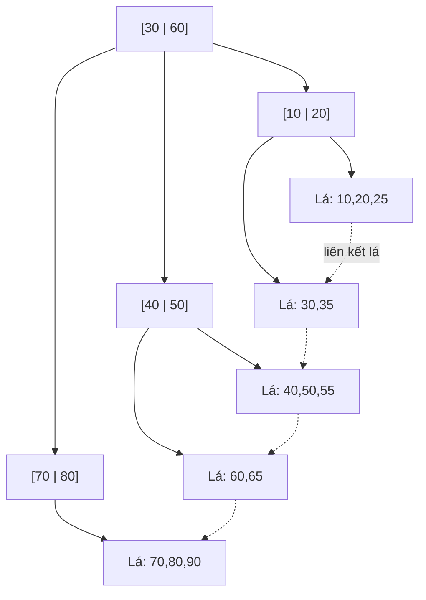

# Chỉ mục (Indexing)

## Khái niệm
Chỉ mục (index) là cấu trúc dữ liệu phụ giúp cơ sở dữ liệu tìm hàng nhanh mà không phải quét toàn bộ bảng (full table scan). Nó giống mục lục của cuốn sách: thay vì đọc từng trang, ta tra mục lục để nhảy thẳng tới nơi cần.

## Khi nào dùng / Vì sao quan trọng
Tạo chỉ mục trên cột thường xuất hiện trong `WHERE`, `JOIN`, `ORDER BY` để giảm truy vấn từ O(n) xuống O(log n). Đây là công cụ tối ưu hiệu năng quan trọng nhất và là câu hỏi phỏng vấn kinh điển ("vì sao truy vấn chậm, tối ưu thế nào").

## Cách hoạt động — Các loại chỉ mục

### B-tree và B+ tree
Cây cân bằng (balanced tree) đa nhánh — loại chỉ mục mặc định và phổ biến nhất.
- **B-tree:** khoá và con trỏ dữ liệu nằm ở mọi nút.
- **B+ tree:** dữ liệu (hoặc con trỏ) **chỉ** nằm ở nút lá; các nút lá được liên kết thành danh sách → quét khoảng (range scan) rất nhanh.

```text
        [30 | 60]                ← nút gốc
       /    |     \
  [10 20] [40 50] [70 80]        ← nút lá (liên kết với nhau ⇄)
```
Phù hợp cho: so sánh bằng (`=`), khoảng (`BETWEEN`, `<`, `>`), sắp xếp, prefix `LIKE 'abc%'`.

### Hash index
Dùng bảng băm (hash table): áp hàm băm lên khoá để tìm vị trí trong O(1) trung bình.
- **Ưu:** cực nhanh cho tra cứu bằng (`=`).
- **Nhược:** KHÔNG hỗ trợ truy vấn khoảng hay sắp xếp (băm phá vỡ thứ tự). Dùng trong Redis, chỉ mục băm của PostgreSQL/MySQL Memory.

### Bitmap index
Mỗi giá trị phân biệt ứng với một chuỗi bit (bitmap) đánh dấu hàng nào chứa giá trị đó.
- Phù hợp cột **ít giá trị phân biệt** (low cardinality): giới tính, trạng thái, tỉnh/thành.
- Kết hợp điều kiện bằng phép AND/OR bit rất nhanh; lý tưởng cho kho dữ liệu (data warehouse, OLAP).
- **Nhược:** tốn kém khi ghi/cập nhật nhiều (OLTP), vì phải cập nhật nhiều bitmap.

```sql
CREATE INDEX idx_ten ON nhan_vien (ho_ten);            -- B-tree mặc định
CREATE INDEX idx_phong ON nhan_vien USING HASH (phong_id);  -- hash (PostgreSQL)
CREATE BITMAP INDEX idx_gioitinh ON nhan_vien (gioi_tinh);  -- bitmap (Oracle)
```

## So sánh nhanh
| Loại | Truy vấn bằng | Truy vấn khoảng | Sắp xếp | Hợp với |
|------|---------------|-----------------|---------|---------|
| B+ tree | ✅ | ✅ | ✅ | Đa số trường hợp (mặc định) |
| Hash | ✅ (nhanh nhất) | ❌ | ❌ | Chỉ tra cứu bằng |
| Bitmap | ✅ | ⚠️ | ⚠️ | Cột ít giá trị, đọc nhiều |

## Chỉ mục gom cụm và không gom cụm (Clustered vs Non-clustered)
- **Clustered index (gom cụm):** quyết định thứ tự lưu trữ vật lý của hàng trên đĩa. Mỗi bảng chỉ có **một** clustered index (thường là khoá chính). Đọc theo khoảng rất nhanh vì dữ liệu nằm liền kề.
- **Non-clustered index (không gom cụm):** cấu trúc tách biệt, chứa khoá và con trỏ tới hàng thực. Một bảng có **nhiều** non-clustered index.

```text
Clustered (theo id):   [1][2][3][4][5]  ← hàng thật xếp theo id
Non-clustered (ho_ten): An→#3  Binh→#1  Lan→#5  ← trỏ tới vị trí hàng
```

## Chỉ mục bao phủ (Covering index)
Nếu chỉ mục chứa **mọi cột** mà truy vấn cần, CSDL trả kết quả ngay từ chỉ mục, không phải tra về bảng (index-only scan) → nhanh hơn nhiều.
```sql
-- Chỉ mục ghép bao phủ truy vấn chỉ đọc ho_ten và luong
CREATE INDEX idx_bao_phu ON nhan_vien (phong_id, ho_ten, luong);
SELECT ho_ten, luong FROM nhan_vien WHERE phong_id = 3;  -- không cần chạm bảng
```

## Kiểm tra chỉ mục có được dùng không
Dùng `EXPLAIN` (hoặc `EXPLAIN ANALYZE`) để xem kế hoạch thực thi (query plan):
```sql
EXPLAIN SELECT * FROM nhan_vien WHERE ho_ten = 'Lan';
-- Mong đợi: "Index Scan using idx_ten" thay vì "Seq Scan" (quét tuần tự)
```
Nếu thấy `Seq Scan` trên bảng lớn dù có điều kiện lọc → thường thiếu chỉ mục phù hợp, hoặc hàm bọc quanh cột (`WHERE UPPER(ho_ten)=...`) làm vô hiệu chỉ mục.

## Đánh đổi đọc/ghi
Chỉ mục **tăng tốc đọc** nhưng **làm chậm ghi**: mỗi `INSERT`, `UPDATE`, `DELETE` phải cập nhật cả bảng lẫn mọi chỉ mục liên quan, và chỉ mục chiếm thêm dung lượng đĩa.

```text
Nhiều chỉ mục  → SELECT nhanh, nhưng INSERT/UPDATE chậm + tốn đĩa
Ít chỉ mục     → ghi nhanh, nhưng SELECT có thể phải quét toàn bảng
```

### Nguyên tắc thực dụng
- Chỉ mục hoá cột trong `WHERE`, `JOIN`, `ORDER BY`, khoá ngoại.
- **Không** chỉ mục hoá cột hiếm dùng để lọc hoặc bảng ghi rất nhiều.
- **Chỉ mục ghép (composite index):** thứ tự cột quan trọng — quy tắc tiền tố trái (leftmost prefix). `INDEX(a, b)` giúp lọc theo `a` hoặc `a AND b`, nhưng không giúp lọc riêng `b`.
- Chỉ mục hoá cột nhiều giá trị phân biệt (high cardinality) mang lại lợi ích lớn nhất.

## Độ phức tạp
| Thao tác | Không chỉ mục | Có B+ tree |
|----------|---------------|------------|
| Tìm kiếm | O(n) | O(log n) |
| Chèn | O(1)* | O(log n) |

(*chèn cuối bảng nhưng tìm để kiểm tra ràng buộc vẫn có thể O(n))

## Khi chỉ mục KHÔNG được dùng
Chỉ mục dễ bị "vô hiệu hoá" một cách vô tình:
- Bọc hàm quanh cột: `WHERE YEAR(ngay_vao) = 2020` → không dùng được chỉ mục trên `ngay_vao`. Viết lại thành `WHERE ngay_vao >= '2020-01-01' AND ngay_vao < '2021-01-01'`.
- `LIKE '%abc'` (ký tự đại diện ở đầu) → không dùng được chỉ mục; `LIKE 'abc%'` thì dùng được.
- Ép kiểu ngầm (implicit cast): so sánh cột số với chuỗi.
- Bảng quá nhỏ: bộ tối ưu (optimizer) có thể cố ý quét tuần tự vì nhanh hơn.

## Cách chọn chỉ mục — quy trình ngắn
1. Xác định truy vấn chậm bằng slow query log.
2. Xem `EXPLAIN` để biết đang quét tuần tự hay dùng chỉ mục.
3. Tạo chỉ mục trên cột trong `WHERE`/`JOIN`/`ORDER BY`, ưu tiên cột high-cardinality.
4. Với truy vấn nhiều điều kiện, cân nhắc chỉ mục ghép theo đúng thứ tự tiền tố trái.
5. Đo lại; xoá chỉ mục không mang lại lợi ích để giảm chi phí ghi.

## Ưu / nhược điểm
- **Ưu:** tăng tốc đọc/tìm kiếm mạnh, hỗ trợ ràng buộc `UNIQUE`, tăng tốc `JOIN` và sắp xếp.
- **Nhược:** làm chậm ghi, tốn dung lượng, cần bảo trì, chỉ mục sai/thừa còn phản tác dụng.

## Câu hỏi phỏng vấn thường gặp
1. Vì sao CSDL dùng B+ tree thay vì B-tree cho chỉ mục?
2. Khi nào hash index tốt hơn B-tree, và ngược lại?
3. Đánh đổi khi thêm nhiều chỉ mục là gì?
4. Quy tắc tiền tố trái của chỉ mục ghép hoạt động ra sao?
5. Cardinality ảnh hưởng thế nào tới hiệu quả chỉ mục? Vì sao bitmap hợp cột low-cardinality?

## Sơ đồ cấu trúc B+ Tree

B+ tree lưu toàn bộ khoá dữ liệu ở các nút lá; nút trong chỉ chứa khoá định hướng. Các nút lá được liên kết với nhau tạo thành danh sách liên kết, giúp quét khoảng (range scan) hiệu quả.



- Chiều cao thấp (fan-out lớn) → số lần đọc đĩa ít, tìm kiếm O(log n).
- Liên kết giữa các lá → truy vấn khoảng và quét tuần tự nhanh.

## Tham khảo
- Xem thêm: [SQL](sql.md), [Giao dịch](giao-dich.md), [Cẩm nang phỏng vấn CSDL](cam-nang-phong-van-csdl.md)
