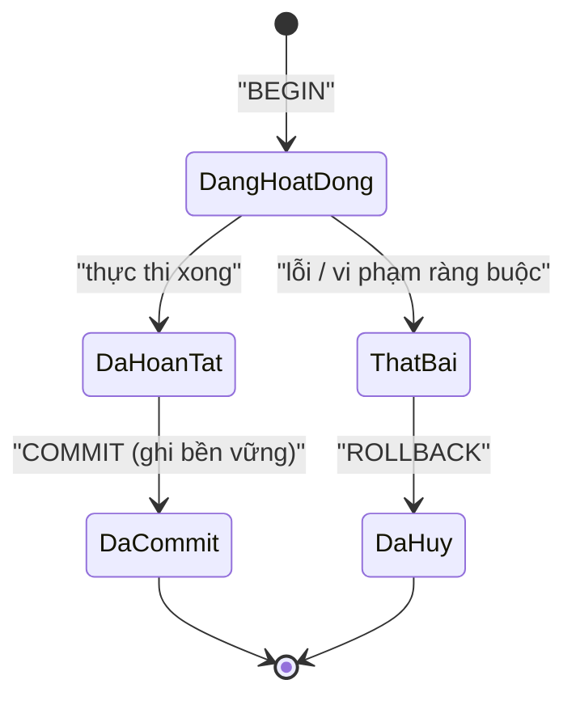
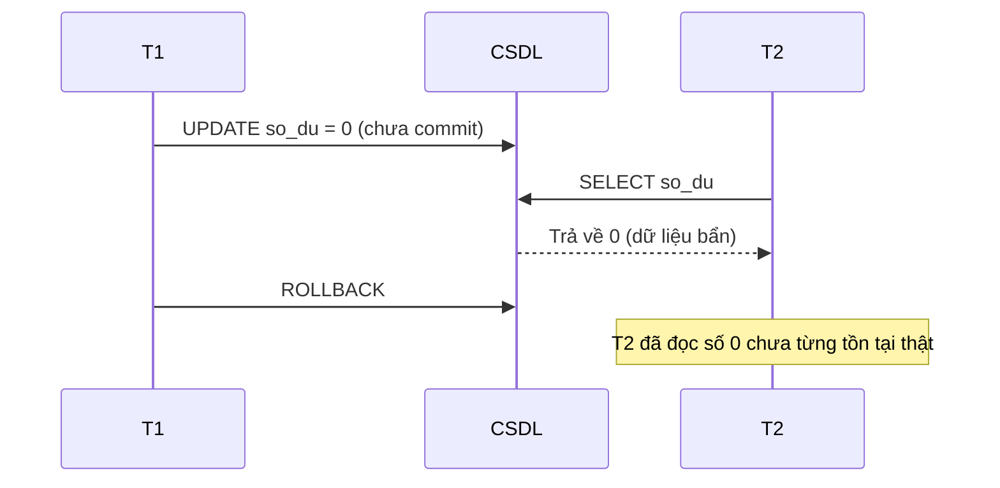
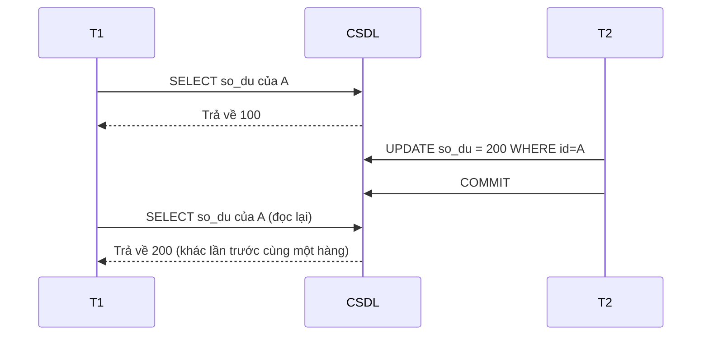
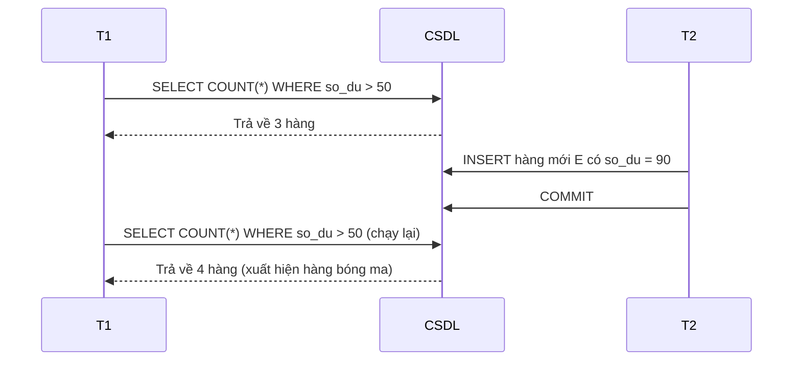

# Giao dịch & mức cô lập (Transactions & Isolation Levels)

## Khái niệm
Giao dịch (transaction) là một chuỗi thao tác được xử lý như một đơn vị logic duy nhất, tuân theo tính chất ACID. Mức cô lập (isolation level) quy định một giao dịch nhìn thấy bao nhiêu thay đổi của các giao dịch đồng thời khác — cân bằng giữa tính đúng đắn và hiệu năng.

## Khi nào dùng / Vì sao quan trọng
Giao dịch cần thiết bất cứ khi nào nhiều thao tác phải thành công cùng nhau (chuyển khoản, đặt hàng trừ kho). Mức cô lập là chủ đề phỏng vấn khó vì liên quan tới lỗi khó tái hiện trong môi trường đồng thời (concurrency).

## Cách hoạt động

### Vòng đời một giao dịch
```sql
BEGIN;                         -- bắt đầu giao dịch
UPDATE kho SET so_luong = so_luong - 1 WHERE sp_id = 10;
INSERT INTO don_hang (sp_id, so_luong) VALUES (10, 1);

SAVEPOINT sp1;                 -- điểm lưu trung gian
UPDATE diem_thuong SET diem = diem + 5 WHERE user_id = 42;
ROLLBACK TO sp1;               -- hoàn tác riêng phần sau savepoint

COMMIT;                        -- ghi bền vững toàn bộ; hoặc ROLLBACK để huỷ tất cả
```
- `COMMIT`: xác nhận, mọi thay đổi trở nên bền vững và hiển thị với giao dịch khác.
- `ROLLBACK`: huỷ toàn bộ, đưa dữ liệu về trạng thái trước `BEGIN`.
- `SAVEPOINT` + `ROLLBACK TO`: hoàn tác một phần mà không huỷ cả giao dịch.

## Các hiện tượng lỗi đồng thời (concurrency anomalies)
| Hiện tượng | Mô tả |
|------------|-------|
| Dirty read (đọc bẩn) | Đọc dữ liệu mà giao dịch khác đã sửa nhưng **chưa** commit; nếu nó rollback thì ta đọc phải dữ liệu không tồn tại |
| Non-repeatable read (đọc không lặp lại) | Đọc cùng một hàng hai lần trong một giao dịch nhưng ra giá trị khác vì giao dịch khác đã sửa & commit ở giữa |
| Phantom read (đọc bóng ma) | Chạy lại cùng một truy vấn theo điều kiện, số **hàng** khác đi vì giao dịch khác đã chèn/xoá hàng khớp điều kiện |
| Lost update (mất cập nhật) | Hai giao dịch cùng đọc rồi ghi đè, một cập nhật bị mất |

### Minh hoạ dirty read
```text
T1: BEGIN; UPDATE tk SET so_du = 0 WHERE id='A';   (chưa commit)
T2: SELECT so_du FROM tk WHERE id='A';  → đọc 0   (dữ liệu bẩn!)
T1: ROLLBACK;                            → số 0 chưa từng tồn tại thật
```

### Minh hoạ lost update
```text
T1 đọc so_du = 100 ─┐
T2 đọc so_du = 100 ─┤ cả hai cùng thấy 100
T1 ghi 100 + 50 = 150
T2 ghi 100 - 30 = 70  → ghi đè, cập nhật +50 của T1 bị MẤT
```
Cách chống: khoá bi quan (`SELECT ... FOR UPDATE`) hoặc khoá lạc quan (optimistic lock bằng cột version).

### Minh hoạ non-repeatable read vs phantom read
```text
Non-repeatable read (cùng HÀNG đổi giá trị):
T1: SELECT so_du FROM tk WHERE id='A';  → 100
T2: UPDATE tk SET so_du=200 WHERE id='A'; COMMIT;
T1: SELECT so_du FROM tk WHERE id='A';  → 200  (khác lần đọc trước!)

Phantom read (SỐ HÀNG khớp điều kiện đổi):
T1: SELECT COUNT(*) FROM tk WHERE so_du > 50;  → 3 hàng
T2: INSERT INTO tk VALUES ('E', 90); COMMIT;
T1: SELECT COUNT(*) FROM tk WHERE so_du > 50;  → 4 hàng (xuất hiện "bóng ma")
```
Khác biệt cốt lõi: non-repeatable read là **giá trị của hàng đã có** thay đổi; phantom read là **tập hàng khớp điều kiện** thay đổi (do chèn/xoá).

## Bốn mức cô lập (chuẩn SQL)
Từ lỏng lẻo (nhanh, ít an toàn) đến chặt chẽ (chậm, an toàn):

| Mức cô lập | Dirty read | Non-repeatable read | Phantom read |
|------------|:----------:|:-------------------:|:------------:|
| Read Uncommitted | ⚠️ Có | ⚠️ Có | ⚠️ Có |
| Read Committed | ✅ Ngăn | ⚠️ Có | ⚠️ Có |
| Repeatable Read | ✅ Ngăn | ✅ Ngăn | ⚠️ Có* |
| Serializable | ✅ Ngăn | ✅ Ngăn | ✅ Ngăn |

(*Chuẩn SQL cho phép phantom ở Repeatable Read; nhưng InnoDB của MySQL dùng next-key lock nên ngăn được phần lớn phantom.)

### Mức cô lập mặc định theo hệ quản trị
| Hệ quản trị | Mức cô lập mặc định |
|-------------|---------------------|
| PostgreSQL | Read Committed |
| Oracle | Read Committed |
| SQL Server | Read Committed |
| MySQL / InnoDB | Repeatable Read |

Đổi mức cô lập là đánh đổi: mức càng cao càng ít anomaly nhưng càng nhiều khoá/chờ và giảm thông lượng. Chọn mức thấp nhất vẫn đảm bảo đúng đắn cho nghiệp vụ.

!!! question "Tại sao mức cô lập cao thì AN TOÀN hơn nhưng CHẬM hơn?"
    Cô lập được thực thi bằng **khoá (lock)**: muốn chặn giao dịch khác nhìn/sửa dữ liệu ta đang dùng, phải khoá nó lại, và **khoá tức là bắt kẻ khác chờ**. Mức càng cao đòi hỏi khoá **nhiều hơn, phạm vi rộng hơn, và giữ lâu hơn** → an toàn hơn nhưng song song kém đi:

    - **Read Uncommitted:** gần như không khoá đọc → nhanh nhất, nhưng thấy cả dữ liệu chưa commit (dirty read).
    - **Read Committed:** chỉ khoá đủ để đọc bản đã commit; khoá đọc **thả ngay sau mỗi câu lệnh**. Vì thả sớm, đọc lại cùng hàng có thể ra giá trị khác → còn non-repeatable read.
    - **Repeatable Read:** **giữ khoá đọc tới hết giao dịch** (hoặc dùng snapshot MVCC cố định), nên hàng đã đọc không ai sửa được → chặn non-repeatable read. Cái giá: khoá tồn tại lâu hơn, kẻ khác chờ lâu hơn.
    - **Serializable:** khoá cả **khoảng/điều kiện** (range lock, ví dụ "mọi hàng có `so_du > 50`"), chặn luôn việc *chèn* hàng mới khớp điều kiện → diệt phantom read. Đây là mức khoá rộng nhất → an toàn tuyệt đối nhưng dễ tắc nghẽn, dễ **deadlock**, thông lượng thấp nhất.

    **Trực giác đánh đổi:** an toàn = "không cho ai đụng vào khi tôi chưa xong" = **giữ nhiều khoá lâu hơn** = người khác **xếp hàng chờ** = ít việc chạy song song = chậm. Vì vậy nguyên tắc là chọn **mức thấp nhất vẫn đúng nghiệp vụ**, đừng bật `SERIALIZABLE` cho mọi thứ chỉ vì nghe "an toàn nhất".

    (Mỗi mức cho phép/chặn hiện tượng nào chính là *hệ quả* của việc nó thả khoá sớm hay muộn: thả càng sớm càng để lọt anomaly, giữ càng lâu và càng rộng thì chặn được càng nhiều loại.)

### Diễn giải từng mức
- **Read Uncommitted:** đọc được cả dữ liệu chưa commit. Nhanh nhất, kém an toàn nhất, hiếm khi dùng.
- **Read Committed:** chỉ đọc dữ liệu đã commit. Mặc định của PostgreSQL, Oracle, SQL Server.
- **Repeatable Read:** trong một giao dịch, đọc lại cùng hàng luôn ra kết quả cũ. Mặc định của MySQL/InnoDB.
- **Serializable:** giao dịch chạy như thể tuần tự hoàn toàn. An toàn nhất, chậm nhất, dễ khoá/đợi.

```sql
-- Đặt mức cô lập cho phiên làm việc
SET TRANSACTION ISOLATION LEVEL READ COMMITTED;
BEGIN;
SELECT so_du FROM tai_khoan WHERE id = 'A';
COMMIT;
```

## Cơ chế thực thi cô lập
- **Khoá (Locking):** khoá đọc/ghi (shared/exclusive) trên hàng hoặc bảng; giao dịch khác phải chờ.
- **MVCC (Multi-Version Concurrency Control):** giữ nhiều phiên bản dữ liệu; đọc lấy ảnh chụp (snapshot) nhất quán mà không chặn ghi. PostgreSQL và InnoDB dùng MVCC để đọc không cần khoá.

### Bế tắc (Deadlock)
Hai giao dịch chờ khoá của nhau vô hạn. CSDL tự phát hiện và huỷ (rollback) một giao dịch làm "nạn nhân". Giảm nguy cơ bằng cách truy cập tài nguyên theo thứ tự nhất quán và giữ giao dịch ngắn.

## Ưu / nhược điểm
- **Cô lập cao — Ưu:** dữ liệu đúng đắn, tránh mọi anomaly. **Nhược:** nhiều khoá, giảm đồng thời, dễ deadlock, chậm.
- **Cô lập thấp — Ưu:** thông lượng cao, ít chặn. **Nhược:** có thể gặp dirty/phantom read.

## Giao dịch trong ứng dụng thực tế
Giao dịch nên **ngắn** để giảm giữ khoá và tránh deadlock. Một số nguyên tắc:
- Không thực hiện gọi mạng/API bên ngoài khi đang mở giao dịch.
- Xử lý lỗi rõ ràng: bắt ngoại lệ và `ROLLBACK`, đừng để giao dịch treo.
- Với thao tác "đọc rồi ghi", dùng `SELECT ... FOR UPDATE` để khoá hàng ngay từ lúc đọc.

```sql
BEGIN;
SELECT so_luong FROM kho WHERE sp_id = 10 FOR UPDATE;  -- khoá hàng
-- kiểm tra tồn kho trong ứng dụng...
UPDATE kho SET so_luong = so_luong - 1 WHERE sp_id = 10;
COMMIT;
```

## Khoá bi quan và khoá lạc quan
- **Khoá bi quan (pessimistic):** giả định sẽ có xung đột nên khoá ngay. An toàn nhưng giảm đồng thời.
- **Khoá lạc quan (optimistic):** không khoá, mà kiểm tra cột `version` lúc ghi; nếu bị người khác sửa trước thì thử lại. Hợp với hệ ít xung đột, đọc nhiều.

## Tính nguyên tử ở tầng ứng dụng: mẫu Saga
Trong hệ phân tán (microservices), một giao dịch ACID không trải được qua nhiều dịch vụ. Mẫu **Saga** chia thành chuỗi giao dịch cục bộ, mỗi bước có một hành động **bù trừ (compensating action)** để hoàn tác khi bước sau thất bại.
```text
Đặt hàng: trừ kho → thu tiền → tạo vận đơn
Nếu thu tiền lỗi → chạy bù: hoàn kho (undo bước trước)
```

## Câu hỏi phỏng vấn thường gặp
1. Bốn mức cô lập và mỗi mức ngăn hiện tượng nào?
2. Phân biệt non-repeatable read và phantom read.
3. `COMMIT`, `ROLLBACK`, `SAVEPOINT` khác nhau ra sao?
4. MVCC hoạt động thế nào và giúp gì cho tính cô lập?
5. Deadlock là gì và làm sao phòng tránh?

## Playground: mô phỏng Lost Update và cách chống

Demo mô phỏng hai giao dịch cùng đọc rồi ghi số dư. Không khoá → xảy ra **lost update**. Dùng khoá lạc quan (kiểm tra cột `version`) → phát hiện xung đột và thử lại.

<div class="js-demo" data-title="Lost update vs khoá lạc quan (version)">
<textarea class="js-demo-src">
// --- Trường hợp 1: KHÔNG khoá → mất cập nhật ---
let so_du = 100;
const t1_doc = so_du;          // T1 đọc 100
const t2_doc = so_du;          // T2 đọc 100 (cùng lúc)
so_du = t1_doc + 50;           // T1 ghi 150
so_du = t2_doc - 30;           // T2 ghi 70  → đè mất +50 của T1
print('KHÔNG khoá:');
print(`  Kỳ vọng đúng = 100 + 50 - 30 = 120`);
print(`  Thực tế      = ${so_du}  → +50 của T1 bị MẤT\n`);

// --- Trường hợp 2: khoá lạc quan bằng cột version ---
let row = { so_du: 100, version: 1 };
function ghiCoVersion(readVersion, newSoDu) {
  if (row.version !== readVersion) return false; // ai đó đã sửa trước
  row.so_du = newSoDu;
  row.version++;
  return true;
}
// T1 và T2 cùng đọc version 1
const v1 = row.version, base1 = row.so_du;
const v2 = row.version, base2 = row.so_du;
print('Khoá lạc quan (version):');
print(`  T1 ghi 150: ${ghiCoVersion(v1, base1 + 50) ? 'OK' : 'từ chối'}`);
let ok2 = ghiCoVersion(v2, base2 - 30);
print(`  T2 ghi 70 : ${ok2 ? 'OK' : 'TỪ CHỐI (version đã đổi) → phải thử lại'}`);
if (!ok2) {
  const retry = row.so_du - 30;   // đọc lại rồi tính trên giá trị mới nhất
  ghiCoVersion(row.version, retry);
  print(`  T2 thử lại trên số dư mới: ${retry}`);
}
print(`  Kết quả cuối = ${row.so_du}  → đúng, không mất cập nhật`);
</textarea>
</div>

## Sơ đồ vòng đời giao dịch

Vòng đời của một giao dịch (transaction) đi qua các trạng thái từ khi bắt đầu đến khi kết thúc (commit hoặc rollback).



- **Đang hoạt động:** các câu lệnh đang được thực thi.
- **Đã hoàn tất → Đã commit:** thay đổi được ghi bền vững (durability).
- **Thất bại → Đã huỷ:** mọi thay đổi bị hoàn tác (rollback), đảm bảo tính nguyên tử (atomicity).

## Sơ đồ các hiện tượng đọc bất thường

Ba hiện tượng đọc bất thường phổ biến khi hai giao dịch chạy đồng thời. Sơ đồ tuần tự cho thấy chính xác thời điểm dữ liệu "sai" bị đọc.

### Dirty read (đọc bẩn)



### Non-repeatable read (đọc không lặp lại)



### Phantom read (đọc bóng ma)



Khác biệt cốt lõi: **dirty read** đọc dữ liệu chưa commit; **non-repeatable read** là *giá trị của một hàng đã có* thay đổi; **phantom read** là *số hàng khớp điều kiện* thay đổi do chèn/xoá.

## Tham khảo
- Xem thêm: [Tính chất ACID](acid.md), [Chỉ mục](chi-muc.md), [SQL](sql.md)
