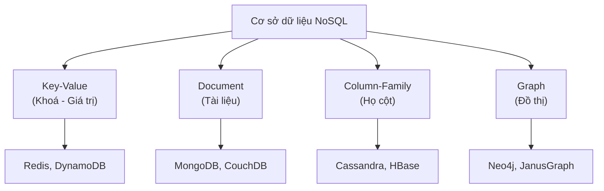

# Cơ sở dữ liệu NoSQL (NoSQL Database)

## Khái niệm
NoSQL ("Not Only SQL") là nhóm cơ sở dữ liệu phi quan hệ (non-relational), không bắt buộc lược đồ (schema) cố định và không dùng mô hình bảng quan hệ truyền thống. Chúng ra đời để xử lý dữ liệu lớn, đa dạng và cần mở rộng theo chiều ngang (horizontal scaling).

## Khi nào dùng / Vì sao quan trọng
Dùng khi dữ liệu bán cấu trúc/phi cấu trúc, khối lượng cực lớn, cần độ trễ thấp và khả năng scale ngang: mạng xã hội, IoT, cache, phân tích thời gian thực, hệ gợi ý. Đây là chủ đề phỏng vấn phổ biến khi bàn về thiết kế hệ thống (system design).

## Cách hoạt động — Bốn loại chính

### 1. Document (tài liệu)
Lưu dữ liệu dạng tài liệu JSON/BSON linh hoạt, mỗi tài liệu tự mô tả cấu trúc.
- **Ví dụ:** MongoDB, CouchDB.
```javascript
// Một document trong MongoDB — không cần schema cố định
{
  "_id": "nv001",
  "ho_ten": "Lan",
  "ky_nang": ["Python", "SQL"],   // mảng lồng nhau
  "dia_chi": { "tinh": "Hà Nội" } // object lồng nhau
}
db.nhan_vien.find({ "ky_nang": "SQL" })  // truy vấn theo phần tử mảng
```

### 2. Key-Value (khoá–giá trị)
Bảng băm (hash map) khổng lồ: mỗi khoá ánh xạ tới một giá trị. Cực nhanh, đơn giản.
- **Ví dụ:** Redis, DynamoDB, Memcached.
```bash
# Redis — thường dùng làm cache, session, đếm lượt
SET session:abc123 "user_id=42"
EXPIRE session:abc123 3600   # tự hết hạn sau 1 giờ
INCR luot_xem:trang_chu      # tăng bộ đếm nguyên tử
```

### 3. Column-Family (họ cột / wide-column)
Lưu theo cột thay vì theo hàng, tối ưu ghi và đọc lượng lớn dữ liệu theo cột.
- **Ví dụ:** Cassandra, HBase, Bigtable.
```sql
-- Cassandra CQL: thiết kế bảng theo mẫu truy vấn (query-first)
CREATE TABLE su_kien (
    user_id  UUID,
    thoi_gian TIMESTAMP,
    hanh_dong TEXT,
    PRIMARY KEY (user_id, thoi_gian)  -- phân vùng theo user, sắp theo thời gian
);
```

### 4. Graph (đồ thị)
Biểu diễn thực thể là nút (node) và mối quan hệ là cạnh (edge); tối ưu truy vấn quan hệ nhiều tầng.
- **Ví dụ:** Neo4j, Amazon Neptune.
```cypher
// Neo4j Cypher: tìm bạn của bạn
MATCH (a:Nguoi {ten: 'Lan'})-[:BAN]->(:Nguoi)-[:BAN]->(fof)
RETURN DISTINCT fof.ten
```

## Thao tác thực tế: Document & Key-Value

### Thao tác document (MongoDB) bằng JS và Python
Cùng một nghiệp vụ (thêm, tìm, cập nhật, xoá hồ sơ nhân viên) viết bằng driver JS và Python.

=== "JavaScript"
    ```js
    // MongoDB Node.js driver
    const col = db.collection('nhan_vien');

    // Chèn document (không cần schema cố định)
    await col.insertOne({ _id: 'nv001', ho_ten: 'Lan', ky_nang: ['Python', 'SQL'] });

    // Tìm theo phần tử mảng + chỉ lấy vài trường
    const ds = await col.find(
      { ky_nang: 'SQL' },
      { projection: { ho_ten: 1 } }
    ).toArray();

    // Cập nhật: thêm kỹ năng mới vào mảng (không trùng)
    await col.updateOne({ _id: 'nv001' }, { $addToSet: { ky_nang: 'Go' } });

    // Xoá
    await col.deleteOne({ _id: 'nv001' });
    ```

=== "Python"
    ```python
    # PyMongo driver
    col = db["nhan_vien"]

    # Chèn document (không cần schema cố định)
    col.insert_one({"_id": "nv001", "ho_ten": "Lan", "ky_nang": ["Python", "SQL"]})

    # Tìm theo phần tử mảng + chỉ lấy vài trường
    ds = list(col.find({"ky_nang": "SQL"}, {"ho_ten": 1}))

    # Cập nhật: thêm kỹ năng mới vào mảng (không trùng)
    col.update_one({"_id": "nv001"}, {"$addToSet": {"ky_nang": "Go"}})

    # Xoá
    col.delete_one({"_id": "nv001"})
    ```

### Thao tác key-value (Redis) bằng JS và Python
Mẫu điển hình: cache, session, bộ đếm nguyên tử.

=== "JavaScript"
    ```js
    // node-redis
    await client.set('session:abc123', 'user_id=42', { EX: 3600 }); // hết hạn 1h
    const s = await client.get('session:abc123');
    await client.incr('luot_xem:trang_chu');        // tăng bộ đếm nguyên tử
    await client.hSet('user:42', { ten: 'Lan', tuoi: '30' }); // hash
    await client.expire('user:42', 86400);
    ```

=== "Python"
    ```python
    # redis-py
    r.set("session:abc123", "user_id=42", ex=3600)   # hết hạn 1h
    s = r.get("session:abc123")
    r.incr("luot_xem:trang_chu")                     # tăng bộ đếm nguyên tử
    r.hset("user:42", mapping={"ten": "Lan", "tuoi": 30})  # hash
    r.expire("user:42", 86400)
    ```

## So sánh SQL và NoSQL
| Tiêu chí | SQL (quan hệ) | NoSQL |
|----------|---------------|-------|
| Lược đồ | Cố định, chặt | Linh hoạt / không schema |
| Mở rộng | Chủ yếu chiều dọc (vertical) | Chiều ngang (horizontal) dễ dàng |
| Giao dịch | ACID mạnh | Thường BASE, ưu tiên sẵn sàng |
| Truy vấn | SQL chuẩn, JOIN mạnh | API riêng từng loại, hạn chế JOIN |
| Quan hệ | Biểu diễn bằng khoá ngoại | Nhúng (embed) hoặc tham chiếu |

## Nhân bản và phân mảnh (Replication & Sharding)
Khả năng scale ngang của NoSQL dựa trên hai kỹ thuật cốt lõi:

- **Replication (nhân bản):** sao chép cùng một dữ liệu ra nhiều nút để tăng tính sẵn sàng và tốc độ đọc. Kiểu master–replica (một nút ghi, nhiều nút đọc) hoặc multi-master (nhiều nút cùng ghi).
- **Sharding (phân mảnh):** chia dữ liệu thành các phần (shard) đặt trên các nút khác nhau theo khoá phân mảnh (shard key). Mỗi nút chỉ giữ một phần dữ liệu → phân tán tải ghi.

```text
Sharding theo user_id:
  shard A (user 0–999)   → node 1
  shard B (user 1000–1999) → node 2
  shard C (user 2000–2999) → node 3
```
Chọn shard key kém (ví dụ giá trị lệch — hotspot) sẽ khiến một nút quá tải trong khi các nút khác nhàn rỗi.

## Mô hình nhất quán (Consistency models)
- **Strong consistency (nhất quán mạnh):** mọi lần đọc luôn thấy lần ghi mới nhất. An toàn nhưng chậm hơn khi phân tán.
- **Eventual consistency (nhất quán cuối cùng):** sau khi ghi, các bản sao hội tụ dần; đọc ngắn hạn có thể thấy dữ liệu cũ. Nhiều hệ NoSQL cho phép **điều chỉnh mức nhất quán** theo từng truy vấn (ví dụ Cassandra: `ONE`, `QUORUM`, `ALL`).

```sql
-- Cassandra: chọn mức nhất quán cho một truy vấn cụ thể
CONSISTENCY QUORUM;   -- đa số bản sao phải phản hồi
SELECT * FROM su_kien WHERE user_id = 550e8400-e29b-41d4-a716-446655440000;
```

## Khi nào chọn cái nào
- **Chọn SQL khi:** dữ liệu quan hệ chặt, cần giao dịch ACID, báo cáo phức tạp (kế toán, ngân hàng).
- **Chọn NoSQL khi:** cần scale ngang lớn, lược đồ thay đổi thường xuyên, độ trễ thấp, dữ liệu bán cấu trúc.
- Nhiều hệ thống dùng **kết hợp (polyglot persistence)**: PostgreSQL cho giao dịch + Redis cho cache + Elasticsearch cho tìm kiếm.

## Bảng chọn loại NoSQL theo bài toán
| Bài toán | Loại nên chọn | Ví dụ hệ |
|----------|---------------|----------|
| Cache, session, bảng xếp hạng, hàng đợi | Key-value | Redis |
| Hồ sơ người dùng, catalog sản phẩm linh hoạt | Document | MongoDB |
| Log, chuỗi thời gian, ghi khối lượng lớn | Column-family | Cassandra |
| Mạng xã hội, gợi ý, phát hiện gian lận | Graph | Neo4j |

## Thiết kế lược đồ: nhúng hay tham chiếu?
Trong CSDL document, có hai cách mô hình hoá quan hệ:

- **Nhúng (embedding):** đặt dữ liệu con ngay trong tài liệu cha. Nhanh khi đọc (một lần truy vấn), phù hợp quan hệ "chứa" và dữ liệu con không dùng độc lập.
- **Tham chiếu (referencing):** lưu id trỏ tới tài liệu khác, giống khoá ngoại. Tránh trùng lặp, phù hợp quan hệ nhiều–nhiều hoặc dữ liệu con lớn/thay đổi thường xuyên.

```javascript
// Nhúng: bình luận nằm trong bài viết
{ "_id": "bai1", "tieu_de": "...", "binh_luan": [ {"tac_gia": "An", "noi_dung": "hay"} ] }

// Tham chiếu: bài viết trỏ tới tác giả
{ "_id": "bai1", "tac_gia_id": "user42" }
```

## Ưu / nhược điểm
- **Ưu:** scale ngang tốt, linh hoạt lược đồ, hiệu năng cao cho mẫu truy cập cụ thể, phù hợp dữ liệu lớn.
- **Nhược:** hỗ trợ giao dịch yếu hơn (nhiều hệ chỉ đảm bảo nhất quán cuối cùng — eventual consistency), thiếu chuẩn truy vấn chung, dễ trùng lặp dữ liệu, khó cho truy vấn ad-hoc phức tạp.

## Câu hỏi phỏng vấn thường gặp
1. Bốn loại NoSQL là gì? Cho ví dụ mỗi loại và tình huống dùng.
2. Khi nào chọn NoSQL thay vì SQL? Đánh đổi là gì?
3. Định lý CAP liên quan thế nào tới NoSQL? (xem trang ACID)
4. Vì sao NoSQL scale ngang dễ hơn SQL?
5. Nhúng (embedding) và tham chiếu (referencing) trong MongoDB khác nhau ra sao?

## Playground: mô phỏng kho document trong bộ nhớ

Demo cài đặt một "collection" document đơn giản (như MongoDB thu nhỏ) hỗ trợ insert, tìm theo phần tử mảng và cập nhật — cho thấy vì sao NoSQL document linh hoạt về lược đồ.

<div class="js-demo" data-title="Kho document mini kiểu MongoDB">
<textarea class="js-demo-src">
class Collection {
  constructor() { this.docs = []; }
  insert(doc) { this.docs.push(doc); return doc._id; }
  // Tìm document mà một trường mảng CHỨA giá trị
  findByArrayContains(field, value) {
    return this.docs.filter(d => Array.isArray(d[field]) && d[field].includes(value));
  }
  update(id, patch) {
    const d = this.docs.find(x => x._id === id);
    if (d) Object.assign(d, patch);
    return d;
  }
}

const col = new Collection();
// Ba document với LƯỢC ĐỒ KHÁC NHAU — hoàn toàn hợp lệ trong NoSQL
col.insert({ _id: 'nv1', ho_ten: 'Lan',   ky_nang: ['Python', 'SQL'] });
col.insert({ _id: 'nv2', ho_ten: 'Bình',  ky_nang: ['SQL', 'Go'], cap_bac: 'senior' });
col.insert({ _id: 'nv3', ho_ten: 'Cường', ky_nang: ['Java'] });

print('Người biết SQL:');
for (const d of col.findByArrayContains('ky_nang', 'SQL'))
  print('  -', d.ho_ten);

col.update('nv3', { ky_nang: ['Java', 'SQL'], du_an: 3 });
print('\nSau khi thêm SQL cho Cường:');
for (const d of col.findByArrayContains('ky_nang', 'SQL'))
  print('  -', d.ho_ten);

print('\nDocument nv3 giờ có thêm trường du_an =', col.docs[2].du_an);
</textarea>
</div>

## Sơ đồ bốn loại NoSQL



## Tham khảo
- Xem thêm: [Tính chất ACID & BASE](acid.md), [SQL](sql.md), [Cẩm nang phỏng vấn CSDL](cam-nang-phong-van-csdl.md)
