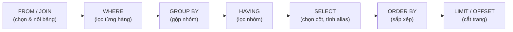
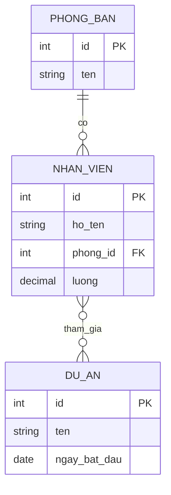

# Cơ sở dữ liệu quan hệ & SQL (Relational Database & SQL)

## Khái niệm
Cơ sở dữ liệu quan hệ (relational database) tổ chức dữ liệu thành các bảng (table) gồm hàng (row) và cột (column), với quan hệ giữa các bảng biểu diễn qua khoá (key). SQL (Structured Query Language) là ngôn ngữ chuẩn để định nghĩa, thao tác và truy vấn dữ liệu trong các hệ quản trị như MySQL, PostgreSQL, SQL Server, Oracle.

## Khi nào dùng / Vì sao quan trọng
Dùng khi dữ liệu có cấu trúc rõ ràng, quan hệ chặt chẽ, cần đảm bảo toàn vẹn (integrity) và giao dịch ACID: hệ thống ngân hàng, thương mại điện tử, ERP. SQL là kỹ năng nền tảng của mọi kỹ sư backend và là chủ đề gần như chắc chắn xuất hiện trong phỏng vấn.

## Cách hoạt động

### Bốn nhóm câu lệnh SQL
| Nhóm | Tên đầy đủ | Mục đích | Lệnh tiêu biểu |
|------|-----------|----------|----------------|
| DDL | Data Definition Language | Định nghĩa cấu trúc | `CREATE`, `ALTER`, `DROP`, `TRUNCATE` |
| DML | Data Manipulation Language | Thao tác dữ liệu | `INSERT`, `UPDATE`, `DELETE` |
| DQL | Data Query Language | Truy vấn dữ liệu | `SELECT` |
| DCL | Data Control Language | Phân quyền | `GRANT`, `REVOKE` |

> Ghi chú: `COMMIT`, `ROLLBACK`, `SAVEPOINT` thuộc nhóm TCL (Transaction Control Language) — xem trang Giao dịch.

### DDL — định nghĩa cấu trúc
```sql
CREATE TABLE nhan_vien (
    id          INT PRIMARY KEY AUTO_INCREMENT,
    ho_ten      VARCHAR(100) NOT NULL,
    phong_id    INT,
    luong       DECIMAL(12,2) CHECK (luong >= 0),
    ngay_vao    DATE DEFAULT (CURRENT_DATE),
    FOREIGN KEY (phong_id) REFERENCES phong_ban(id)  -- khoá ngoại
);

ALTER TABLE nhan_vien ADD COLUMN email VARCHAR(120) UNIQUE;
```

### DML — thao tác dữ liệu
```sql
INSERT INTO nhan_vien (ho_ten, phong_id, luong) VALUES ('Lan', 1, 15000000);

-- Chèn nhiều hàng một lệnh
INSERT INTO nhan_vien (ho_ten, phong_id, luong) VALUES
    ('Bình', 1, 18000000),
    ('Cường', 2, 22000000),
    ('Dung', 2, 16000000);

UPDATE nhan_vien SET luong = luong * 1.1 WHERE phong_id = 1;  -- tăng 10%
DELETE FROM nhan_vien WHERE ngay_vao < '2015-01-01';

-- UPSERT: chèn nếu chưa có, cập nhật nếu trùng khoá (PostgreSQL)
INSERT INTO nhan_vien (id, ho_ten, luong) VALUES (5, 'Em', 14000000)
ON CONFLICT (id) DO UPDATE SET luong = EXCLUDED.luong;
```

> Phân biệt xoá dữ liệu: `DELETE` xoá từng hàng theo điều kiện (ghi log, có thể rollback, kích hoạt trigger); `TRUNCATE` xoá sạch bảng cực nhanh (không log từng hàng, đặt lại AUTO_INCREMENT); `DROP` xoá luôn cả cấu trúc bảng.

### DCL — phân quyền
`DCL` kiểm soát ai được làm gì trên đối tượng CSDL.
```sql
GRANT SELECT, INSERT ON nhan_vien TO 'ke_toan';   -- cấp quyền đọc & chèn
GRANT ALL PRIVILEGES ON DATABASE cong_ty TO 'admin';
REVOKE INSERT ON nhan_vien FROM 'ke_toan';        -- thu hồi quyền chèn
```

### TCL — điều khiển giao dịch
`TCL` gom nhiều lệnh DML thành một đơn vị "tất-cả-hoặc-không".
```sql
BEGIN;                       -- (hoặc START TRANSACTION)
UPDATE tai_khoan SET so_du = so_du - 500000 WHERE id = 'A';
UPDATE tai_khoan SET so_du = so_du + 500000 WHERE id = 'B';
COMMIT;                      -- ghi bền vững; hoặc ROLLBACK để huỷ toàn bộ
```

## Chuẩn hoá (Normalization)
Chuẩn hoá loại bỏ dư thừa (redundancy) và bất thường khi cập nhật (update anomaly).

| Dạng chuẩn | Điều kiện |
|------------|-----------|
| 1NF | Mỗi ô chứa giá trị nguyên tử (atomic), không có nhóm lặp |
| 2NF | Đạt 1NF + không phụ thuộc bộ phận vào khoá chính (partial dependency) |
| 3NF | Đạt 2NF + không phụ thuộc bắc cầu (transitive dependency) |
| BCNF | Đạt 3NF + mọi phụ thuộc hàm đều có vế trái là siêu khoá (superkey) |

Thực tế thường chuẩn hoá tới 3NF, đôi khi **phi chuẩn hoá (denormalize)** có chủ đích để tăng tốc đọc.

!!! question "Tại sao chuẩn hoá giảm trùng lặp nhưng có thể làm CHẬM truy vấn? (và khi nào phi chuẩn hoá)"
    **Chuẩn hoá = tách một sự thật ra đúng một chỗ.** Ví dụ tên trưởng phòng chỉ lưu ở bảng `phong_ban`, mọi nơi khác *trỏ tới* qua khoá ngoại thay vì chép lại. Lợi ích:

    - **Không trùng lặp** → tiết kiệm chỗ, và quan trọng hơn là **tránh bất thường cập nhật (update anomaly)**: đổi tên trưởng phòng chỉ sửa **một hàng**, không phải đi tìm sửa hàng nghìn dòng đơn hàng có chép sẵn tên đó (chép nhiều nơi thì dễ sót → dữ liệu mâu thuẫn).

    **Nhưng cái giá là JOIN.** Vì dữ liệu bị xé ra nhiều bảng, để hiển thị "đơn hàng + tên khách + tên phòng + tên trưởng phòng" ta phải **ghép (JOIN) nhiều bảng lại lúc đọc**. Mỗi JOIN buộc CSDL khớp khoá giữa các bảng (dò chỉ mục, băm, hoặc quét) — càng nhiều bảng, càng nhiều hàng, càng tốn công. Truy vấn đọc nóng chạy hàng triệu lần mà phải JOIN 5–6 bảng có thể trở thành điểm nghẽn.

    **Vì vậy đôi khi phi chuẩn hoá:** cố ý **chép lại** vài trường (ví dụ lưu sẵn `ten_khach` ngay trong bảng đơn hàng) để **đọc một bảng là đủ, khỏi JOIN** → nhanh hơn nhiều. Đánh đổi ngược lại: tốn chỗ hơn và **phải tự lo đồng bộ bản sao** (đổi tên khách thì phải cập nhật nhiều nơi). Nguyên tắc: **chuẩn hoá để ghi an toàn/đúng đắn là mặc định; phi chuẩn hoá là tối ưu có chủ đích cho những truy vấn đọc nóng, chấp nhận thêm rủi ro trùng lặp.**

### Ví dụ chuẩn hoá từng bước
Bảng chưa chuẩn hoá (một hàng đơn hàng gộp mọi thứ):

| don_id | khach | sp_1, sp_2 | phong | truong_phong |
|--------|-------|------------|-------|--------------|
| 1 | An | Bút, Vở | KD | Hùng |

- **Vi phạm 1NF:** cột `sp_1, sp_2` chứa nhiều giá trị (nhóm lặp). Sửa: tách mỗi sản phẩm thành một hàng riêng.
- **Vi phạm 2NF:** nếu khoá chính là `(don_id, sp_id)` mà `khach` chỉ phụ thuộc `don_id` → phụ thuộc bộ phận. Sửa: tách bảng `don_hang(don_id, khach)` riêng.
- **Vi phạm 3NF:** `truong_phong` phụ thuộc `phong`, mà `phong` không phải khoá → phụ thuộc bắc cầu. Sửa: tách bảng `phong_ban(phong, truong_phong)`.

```sql
-- Sau chuẩn hoá 3NF: mỗi thực thể một bảng, quan hệ qua khoá ngoại
CREATE TABLE phong_ban (id INT PRIMARY KEY, ten VARCHAR(50), truong_phong VARCHAR(50));
CREATE TABLE khach_hang (id INT PRIMARY KEY, ten VARCHAR(50));
CREATE TABLE don_hang (id INT PRIMARY KEY, khach_id INT REFERENCES khach_hang(id));
CREATE TABLE chi_tiet_don (don_id INT, sp_id INT, so_luong INT, PRIMARY KEY (don_id, sp_id));
```

## Truy vấn (DQL)

### Các loại JOIN
```sql
-- INNER JOIN: chỉ hàng khớp ở cả hai bảng
SELECT nv.ho_ten, pb.ten
FROM nhan_vien nv
INNER JOIN phong_ban pb ON nv.phong_id = pb.id;

-- LEFT OUTER JOIN: giữ mọi hàng bảng trái, thiếu thì NULL
SELECT nv.ho_ten, pb.ten
FROM nhan_vien nv
LEFT JOIN phong_ban pb ON nv.phong_id = pb.id;

-- CROSS JOIN: tích Descartes mọi cặp hàng
SELECT a.mau, b.size FROM mau a CROSS JOIN size b;

-- FULL OUTER JOIN: giữ mọi hàng cả hai bảng, thiếu thì NULL
SELECT nv.ho_ten, pb.ten
FROM nhan_vien nv
FULL OUTER JOIN phong_ban pb ON nv.phong_id = pb.id;

-- SELF JOIN: nối bảng với chính nó (tìm nhân viên & quản lý)
SELECT nv.ho_ten AS nhan_vien, sep.ho_ten AS quan_ly
FROM nhan_vien nv
LEFT JOIN nhan_vien sep ON nv.quan_ly_id = sep.id;
```

Minh hoạ trực quan tập kết quả của các JOIN trên hai bảng A và B:

```text
A = {1,2,3}   B = {2,3,4}   (nối theo giá trị)
INNER      → {2,3}            (giao)
LEFT       → {1,2,3}          (mọi hàng A; 1 kèm NULL bên B)
RIGHT      → {2,3,4}          (mọi hàng B; 4 kèm NULL bên A)
FULL OUTER → {1,2,3,4}        (hợp; hai đầu thiếu là NULL)
```

| Loại JOIN | Kết quả |
|-----------|---------|
| INNER | Giao — chỉ hàng khớp |
| LEFT / RIGHT OUTER | Giữ toàn bộ bảng trái / phải |
| FULL OUTER | Hợp — giữ cả hai, thiếu thì NULL |
| CROSS | Tích Descartes (m × n hàng) |

!!! question "Tại sao chỉ mục (index) giúp `WHERE` và `JOIN` nhanh?"
    - **`WHERE`:** không có chỉ mục trên cột lọc, CSDL phải **quét toàn bảng** (đọc từng hàng để so điều kiện) → O(n). Chỉ mục giữ cột đó **đã sắp xếp** trong B+ tree, nên nhảy thẳng tới vùng khớp bằng cách chia đôi/rẽ nhánh → O(log n). Ví dụ `WHERE ho_ten = 'Lan'` trên 1 triệu hàng: quét ~1.000.000 lần đọc so với ~20 bước qua chỉ mục.
    - **`JOIN`:** ghép hai bảng thực chất là "với mỗi hàng bảng A, tìm hàng khớp ở bảng B". Không chỉ mục trên cột nối của B, mỗi hàng của A phải **quét lại toàn bộ B** → chi phí `A × B` (nested loop tệ nhất). Có chỉ mục trên cột nối của B, mỗi lần tìm khớp chỉ tốn O(log n) → tổng còn `A × log B`. Đây là lý do **cột khoá ngoại dùng để JOIN gần như luôn nên được chỉ mục hoá**; thiếu nó là nguyên nhân kinh điển khiến JOIN chậm ở quy mô lớn.

    Nói ngắn: chỉ mục biến thao tác "dò tìm tuyến tính" thành "tra cứu có định hướng", và cả `WHERE` lẫn `JOIN` đều bản chất là các thao tác dò tìm. (Chi tiết cơ chế B+ tree: xem trang [Chỉ mục](chi-muc.md).)

#### Sơ đồ Venn các loại JOIN

Mỗi loại JOIN tương ứng với một vùng của biểu đồ Venn giữa hai bảng A (trái) và B (phải); phần tô màu là dữ liệu được giữ lại trong kết quả.

<svg viewBox="0 0 640 340" xmlns="http://www.w3.org/2000/svg" role="img" aria-label="Sơ đồ Venn các loại JOIN" style="max-width:100%;height:auto;background:#1e1e1e;border-radius:8px">
  <style>
    .lbl { fill:#e0e0e0; font-family:sans-serif; font-size:15px; text-anchor:middle; }
    .cap { fill:#bdbdbd; font-family:sans-serif; font-size:12px; text-anchor:middle; }
    .ring { fill:none; stroke:#4db6ac; stroke-width:2; }
    .fillA { fill:#4db6ac; fill-opacity:0.55; }
    .fillB { fill:#7e57c2; fill-opacity:0.55; }
  </style>
  <!-- INNER -->
  <g>
    <text x="90" y="30" class="lbl">INNER JOIN</text>
    <clipPath id="clipInnerA"><circle cx="72" cy="110" r="45"/></clipPath>
    <circle cx="72" cy="110" r="45" class="ring"/>
    <circle cx="110" cy="110" r="45" class="ring"/>
    <circle cx="110" cy="110" r="45" class="fillA" clip-path="url(#clipInnerA)"/>
    <text x="90" y="185" class="cap">Chỉ hàng khớp ở cả hai</text>
  </g>
  <!-- LEFT -->
  <g>
    <text x="250" y="30" class="lbl">LEFT JOIN</text>
    <circle cx="232" cy="110" r="45" class="fillA"/>
    <circle cx="232" cy="110" r="45" class="ring"/>
    <circle cx="270" cy="110" r="45" class="ring"/>
    <text x="250" y="185" class="cap">Toàn bộ A + phần khớp B</text>
  </g>
  <!-- RIGHT -->
  <g>
    <text x="410" y="30" class="lbl">RIGHT JOIN</text>
    <circle cx="392" cy="110" r="45" class="ring"/>
    <circle cx="430" cy="110" r="45" class="fillB"/>
    <circle cx="392" cy="110" r="45" class="ring"/>
    <text x="410" y="185" class="cap">Toàn bộ B + phần khớp A</text>
  </g>
  <!-- FULL OUTER -->
  <g>
    <text x="560" y="30" class="lbl">FULL OUTER JOIN</text>
    <circle cx="542" cy="110" r="45" class="fillA"/>
    <circle cx="580" cy="110" r="45" class="fillB"/>
    <circle cx="542" cy="110" r="45" class="ring"/>
    <circle cx="580" cy="110" r="45" class="ring"/>
    <text x="560" y="185" class="cap">Hợp cả hai bảng</text>
  </g>
  <!-- chú thích A/B -->
  <g>
    <rect x="200" y="245" width="18" height="18" class="fillA"/>
    <text x="228" y="259" class="cap" style="text-anchor:start">Bảng A (trái)</text>
    <rect x="360" y="245" width="18" height="18" class="fillB"/>
    <text x="388" y="259" class="cap" style="text-anchor:start">Bảng B (phải)</text>
  </g>
</svg>

### Aggregate + GROUP BY / HAVING
```sql
SELECT phong_id, COUNT(*) AS so_nv, AVG(luong) AS luong_tb
FROM nhan_vien
GROUP BY phong_id
HAVING AVG(luong) > 12000000  -- lọc SAU khi gộp nhóm
ORDER BY luong_tb DESC;
```
`WHERE` lọc từng hàng **trước** khi gộp; `HAVING` lọc nhóm **sau** khi gộp.

#### Thứ tự thực thi logic của câu SELECT

Câu SQL được viết bắt đầu bằng `SELECT`, nhưng công cụ CSDL lại **thực thi theo thứ tự khác**. Hiểu thứ tự này giải thích vì sao không dùng được bí danh cột (alias) của `SELECT` trong `WHERE`, hay vì sao `HAVING` lọc được kết quả gộp còn `WHERE` thì không.



- `WHERE` chạy **trước** `SELECT` → chưa có alias, nên phải lặp lại biểu thức thay vì dùng tên bí danh.
- `HAVING` chạy **sau** `GROUP BY` → mới lọc được trên kết quả gộp như `AVG(luong)`.
- `ORDER BY` chạy gần cuối → được phép dùng alias khai báo trong `SELECT`.

### Subquery (truy vấn con)
```sql
-- Nhân viên có lương cao hơn trung bình toàn công ty
SELECT ho_ten, luong FROM nhan_vien
WHERE luong > (SELECT AVG(luong) FROM nhan_vien);
```

### Window function (hàm cửa sổ)
Tính toán trên một "cửa sổ" hàng mà **không** gộp chúng lại thành một dòng.
```sql
SELECT ho_ten, phong_id, luong,
       RANK() OVER (PARTITION BY phong_id ORDER BY luong DESC) AS hang_luong
FROM nhan_vien;
```

Các hàm cửa sổ thông dụng:
```sql
SELECT ho_ten, phong_id, luong,
       ROW_NUMBER() OVER (ORDER BY luong DESC)              AS stt,        -- số thứ tự duy nhất
       RANK()       OVER (ORDER BY luong DESC)              AS hang,       -- hạng, nhảy số khi bằng
       DENSE_RANK() OVER (ORDER BY luong DESC)              AS hang_lien,  -- hạng, không nhảy số
       AVG(luong)   OVER (PARTITION BY phong_id)            AS luong_tb_phong,
       LAG(luong)   OVER (ORDER BY ngay_vao)                AS luong_nguoi_truoc,
       SUM(luong)   OVER (ORDER BY ngay_vao)                AS luong_luy_ke   -- cộng dồn
FROM nhan_vien;
```

| Hàm | Công dụng |
|-----|-----------|
| `ROW_NUMBER()` | Đánh số thứ tự duy nhất từng hàng |
| `RANK()` / `DENSE_RANK()` | Xếp hạng; RANK nhảy số khi trùng, DENSE_RANK thì không |
| `LAG()` / `LEAD()` | Lấy giá trị hàng trước / hàng sau |
| `SUM()/AVG() OVER(...)` | Tổng/trung bình lũy kế hoặc theo nhóm mà giữ nguyên số hàng |

### CTE và tập hợp (UNION / INTERSECT / EXCEPT)
```sql
-- CTE (Common Table Expression): đặt tên truy vấn con cho dễ đọc
WITH luong_cao AS (
    SELECT * FROM nhan_vien WHERE luong > 20000000
)
SELECT phong_id, COUNT(*) FROM luong_cao GROUP BY phong_id;

-- UNION loại trùng; UNION ALL giữ trùng (nhanh hơn)
SELECT ho_ten FROM nhan_vien_ha_noi
UNION
SELECT ho_ten FROM nhan_vien_da_nang;
```
`UNION` khử bản ghi trùng (tốn thêm bước sắp xếp/băm), còn `UNION ALL` nối thẳng không khử → nhanh hơn khi biết chắc không trùng.

## Đối tượng khác

### View (khung nhìn)
Bảng ảo dựa trên câu truy vấn, dùng để đơn giản hoá và kiểm soát truy cập.
```sql
CREATE VIEW nv_luong_cao AS
SELECT ho_ten, luong FROM nhan_vien WHERE luong > 20000000;
```

### Stored procedure (thủ tục lưu sẵn)
```sql
CREATE PROCEDURE tang_luong(IN p_phong INT, IN p_ty_le DECIMAL(4,2))
BEGIN
    UPDATE nhan_vien SET luong = luong * p_ty_le WHERE phong_id = p_phong;
END;
```

### Trigger (bộ kích hoạt)
Tự động chạy khi có sự kiện INSERT/UPDATE/DELETE.
```sql
CREATE TRIGGER ghi_log_luong
AFTER UPDATE ON nhan_vien
FOR EACH ROW
INSERT INTO log_luong(nv_id, luong_cu, luong_moi)
VALUES (OLD.id, OLD.luong, NEW.luong);
```

## Ưu / nhược điểm
- **Ưu:** toàn vẹn dữ liệu mạnh, hỗ trợ ACID, ngôn ngữ truy vấn chuẩn hoá, quan hệ rõ ràng.
- **Nhược:** khó mở rộng theo chiều ngang (horizontal scaling), lược đồ (schema) cứng nhắc, JOIN nhiều bảng có thể chậm ở quy mô lớn.

## Câu hỏi phỏng vấn thường gặp
1. Phân biệt `WHERE` và `HAVING`? Phân biệt `DELETE`, `TRUNCATE`, `DROP`?
2. 3NF khác BCNF ở điểm nào? Cho ví dụ vi phạm.
3. Sự khác nhau giữa INNER JOIN và LEFT JOIN? Khi nào kết quả có NULL?
4. Window function khác GROUP BY như thế nào?
5. `UNION` và `UNION ALL` khác nhau ra sao?

## Playground: mô phỏng INNER JOIN vs LEFT JOIN

Demo dưới đây thực hiện JOIN thủ công trên hai mảng object (nhân viên và phòng ban) để thấy rõ khác biệt giữa INNER và LEFT JOIN. Bấm **Chạy** và sửa dữ liệu để thử.

<div class="js-demo" data-title="INNER JOIN vs LEFT JOIN trên 2 mảng object">
<textarea class="js-demo-src">
// Hai "bảng" dưới dạng mảng object
const nhanVien = [
  { id: 1, ho_ten: 'Lan',   phong_id: 1 },
  { id: 2, ho_ten: 'Bình',  phong_id: 2 },
  { id: 3, ho_ten: 'Cường', phong_id: 3 },   // phòng 3 KHÔNG tồn tại
  { id: 4, ho_ten: 'Dung',  phong_id: null }, // chưa có phòng
];
const phongBan = [
  { id: 1, ten: 'Kinh doanh' },
  { id: 2, ten: 'Kỹ thuật' },
];

// INNER JOIN: chỉ giữ hàng khớp ở CẢ hai bảng
function innerJoin(nv, pb) {
  const out = [];
  for (const n of nv) {
    const p = pb.find(x => x.id === n.phong_id);
    if (p) out.push({ ho_ten: n.ho_ten, phong: p.ten });
  }
  return out;
}

// LEFT JOIN: giữ MỌI hàng bảng trái; không khớp thì phòng = NULL
function leftJoin(nv, pb) {
  return nv.map(n => {
    const p = pb.find(x => x.id === n.phong_id);
    return { ho_ten: n.ho_ten, phong: p ? p.ten : 'NULL' };
  });
}

print('=== INNER JOIN (chỉ hàng khớp) ===');
for (const r of innerJoin(nhanVien, phongBan))
  print(`  ${r.ho_ten.padEnd(6)} | ${r.phong}`);

print('');
print('=== LEFT JOIN (giữ mọi nhân viên) ===');
for (const r of leftJoin(nhanVien, phongBan))
  print(`  ${r.ho_ten.padEnd(6)} | ${r.phong}`);

print('');
print(`INNER trả ${innerJoin(nhanVien, phongBan).length} hàng, ` +
      `LEFT trả ${leftJoin(nhanVien, phongBan).length} hàng.`);
</textarea>
</div>

## Sơ đồ quan hệ (ERD)

Ví dụ mô hình quan hệ giữa ba bảng: phòng ban, nhân viên và dự án. Nhãn dùng tên không dấu cho an toàn khi hiển thị.



- Một phòng ban có nhiều nhân viên (quan hệ 1–N qua khoá ngoại `phong_id`).
- Một nhân viên có thể tham gia nhiều dự án và một dự án có nhiều nhân viên (quan hệ N–N, thường cần bảng trung gian).

## Tham khảo
- Xem thêm: [Cẩm nang phỏng vấn CSDL](cam-nang-phong-van-csdl.md), [Chỉ mục](chi-muc.md), [Giao dịch](giao-dich.md)
