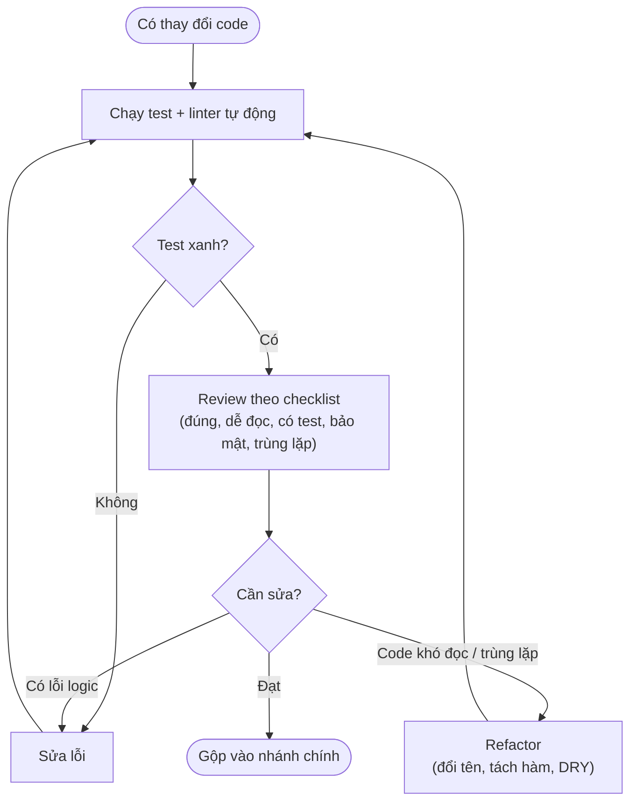

# Thực hành tốt khi viết code (Coding Best Practices)

## Khái niệm

Thực hành tốt là những **quy ước và thói quen** giúp code dễ đọc, dễ bảo trì, ít lỗi và dễ cộng tác. Chúng không thay đổi kết quả chương trình nhưng ảnh hưởng lớn tới chất lượng phần mềm về lâu dài — và tới ấn tượng của người phỏng vấn về sự chuyên nghiệp của bạn.

## Khi nào dùng / Vì sao quan trọng

Code được đọc nhiều hơn được viết. Trong phỏng vấn và công việc thực tế:

- Code sạch giúp người khác (và chính bạn sau này) hiểu nhanh.
- Giảm lỗi và chi phí bảo trì.
- Thể hiện tư duy kỹ sư trưởng thành, không chỉ "chạy được là xong".

## Cách hoạt động

**1. Quy ước đặt tên (Naming conventions)**

- Đặt tên **có nghĩa, mô tả ý định**: `total_price` thay vì `tp`, `is_valid` thay vì `flag`.
- Nhất quán theo phong cách ngôn ngữ: Python dùng `snake_case`, Java/JS dùng `camelCase`, hằng số viết `UPPER_CASE`.
- Hàm nên là **động từ** (`calculate_total`), biến boolean nên đọc như câu hỏi (`has_next`, `is_empty`).

**2. Dễ đọc (Readability)**

- Hàm ngắn, mỗi hàm làm **một việc** (single responsibility).
- Tránh lồng sâu (deep nesting); dùng **early return** để giảm cấp.
- Thụt lề nhất quán, khoảng trắng hợp lý, dòng không quá dài.
- Chú thích giải thích **vì sao (why)**, không lặp lại điều code đã nói rõ (what).

**3. Tái sử dụng (Reusability / DRY)**

- **Don't Repeat Yourself:** gom logic lặp thành hàm/lớp dùng chung.
- Tham số hoá thay vì hard-code giá trị.
- Tách phần dễ thay đổi khỏi phần ổn định.

**4. Xử lý lỗi (Error handling)**

- Kiểm tra đầu vào và trường hợp biên (input rỗng, null, ngoài phạm vi).
- Dùng ngoại lệ (exception) đúng chỗ; không "nuốt" lỗi một cách âm thầm.
- Thông báo lỗi rõ ràng, giúp truy vết nguyên nhân.

**5. Kiểm thử (Testing)**

- Viết **kiểm thử đơn vị (unit test)** cho từng hàm, gồm cả ca biên.
- Ưu tiên **phát triển hướng kiểm thử (TDD)** khi hợp lý: viết test trước, code sau.
- Đảm bảo test chạy tự động và nhanh.

**6. Quản lý phiên bản (Version control)**

- Commit nhỏ, thường xuyên, **mô tả rõ mục đích**.
- Dùng nhánh (branch) cho từng tính năng; không đẩy code hỏng lên nhánh chính.
- Xem thêm [Git](../quan-ly-phien-ban/git.md).

**7. Đánh giá code (Code review)**

- Đọc code người khác với thái độ xây dựng, tập trung vào tính đúng, dễ đọc, hiệu năng.
- Nhận review một cách cởi mở; giải thích quyết định thiết kế.
- Dùng danh sách kiểm (checklist): logic đúng chưa, có test chưa, có lỗ hổng bảo mật không, có trùng lặp không.

## Quy trình review & refactor

Sơ đồ dưới mô tả một vòng đánh giá code (code review) và tái cấu trúc (refactor) điển hình: chạy kiểm thử trước, review theo checklist, và chỉ gộp (merge) khi đạt.



## Ví dụ

**Trước / sau khi cải thiện** — cùng một hàm tính trung bình cộng:

=== "JavaScript"
    ```js
    // CHƯA TỐT: tên mơ hồ, không xử lý biên (chia cho 0)
    function f(l) {
      let s = 0;
      for (const i of l) s = s + i;
      return s / l.length;      // NaN nếu l rỗng
    }

    // TỐT HƠN: tên rõ, xử lý biên, tái dùng hàm chuẩn
    function average(numbers) {
      if (numbers.length === 0) return null;   // xử lý trường hợp biên
      const sum = numbers.reduce((a, b) => a + b, 0);  // tái dùng reduce
      return sum / numbers.length;
    }
    ```
=== "Python"
    ```python
    # CHƯA TỐT: tên mơ hồ, lặp logic, không xử lý biên
    def f(l):
        s = 0
        for i in l:
            s = s + i
        return s / len(l)      # lỗi chia cho 0 nếu l rỗng

    # TỐT HƠN: tên rõ, xử lý biên, tái dùng hàm chuẩn
    def average(numbers):
        """Trả về trung bình cộng; None nếu danh sách rỗng."""
        if not numbers:                    # xử lý trường hợp biên
            return None
        return sum(numbers) / len(numbers) # tái dùng sum() thay vì viết lại
    ```

**Early return làm phẳng lồng sâu** — cùng một logic phân loại:

=== "JavaScript"
    ```js
    // CHƯA TỐT: lồng sâu, khó đọc
    function grade(score) {
      if (score >= 0) {
        if (score <= 100) {
          if (score >= 50) return 'Đạt';
          else return 'Trượt';
        } else return 'Không hợp lệ';
      } else return 'Không hợp lệ';
    }

    // TỐT HƠN: kiểm tra biên trước, thoát sớm
    function gradeClean(score) {
      if (score < 0 || score > 100) return 'Không hợp lệ';  // early return
      return score >= 50 ? 'Đạt' : 'Trượt';
    }
    ```
=== "Python"
    ```python
    # CHƯA TỐT: lồng sâu, khó đọc
    def grade(score):
        if score >= 0:
            if score <= 100:
                if score >= 50:
                    return "Đạt"
                else:
                    return "Trượt"
            else:
                return "Không hợp lệ"
        else:
            return "Không hợp lệ"

    # TỐT HƠN: kiểm tra biên trước, thoát sớm
    def grade_clean(score):
        if score < 0 or score > 100:      # early return
            return "Không hợp lệ"
        return "Đạt" if score >= 50 else "Trượt"
    ```

```python
# Ví dụ unit test đi kèm
def test_average():
    assert average([2, 4, 6]) == 4
    assert average([]) is None        # ca biên
    assert average([5]) == 5
```

## Thử ngay: DRY và xử lý biên

Playground chạy cả hàm "chưa tốt" và "tốt hơn" trên vài đầu vào (gồm cả danh sách rỗng) để bạn thấy tác động của việc xử lý biên. Hàm `f` cho `NaN`, còn `average` trả `null` an toàn.

<div class="js-demo" data-title="So sánh: xử lý biên & DRY">
<textarea class="js-demo-src">
function f(l) {                       // chưa xử lý biên
  let s = 0;
  for (const i of l) s = s + i;
  return s / l.length;
}
function average(numbers) {           // đã xử lý biên + DRY
  if (numbers.length === 0) return null;
  return numbers.reduce((a, b) => a + b, 0) / numbers.length;
}

const cases = [[2, 4, 6], [5], []];
for (const c of cases) {
  print(`Đầu vào ${JSON.stringify(c)}:  f = ${f(c)},  average = ${average(c)}`);
}
print('');
print('=> f([]) cho NaN (lỗi ngầm), average([]) cho null (an toàn, rõ ý).');
</textarea>
</div>

## Ưu / nhược điểm

- **Ưu:** giảm lỗi, dễ bảo trì và mở rộng; cộng tác nhóm mượt hơn; ghi điểm trong phỏng vấn.
- **Nhược:** cần kỷ luật và thời gian ban đầu; áp dụng máy móc (ví dụ trừu tượng hoá quá mức) có thể làm code phức tạp không cần thiết — cân nhắc theo ngữ cảnh.

## Câu hỏi phỏng vấn thường gặp

1. Nguyên tắc DRY là gì và khi nào **không** nên áp dụng cứng nhắc?
2. Bạn xử lý lỗi và đầu vào không hợp lệ như thế nào?
3. Một commit tốt trông ra sao?
4. Khi review code, bạn chú ý những gì?

## Tham khảo

- [Git](../quan-ly-phien-ban/git.md)
- [Gỡ lỗi](debugging.md)
- R. C. Martin, *Clean Code* (2008)
