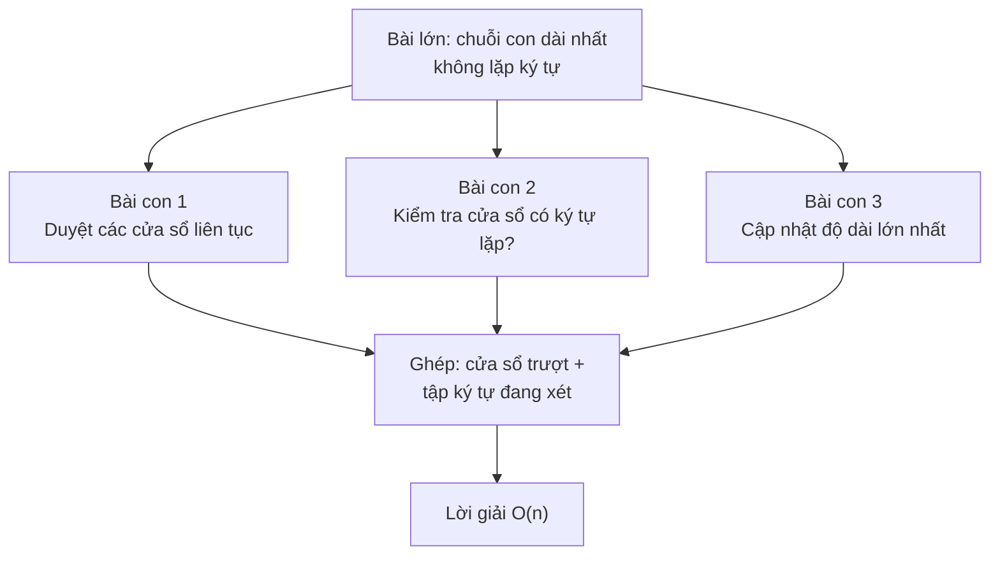
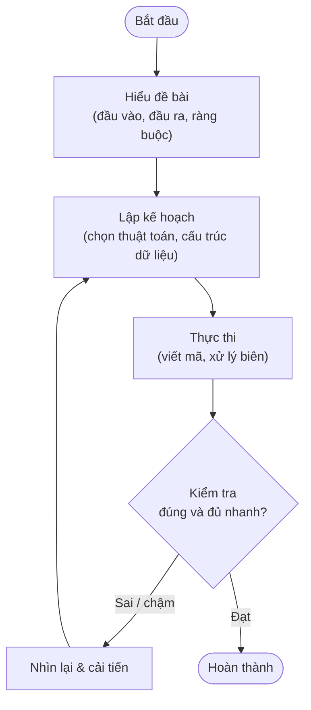

# Chiến lược giải quyết vấn đề (Problem-Solving Strategy)

## Khái niệm

Chiến lược giải quyết vấn đề là một quy trình có hệ thống để đi từ đề bài (problem statement) tới lời giải đúng và hiệu quả. Thay vì lao ngay vào viết code, ta tách bài toán thành các bước tư duy rõ ràng: hiểu đề, phân rã, tìm mẫu, lập kế hoạch, triển khai và kiểm thử. Cách làm này giúp giảm sai sót và tiết kiệm thời gian, đặc biệt trong phỏng vấn kỹ thuật.

## Khi nào dùng / Vì sao quan trọng

Trong phỏng vấn coding, người phỏng vấn đánh giá **cách bạn suy nghĩ** chứ không chỉ đáp án. Một quy trình rõ ràng giúp bạn:

- Tránh hiểu sai đề — nguyên nhân thất bại phổ biến nhất.
- Trình bày mạch lạc để người phỏng vấn theo dõi được.
- Phát hiện trường hợp biên (edge case) trước khi code.
- Bình tĩnh khi gặp bài khó, vì luôn có bước tiếp theo để bám vào.

## Cách hoạt động

**Bốn bước gốc của Pólya (How to Solve It, 1945)** — nền tảng cho mọi quy trình hiện đại:

1. **Hiểu bài toán (Understand):** biết rõ cái gì đã cho, cần tìm gì, ràng buộc ra sao.
2. **Lập kế hoạch (Devise a plan):** liên hệ bài với bài đã biết, tìm mẫu, chọn chiến lược.
3. **Thực hiện kế hoạch (Carry out the plan):** triển khai cẩn thận, kiểm từng bước.
4. **Nhìn lại (Look back):** kiểm tra kết quả, xem có cách khác tốt hơn, rút kinh nghiệm.

Từ bốn bước đó, quy trình phỏng vấn thực tế thường mở rộng thành **7 bước** (viết tắt **UPER**: Understand – Plan – Execute – Review):

**1. Hiểu đề (Understand the problem)**

- Đọc kỹ, diễn đạt lại đề bằng lời của bạn.
- Xác định **đầu vào (input)**, **đầu ra (output)** và **ràng buộc (constraints)**: kích thước dữ liệu, phạm vi giá trị, thời gian/bộ nhớ cho phép.
- Hỏi lại người phỏng vấn để làm rõ chỗ mơ hồ (dữ liệu có trùng không? có âm không? mảng đã sắp chưa?).
- **Câu hỏi làm rõ nên hỏi:** kích thước `n` tối đa? Có phần tử trùng/âm/rỗng? Định dạng đầu ra? Được phép sửa đầu vào tại chỗ không? Có nhiều lời giải thì trả về cái nào?

**2. Ví dụ hoá (Work through examples)**

- Tự tạo vài ví dụ nhỏ, giải bằng tay.
- Chú ý các **trường hợp biên**: mảng rỗng, một phần tử, trùng lặp, giá trị lớn nhất/nhỏ nhất.
- Vẽ ra bảng/sơ đồ nếu dữ liệu có cấu trúc (cây, đồ thị, ma trận).

**3. Chia nhỏ (Decompose)**

- Tách bài lớn thành các bài con độc lập, dễ giải.
- Ví dụ: "tìm chuỗi con dài nhất" = "duyệt các cửa sổ" + "kiểm tra điều kiện" + "cập nhật kết quả".

Sơ đồ minh hoạ cách chia nhỏ bài "tìm chuỗi con dài nhất không lặp ký tự" thành các bài con rồi ghép kết quả:




**4. Giải bài đơn giản hơn (Solve a simpler version)**

- Nếu bí, hãy giải phiên bản dễ hơn (bỏ bớt ràng buộc) rồi tổng quát dần.
- Ví dụ: giải cho mảng đã sắp trước, sau đó xử lý mảng chưa sắp.
- Hoặc bắt đầu bằng lời giải vét cạn (brute force) đúng nhưng chậm, rồi tối ưu dần.

**5. Tìm mẫu (Pattern matching)**

- Đối chiếu bài toán với các **mẫu quen thuộc**: hai con trỏ, cửa sổ trượt, chia để trị, quy hoạch động, tìm kiếm nhị phân, đồ thị (BFS/DFS)...
- Nhận ra mẫu thường mở khoá lời giải tối ưu ngay.

**6. Lập kế hoạch (Plan)**

- Viết **mã giả (pseudocode)** hoặc phác thảo các bước trước khi code.
- Ước lượng độ phức tạp dự kiến; nếu không đạt yêu cầu, tìm hướng khác trước khi cài đặt.
- **Nói to suy nghĩ (think aloud):** trong phỏng vấn, trình bày kế hoạch trước khi gõ giúp người phỏng vấn góp ý sớm, tránh đi sai hướng.

**7. Triển khai & kiểm thử (Implement & test)**

- Code từng phần nhỏ, đặt tên biến rõ ràng.
- Chạy thử với ví dụ ban đầu và các trường hợp biên; sửa dần.
- **Nhìn lại (bước 4 của Pólya):** sau khi đúng, tự hỏi "có thể gọn hơn, nhanh hơn, ít bộ nhớ hơn không?".

## Ví dụ

Áp dụng quy trình cho bài "tìm hai số trong mảng có tổng bằng `target`":

=== "JavaScript"
    ```js
    // Bước 1-2: input = mảng nums, số target; output = chỉ số 2 phần tử.
    //           Hỏi: có trùng không? có nghiệm duy nhất? -> giả sử có đúng 1.
    // Bước 5:   nhận ra mẫu "bù trừ" -> dùng hash map tra cứu O(1).
    // Bước 6:   kế hoạch: duyệt 1 lần, với mỗi x tìm (target - x) đã gặp chưa.

    function twoSum(nums, target) {
      const seen = new Map();          // giá trị -> chỉ số
      for (let i = 0; i < nums.length; i++) {
        const need = target - nums[i]; // số bù cần tìm
        if (seen.has(need)) return [seen.get(need), i];
        seen.set(nums[i], i);
      }
      return [-1, -1];
    }

    // Bước 7: test biên
    console.log(twoSum([2, 7, 11, 15], 9));   // [0, 1]
    console.log(twoSum([3, 3], 6));           // [0, 1] - trùng giá trị
    ```
=== "Python"
    ```python
    # Bước 1-2: input = mảng nums, số target; output = chỉ số 2 phần tử.
    #           Hỏi: có trùng không? có nghiệm duy nhất? -> giả sử có đúng 1 nghiệm.
    # Bước 5:   nhận ra mẫu "bù trừ" -> dùng bảng băm (hash map) tra cứu O(1).
    # Bước 6:   kế hoạch: duyệt 1 lần, với mỗi số x tìm (target - x) đã gặp chưa.

    def two_sum(nums, target):
        seen = {}                     # giá trị -> chỉ số
        for i, x in enumerate(nums):
            need = target - x         # số bù cần tìm
            if need in seen:          # đã gặp trước đó?
                return [seen[need], i]
            seen[x] = i
        return [-1, -1]

    # Bước 7: test biên
    print(two_sum([2, 7, 11, 15], 9))   # [0, 1]
    print(two_sum([3, 3], 6))           # [0, 1] - trùng giá trị
    ```

Quy trình biến bài từ "quét mọi cặp `O(n²)`" thành "một lượt `O(n)`" nhờ bước tìm mẫu.

## Thử ngay: từ vét cạn tới tối ưu

Playground minh hoạ bước 4 → bước 5: bắt đầu bằng lời giải vét cạn `O(n²)`, rồi nhận ra mẫu "bù trừ" để nâng lên `O(n)`. Cả hai cho cùng đáp án; playground đếm số phép so sánh để thấy chênh lệch.

<div class="js-demo" data-title="Two Sum: vét cạn O(n²) vs hash map O(n)">
<textarea class="js-demo-src">
function twoSumBrute(nums, target) {   // O(n^2)
  let ops = 0;
  for (let i = 0; i < nums.length; i++)
    for (let j = i + 1; j < nums.length; j++) {
      ops++;
      if (nums[i] + nums[j] === target) return { ans: [i, j], ops };
    }
  return { ans: [-1, -1], ops };
}
function twoSumHash(nums, target) {    // O(n)
  let ops = 0;
  const seen = new Map();
  for (let i = 0; i < nums.length; i++) {
    ops++;
    const need = target - nums[i];
    if (seen.has(need)) return { ans: [seen.get(need), i], ops };
    seen.set(nums[i], i);
  }
  return { ans: [-1, -1], ops };
}

const nums = [3, 8, 2, 15, 7, 11, 6], target = 9;
const b = twoSumBrute(nums, target);
const h = twoSumHash(nums, target);
print('Mảng:', JSON.stringify(nums), ' target =', target);
print('Vét cạn  -> đáp án', JSON.stringify(b.ans), '| số phép so sánh:', b.ops);
print('Hash map -> đáp án', JSON.stringify(h.ans), '| số phép so sánh:', h.ops);
print('');
print('Cùng đáp án nhưng hash map ít phép hơn — đó là giá trị của bước tìm mẫu.');
</textarea>
</div>

## Ưu / nhược điểm

- **Ưu:**
    - Giảm sai sót do vội vàng; tăng khả năng ra lời giải tối ưu.
    - Giúp giao tiếp rõ ràng, gây ấn tượng tốt trong phỏng vấn.
    - Áp dụng được cho mọi loại bài, không chỉ thuật toán.
- **Nhược:**
    - Với bài quá dễ, quy trình đầy đủ có thể mất thời gian không cần thiết.
    - Cần luyện tập để các bước trở thành phản xạ, tránh máy móc.

## Câu hỏi phỏng vấn thường gặp

1. Bạn làm gì đầu tiên khi nhận một đề bài lạ và khó?
2. Vì sao nên viết mã giả trước khi code thật?
3. Kể tên vài mẫu bài toán (pattern) phổ biến và dấu hiệu nhận biết chúng.
4. Làm sao xác định đủ các trường hợp biên cần kiểm thử?

## Sơ đồ quy trình giải bài

Quy trình giải quyết vấn đề theo bốn bước của Pólya, có vòng lặp kiểm tra và cải tiến.



- Luôn làm rõ đề và ví dụ trước khi viết mã.
- Nếu chưa đạt (sai hoặc quá chậm), quay lại bước lập kế hoạch để tối ưu.

## Tham khảo

- [Kỹ thuật lập trình](ky-thuat-coding.md)
- [Phân tích độ phức tạp](do-phuc-tap.md)
- G. Pólya, *How to Solve It* (1945)
