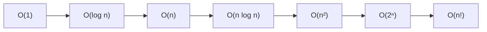

# Phân tích độ phức tạp (Complexity Analysis / Big O)

## Khái niệm

Phân tích độ phức tạp là cách **ước lượng lượng tài nguyên** (thời gian chạy và bộ nhớ) mà một thuật toán tiêu tốn khi kích thước đầu vào `n` tăng lên. Ta không đo bằng giây thực tế (phụ thuộc máy, ngôn ngữ) mà mô tả **tốc độ tăng trưởng** bằng ký hiệu tiệm cận (asymptotic notation): Big O, Big Omega, Big Theta.

## Khi nào dùng / Vì sao quan trọng

- So sánh hai thuật toán một cách khách quan, không phụ thuộc phần cứng.
- Dự đoán liệu lời giải có "chạy kịp" với ràng buộc đề bài (ví dụ `n ≤ 10⁶` thì cần `O(n)` hoặc `O(n log n)`).
- Là ngôn ngữ chung bắt buộc trong mọi phỏng vấn thuật toán.

## Cách hoạt động

**Ba ký hiệu tiệm cận chính**

- **Big O — `O(f(n))`:** chặn **trên** (upper bound). Về mặt toán học: `T(n) = O(f(n))` nếu tồn tại hằng số `c > 0` và `n₀` sao cho `T(n) ≤ c·f(n)` với mọi `n ≥ n₀`. Nói cách khác, kể từ một kích thước đủ lớn, `f(n)` (nhân một hằng số) luôn "phủ" được thời gian chạy. Đây là ký hiệu dùng nhiều nhất vì ta thường quan tâm **trường hợp xấu nhất (worst case)** — cam kết "chạy không chậm hơn".
- **Big Omega — `Ω(f(n))`:** chặn **dưới** (lower bound). `T(n) = Ω(f(n))` nếu `T(n) ≥ c·f(n)` với mọi `n ≥ n₀`. Mô tả **trường hợp tốt nhất (best case)** hoặc giới hạn dưới không thể phá vỡ của một lớp bài toán (ví dụ sắp xếp so sánh không thể nhanh hơn `Ω(n log n)`). Cam kết "chạy không nhanh hơn".
- **Big Theta — `Θ(f(n))`:** chặn **chặt** (tight bound) — khi `T(n) = O(f(n))` **và** `T(n) = Ω(f(n))` cùng một lúc. Tồn tại `c₁, c₂` sao cho `c₁·f(n) ≤ T(n) ≤ c₂·f(n)`. Đây là mô tả chính xác nhất: "tăng trưởng đúng bằng `f(n)`".

**Phân biệt trực quan bằng ví dụ:** hàm `binary_search` chạy nhanh nhất khi trúng ngay giữa (`Ω(1)`), chậm nhất khi phải chia tới cùng (`O(log n)`); ta thường viết gọn "tìm kiếm nhị phân là `O(log n)`". Còn vòng lặp cộng `n` phần tử luôn chạy đúng `n` bước bất kể dữ liệu, nên nó là `Θ(n)` — chặn trên và chặn dưới trùng nhau.

**Ba trường hợp phân tích thường gặp**

- **Trường hợp tốt nhất (best case):** đầu vào thuận lợi nhất. Ví dụ tìm kiếm tuyến tính gặp mục tiêu ngay phần tử đầu → `O(1)`.
- **Trường hợp trung bình (average case):** kỳ vọng trên phân phối đầu vào ngẫu nhiên. Quicksort trung bình `O(n log n)`.
- **Trường hợp xấu nhất (worst case):** đầu vào bất lợi nhất — đây là bảo đảm an toàn ta hay dùng để đánh giá.

**Quy tắc rút gọn**

- Bỏ hằng số: `O(2n)` → `O(n)`; `O(n/2)` → `O(n)`.
- Giữ số hạng trội nhất: `O(n² + n)` → `O(n²)`.
- Nhân theo vòng lặp lồng nhau; cộng theo các đoạn nối tiếp.

**Phân tích thời gian (time complexity)** — đếm số phép toán cơ bản theo `n`:

- Một vòng lặp qua `n` phần tử → `O(n)`.
- Hai vòng lặp lồng nhau → `O(n²)`.
- Chia đôi mỗi bước (tìm kiếm nhị phân) → `O(log n)`.
- Chia để trị kiểu merge sort → `O(n log n)`.

**Phân tích bộ nhớ (space complexity)** — đếm bộ nhớ phụ theo `n`:

- Biến đếm, vài con trỏ → `O(1)`.
- Mảng/bảng băm phụ kích thước `n` → `O(n)`.
- Đệ quy sâu `n` tầng → `O(n)` cho ngăn xếp lời gọi (call stack).

**Các bậc tăng trưởng thường gặp (từ tốt tới xấu)**

`O(1) < O(log n) < O(n) < O(n log n) < O(n²) < O(2ⁿ) < O(n!)`

## Ví dụ

=== "JavaScript"
    ```js
    // O(n) - một vòng lặp
    function total(nums) {
      let s = 0;
      for (const x of nums) s += x;   // chạy n lần
      return s;
    }

    // O(n^2) - hai vòng lồng nhau
    function hasDupPair(nums) {
      for (let i = 0; i < nums.length; i++)          // n lần
        for (let j = i + 1; j < nums.length; j++)    // tới n lần
          if (nums[i] === nums[j]) return true;
      return false;
    }

    // O(log n) - chia đôi mỗi vòng
    function countHalvings(n) {
      let steps = 0;
      while (n > 1) { n = Math.floor(n / 2); steps++; }  // ~ log2(n) lần
      return steps;
    }
    ```
=== "Python"
    ```python
    # O(n) - một vòng lặp
    def total(nums):
        s = 0
        for x in nums:        # chạy n lần
            s += x
        return s

    # O(n^2) - hai vòng lồng nhau
    def has_dup_pair(nums):
        for i in range(len(nums)):        # n lần
            for j in range(i + 1, len(nums)):  # tới n lần
                if nums[i] == nums[j]:
                    return True
        return False

    # O(log n) - chia đôi mỗi vòng
    def count_halvings(n):
        steps = 0
        while n > 1:
            n //= 2           # số lần lặp ~ log2(n)
            steps += 1
        return steps
    ```

## Thử ngay: đo số phép toán O(n) so với O(n²)

Playground dưới đây **đếm số phép so sánh thực tế** của thuật toán tuyến tính (`O(n)`) và thuật toán vòng lồng (`O(n²)`) với nhiều kích thước `n`. Hãy chú ý cột O(n²) tăng vọt trong khi O(n) tăng đều — đúng như lý thuyết tiệm cận dự đoán.

<div class="js-demo" data-title="Đếm số phép toán: O(n) vs O(n²)">
<textarea class="js-demo-src">
// Đếm số phép so sánh khi tìm phần tử trùng bằng 2 cách
function countLinear(n) {   // O(n): dùng Set
  let ops = 0;
  const seen = new Set();
  for (let i = 0; i < n; i++) { ops++; seen.add(i); }
  return ops;
}
function countQuadratic(n) {  // O(n^2): vòng lồng
  let ops = 0;
  for (let i = 0; i < n; i++)
    for (let j = i + 1; j < n; j++) ops++;   // mỗi cặp là 1 phép
  return ops;
}

print('   n |     O(n) |    O(n^2) | tỉ lệ n^2/n');
print('-----+----------+-----------+------------');
for (const n of [10, 50, 100, 500, 1000]) {
  const a = countLinear(n), b = countQuadratic(n);
  const pad = (x, w) => String(x).padStart(w);
  print(`${pad(n,4)} | ${pad(a,8)} | ${pad(b,9)} | ${pad((b/a).toFixed(1),10)}`);
}
print('');
print('Kết luận: O(n) tăng tuyến tính, O(n^2) tăng theo bình phương.');
</textarea>
</div>

## Bảng độ phức tạp các thao tác phổ biến

| Cấu trúc / thao tác | Trung bình | Xấu nhất |
|---------------------|-----------|----------|
| Mảng — truy cập theo chỉ số | O(1) | O(1) |
| Mảng — tìm kiếm tuyến tính | O(n) | O(n) |
| Mảng — chèn/xoá ở giữa | O(n) | O(n) |
| Mảng động — thêm cuối (amortized) | O(1) | O(n) |
| Bảng băm — tra cứu/chèn/xoá | O(1) | O(n) |
| Danh sách liên kết — chèn/xoá đầu | O(1) | O(1) |
| Danh sách liên kết — tìm kiếm | O(n) | O(n) |
| Cây tìm kiếm nhị phân cân bằng | O(log n) | O(log n) |
| Đống nhị phân (binary heap) — push/pop | O(log n) | O(log n) |
| Tìm kiếm nhị phân (mảng đã sắp) | O(log n) | O(log n) |
| Sắp xếp nhanh (quicksort) | O(n log n) | O(n²) |
| Sắp xếp trộn (merge sort) | O(n log n) | O(n log n) |

## Ưu / nhược điểm

- **Ưu:** so sánh khách quan, độc lập phần cứng; dự đoán khả năng mở rộng (scalability).
- **Nhược:** bỏ qua hằng số và số hạng bậc thấp — với `n` nhỏ, thuật toán "bậc cao hơn" đôi khi lại nhanh hơn trong thực tế; không phản ánh yếu tố như cache, hằng số ẩn lớn.

## Câu hỏi phỏng vấn thường gặp

1. Phân biệt Big O, Big Omega và Big Theta.
2. Vì sao thêm phần tử vào cuối mảng động là `O(1)` khấu hao (amortized) dù đôi lúc là `O(n)`?
3. Độ phức tạp bộ nhớ của một hàm đệ quy sâu `n` tầng là bao nhiêu, vì sao?
4. Quicksort trung bình `O(n log n)` nhưng xấu nhất `O(n²)` — khi nào xảy ra trường hợp xấu?

## Sơ đồ so sánh các mức độ phức tạp

Bảng dưới minh hoạ số phép tính tăng thế nào khi kích thước đầu vào `n` tăng, cho thấy độ dốc của từng đường cong độ phức tạp.

| n | O(1) | O(log n) | O(n) | O(n log n) | O(n²) | O(2ⁿ) |
|---|------|----------|------|-----------|-------|-------|
| 10 | 1 | ~3 | 10 | ~33 | 100 | 1 024 |
| 100 | 1 | ~7 | 100 | ~664 | 10 000 | ~10³⁰ |
| 1 000 | 1 | ~10 | 1 000 | ~9 966 | 1 000 000 | quá lớn |

Xếp hạng từ tốt đến tệ (khi n lớn):



Càng sang phải, đường cong càng dốc và thời gian chạy tăng càng nhanh theo `n`.

## Tham khảo

- [Kỹ thuật lập trình](ky-thuat-coding.md)
- [Tối ưu hoá](toi-uu.md)
- T. Cormen và cộng sự, *Introduction to Algorithms* (CLRS)
