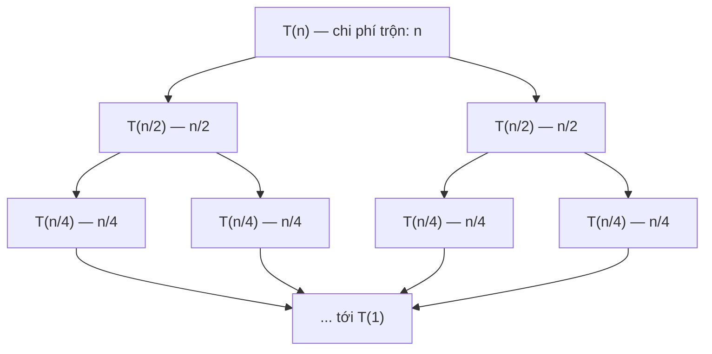

# Chia để trị (Divide and Conquer)

## Khái niệm

Chia để trị (divide and conquer) là mô hình thiết kế thuật toán gồm ba bước: **chia (divide)** bài toán lớn thành các bài con nhỏ hơn cùng dạng, **trị (conquer)** giải từng bài con (thường bằng đệ quy), rồi **gộp (combine)** các lời giải con thành lời giải cho bài toán ban đầu.

## Khi nào dùng / Vì sao quan trọng

- Khi bài toán có thể **tách thành các bài con độc lập** cùng cấu trúc.
- Khi việc gộp kết quả các bài con rẻ hơn so với giải trực tiếp.
- Là nền tảng của nhiều thuật toán quan trọng (merge sort, quick sort, FFT, nhân số lớn...) và của tư duy đệ quy nói chung.

Khác với quy hoạch động: DP xử lý các bài con **chồng lấp** (lưu lại để dùng lại), còn chia để trị thường có các bài con **rời nhau, không chồng lấp**.

## Cách hoạt động

### Định lý thợ (Master Theorem)

Với công thức truy hồi dạng `T(n) = a·T(n/b) + f(n)` — trong đó chia thành `a` bài con, mỗi bài kích thước `n/b`, và `f(n)` là chi phí chia + gộp — ta so sánh `f(n)` với `n^(log_b a)`:

- **Trường hợp 1:** nếu `f(n) = O(n^(log_b a - ε))` thì `T(n) = Θ(n^(log_b a))`. (Công việc dồn ở lá.)
- **Trường hợp 2:** nếu `f(n) = Θ(n^(log_b a))` thì `T(n) = Θ(n^(log_b a) · log n)`. (Công việc đều mỗi tầng.)
- **Trường hợp 3:** nếu `f(n) = Ω(n^(log_b a + ε))` (và thỏa điều kiện chính quy) thì `T(n) = Θ(f(n))`. (Công việc dồn ở gốc.)

**Ví dụ áp dụng:**

| Thuật toán | Truy hồi | Kết quả |
|-----------|----------|---------|
| Merge sort | `T(n) = 2T(n/2) + O(n)` | `O(n log n)` (TH2) |
| Tìm kiếm nhị phân | `T(n) = T(n/2) + O(1)` | `O(log n)` (TH2) |
| Karatsuba | `T(n) = 3T(n/2) + O(n)` | `O(n^1.585)` (TH1) |

Sơ đồ dưới hình dung ba trường hợp qua **phân bố công việc theo tầng** của cây đệ quy (gốc ở trên, lá ở dưới):


### Cây đệ quy (recursion tree)

Với merge sort `T(n) = 2T(n/2) + O(n)`: mỗi tầng chia đôi kích thước nhưng **tổng công việc mỗi tầng vẫn là `O(n)`** (phần trộn). Có `log₂ n` tầng, nên tổng cộng `O(n log n)` — đúng trường hợp 2 của định lý thợ.



Cộng theo tầng: `n + 2·(n/2) + 4·(n/4) + … = n + n + n + …` (mỗi tầng đúng `n`), nhân với số tầng `log₂ n` ⇒ `O(n log n)`.

!!! question "Vì sao T(n) = 2T(n/2) + O(n) lại ra O(n log n)? (trực giác định lý thợ)"
    Định lý thợ ở trên nghe trừu tượng, nhưng với công thức của merge sort ta có thể "nhìn thấy" kết quả bằng cách **cộng công việc theo từng tầng** của cây đệ quy — không cần thuộc công thức.

    Hai đại lượng cần theo dõi:

    1. **Công việc mỗi tầng.** Ở gốc, phần gộp (`+O(n)`) xử lý `n` phần tử. Tầng dưới có **2** bài con, mỗi bài kích thước `n/2`, nên tổng gộp = `2 × (n/2) = n`. Tầng sau nữa có **4** bài, mỗi bài `n/4` → tổng vẫn `4 × (n/4) = n`. Cứ thế: **mỗi tầng đều tốn đúng `n`**. Đó là vì số bài con nhân đôi thì kích thước mỗi bài giảm một nửa — hai yếu tố *triệt tiêu* nhau.
    2. **Số tầng.** Kích thước bài toán chia đôi sau mỗi tầng (`n → n/2 → n/4 → … → 1`). Số lần chia đôi để về `1` là `log₂ n`, nên cây cao **`log₂ n` tầng**.

    Nhân hai lại: `n` (mỗi tầng) × `log₂ n` (số tầng) = **`O(n log n)`**.

    Trực giác chung của định lý thợ chính là *ai thắng cuộc đua giữa "công gộp `f(n)`" và "số bài con càng xuống càng nhiều"*:

    - Nếu công việc **đều nhau** ở mọi tầng (như merge sort) → nhân thêm thừa số `log n` → **TH2**.
    - Nếu các bài con sinh sôi nhanh hơn công gộp, công dồn ở **lá** (đáy cây, nơi có nhiều bài nhất) → **TH1**, ví dụ Karatsuba `T(n)=3T(n/2)+O(n)` cho `O(n^1.585)`.
    - Nếu công gộp lớn áp đảo, công dồn ở **gốc** → **TH3**, kết quả bằng chính `f(n)`.

    Với **tìm kiếm nhị phân** `T(n) = T(n/2) + O(1)`: mỗi tầng chỉ tốn `O(1)` (một phép so sánh), và có `log₂ n` tầng → `O(log n)`. Không có thừa số `n` vì mỗi tầng chỉ có **một** bài con (không chia đôi công việc, chỉ *bỏ đi* một nửa).

### Các ví dụ kinh điển

- **Merge Sort:** chia đôi, sắp hai nửa, trộn lại. `O(n log n)`.
- **Karatsuba:** nhân hai số lớn với 3 phép nhân con thay vì 4, đạt `O(n^1.585)` thay cho `O(n²)`.
- **Closest Pair of Points (cặp điểm gần nhất):** tìm hai điểm gần nhất trong mặt phẳng, `O(n log n)` bằng chia mặt phẳng theo trục.
- **Kadane (dãy con liên tục tổng lớn nhất):** thường trình bày kiểu quét tuyến tính `O(n)`, nhưng cũng có biến thể chia để trị `O(n log n)`.

!!! tip "Thử ngay (chạy được)"
    Bấm **▶ Chạy** để xem merge sort in ra từng bước trộn ngay trong trình duyệt. Sửa mảng `a` rồi chạy lại.

<div class="js-demo" data-title="Merge Sort — in từng bước trộn (JavaScript)">
<textarea class="js-demo-src">
function mergeSort(arr, depth = 0) {
  const pad = '  '.repeat(depth);
  if (arr.length <= 1) return arr;
  const mid = arr.length >> 1;
  print(`${pad}chia: [${arr}] -> [${arr.slice(0, mid)}] | [${arr.slice(mid)}]`);
  const left = mergeSort(arr.slice(0, mid), depth + 1);
  const right = mergeSort(arr.slice(mid), depth + 1);
  const merged = [];
  let i = 0, j = 0;
  while (i < left.length && j < right.length) {
    if (left[i] <= right[j]) merged.push(left[i++]);
    else merged.push(right[j++]);
  }
  while (i < left.length) merged.push(left[i++]);
  while (j < right.length) merged.push(right[j++]);
  print(`${pad}gộp : [${left}] + [${right}] -> [${merged}]`);
  return merged;
}

const a = [5, 2, 9, 1, 7, 3];
print('Kết quả:', mergeSort(a).join(', '));
</textarea>
</div>

## Ví dụ

**Karatsuba — nhân hai số lớn**

=== "JavaScript"
    ```js
    function karatsuba(x, y) {
      if (x < 10 || y < 10) return x * y;   // trường hợp cơ sở: số một chữ số
      const n = Math.max(String(x).length, String(y).length);
      const half = Math.floor(n / 2);
      const p = 10 ** half;
      const highX = Math.floor(x / p), lowX = x % p;   // tách phần cao / thấp của x
      const highY = Math.floor(y / p), lowY = y % p;   // tách phần cao / thấp của y

      const z0 = karatsuba(lowX, lowY);                // tích phần thấp
      const z2 = karatsuba(highX, highY);              // tích phần cao
      // z1 = (a+b)(c+d) - z2 - z0  -> chỉ cần thêm 1 phép nhân
      const z1 = karatsuba(lowX + highX, lowY + highY) - z2 - z0;

      return z2 * 10 ** (2 * half) + z1 * 10 ** half + z0;
    }

    console.log(karatsuba(1234, 5678));   // 7006652
    ```

=== "Python"
    ```python
    def karatsuba(x, y):
        if x < 10 or y < 10:        # trường hợp cơ sở: số một chữ số
            return x * y
        n = max(len(str(x)), len(str(y)))
        half = n // 2
        high_x, low_x = divmod(x, 10 ** half)   # tách phần cao / thấp của x
        high_y, low_y = divmod(y, 10 ** half)   # tách phần cao / thấp của y

        z0 = karatsuba(low_x, low_y)            # tích phần thấp
        z2 = karatsuba(high_x, high_y)          # tích phần cao
        # z1 = (a+b)(c+d) - z2 - z0  -> chỉ cần thêm 1 phép nhân
        z1 = karatsuba(low_x + high_x, low_y + high_y) - z2 - z0

        return z2 * 10 ** (2 * half) + z1 * 10 ** half + z0

    print(karatsuba(1234, 5678))   # 7006652
    ```

**Kadane — tổng dãy con liên tục lớn nhất (bản tuyến tính)**

```python
def max_subarray(nums):
    best = cur = nums[0]
    for x in nums[1:]:
        # hoặc bắt đầu dãy mới tại x, hoặc nối x vào dãy đang xét
        cur = max(x, cur + x)
        best = max(best, cur)   # cập nhật kết quả tốt nhất
    return best

print(max_subarray([-2, 1, -3, 4, -1, 2, 1, -5, 4]))   # 6  (dãy [4,-1,2,1])
```

**Đếm nghịch thế bằng chia để trị (kết hợp merge sort)**

```python
def count_inversions(arr):
    # trả về (mảng đã sắp, số cặp nghịch thế i<j nhưng arr[i]>arr[j])
    if len(arr) <= 1:
        return arr, 0
    mid = len(arr) // 2
    left, a = count_inversions(arr[:mid])
    right, b = count_inversions(arr[mid:])
    merged, c = [], 0
    i = j = 0
    while i < len(left) and j < len(right):
        if left[i] <= right[j]:
            merged.append(left[i]); i += 1
        else:
            merged.append(right[j]); j += 1
            c += len(left) - i      # mọi phần tử còn lại của left đều lớn hơn
    merged += left[i:] + right[j:]
    return merged, a + b + c

print(count_inversions([2, 4, 1, 3, 5])[1])   # 3
```

## Độ phức tạp

| Thuật toán | Thời gian | Bộ nhớ |
|-----------|-----------|--------|
| Merge sort | O(n log n) | O(n) |
| Karatsuba | O(n^1.585) | O(n) |
| Closest pair | O(n log n) | O(n) |
| Đếm nghịch thế | O(n log n) | O(n) |

## Ưu / nhược điểm

- **Ưu:**
    - Giảm độ phức tạp nhiều bài toán khó (nhân số lớn, sắp xếp).
    - Tự nhiên song song hóa được vì các bài con độc lập.
- **Nhược:**
    - Đệ quy tốn bộ nhớ ngăn xếp và có chi phí gọi hàm.
    - Không hiệu quả nếu các bài con **chồng lấp** — khi đó DP tốt hơn.

## Câu hỏi phỏng vấn thường gặp

1. Phát biểu định lý thợ và áp dụng cho `T(n) = 2T(n/2) + O(n)`.
2. Phân biệt chia để trị và quy hoạch động.
3. Karatsuba giảm số phép nhân con từ 4 xuống 3 bằng cách nào?
4. Trình bày ý tưởng thuật toán cặp điểm gần nhất `O(n log n)`.
5. Vì sao đếm số cặp nghịch thế lại gắn tự nhiên với merge sort?

## Tham khảo

- [Divide and Conquer — GeeksforGeeks](https://www.geeksforgeeks.org/divide-and-conquer/)
- [Master Theorem — Wikipedia](https://en.wikipedia.org/wiki/Master_theorem_(analysis_of_algorithms))
