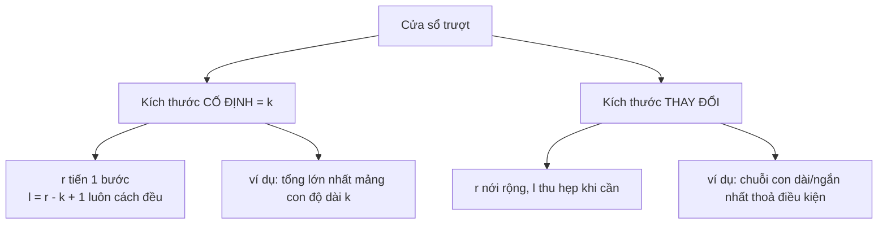

# Cửa sổ trượt (Sliding Window)

## Khái niệm

Cửa sổ trượt (sliding window) là kỹ thuật dành cho các bài toán liên quan tới **mảng con hoặc chuỗi con liên tiếp (contiguous subarray/substring)**. Ta duy trì một "cửa sổ" `[l, r]` trên dữ liệu và **trượt** nó đi thay vì tính lại từ đầu mỗi lần. Nhờ vậy, nhiều lời giải vét cạn `O(n²)` hay `O(n·k)` được rút xuống còn `O(n)`.

## Khi nào dùng / Vì sao quan trọng

Hãy để ý các "tín hiệu" sau trong đề bài:

- Nhắc tới **"mảng con liên tiếp"** / **"chuỗi con"** (contiguous subarray / substring).
- Yêu cầu **"dài nhất / ngắn nhất / lớn nhất / nhỏ nhất"** của một mảng con thỏa điều kiện nào đó.
- Một ràng buộc tăng hoặc giảm **đơn điệu (monotonic)** khi cửa sổ thay đổi (ví dụ: tổng, số ký tự phân biệt, tần suất).
- Độ dài cửa sổ **cố định** bằng `k`, hoặc một mục tiêu (target) để ta nới rộng / thu hẹp tiến tới.

Quy tắc then chốt: nếu tính hợp lệ của cửa sổ có tính **đơn điệu** (mở rộng một cửa sổ không hợp lệ thì nó vẫn không hợp lệ; hoặc thu hẹp một cửa sổ hợp lệ thì nó vẫn hợp lệ) thì cửa sổ trượt áp dụng được. Nếu không, thường phải dùng tổng tiền tố (prefix sum) + băm, hoặc cách khác.

## Cách hoạt động

Có hai mẫu (pattern) cốt lõi.

### Phân biệt hai kiểu cửa sổ



### 1. Cửa sổ kích thước cố định (fixed-size window)

Độ dài cửa sổ luôn bằng `k`. Trượt từng bước một: thêm phần tử vừa đi vào, bỏ phần tử vừa đi ra.

Khung suy nghĩ:

```
với r trong [0, n):
    thêm a[r] vào trạng thái cửa sổ
    nếu kích thước cửa sổ == k:
        ghi nhận / dùng đáp án
        bỏ a[r - k + 1] khỏi trạng thái cửa sổ
```

### 2. Cửa sổ kích thước thay đổi (variable-size window: nới rộng / thu hẹp)

Cửa sổ **nới rộng** khi tăng `r`, và **thu hẹp** khi tăng `l` mỗi khi cửa sổ trở nên không hợp lệ (hoặc để tối ưu). Mỗi chỉ số đi vào và đi ra tối đa một lần → tổng cộng vẫn là `O(n)` dù có vòng `while` lồng bên trong.

Khung suy nghĩ:

```
l = 0
với r trong [0, n):
    thêm a[r] vào trạng thái cửa sổ
    trong khi cửa sổ không hợp lệ:
        bỏ a[l] khỏi trạng thái cửa sổ
        l++
    cập nhật đáp án với [l, r]
```

Hai quyết định thiết kế duy nhất là: *trạng thái nào mô tả cửa sổ* và *"không hợp lệ" nghĩa là gì*.

### Chọn giữa "dài nhất" và "ngắn nhất"

Điều kiện thu hẹp đảo ngược tùy theo mục tiêu:

| Mục tiêu | Bất biến vòng lặp | Khi nào thu hẹp |
|----------|-------------------|-----------------|
| Cửa sổ hợp lệ **dài nhất** | giữ cho cửa sổ hợp lệ | thu hẹp **trong khi không hợp lệ**, rồi ghi nhận |
| Cửa sổ hợp lệ **ngắn nhất** | cửa sổ có thể đang hợp lệ | thu hẹp **trong khi vẫn hợp lệ**, ghi nhận ở mỗi bước |

!!! question "Tại sao cửa sổ trượt là O(n) chứ không phải O(n·k)?"
    Cách **ngây thơ** cho bài "tổng lớn nhất của mảng con độ dài `k`" là: với mỗi vị trí bắt đầu, cộng lại `k` phần tử từ đầu → `n` vị trí × `k` phép cộng = `O(n·k)`. Lãng phí ở đây rất rõ: hai cửa sổ liền kề `[i..i+k-1]` và `[i+1..i+k]` **giống hệt nhau ở k−1 phần tử giữa** — nhưng cách ngây thơ vẫn cộng lại toàn bộ từ đầu mỗi lần, tính đi tính lại cùng những con số đó.

    Cửa sổ trượt **tái sử dụng kết quả của cửa sổ trước** thay vì tính lại. Khi trượt sang phải một bước, ta chỉ làm hai việc `O(1)`:

    ```
    tổng_mới = tổng_cũ + phần_tử_vừa_vào − phần_tử_vừa_ra
    ```

    Chỉ **một cộng, một trừ** cho mỗi bước trượt, dù `k` lớn cỡ nào. Vì có đúng `n` bước trượt và mỗi bước là `O(1)`, tổng chi phí là `O(n)` — hệ số `k` biến mất hoàn toàn. Trực giác: thông tin về `k−1` phần tử chung đã nằm sẵn trong `tổng_cũ`, cớ gì phải đọc lại chúng?

    **Với cửa sổ kích thước thay đổi**, lập luận hơi khác nhưng cùng bản chất. Nhìn vòng `while` thu hẹp lồng bên trong, ta dễ tưởng là `O(n²)`. Thực ra không: con trỏ trái `l` **chỉ tiến, không bao giờ lùi**, nên trong suốt toàn bộ thuật toán `l` đi được tối đa `n` bước; `r` cũng đi tối đa `n` bước. Mỗi chỉ số **vào cửa sổ đúng một lần và ra đúng một lần** → tổng số thao tác bị chặn bởi `2n` = `O(n)`, bất kể vòng `while` "co giãn" thế nào ở từng bước riêng lẻ. (Đây chính là lý do quy tắc "không đưa `l` lùi lại" trong phần cạm bẫy là bắt buộc — lùi lại sẽ phá vỡ đúng cái bảo đảm `O(n)` này.)

## Ví dụ

**Ví dụ 1 — Tổng lớn nhất của mảng con độ dài `k` (cửa sổ cố định)**

```python
# Tổng lớn nhất của mọi mảng con có độ dài k
def max_sum_k(a, k):
    total = 0
    best = float('-inf')
    for r in range(len(a)):
        total += a[r]
        if r >= k - 1:
            best = max(best, total)
            total -= a[r - k + 1]   # phần tử rời khỏi cửa sổ
    return best
```

**Ví dụ 2 — Chuỗi con dài nhất không lặp ký tự (LeetCode 3, cửa sổ thay đổi)**

**Minh hoạ cửa sổ trượt** trên `s = "abcabcbb"`. Ô **tô màu** là cửa sổ hiện tại `[l..r]`. Khi gặp ký tự đã có trong cửa sổ, `l` nhảy qua vị trí trùng để cửa sổ luôn không lặp.

<svg viewBox="0 0 470 210" width="100%" role="img" aria-label="Minh hoạ cửa sổ trượt trên chuỗi" style="max-width:560px;font-family:sans-serif;font-size:13px">
  <g text-anchor="middle">
    <text x="235" y="14" font-size="12" fill="#666">s = a b c a b c b b — tìm chuỗi con dài nhất không lặp</text>
    <!-- header chỉ số -->
    <g fill="#999" font-size="11">
      <text x="60" y="34">0</text><text x="100" y="34">1</text><text x="140" y="34">2</text>
      <text x="180" y="34">3</text><text x="220" y="34">4</text><text x="260" y="34">5</text>
      <text x="300" y="34">6</text><text x="340" y="34">7</text>
    </g>
    <!-- Bước r=2: cửa sổ [0..2] "abc" dài 3 -->
    <g transform="translate(0,42)">
      <rect x="40" y="0" width="40" height="26" fill="#4db6ac" rx="3"/><text x="60" y="18" fill="#fff">a</text>
      <rect x="80" y="0" width="40" height="26" fill="#4db6ac" rx="3"/><text x="100" y="18" fill="#fff">b</text>
      <rect x="120" y="0" width="40" height="26" fill="#4db6ac" rx="3"/><text x="140" y="18" fill="#fff">c</text>
      <rect x="160" y="0" width="40" height="26" fill="#eee" rx="3"/><text x="180" y="18">a</text>
      <rect x="200" y="0" width="40" height="26" fill="#eee" rx="3"/><text x="220" y="18">b</text>
      <rect x="240" y="0" width="40" height="26" fill="#eee" rx="3"/><text x="260" y="18">c</text>
      <rect x="280" y="0" width="40" height="26" fill="#eee" rx="3"/><text x="300" y="18">b</text>
      <rect x="320" y="0" width="40" height="26" fill="#eee" rx="3"/><text x="340" y="18">b</text>
      <text x="380" y="18" font-size="11" fill="#083" text-anchor="start">[0..2] "abc" =3</text>
    </g>
    <!-- Bước r=3: 'a' trùng, l nhảy tới 1 -> cửa sổ [1..3] "bca" -->
    <g transform="translate(0,76)">
      <rect x="40" y="0" width="40" height="26" fill="#eee" rx="3"/><text x="60" y="18">a</text>
      <rect x="80" y="0" width="40" height="26" fill="#4db6ac" rx="3"/><text x="100" y="18" fill="#fff">b</text>
      <rect x="120" y="0" width="40" height="26" fill="#4db6ac" rx="3"/><text x="140" y="18" fill="#fff">c</text>
      <rect x="160" y="0" width="40" height="26" fill="#4db6ac" rx="3"/><text x="180" y="18" fill="#fff">a</text>
      <rect x="200" y="0" width="40" height="26" fill="#eee" rx="3"/><text x="220" y="18">b</text>
      <rect x="240" y="0" width="40" height="26" fill="#eee" rx="3"/><text x="260" y="18">c</text>
      <rect x="280" y="0" width="40" height="26" fill="#eee" rx="3"/><text x="300" y="18">b</text>
      <rect x="320" y="0" width="40" height="26" fill="#eee" rx="3"/><text x="340" y="18">b</text>
      <text x="380" y="18" font-size="11" fill="#a33" text-anchor="start">'a' lặp → l=1</text>
    </g>
    <!-- Bước r=6: 'b' trùng, l nhảy -> cửa sổ [4..6] "cb"? show [5..6] -->
    <g transform="translate(0,110)">
      <rect x="40" y="0" width="40" height="26" fill="#eee" rx="3"/><text x="60" y="18">a</text>
      <rect x="80" y="0" width="40" height="26" fill="#eee" rx="3"/><text x="100" y="18">b</text>
      <rect x="120" y="0" width="40" height="26" fill="#eee" rx="3"/><text x="140" y="18">c</text>
      <rect x="160" y="0" width="40" height="26" fill="#eee" rx="3"/><text x="180" y="18">a</text>
      <rect x="200" y="0" width="40" height="26" fill="#eee" rx="3"/><text x="220" y="18">b</text>
      <rect x="240" y="0" width="40" height="26" fill="#4db6ac" rx="3"/><text x="260" y="18" fill="#fff">c</text>
      <rect x="280" y="0" width="40" height="26" fill="#4db6ac" rx="3"/><text x="300" y="18" fill="#fff">b</text>
      <rect x="320" y="0" width="40" height="26" fill="#eee" rx="3"/><text x="340" y="18">b</text>
      <text x="380" y="18" font-size="11" fill="#666" text-anchor="start">[5..6] "cb" =2</text>
    </g>
    <text x="40" y="162" font-size="12" fill="#083" text-anchor="start">Kết quả: dài nhất = "abc" (độ dài 3).</text>
  </g>
</svg>

!!! tip "Thử ngay (chạy được)"
    Bấm **▶ Chạy** để cửa sổ trượt tìm chuỗi con dài nhất không lặp ký tự, in từng bước và kết quả. Sửa `s` rồi chạy lại.

<div class="js-demo" data-title="Chuỗi con dài nhất không lặp ký tự (JavaScript)">
<textarea class="js-demo-src">
function lengthOfLongestSubstring(s) {
  const last = {};   // chỉ số xuất hiện gần nhất của mỗi ký tự
  let l = 0, best = 0, bestStr = '';
  for (let r = 0; r < s.length; r++) {
    const c = s[r];
    if (last[c] !== undefined && last[c] >= l) {
      l = last[c] + 1;   // nhảy l qua vị trí bị trùng
    }
    last[c] = r;
    const curLen = r - l + 1;
    if (curLen > best) {
      best = curLen;
      bestStr = s.slice(l, r + 1);
    }
    print(`r=${r} ('${c}'), cửa sổ=[${l}..${r}] "${s.slice(l, r + 1)}" dài ${curLen}`);
  }
  print(`=> Dài nhất: "${bestStr}" (độ dài ${best})`);
  return best;
}

const s = 'abcabcbb';
print('Kết quả:', lengthOfLongestSubstring(s));
</textarea>
</div>

=== "JavaScript"
    ```js
    function lengthOfLongestSubstring(s) {
      const last = {};            // chỉ số xuất hiện gần nhất của mỗi ký tự
      let l = 0, best = 0;
      for (let r = 0; r < s.length; r++) {
        const c = s[r];
        if (last[c] !== undefined && last[c] >= l) {
          l = last[c] + 1;        // nhảy l qua vị trí bị trùng
        }
        last[c] = r;
        best = Math.max(best, r - l + 1);
      }
      return best;
    }
    ```

=== "Python"
    ```python
    def length_of_longest_substring(s):
        last = {}          # lưu chỉ số xuất hiện gần nhất của mỗi ký tự
        l = 0
        best = 0
        for r in range(len(s)):
            if s[r] in last and last[s[r]] >= l:   # ký tự lặp bên trong cửa sổ
                l = last[s[r]] + 1                 # nhảy l qua vị trí bị trùng
            last[s[r]] = r
            best = max(best, r - l + 1)
        return best
    ```

**Ví dụ 3 — Mảng con ngắn nhất có tổng ≥ target (số dương, LeetCode 209)**

```python
def min_sub_array_len(target, a):
    l = 0
    best = float('inf')
    total = 0
    for r in range(len(a)):
        total += a[r]
        while total >= target:            # thu hẹp trong khi VẪN hợp lệ
            best = min(best, r - l + 1)
            total -= a[l]
            l += 1
    return 0 if best == float('inf') else best
```

**Ví dụ 4 — Chuỗi con dài nhất có tối đa `k` ký tự phân biệt**

```python
def at_most_k_distinct(s, k):
    cnt = {}          # bảng tần suất (frequency map) của các ký tự trong cửa sổ
    l = 0
    best = 0
    for r in range(len(s)):
        cnt[s[r]] = cnt.get(s[r], 0) + 1
        while len(cnt) > k:               # quá k ký tự phân biệt -> thu hẹp
            cnt[s[l]] -= 1
            if cnt[s[l]] == 0:
                del cnt[s[l]]             # phải xoá khoá có tần suất 0
            l += 1
        best = max(best, r - l + 1)
    return best
```

### Trạng thái cửa sổ thường gặp

"Trạng thái" là bất cứ thứ gì cho phép kiểm tra tính hợp lệ trong `O(1)` khấu hao (amortized):

- **Tổng chạy (running sum)** → ràng buộc về tổng / trung bình.
- **Bảng tần suất (frequency map)** → đếm ký tự phân biệt, hoán vị (anagram), giới hạn ký tự.
- **Số phần tử "xấu"** → dạng bài "tối đa k số 0 / k lần thay thế".
- **Hàng đợi hai đầu đơn điệu (monotonic deque)** → lấy max/min của cửa sổ trong `O(1)`.
- **Bộ đếm số phần tử phân biệt (`distinct`)** đi kèm bảng tần suất.

### Mẹo "đúng bằng k" (exactly k)

Đếm số mảng con thỏa một tính chất **đúng bằng k** thì khó tính trực tiếp, nhưng dễ khi biến đổi:

```
exactly(k) = atMost(k) - atMost(k - 1)
```

Cách này quy các bài "đúng bằng k" (ví dụ *Subarrays with K Different Integers*, LeetCode 992) về hai cửa sổ trượt kiểu "tối đa" chuẩn.

> Khi đếm mảng con: nếu cửa sổ `[l, r]` hợp lệ thì **mọi** mảng con kết thúc tại `r` với điểm bắt đầu trong `[l, r]` đều hợp lệ, nên cộng thêm `r - l + 1` vào kết quả đếm.

### Hàng đợi hai đầu đơn điệu: lấy max của cửa sổ

Với bài lấy max/min của cửa sổ trượt, dùng một deque lưu **chỉ số** theo thứ tự giá trị giảm dần. Phần tử đầu deque luôn là max của cửa sổ.

```python
from collections import deque

# Sliding window maximum (LeetCode 239)
def max_sliding_window(a, k):
    dq = deque()      # lưu chỉ số, giá trị giảm dần
    res = []
    for r in range(len(a)):
        while dq and a[dq[-1]] <= a[r]:
            dq.pop()
        dq.append(r)
        if dq[0] <= r - k:          # bỏ chỉ số đã ra ngoài cửa sổ
            dq.popleft()
        if r >= k - 1:
            res.append(a[dq[0]])
    return res
```

## Độ phức tạp

| Thao tác | Thời gian | Bộ nhớ |
|----------|-----------|--------|
| Trượt cửa sổ (cố định / thay đổi) | O(n) — mỗi chỉ số vào một lần, ra tối đa một lần | O(1) cho cửa sổ tổng |
| Cửa sổ dùng bảng tần suất / deque | O(n) | O(k) hoặc O(kích thước bảng chữ cái) |

## Ưu / nhược điểm

- **Ưu:**
    - Giảm độ phức tạp từ `O(n²)`/`O(n·k)` xuống `O(n)`.
    - Tiết kiệm bộ nhớ: thường chỉ `O(1)` hoặc `O(k)`.
    - Khung mẫu rõ ràng, dễ tái sử dụng cho nhiều dạng bài.
- **Nhược:**
    - Chỉ áp dụng khi tính hợp lệ của cửa sổ có tính **đơn điệu**.
    - **Số âm phá vỡ cửa sổ tổng:** ví dụ `min_sub_array_len` giả định số dương để tổng đơn điệu. Có số âm thì phải dùng tổng tiền tố + monotonic deque (LeetCode 862).
    - Dễ mắc lỗi chi tiết (xem phần cạm bẫy).

### Cạm bẫy thường gặp

- **Số âm phá vỡ cửa sổ tổng.** Với số âm, tổng không còn đơn điệu — hãy dùng prefix sum + monotonic deque.
- **Sai lệch một đơn vị (off-by-one) ở kích thước cửa sổ:** kích thước là `r - l + 1`, không phải `r - l`.
- **Quên xoá khoá có tần suất 0** khi dùng bảng băm để đếm số phân biệt — nếu không, `len(map)` sẽ sai.
- **Ghi nhận đáp án sai thời điểm:** với "dài nhất" thì ghi nhận sau khi thu hẹp về hợp lệ; với "ngắn nhất" thì ghi nhận bên trong vòng thu hẹp khi vẫn còn hợp lệ.
- **Đưa `l` lùi lại.** `l` chỉ được tiến lên; chính sự dịch chuyển đơn điệu đó bảo đảm `O(n)`.

## Câu hỏi phỏng vấn thường gặp

Bộ bài luyện tập theo từng mẫu:

| # | Bài toán | Mẫu |
|---|----------|------|
| LC 3 | Longest Substring Without Repeating Characters | thay đổi, bảng tần suất |
| LC 76 | Minimum Window Substring | thay đổi, tần suất + bộ đếm nhu cầu |
| LC 209 | Minimum Size Subarray Sum | thay đổi, ngắn nhất |
| LC 239 | Sliding Window Maximum | monotonic deque |
| LC 424 | Longest Repeating Character Replacement | thay đổi, tần suất lớn nhất |
| LC 567 | Permutation in String | cố định, so sánh tần suất |
| LC 862 | Shortest Subarray with Sum ≥ K | prefix + deque |
| LC 992 | Subarrays with K Different Integers | atMost(k) − atMost(k−1) |
| LC 1004 | Max Consecutive Ones III | thay đổi, bộ đếm phần tử xấu |
| LC 1456 | Max Vowels in Substring of Length K | cố định |

## Tham khảo

- [LeetCode 3 — Longest Substring Without Repeating Characters](https://leetcode.com/problems/longest-substring-without-repeating-characters/)
- [LeetCode 209 — Minimum Size Subarray Sum](https://leetcode.com/problems/minimum-size-subarray-sum/)
- [LeetCode 239 — Sliding Window Maximum](https://leetcode.com/problems/sliding-window-maximum/)
- [LeetCode 992 — Subarrays with K Different Integers](https://leetcode.com/problems/subarrays-with-k-different-integers/)
