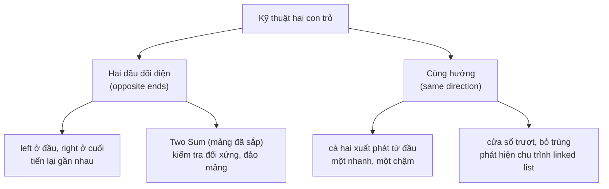

# Kỹ thuật hai con trỏ (Two Pointers)

## Khái niệm

Kỹ thuật hai con trỏ (two pointers) là một chiến lược cơ bản dùng **hai chỉ số** (hoặc hai con trỏ) để duyệt và xử lý dữ liệu, chủ yếu trên mảng (array) hoặc danh sách liên kết (linked list). Thay vì lồng hai vòng lặp để xét mọi cặp phần tử, ta di chuyển hai con trỏ một cách có chủ đích, thường giúp giảm độ phức tạp từ `O(n²)` xuống `O(n)`.

## Khi nào dùng / Vì sao quan trọng

Kỹ thuật này phù hợp với nhiều dạng bài phổ biến:

1. **Bài toán tổng cặp / bộ ba (pair/triplet sum):** tìm cặp hoặc bộ ba số thỏa một điều kiện, ví dụ có tổng bằng một giá trị mục tiêu (target).
2. **Mảng đã sắp xếp (sorted array):** hiệu quả với các thao tác trên mảng đã sắp, chẳng hạn trộn (merge) hai mảng đã sắp.
3. **Bài toán cửa sổ trượt (sliding window):** tìm mảng con hoặc chuỗi con thỏa điều kiện, ví dụ chuỗi con dài nhất không lặp ký tự.
4. **Bài toán phân hoạch (partitioning):** chia mảng quanh một phần tử chốt (pivot), như bước phân hoạch trong quicksort.
5. **Loại bỏ phần tử trùng (removing duplicates):** hiệu quả khi cần bỏ phần tử trùng trong mảng hoặc danh sách đã sắp.

## Cách hoạt động

### Hai kiểu bố trí con trỏ



Có hai kiểu bố trí con trỏ chính:

**1. Hai đầu đối diện (opposite ends)**

- **Khởi tạo:** một con trỏ ở đầu mảng (`left`), con trỏ kia ở cuối mảng (`right`).
- **Di chuyển:** hai con trỏ tiến lại gần nhau dựa theo điều kiện cụ thể, thường để tìm cặp có tổng bằng mục tiêu.
- **Điều kiện dừng:** lặp cho tới khi hai con trỏ gặp/vượt nhau, hoặc khi điều kiện được thỏa.

```
mảng: [ 2  3  5  8  11 ]
        ^              ^
       left          right   -> tiến lại gần nhau
```

**2. Cùng hướng (same direction)**

- **Khởi tạo:** cả hai con trỏ bắt đầu ở đầu mảng.
- **Di chuyển:** một con trỏ chạy nhanh phía trước, con trỏ kia chạy chậm phía sau, duy trì một "khoảng cách" hoặc một "cửa sổ" giữa chúng.
- **Ứng dụng:** thường dùng cho bài toán mảng con / chuỗi con, ví dụ tìm chuỗi con duy nhất dài nhất.

**Một vài điểm cần lưu ý**

- **Khởi tạo đúng vị trí** cho hai con trỏ là bước then chốt.
- **Điều kiện di chuyển:** xác định rõ khi nào con trỏ nào được dịch — điều này phụ thuộc từng bài.
- **Điều kiện biên (boundary):** luôn kiểm tra để con trỏ không vượt ra ngoài phạm vi mảng.
- **Hiệu năng:** kỹ thuật giúp giảm số lần duyệt qua dữ liệu, rất lợi khi dữ liệu lớn.

## Ví dụ

**Ví dụ 1 — Kiểm tra chuỗi đối xứng (palindrome)**

Cho chuỗi `s`, trả về `True` nếu nó là chuỗi đối xứng (đọc xuôi và đọc ngược giống nhau), ngược lại trả về `False`. Ví dụ: `"abcdcba"` hay `"racecar"`.

```python
def palindrom(s):
    left = 0
    right = len(s) - 1
    while left < right:
        if s[left] != s[right]:   # hai đầu khác nhau -> không đối xứng
            return False
        left += 1                 # tiến con trỏ trái
        right -= 1                # lùi con trỏ phải
    return True
```

**Ví dụ 2 — Valid Palindrome (LeetCode 125)**

Một cụm từ là đối xứng nếu sau khi đổi hết chữ hoa thành chữ thường và loại bỏ mọi ký tự không phải chữ-số (alphanumeric), nó đọc xuôi và đọc ngược giống nhau.

```python
def isPalindrome(s):
    # chỉ giữ ký tự chữ/số và đổi về chữ thường
    s = ''.join(char for char in s if char.isalnum()).lower()
    left = 0
    right = len(s) - 1
    while left < right:
        if s[left] != s[right]:
            return False
        left += 1
        right -= 1
    return True

# "A man, a plan, a canal: Panama" -> True
# "race a car"                     -> False
# " "                             -> True
```

**Ví dụ 3 — Two Sum trên mảng đã sắp (kiểu hai đầu đối diện)**

Cho mảng số nguyên `nums` **đã sắp tăng dần** và một giá trị `target`, trả về chỉ số của hai số có tổng bằng `target`.

**Minh hoạ hai con trỏ di chuyển** trên `nums = [2, 3, 5, 8, 11, 15]`, `target = 13`. Mỗi hàng là một bước: `left` (▶) và `right` (◀) chỉ vào ô nào, tổng bằng bao nhiêu, và quyết định dịch con trỏ.

<svg viewBox="0 0 480 250" width="100%" role="img" aria-label="Minh hoạ hai con trỏ hai đầu đối diện" style="max-width:560px;font-family:sans-serif">
  <g font-size="13" text-anchor="middle">
    <!-- tiêu đề cột giá trị -->
    <text x="240" y="16" font-size="12" fill="#666">nums = [2, 3, 5, 8, 11, 15], target = 13</text>
    <!-- Bước 1: left=0(2), right=5(15) => 17 > 13 -> right-- -->
    <g transform="translate(0,28)">
      <rect x="40" y="0" width="60" height="26" fill="#4db6ac" rx="3"/><text x="70" y="18" fill="#fff">2 ▶L</text>
      <rect x="100" y="0" width="60" height="26" fill="#eee" rx="3"/><text x="130" y="18">3</text>
      <rect x="160" y="0" width="60" height="26" fill="#eee" rx="3"/><text x="190" y="18">5</text>
      <rect x="220" y="0" width="60" height="26" fill="#eee" rx="3"/><text x="250" y="18">8</text>
      <rect x="280" y="0" width="60" height="26" fill="#eee" rx="3"/><text x="310" y="18">11</text>
      <rect x="340" y="0" width="60" height="26" fill="#f4a261" rx="3"/><text x="370" y="18" fill="#fff">15 R◀</text>
      <text x="440" y="18" font-size="11" fill="#a33" text-anchor="start">17&gt;13 → R--</text>
    </g>
    <!-- Bước 2: left=0(2), right=4(11) => 13 = 13 tìm thấy -->
    <g transform="translate(0,62)">
      <rect x="40" y="0" width="60" height="26" fill="#4db6ac" rx="3"/><text x="70" y="18" fill="#fff">2 ▶L</text>
      <rect x="100" y="0" width="60" height="26" fill="#eee" rx="3"/><text x="130" y="18">3</text>
      <rect x="160" y="0" width="60" height="26" fill="#eee" rx="3"/><text x="190" y="18">5</text>
      <rect x="220" y="0" width="60" height="26" fill="#eee" rx="3"/><text x="250" y="18">8</text>
      <rect x="280" y="0" width="60" height="26" fill="#2a9d8f" rx="3"/><text x="310" y="18" fill="#fff">11 R◀</text>
      <rect x="340" y="0" width="60" height="26" fill="#eee" rx="3"/><text x="370" y="18">15</text>
      <text x="440" y="18" font-size="11" fill="#083" text-anchor="start">2+11=13 ✓</text>
    </g>
    <text x="40" y="118" font-size="12" fill="#666" text-anchor="start">Quy tắc: tổng &gt; target → lùi R; tổng &lt; target → tiến L; bằng → tìm thấy.</text>
  </g>
</svg>

!!! tip "Thử ngay (chạy được)"
    Bấm **▶ Chạy** để hai con trỏ quét mảng đã sắp tìm cặp có tổng bằng `target`, in từng bước. Sửa `nums`/`target` rồi chạy lại.

<div class="js-demo" data-title="Two Sum trên mảng đã sắp — in cặp (JavaScript)">
<textarea class="js-demo-src">
function twoSumSorted(nums, target) {
  let left = 0, right = nums.length - 1;
  while (left < right) {
    const sum = nums[left] + nums[right];
    print(`left=${left}(${nums[left]}), right=${right}(${nums[right]}), tổng=${sum}`);
    if (sum === target) {
      print(`=> Tìm thấy cặp: nums[${left}]=${nums[left]} + nums[${right}]=${nums[right]} = ${target}`);
      return [left, right];
    } else if (sum > target) {
      right--;   // tổng quá lớn -> lùi con trỏ phải
    } else {
      left++;    // tổng quá nhỏ -> tiến con trỏ trái
    }
  }
  print('Không tìm thấy cặp nào.');
  return [-1, -1];
}

const nums = [2, 3, 5, 8, 11, 15];
const target = 13;
print('Kết quả (chỉ số):', `[${twoSumSorted(nums, target)}]`);
</textarea>
</div>

=== "JavaScript"
    ```js
    function twoSum(nums, target) {
      let left = 0, right = nums.length - 1;
      while (left < right) {
        const sum = nums[left] + nums[right];
        if (sum === target) return [left, right];
        else if (sum > target) right--;   // tổng quá lớn -> lùi con trỏ phải
        else left++;                      // tổng quá nhỏ -> tiến con trỏ trái
      }
      return [-1, -1];
    }
    ```

=== "Python"
    ```python
    def twoSum(nums, target):
        left = 0
        right = len(nums) - 1
        while left < right:
            sum = nums[left] + nums[right]
            if sum == target:
                return [left, right]
            elif sum > target:
                right -= 1   # tổng quá lớn -> giảm bằng cách lùi con trỏ phải
            else:
                left += 1    # tổng quá nhỏ -> tăng bằng cách tiến con trỏ trái
        return [-1, -1]
    ```

**Ví dụ 4 — Trộn hai mảng đã sắp (merge two sorted arrays)**

Cho hai mảng số nguyên đã sắp `arr1` và `arr2`, trả về một mảng mới gộp cả hai và vẫn giữ thứ tự sắp xếp.

```python
def merged_sorted(arr1, arr2):
    i, j = 0, 0
    result = []
    # so sánh song song hai con trỏ trên hai mảng
    while i < len(arr1) and j < len(arr2):
        if arr1[i] < arr2[j]:
            result.append(arr1[i])
            i += 1
        else:
            result.append(arr2[j])
            j += 1

    # chép nốt phần còn lại của arr1 (nếu có)
    while i < len(arr1):
        result.append(arr1[i])
        i += 1

    # chép nốt phần còn lại của arr2 (nếu có)
    while j < len(arr2):
        result.append(arr2[j])
        j += 1
    return result

print(merged_sorted([1, 2, 5, 6], [4, 5, 7, 8]))
```

## Độ phức tạp

| Thao tác | Thời gian | Bộ nhớ |
|----------|-----------|--------|
| Duyệt hai đầu / cùng hướng | O(n) | O(1) |
| Trộn hai mảng đã sắp | O(n + m) | O(n + m) cho mảng kết quả |

## Ưu / nhược điểm

- **Ưu:**
    - **Đơn giản:** dễ hình dung và dễ cài đặt.
    - **Hiệu quả:** thường giảm độ phức tạp thời gian (từ `O(n²)` xuống `O(n)`).
    - **Linh hoạt:** áp dụng được cho nhiều dạng bài, nhất là mảng đã sắp và bài toán phân hoạch.
- **Nhược:**
    - Nhiều biến thể (nhất là kiểu "hai đầu đối diện") yêu cầu **dữ liệu đã sắp xếp**; nếu chưa sắp thì phải trả thêm chi phí `O(n log n)` để sắp trước.
    - Cần xác định đúng điều kiện di chuyển và điều kiện biên, dễ sai chỉ số (off-by-one) nếu không cẩn thận.

## Câu hỏi phỏng vấn thường gặp

1. Khi nào nên dùng hai con trỏ theo kiểu "hai đầu đối diện" và khi nào theo kiểu "cùng hướng"?
2. Vì sao Two Sum trên mảng **đã sắp** có thể giải bằng hai con trỏ trong `O(n)`, còn bản chưa sắp thì thường dùng bảng băm (hash map)?
3. Trình bày cách loại bỏ phần tử trùng khỏi mảng đã sắp bằng hai con trỏ tại chỗ (in-place).
4. Giải thích cách trộn hai mảng đã sắp và độ phức tạp của nó.

## Tham khảo

- [LeetCode 125 — Valid Palindrome](https://leetcode.com/problems/valid-palindrome/description/)
- [LeetCode 1 — Two Sum](https://leetcode.com/problems/two-sum/description/)
