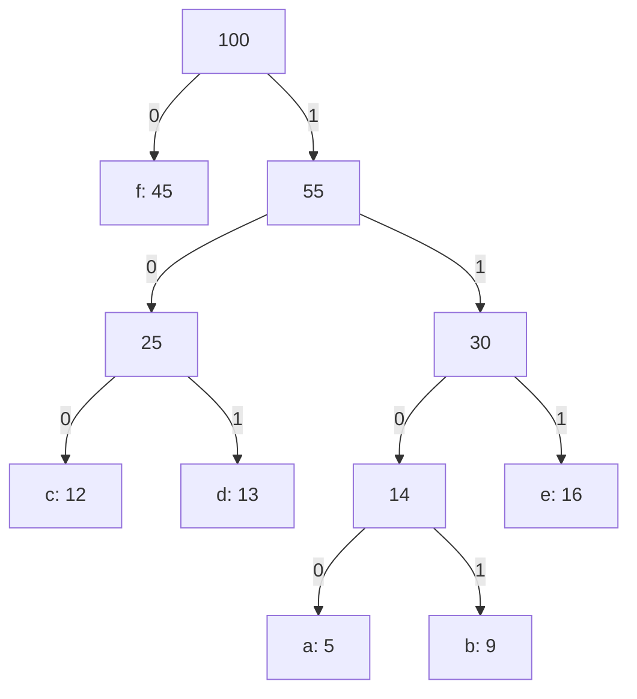

# Thuật toán tham lam (Greedy Algorithms)

## Khái niệm

Tham lam (greedy) là chiến lược xây dựng lời giải bằng cách ở **mỗi bước luôn chọn phương án tốt nhất tại thời điểm hiện tại** (lựa chọn cục bộ tối ưu), với hy vọng chuỗi các lựa chọn cục bộ sẽ cho lời giải tối ưu toàn cục. Không quay lui, không xét lại — mỗi quyết định là cuối cùng.

## Khi nào dùng / Vì sao quan trọng

Tham lam chỉ cho kết quả **tối ưu toàn cục** khi bài toán có hai tính chất:

- **Tính chất lựa chọn tham lam (greedy-choice property):** một lựa chọn cục bộ tối ưu dẫn tới lời giải toàn cục tối ưu.
- **Cấu trúc con tối ưu (optimal substructure):** lời giải tối ưu chứa trong nó lời giải tối ưu của các bài con.

Nếu thiếu các tính chất này, tham lam có thể sai — khi đó cần quy hoạch động. Tham lam thường nhanh và đơn giản hơn DP nên rất đáng ưu tiên khi chứng minh được tính đúng.

## Cách hoạt động

Khung chung: sắp xếp/ưu tiên các lựa chọn theo một tiêu chí, rồi lần lượt nhận lựa chọn nào không vi phạm ràng buộc.

### Các ví dụ kinh điển

- **Activity Selection (chọn hoạt động):** chọn nhiều nhất các hoạt động không giao nhau. Tham lam: luôn chọn hoạt động **kết thúc sớm nhất**. `O(n log n)` do sắp xếp.
- **Huffman Coding (mã hóa Huffman):** xây cây mã tiền tố tối ưu để nén dữ liệu; luôn gộp hai nút tần suất nhỏ nhất. `O(n log n)` dùng hàng đợi ưu tiên.
- **Fractional Knapsack (túi phân số):** được lấy phần lẻ của món đồ; tham lam chọn theo **tỉ lệ giá trị/trọng lượng** cao nhất. `O(n log n)`. (Khác 0/1 knapsack — bản 0/1 phải dùng DP.)
- **Prim & Kruskal (cây khung nhỏ nhất — Minimum Spanning Tree, MST):** Prim mở rộng cây bằng cạnh nhẹ nhất nối ra ngoài (dùng hàng đợi ưu tiên); Kruskal xét các cạnh tăng dần theo trọng số, thêm cạnh nếu không tạo chu trình (dùng cấu trúc Union-Find để kiểm tra chu trình). Cả hai đều `O(E log V)`.
- **Dijkstra (đường đi ngắn nhất):** với đồ thị trọng số **không âm**, luôn mở rộng đỉnh có khoảng cách tạm nhỏ nhất. `O(E log V)` với hàng đợi ưu tiên.

### Minh hoạ Activity Selection trên trục thời gian

Sáu hoạt động vẽ theo khoảng `[bắt đầu, kết thúc]`. Sắp theo thời điểm **kết thúc** rồi lần lượt nhận hoạt động nào không đè lên hoạt động vừa chọn. Thanh **tô đậm** là được chọn, thanh **mờ** bị bỏ vì chồng lấn.

<svg viewBox="0 0 560 250" width="100%" role="img" aria-label="Minh hoạ Activity Selection trên trục thời gian" style="max-width:640px;font-family:sans-serif">
  <!-- lưới trục thời gian -->
  <g stroke="#cfcfcf" stroke-width="1">
    <line x1="40" y1="20" x2="40" y2="210"/>
    <line x1="88" y1="20" x2="88" y2="210"/>
    <line x1="136" y1="20" x2="136" y2="210"/>
    <line x1="184" y1="20" x2="184" y2="210"/>
    <line x1="232" y1="20" x2="232" y2="210"/>
    <line x1="280" y1="20" x2="280" y2="210"/>
    <line x1="328" y1="20" x2="328" y2="210"/>
    <line x1="376" y1="20" x2="376" y2="210"/>
    <line x1="424" y1="20" x2="424" y2="210"/>
    <line x1="472" y1="20" x2="472" y2="210"/>
    <line x1="520" y1="20" x2="520" y2="210"/>
  </g>
  <!-- nhãn trục -->
  <g fill="#666" font-size="11" text-anchor="middle">
    <text x="40" y="228">0</text><text x="88" y="228">1</text><text x="136" y="228">2</text>
    <text x="184" y="228">3</text><text x="232" y="228">4</text><text x="280" y="228">5</text>
    <text x="328" y="228">6</text><text x="376" y="228">7</text><text x="424" y="228">8</text>
    <text x="472" y="228">9</text><text x="520" y="228">10</text>
    <text x="280" y="245" font-size="12">thời gian</text>
  </g>
  <!-- CHỌN [1,3] --><rect x="88" y="28" width="96" height="20" rx="4" fill="#4db6ac"/><text x="136" y="42" fill="#083" font-size="11" text-anchor="middle">[1,3] ✓</text>
  <!-- BỎ [2,5] --><rect x="136" y="56" width="144" height="20" rx="4" fill="#d9d9d9"/><text x="208" y="70" fill="#777" font-size="11" text-anchor="middle">[2,5] ✗</text>
  <!-- CHỌN [4,7] --><rect x="232" y="84" width="144" height="20" rx="4" fill="#4db6ac"/><text x="304" y="98" fill="#083" font-size="11" text-anchor="middle">[4,7] ✓</text>
  <!-- BỎ [1,8] --><rect x="88" y="112" width="336" height="20" rx="4" fill="#d9d9d9"/><text x="256" y="126" fill="#777" font-size="11" text-anchor="middle">[1,8] ✗</text>
  <!-- BỎ [5,9] --><rect x="280" y="140" width="192" height="20" rx="4" fill="#d9d9d9"/><text x="376" y="154" fill="#777" font-size="11" text-anchor="middle">[5,9] ✗</text>
  <!-- CHỌN [8,10] --><rect x="424" y="168" width="96" height="20" rx="4" fill="#4db6ac"/><text x="472" y="182" fill="#083" font-size="11" text-anchor="middle">[8,10] ✓</text>
</svg>

Kết quả: chọn được tối đa **3** hoạt động `[1,3] → [4,7] → [8,10]`.

## Ví dụ

**Activity Selection — chọn nhiều hoạt động không giao nhau nhất**

=== "JavaScript"
    ```js
    function activitySelection(activities) {
      // activities: mảng [start, finish]; sắp theo thời điểm kết thúc
      activities.sort((a, b) => a[1] - b[1]);
      const result = [];
      let lastEnd = -Infinity;
      for (const [start, finish] of activities) {
        if (start >= lastEnd) {      // không đè lên hoạt động vừa chọn
          result.push([start, finish]);
          lastEnd = finish;          // cập nhật mốc kết thúc gần nhất
        }
      }
      return result;
    }

    console.log(activitySelection([[1, 3], [2, 5], [4, 7], [1, 8], [5, 9]]));
    // [[1, 3], [4, 7], [5, 9]]
    ```
=== "Python"
    ```python
    def activity_selection(activities):
        # activities: danh sách (start, finish); sắp theo thời điểm kết thúc
        activities.sort(key=lambda x: x[1])
        result = []
        last_end = float('-inf')
        for start, finish in activities:
            if start >= last_end:       # không đè lên hoạt động vừa chọn
                result.append((start, finish))
                last_end = finish       # cập nhật mốc kết thúc gần nhất
        return result

    print(activity_selection([(1, 3), (2, 5), (4, 7), (1, 8), (5, 9)]))
    # [(1, 3), (4, 7), (5, 9)]
    ```

**Fractional Knapsack — túi phân số**

=== "JavaScript"
    ```js
    function fractionalKnapsack(items, W) {
      // items: mảng [value, weight]; sắp giảm dần theo tỉ lệ value/weight
      items.sort((a, b) => b[0] / b[1] - a[0] / a[1]);
      let total = 0;
      for (const [value, weight] of items) {
        if (W >= weight) {
          total += value;             // lấy trọn món
          W -= weight;
        } else {
          total += value * (W / weight);   // lấy phần lẻ vừa đủ đầy túi
          break;                      // túi đã đầy
        }
      }
      return total;
    }

    console.log(fractionalKnapsack([[60, 10], [100, 20], [120, 30]], 50));   // 240
    ```
=== "Python"
    ```python
    def fractional_knapsack(items, W):
        # items: danh sách (value, weight); sắp giảm dần theo tỉ lệ value/weight
        items.sort(key=lambda it: it[0] / it[1], reverse=True)
        total = 0.0
        for value, weight in items:
            if W >= weight:
                total += value         # lấy trọn món
                W -= weight
            else:
                total += value * (W / weight)   # lấy phần lẻ vừa đủ đầy túi
                break                  # túi đã đầy
        return total

    print(fractional_knapsack([(60, 10), (100, 20), (120, 30)], 50))   # 240.0
    ```

**Huffman Coding — xây cây mã tối ưu (dùng heap)**

=== "JavaScript"
    ```js
    function huffman(freqs) {
      // freqs: mảng [char, weight]; dùng mảng đã sắp làm hàng đợi ưu tiên đơn giản
      let heap = freqs.map(([ch, w]) => ({ w, ch }));
      let cost = 0;
      while (heap.length > 1) {
        heap.sort((x, y) => x.w - y.w);      // hai nút tần suất nhỏ nhất ở đầu
        const a = heap.shift();
        const b = heap.shift();
        const merged = a.w + b.w;
        cost += merged;                      // mỗi lần gộp cộng vào tổng chi phí
        heap.push({ w: merged, ch: null });
      }
      return cost;
    }

    console.log(huffman([['a', 5], ['b', 9], ['c', 12], ['d', 13], ['e', 16], ['f', 45]]));
    ```
=== "Python"
    ```python
    import heapq

    def huffman(freqs):
        # freqs: dict ký tự -> tần suất; trả về tổng chi phí mã hóa
        heap = [[w, ch] for ch, w in freqs.items()]
        heapq.heapify(heap)
        cost = 0
        while len(heap) > 1:
            a = heapq.heappop(heap)     # hai nút tần suất nhỏ nhất
            b = heapq.heappop(heap)
            merged = a[0] + b[0]
            cost += merged              # mỗi lần gộp cộng vào tổng chi phí
            heapq.heappush(heap, [merged, None])
        return cost

    print(huffman({'a': 5, 'b': 9, 'c': 12, 'd': 13, 'e': 16, 'f': 45}))
    ```

### Minh hoạ cây Huffman

Với tần suất `f=45, e=16, d=13, c=12, b=9, a=5`, luôn gộp **hai nút tần suất nhỏ nhất** thành một nút cha (giá trị = tổng), lặp tới khi còn một gốc. Nhánh trái ghi `0`, nhánh phải ghi `1`; đường từ gốc tới lá là mã của ký tự đó (ký tự tần suất cao → mã ngắn).



## Thử ngay: Activity Selection in từng bước chọn

!!! tip "Chạy được ngay"
    Đoạn dưới sắp các hoạt động theo thời điểm kết thúc, rồi duyệt và in quyết định **chọn** hay **bỏ** từng hoạt động cùng lý do. Bấm **▶ Chạy**; đổi mảng `activities` (mỗi phần tử là `[start, finish]`) để thử.

<div class="js-demo" data-title="Activity Selection — chọn hoạt động kết thúc sớm nhất">
<textarea class="js-demo-src">
function activitySelection(activities) {
  // sắp tăng dần theo thời điểm kết thúc (finish)
  const sorted = [...activities].sort((a, b) => a[1] - b[1]);
  print('Sau khi sắp theo thời điểm kết thúc:');
  print('  ' + sorted.map(a => `[${a[0]},${a[1]}]`).join('  '));
  const chosen = [];
  let lastEnd = -Infinity;
  for (const [s, f] of sorted) {
    if (s >= lastEnd) {
      chosen.push([s, f]);
      print(`CHỌN [${s},${f}] — bắt đầu ${s} >= mốc ${lastEnd === -Infinity ? '-∞' : lastEnd}`);
      lastEnd = f;
    } else {
      print(`BỎ   [${s},${f}] — bắt đầu ${s} < mốc ${lastEnd} (bị chồng lấn)`);
    }
  }
  print(`=> Chọn được tối đa ${chosen.length} hoạt động: ` +
        chosen.map(a => `[${a[0]},${a[1]}]`).join(', '));
}

const activities = [[1, 3], [2, 5], [4, 7], [1, 8], [5, 9], [8, 10]];
activitySelection(activities);
</textarea>
</div>

## Độ phức tạp

| Bài toán | Thời gian | Bộ nhớ |
|----------|-----------|--------|
| Activity Selection | O(n log n) | O(1) |
| Fractional Knapsack | O(n log n) | O(1) |
| Huffman Coding | O(n log n) | O(n) |
| Prim / Kruskal (MST) | O(E log V) | O(V + E) |
| Dijkstra | O(E log V) | O(V + E) |

- **Prim (Minimum Spanning Tree):** `O(E log V)` với hàng đợi ưu tiên | `O(V + E)`
- **Kruskal (Minimum Spanning Tree):** `O(E log V)` do sắp cạnh | `O(V + E)`
- **Dijkstra (shortest path):** `O(E log V)` | `O(V + E)`

Ghi chú: cả Prim, Kruskal, Dijkstra đều là các thuật toán tham lam trên đồ thị — chúng cùng khai thác tính chất "chọn cạnh/đỉnh nhẹ nhất tại mỗi bước" và đều chứng minh được tính đúng nhờ cấu trúc con tối ưu của đồ thị.

## Ưu / nhược điểm

- **Ưu:**
    - Nhanh, đơn giản, ít bộ nhớ hơn quy hoạch động.
    - Nhiều bài kinh điển có lời giải tham lam ngắn gọn và đẹp.
- **Nhược:**
    - **Không phải lúc nào cũng đúng** — cần chứng minh tính chất lựa chọn tham lam.
    - Ví dụ điển hình thất bại: 0/1 knapsack (phải dùng DP), đổi tiền với bộ mệnh giá bất kỳ.

## Câu hỏi phỏng vấn thường gặp

1. Vì sao tham lam đúng cho fractional knapsack nhưng sai cho 0/1 knapsack?
2. Chứng minh tại sao "chọn hoạt động kết thúc sớm nhất" là tối ưu.
3. So sánh Prim và Kruskal — khi nào chọn cái nào?
4. Vì sao Dijkstra không hoạt động đúng khi có cạnh trọng số âm?
5. Cho một bài toán, làm sao xác định nó giải được bằng tham lam hay phải dùng DP?

## Tham khảo

- [Greedy Algorithms — GeeksforGeeks](https://www.geeksforgeeks.org/greedy-algorithms/)
- [Huffman Coding — Wikipedia](https://en.wikipedia.org/wiki/Huffman_coding)
