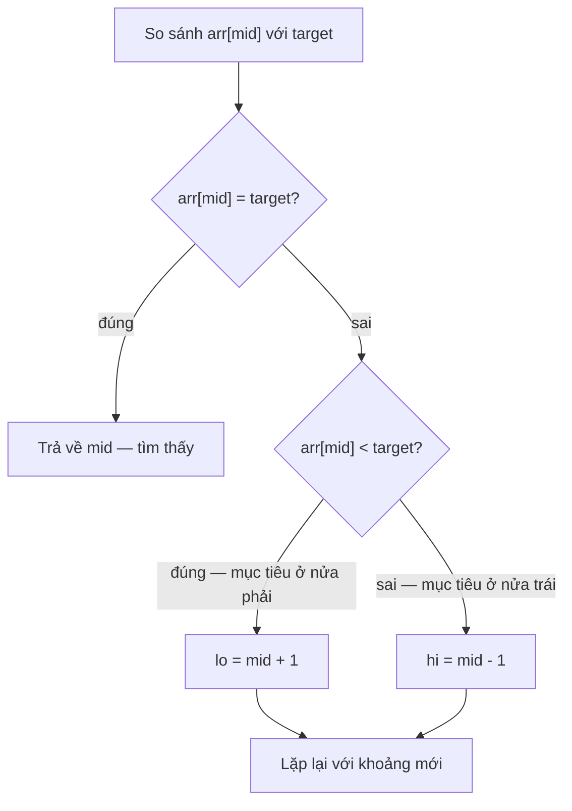

# Thuật toán tìm kiếm (Searching Algorithms)

## Khái niệm

Tìm kiếm (searching) là quá trình xác định vị trí (hoặc sự tồn tại) của một phần tử mục tiêu trong một tập dữ liệu. Cách tìm phụ thuộc nhiều vào việc dữ liệu **đã sắp xếp hay chưa**: với dữ liệu chưa sắp ta chỉ có thể duyệt tuyến tính, còn với dữ liệu đã sắp ta khai thác được các thuật toán logarit như tìm kiếm nhị phân.

## Khi nào dùng / Vì sao quan trọng

- **Truy vấn thành viên (membership):** kiểm tra một phần tử có trong tập dữ liệu không.
- **Định vị chỉ số:** tìm vị trí để chèn/xóa, hoặc tìm biên (cận trái/cận phải).
- **Nền tảng phỏng vấn:** tìm kiếm nhị phân là một trong những kỹ thuật được hỏi nhiều nhất, đặc biệt biến thể "nhị phân trên đáp án" (binary search on answer).

## Cách hoạt động

!!! tip "Thử ngay (chạy được)"
    Bấm **▶ Chạy** để chạy đoạn JavaScript dưới đây ngay trong trình duyệt. Bạn có thể sửa mảng hoặc `target` rồi chạy lại.

<div class="js-demo" data-title="Tìm kiếm nhị phân — JavaScript">
<textarea class="js-demo-src">
function binarySearch(arr, target) {
  let lo = 0, hi = arr.length - 1, buoc = 0;
  while (lo <= hi) {
    buoc++;
    const mid = (lo + hi) >> 1;
    print(`Bước ${buoc}: xét mid=${mid}, giá trị=${arr[mid]}`);
    if (arr[mid] === target) return mid;
    if (arr[mid] < target) lo = mid + 1;
    else hi = mid - 1;
  }
  return -1;
}

const a = [2, 5, 8, 12, 16, 23, 38, 56, 72, 91];
const target = 23;
const idx = binarySearch(a, target);
print(idx >= 0 ? `Tìm thấy ${target} tại chỉ số ${idx}` : `Không tìm thấy ${target}`);
</textarea>
</div>

### Tìm kiếm tuyến tính (Linear Search)

Duyệt tuần tự từng phần tử cho tới khi gặp mục tiêu. Không yêu cầu dữ liệu sắp xếp. **Thời gian:** `O(n)`.

### Tìm kiếm nhị phân (Binary Search)

Yêu cầu **mảng đã sắp**. Mỗi bước so sánh mục tiêu với phần tử giữa (mid) rồi loại bỏ nửa không thể chứa mục tiêu, thu hẹp không gian tìm kiếm còn một nửa. **Thời gian:** `O(log n)`.

Sơ đồ dưới minh hoạ việc **loại nửa mảng mỗi bước** khi tìm `target = 23` trong `[2, 5, 8, 12, 16, 23, 38, 56, 72, 91]` (chỉ số `0..9`). Vùng `▓` là khoảng `[lo, hi]` còn xét, `↑` là `mid`:

```
Bước 1:  ▓▓▓▓▓▓▓▓▓▓   lo=0, hi=9, mid=4 (=16)  →  16 < 23 ⇒ bỏ nửa trái, lo=5
          2 5 8 …  ↑
Bước 2:       ▓▓▓▓▓   lo=5, hi=9, mid=7 (=56)  →  56 > 23 ⇒ bỏ nửa phải, hi=6
                  ↑
Bước 3:       ▓▓      lo=5, hi=6, mid=5 (=23)  →  23 = 23 ⇒ TÌM THẤY tại chỉ số 5
          ↑
```

Mỗi bước, khoảng còn lại giảm đi một nửa: `10 → 5 → 2 → 1`, nên số bước là `O(log n)`.

<svg viewBox="0 0 640 150" width="100%" xmlns="http://www.w3.org/2000/svg" font-family="sans-serif" font-size="13">
  <text x="10" y="20" fill="#888">Trục số (mảng đã sắp) — khoảng còn xét thu hẹp mỗi bước:</text>
  <!-- Bước 1: full range -->
  <rect x="40" y="35" width="560" height="20" fill="#4db6ac" opacity="0.25" stroke="#4db6ac"/>
  <text x="10" y="50" fill="#888">B1</text>
  <line x1="320" y1="30" x2="320" y2="60" stroke="#888" stroke-width="2"/>
  <text x="300" y="75" fill="#888">mid=16 &lt; 23</text>
  <!-- Bước 2: right half -->
  <rect x="320" y="90" width="280" height="20" fill="#4db6ac" opacity="0.4" stroke="#4db6ac"/>
  <text x="10" y="105" fill="#888">B2</text>
  <line x1="460" y1="85" x2="460" y2="115" stroke="#888" stroke-width="2"/>
  <text x="440" y="130" fill="#888">mid=56 &gt; 23</text>
  <!-- Bước 3: found -->
  <rect x="320" y="130" width="56" height="16" fill="#4db6ac" opacity="0.7" stroke="#4db6ac"/>
  <text x="384" y="143" fill="#4db6ac">✓ 23 tại chỉ số 5</text>
</svg>

Cây quyết định dưới đây tóm tắt ba nhánh so sánh `arr[mid]` với `target` ở mỗi vòng lặp:



### Jump Search (tìm kiếm nhảy)

Trên mảng đã sắp, nhảy từng bước cỡ `√n` để khoanh vùng khối chứa mục tiêu, rồi tìm tuyến tính trong khối đó. **Thời gian:** `O(√n)`.

### Interpolation Search (tìm kiếm nội suy)

Cải tiến của nhị phân cho dữ liệu **phân bố đều**: thay vì luôn lấy giữa, ước lượng vị trí mục tiêu theo tỉ lệ giá trị. **Thời gian:** `O(log log n)` khi phân bố đều, `O(n)` xấu nhất.

### Exponential Search (tìm kiếm hàm mũ)

Dùng khi không biết kích thước mảng (hoặc mảng vô hạn/rất lớn): nhân đôi chỉ số (1, 2, 4, 8...) đến khi vượt qua mục tiêu, rồi nhị phân trong khoảng vừa tìm được. **Thời gian:** `O(log n)`.

### Ternary Search (tìm kiếm tam phân)

Chia không gian thành ba phần thay vì hai. Thường dùng để tìm cực trị của **hàm đơn thức (unimodal function)** hơn là tìm phần tử trong mảng. **Thời gian:** `O(log n)`.

## Ví dụ

**Tìm kiếm tuyến tính**

=== "JavaScript"
    ```js
    function linearSearch(arr, target) {
      for (let i = 0; i < arr.length; i++) {
        if (arr[i] === target) return i;   // gặp mục tiêu
      }
      return -1;                            // không tìm thấy
    }
    ```
=== "Python"
    ```python
    def linear_search(arr, target):
        for i in range(len(arr)):
            if arr[i] == target:    # gặp mục tiêu
                return i
        return -1                   # không tìm thấy
    ```

**Tìm kiếm nhị phân (bản lặp)**

=== "JavaScript"
    ```js
    function binarySearch(arr, target) {
      let left = 0, right = arr.length - 1;
      while (left <= right) {
        const mid = left + ((right - left) >> 1);   // tránh tràn số
        if (arr[mid] === target) return mid;        // tìm thấy
        else if (arr[mid] < target) left = mid + 1; // mục tiêu ở nửa phải
        else right = mid - 1;                       // mục tiêu ở nửa trái
      }
      return -1;
    }

    console.log(binarySearch([1, 3, 5, 7, 9, 11], 7));   // 3
    ```
=== "Python"
    ```python
    def binary_search(arr, target):
        left, right = 0, len(arr) - 1
        while left <= right:
            mid = left + (right - left) // 2    # tránh tràn số so với (left+right)//2
            if arr[mid] == target:
                return mid                       # tìm thấy
            elif arr[mid] < target:
                left = mid + 1                   # mục tiêu ở nửa phải
            else:
                right = mid - 1                  # mục tiêu ở nửa trái
        return -1

    print(binary_search([1, 3, 5, 7, 9, 11], 7))   # 3
    ```

**Tìm biên trái/phải — cận dưới (lower bound) và cận trên (upper bound)**

Với mảng có phần tử lặp, ta thường cần chỉ số **đầu tiên** hoặc **cuối cùng** bằng mục tiêu. `lower_bound` trả về vị trí đầu tiên có `arr[i] >= target`; `upper_bound` trả về vị trí đầu tiên có `arr[i] > target`. Nhờ đó số lần xuất hiện của `target` là `upper_bound - lower_bound`.

=== "JavaScript"
    ```js
    // vị trí đầu tiên có arr[i] >= target
    function lowerBound(arr, target) {
      let left = 0, right = arr.length;   // khoảng nửa mở [left, right)
      while (left < right) {
        const mid = left + ((right - left) >> 1);
        if (arr[mid] < target) left = mid + 1;
        else right = mid;                 // giữ mid vì có thể là đáp án
      }
      return left;
    }

    // vị trí đầu tiên có arr[i] > target
    function upperBound(arr, target) {
      let left = 0, right = arr.length;
      while (left < right) {
        const mid = left + ((right - left) >> 1);
        if (arr[mid] <= target) left = mid + 1;
        else right = mid;
      }
      return left;
    }

    console.log(lowerBound([1, 2, 2, 2, 5], 2));   // 1
    console.log(upperBound([1, 2, 2, 2, 5], 2));   // 4
    ```
=== "Python"
    ```python
    def lower_bound(arr, target):
        # vị trí đầu tiên có arr[i] >= target (chèn giữ thứ tự)
        left, right = 0, len(arr)   # right = len(arr): khoảng nửa mở [left, right)
        while left < right:
            mid = left + (right - left) // 2
            if arr[mid] < target:
                left = mid + 1
            else:
                right = mid          # giữ lại mid vì có thể là đáp án
        return left

    def upper_bound(arr, target):
        # vị trí đầu tiên có arr[i] > target
        left, right = 0, len(arr)
        while left < right:
            mid = left + (right - left) // 2
            if arr[mid] <= target:
                left = mid + 1
            else:
                right = mid
        return left

    print(lower_bound([1, 2, 2, 2, 5], 2))   # 1
    print(upper_bound([1, 2, 2, 2, 5], 2))   # 4
    ```

**Exponential Search**

=== "JavaScript"
    ```js
    function exponentialSearch(arr, target) {
      if (arr[0] === target) return 0;
      let i = 1;
      while (i < arr.length && arr[i] <= target) i *= 2;  // nhân đôi tầm nhảy
      // nhị phân trong khoảng [i/2, min(i, n-1)]
      let lo = i >> 1, hi = Math.min(i, arr.length - 1);
      while (lo <= hi) {
        const mid = lo + ((hi - lo) >> 1);
        if (arr[mid] === target) return mid;
        else if (arr[mid] < target) lo = mid + 1;
        else hi = mid - 1;
      }
      return -1;
    }
    ```
=== "Python"
    ```python
    def exponential_search(arr, target):
        if arr[0] == target:
            return 0
        i = 1
        while i < len(arr) and arr[i] <= target:
            i *= 2                  # nhân đôi tầm nhảy cho tới khi vượt mục tiêu
        # nhị phân trong khoảng [i//2, min(i, n-1)]
        lo, hi = i // 2, min(i, len(arr) - 1)
        while lo <= hi:
            mid = lo + (hi - lo) // 2
            if arr[mid] == target:
                return mid
            elif arr[mid] < target:
                lo = mid + 1
            else:
                hi = mid - 1
        return -1
    ```

## Thử ngay: đếm số lần xuất hiện bằng tìm biên

!!! tip "Chạy được ngay"
    Đoạn dưới dùng `lowerBound` và `upperBound` để tìm biên trái, biên phải của `target` trong mảng có phần tử lặp, rồi suy ra số lần xuất hiện. Bấm **▶ Chạy**; đổi `arr` hoặc `target` để thử.

<div class="js-demo" data-title="Tìm biên trái/phải — JavaScript">
<textarea class="js-demo-src">
function lowerBound(arr, target) {
  let left = 0, right = arr.length;
  while (left < right) {
    const mid = left + ((right - left) >> 1);
    if (arr[mid] < target) left = mid + 1;
    else right = mid;
  }
  return left;
}

function upperBound(arr, target) {
  let left = 0, right = arr.length;
  while (left < right) {
    const mid = left + ((right - left) >> 1);
    if (arr[mid] <= target) left = mid + 1;
    else right = mid;
  }
  return left;
}

const arr = [1, 2, 2, 2, 4, 4, 7, 9, 9, 9, 9];
const target = 9;
const lo = lowerBound(arr, target);
const hi = upperBound(arr, target);
print(`Mảng: [${arr.join(', ')}]`);
print(`target=${target}`);
print(`Biên trái (lower bound) = ${lo}`);
print(`Biên phải (upper bound) = ${hi}`);
const soLan = hi - lo;
print(soLan > 0
  ? `Xuất hiện ${soLan} lần, từ chỉ số ${lo} đến ${hi - 1}`
  : `Không có ${target} trong mảng (vị trí chèn = ${lo})`);
</textarea>
</div>

## Độ phức tạp

| Thuật toán | Thời gian | Yêu cầu | Bộ nhớ |
|-----------|-----------|---------|--------|
| Tuyến tính | O(n) | Không | O(1) |
| Nhị phân | O(log n) | Đã sắp | O(1) |
| Jump | O(√n) | Đã sắp | O(1) |
| Interpolation | O(log log n) ~ O(n) | Đã sắp, phân bố đều | O(1) |
| Exponential | O(log n) | Đã sắp | O(1) |
| Ternary | O(log n) | Đã sắp / hàm đơn thức | O(1) |

### Vì sao có các con số này?

!!! question "Vì sao tìm kiếm nhị phân là O(log n)?"
    Mấu chốt: mỗi bước **loại bỏ đúng một nửa** số ứng viên còn lại. So sánh mục tiêu với phần tử giữa (`mid`) cho biết mục tiêu — nếu có — nằm ở nửa trái hay nửa phải, nên ta **vứt bỏ cả nửa kia** mà không cần xem tới.

    Không gian tìm kiếm co lại theo dãy `n → n/2 → n/4 → n/8 → … → 1`. Số lần chia đôi để từ `n` về `1` chính là `log₂ n`. Ví dụ mảng **1 triệu phần tử** chỉ cần khoảng **20 bước** (vì `2²⁰ ≈ 1.000.000`), còn **1 tỷ phần tử** chỉ tốn ~30 bước. Đó là lý do nhị phân nhanh vượt trội so với tuyến tính `O(n)` (phải duyệt tới 1 triệu phần tử).

!!! question "Vì sao nhị phân bắt buộc mảng phải đã sắp?"
    Vì bước "loại nửa" chỉ đúng khi mảng có **thứ tự**. Khi so `arr[mid]` với `target`, ta kết luận "mọi phần tử bên trái `mid` đều nhỏ hơn, mọi phần tử bên phải đều lớn hơn" — kết luận này **chỉ đúng nếu mảng đã sắp**.

    Nếu mảng **chưa sắp**, phần tử cần tìm có thể nằm ở *bất kỳ* nửa nào, nên vứt bỏ một nửa là sai — có thể vứt luôn cả đáp án. Khi đó không còn cách nào ngoài duyệt tuyến tính `O(n)`. Đây là một **đánh đổi**: nếu chỉ tìm một lần trên dữ liệu chưa sắp thì tìm tuyến tính `O(n)` rẻ hơn; nhưng nếu tìm nhiều lần, bỏ ra `O(n log n)` sắp trước một lần rồi mỗi truy vấn chỉ `O(log n)` sẽ lời hơn hẳn.

## Ưu / nhược điểm

- **Ưu:**
    - **Tuyến tính:** đơn giản, không cần sắp xếp trước.
    - **Nhị phân:** cực nhanh `O(log n)`, dễ mở rộng sang tìm biên và "nhị phân trên đáp án".
    - **Exponential/Jump:** hữu ích khi kích thước không biết trước hoặc muốn giảm số lần so sánh.
- **Nhược:**
    - Mọi thuật toán logarit đều **đòi hỏi dữ liệu đã sắp** — chi phí sắp là `O(n log n)`.
    - **Interpolation** dễ suy biến về `O(n)` nếu dữ liệu phân bố lệch.
    - Nhị phân dễ mắc lỗi off-by-one (điều kiện `<=` vs `<`, cập nhật `mid ± 1`).

## Câu hỏi phỏng vấn thường gặp

1. Viết tìm kiếm nhị phân và giải thích vì sao dùng `left + (right - left) // 2`.
2. Tìm phần tử đầu tiên / cuối cùng bằng mục tiêu trong mảng có phần tử lặp (lower/upper bound).
3. "Nhị phân trên đáp án" là gì? Cho ví dụ (ví dụ tìm tốc độ ăn chuối tối thiểu).
4. Tìm kiếm trong mảng đã sắp bị xoay vòng (rotated sorted array).
5. Khi nào interpolation search tốt hơn binary search và khi nào tệ hơn?

## Tham khảo

- [Binary Search — GeeksforGeeks](https://www.geeksforgeeks.org/binary-search/)
- [LeetCode 704 — Binary Search](https://leetcode.com/problems/binary-search/)
