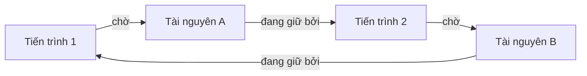

# Bế tắc (Deadlock)

## Khái niệm
**Bế tắc (deadlock)** là tình huống một tập hợp tiến trình/luồng bị kẹt vĩnh viễn vì mỗi cái đang giữ một tài nguyên và chờ tài nguyên mà cái khác trong tập đang giữ — tạo thành vòng chờ khép kín. Không ai nhường, không ai tiến triển.

Chu trình chờ tài nguyên khép kín tạo ra bế tắc:



## Khi nào dùng / Vì sao quan trọng
Bế tắc xuất hiện bất cứ khi nào nhiều thực thể tranh giành tài nguyên hữu hạn có tính loại trừ: khoá trong cơ sở dữ liệu, tài nguyên hệ điều hành, khoá lồng nhau trong code đa luồng. Nhận diện và xử lý deadlock là kỹ năng cốt lõi khi xây dựng hệ thống đồng thời tin cậy.

## Cách hoạt động

### Bốn điều kiện Coffman (Coffman conditions)
Deadlock **chỉ** xảy ra khi cả 4 điều kiện đồng thời đúng:

1. **Loại trừ lẫn nhau (mutual exclusion):** tài nguyên không chia sẻ được, một lúc chỉ một tiến trình dùng.
2. **Giữ và chờ (hold and wait):** tiến trình đang giữ ít nhất một tài nguyên và chờ xin thêm.
3. **Không tước đoạt (no preemption):** tài nguyên chỉ được nhả tự nguyện, không thể cưỡng chế lấy lại.
4. **Chờ vòng tròn (circular wait):** tồn tại chuỗi P1→P2→...→Pn→P1, mỗi tiến trình chờ tài nguyên do cái kế tiếp giữ.

Phá vỡ **bất kỳ một** điều kiện là ngăn được deadlock.

### Đồ thị cấp phát tài nguyên (resource-allocation graph)
Đỉnh gồm tiến trình và tài nguyên; cạnh gán (tài nguyên→tiến trình) và cạnh yêu cầu (tiến trình→tài nguyên). Có **chu trình (cycle)** → có khả năng deadlock; nếu mỗi loại tài nguyên chỉ một thực thể thì chu trình đồng nghĩa deadlock chắc chắn.

### Ba nhóm chiến lược

**A. Ngăn chặn (prevention)** — phá vỡ một điều kiện Coffman ngay từ thiết kế:
- Phá *hold and wait*: yêu cầu cấp toàn bộ tài nguyên một lần trước khi chạy.
- Phá *no preemption*: cho phép tước tài nguyên khi cần.
- Phá *circular wait*: đánh số thứ tự tài nguyên, luôn xin theo thứ tự tăng dần (kỹ thuật lock ordering rất phổ biến).

**B. Phòng tránh (avoidance)** — cho phép các điều kiện tồn tại nhưng quyết định cấp phát sao cho hệ luôn ở **trạng thái an toàn (safe state)**. Cần biết trước nhu cầu tối đa. Điển hình là **thuật toán Banker**.

**C. Phát hiện & khắc phục (detection & recovery)** — cứ để deadlock xảy ra, định kỳ chạy thuật toán dò chu trình; khi phát hiện thì khắc phục bằng cách hủy tiến trình (kill) hoặc tước tài nguyên (rollback về checkpoint).

### Thuật toán Banker (Banker's algorithm)
Do Dijkstra đề xuất, dùng cho tài nguyên nhiều thực thể. Các cấu trúc:
- `Available[m]`: số thực thể còn rảnh của mỗi loại.
- `Max[n][m]`: nhu cầu tối đa của mỗi tiến trình.
- `Allocation[n][m]`: đang cấp cho mỗi tiến trình.
- `Need = Max − Allocation`: còn cần bao nhiêu.

Khi có yêu cầu, hệ **thử cấp** rồi chạy **thuật toán an toàn (safety algorithm)**: tìm được một thứ tự hoàn thành tất cả tiến trình (mỗi tiến trình có thể lấy đủ Need từ Work rồi trả lại) thì trạng thái an toàn → chấp nhận; ngược lại từ chối, giữ nguyên.

## Ví dụ
```python
# Thuật toán an toàn của Banker: kiểm tra hệ có ở trạng thái an toàn không
def trang_thai_an_toan(available, maxm, alloc):
    n = len(maxm)                              # số tiến trình
    m = len(available)                         # số loại tài nguyên
    need = [[maxm[i][j] - alloc[i][j] for j in range(m)] for i in range(n)]
    work = available[:]                        # tài nguyên rảnh giả lập
    finish = [False] * n
    thu_tu = []
    while len(thu_tu) < n:
        cap_duoc = False
        for i in range(n):
            # tiến trình chưa xong và Need <= Work thì có thể hoàn thành
            if not finish[i] and all(need[i][j] <= work[j] for j in range(m)):
                for j in range(m):
                    work[j] += alloc[i][j]     # hoàn thành xong trả lại tài nguyên
                finish[i] = True
                thu_tu.append(i)
                cap_duoc = True
        if not cap_duoc:                        # không tiến trình nào chạy được
            return False, []
    return True, thu_tu                         # thứ tự an toàn

available = [3, 3, 2]
maxm  = [[7,5,3], [3,2,2], [9,0,2], [2,2,2], [4,3,3]]
alloc = [[0,1,0], [2,0,0], [3,0,2], [2,1,1], [0,0,2]]
an_toan, thu_tu = trang_thai_an_toan(available, maxm, alloc)
print("An toàn:", an_toan, "| Thứ tự:", thu_tu)  # True, ví dụ [1,3,4,0,2]
```

### Playground: phát hiện deadlock qua đồ thị chờ (wait-for graph)
Mỗi cạnh `A -> B` nghĩa là tiến trình A đang **chờ** tài nguyên do B giữ. Nếu đồ thị có **chu trình**, hệ đang deadlock. Dùng DFS tô màu (trắng/xám/đen) để dò cạnh lùi (back edge).

<div class="js-demo" data-title="Dò chu trình trong wait-for graph">
<textarea class="js-demo-src">
// Đồ thị chờ: canh[A] = [B, ...] nghĩa là A chờ tài nguyên B đang giữ.
function coDeadlock(canh) {
  const mau = {};                     // 0=trắng(chưa thăm),1=xám(đang xử lý),2=đen(xong)
  const dinh = Object.keys(canh);
  for (const v of dinh) mau[v] = 0;
  let chuTrinh = null;

  function dfs(u, duong) {
    mau[u] = 1; duong.push(u);
    for (const v of (canh[u] || [])) {
      if (mau[v] === undefined) mau[v] = 0;
      if (mau[v] === 1) {             // gặp đỉnh xám -> cạnh lùi -> chu trình
        chuTrinh = duong.slice(duong.indexOf(v)).concat(v);
        return true;
      }
      if (mau[v] === 0 && dfs(v, duong)) return true;
    }
    mau[u] = 2; duong.pop();
    return false;
  }

  for (const v of dinh) if (mau[v] === 0 && dfs(v, [])) break;
  return chuTrinh;
}

function kiemTra(ten, canh) {
  const ct = coDeadlock(canh);
  if (ct) print(`${ten}: CÓ deadlock — chu trình: ${ct.join(' -> ')}`);
  else    print(`${ten}: KHÔNG deadlock (không có chu trình)`);
}

// Trường hợp 1: P1->P2->P3->P1 (vòng khép kín)
kiemTra('Hệ 1', { P1: ['P2'], P2: ['P3'], P3: ['P1'] });

// Trường hợp 2: chuỗi thẳng, không vòng
kiemTra('Hệ 2', { P1: ['P2'], P2: ['P3'], P3: [] });

// Trường hợp 3: vòng nhỏ P2<->P4 lồng trong hệ lớn hơn
kiemTra('Hệ 3', { P1: ['P2'], P2: ['P4'], P3: ['P1'], P4: ['P2'] });
</textarea>
</div>

## Độ phức tạp (nếu có)
| Thao tác | Thời gian | Bộ nhớ |
|----------|-----------|--------|
| Thuật toán an toàn Banker | O(n²·m) | O(n·m) |
| Dò chu trình đồ thị cấp phát | O(V + E) | O(V + E) |

## Ưu / nhược điểm
- **Ưu (prevention):** đơn giản, đảm bảo tuyệt đối; lock ordering rẻ và hiệu quả.
- **Nhược (prevention):** giảm hiệu suất, tận dụng tài nguyên kém.
- **Ưu (avoidance/Banker):** cho phép linh hoạt hơn prevention.
- **Nhược (Banker):** cần biết trước Max, chi phí tính toán cao, ít thực dụng.
- **Ưu (detection):** tận dụng tài nguyên tối đa.
- **Nhược (detection):** tốn chi phí dò định kỳ và mất mát khi rollback.

### Deadlock trong thực tế và so sánh
Trong kỹ thuật phần mềm thực tế, deadlock hay gặp nhất ở:
- **Cơ sở dữ liệu:** hai giao dịch (transaction) khoá bản ghi ngược thứ tự nhau. Đa số DBMS có bộ **phát hiện deadlock** tự động, chọn một giao dịch làm "nạn nhân" và rollback.
- **Code đa luồng:** hai luồng lấy hai mutex theo thứ tự đối nghịch — giải pháp thực dụng nhất là **lock ordering** toàn cục.
- **Timeout:** đặt hạn chờ khoá; quá hạn thì từ bỏ và thử lại — đơn giản, tránh kẹt vĩnh viễn.

### Phân biệt với các trạng thái tương tự

| Hiện tượng | Mô tả | Có tiến triển? |
|-----------|-------|----------------|
| Deadlock | Chờ vòng tròn, kẹt vĩnh viễn | Không |
| Livelock | Liên tục đổi trạng thái nhường nhau | Không (nhưng vẫn chạy) |
| Starvation | Một tiến trình mãi không được cấp tài nguyên | Có (cho các tiến trình khác) |

**Cách tiếp cận Ostrich (đà điểu):** nhiều hệ điều hành thực dụng (như UNIX, Windows) chọn **bỏ qua** vấn đề deadlock đối với tài nguyên nhân, vì chi phí ngăn chặn/phát hiện cao hơn thiệt hại của deadlock hiếm khi xảy ra — người dùng khởi động lại khi kẹt.

## Câu hỏi phỏng vấn thường gặp
1. Bốn điều kiện Coffman là gì? Phá điều kiện nào dễ nhất trong thực tế?
2. Phân biệt prevention, avoidance và detection.
3. Giải thích thuật toán Banker và khái niệm safe state.
4. Lock ordering ngăn deadlock bằng cách nào?
5. Deadlock khác livelock và starvation ra sao?
6. Làm sao phát hiện deadlock bằng resource-allocation graph?
7. Sau khi phát hiện deadlock, có những cách khắc phục nào?
8. Cơ sở dữ liệu xử lý deadlock giữa các giao dịch thế nào?
9. Cách tiếp cận Ostrich là gì và vì sao nhiều OS dùng nó?
10. Dùng timeout để tránh deadlock có ưu nhược gì?

## Tham khảo
- Operating System Concepts (Silberschatz) — chương Deadlocks
- Dijkstra, "The Banker's Algorithm"
- Coffman, Elphick, Shoshani (1971) — "System Deadlocks"
- Operating Systems: Three Easy Pieces (OSTEP) — chương Deadlock
