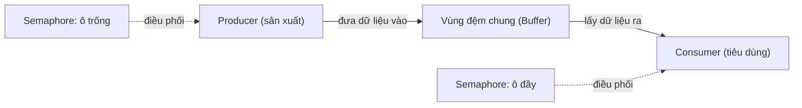
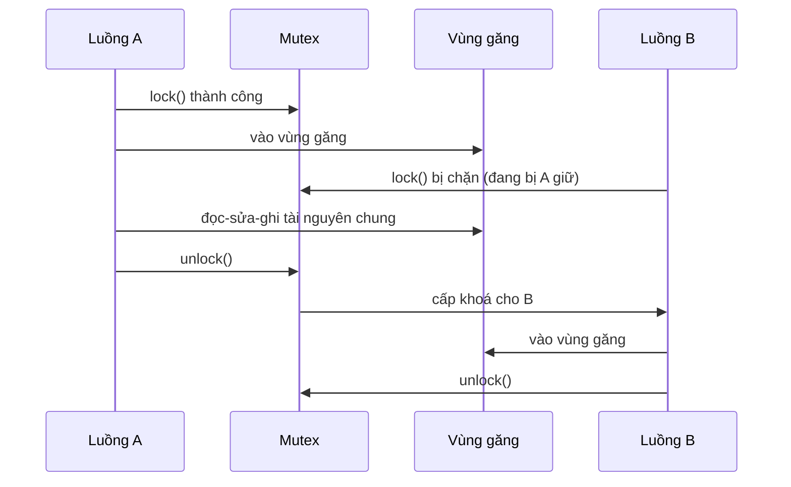
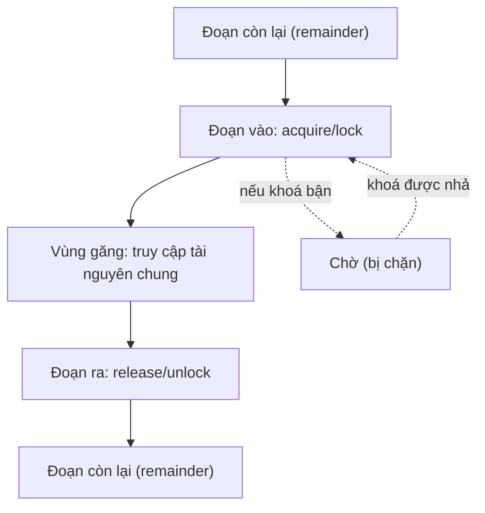

# Đồng bộ hoá luồng (Synchronization)

## Khái niệm
**Đồng bộ hoá (synchronization)** là tập hợp cơ chế điều phối nhiều luồng/tiến trình khi chúng truy cập tài nguyên chung, nhằm tránh **tranh chấp dữ liệu (race condition)** — tình huống kết quả phụ thuộc thứ tự thực thi không xác định. **Vùng găng (critical section)** là đoạn mã truy cập tài nguyên chia sẻ và tại một thời điểm chỉ được phép một luồng đi vào (**loại trừ lẫn nhau — mutual exclusion**).

## Khi nào dùng / Vì sao quan trọng
Khi hai luồng cùng đọc–sửa–ghi một biến, thao tác tưởng "một dòng" như `x += 1` thực chất gồm nhiều bước máy (đọc, cộng, ghi) và có thể bị chen ngang, làm mất cập nhật. Đồng bộ hoá đảm bảo tính đúng đắn của chương trình đồng thời — điều bắt buộc trong hệ đa luồng, cơ sở dữ liệu, hệ điều hành.

Ba yêu cầu của một lời giải vùng găng đúng:
1. **Mutual exclusion:** tối đa một luồng trong vùng găng.
2. **Progress:** nếu không luồng nào trong vùng găng, luồng muốn vào không bị trì hoãn vô cớ.
3. **Bounded waiting:** thời gian chờ có giới hạn, không bị bỏ đói (starvation).

Mô hình Producer–Consumer (nhà sản xuất – người tiêu dùng) qua vùng đệm chung:



## Cách hoạt động

### Mutex (khoá loại trừ lẫn nhau)
Khoá nhị phân có chủ sở hữu: luồng nào **lock** thì phải chính luồng đó **unlock**. Dùng bảo vệ vùng găng ngắn.

Hai luồng cùng muốn vào vùng găng, nhưng mutex chỉ cho một luồng vào tại một thời điểm; luồng kia bị chặn tới khi khoá được nhả:



Cấu trúc chuẩn của một vùng găng gồm bốn phần: đoạn vào (entry), vùng găng, đoạn ra (exit) và đoạn còn lại (remainder):



### Semaphore
Biến đếm với hai thao tác nguyên tử **wait (P)** giảm 1 và **signal (V)** tăng 1; nếu giá trị < 0 luồng bị chặn.
- **Binary semaphore** (0/1): giống mutex nhưng không có khái niệm chủ sở hữu.
- **Counting semaphore:** cho phép tối đa N luồng vào cùng lúc (ví dụ giới hạn số kết nối).

### Monitor
Cấu trúc cấp cao gói dữ liệu chung + các phương thức đồng bộ tự động (chỉ một luồng thực thi phương thức monitor tại một thời điểm), kết hợp **biến điều kiện (condition variable)** với `wait()` và `signal()/notify()`. Java `synchronized` và `Lock/Condition`, Python `threading.Condition` là hiện thực của ý tưởng monitor.

### So sánh nhanh

| Cơ chế | Cấp | Đặc điểm |
|--------|-----|----------|
| Mutex | Thấp | 1 luồng, có chủ sở hữu |
| Semaphore | Thấp | Đếm N, không chủ sở hữu |
| Monitor | Cao | Gói dữ liệu + điều kiện, an toàn hơn |

### Lỗi thường gặp
- **Deadlock:** hai luồng giữ khoá và chờ khoá của nhau.
- **Livelock:** luồng liên tục đổi trạng thái mà không tiến triển.
- **Starvation:** một luồng mãi không được cấp tài nguyên.
- **Busy waiting (spinlock):** vòng lặp kiểm tra khoá, tốn CPU nhưng độ trễ thấp.

## Ví dụ

### Race condition và cách sửa bằng mutex
```python
import threading

dem = 0
khoa = threading.Lock()

def tang():
    global dem
    for _ in range(100000):
        with khoa:          # vào vùng găng — loại trừ lẫn nhau
            dem += 1        # đọc-cộng-ghi được bảo vệ nguyên tử

luongs = [threading.Thread(target=tang) for _ in range(4)]
for l in luongs: l.start()
for l in luongs: l.join()
print(dem)   # đúng = 400000; nếu bỏ khoá sẽ ra số nhỏ hơn thất thường
```

### Producer–Consumer bằng semaphore và mutex
```python
import threading, time, collections

buffer = collections.deque()
MAX = 5
o_trong = threading.Semaphore(MAX)   # số ô còn trống
co_hang = threading.Semaphore(0)     # số sản phẩm sẵn có
khoa = threading.Lock()              # bảo vệ buffer

def nha_san_xuat():
    for i in range(10):
        o_trong.acquire()            # chờ nếu buffer đầy
        with khoa:
            buffer.append(i)
            print("Sản xuất", i)
        co_hang.release()            # báo có thêm hàng
        time.sleep(0.1)

def nguoi_tieu_thu():
    for _ in range(10):
        co_hang.acquire()            # chờ nếu không có hàng
        with khoa:
            sp = buffer.popleft()
            print("  Tiêu thụ", sp)
        o_trong.release()            # giải phóng một ô
        time.sleep(0.2)

t1 = threading.Thread(target=nha_san_xuat)
t2 = threading.Thread(target=nguoi_tieu_thu)
t1.start(); t2.start(); t1.join(); t2.join()
```

### Các kỹ thuật đồng bộ hoá khác
- **Read-Write Lock (khoá đọc-ghi):** cho phép nhiều luồng đọc đồng thời nhưng ghi thì độc quyền — tăng thông lượng khi đọc nhiều hơn ghi.
- **Barrier (rào chắn):** buộc một nhóm luồng cùng chờ tại một điểm cho tới khi tất cả tới nơi mới đi tiếp — hữu ích trong tính toán song song theo pha.
- **Biến nguyên tử (atomic variable):** thao tác đọc-sửa-ghi được phần cứng đảm bảo nguyên tử (ví dụ `compare-and-swap` — CAS), nền tảng của lập trình **lock-free**.
- **Deadlock từ khoá lồng nhau:** khi hai luồng khoá A rồi B và B rồi A ngược nhau — khắc phục bằng **thứ tự khoá nhất quán (lock ordering)**.

### Vấn đề triết gia ăn tối (Dining Philosophers)
Bài toán kinh điển: 5 triết gia ngồi quanh bàn, mỗi người cần 2 chiếc đũa (chia sẻ với người bên cạnh) để ăn. Nếu ai cũng cầm đũa trái rồi chờ đũa phải → deadlock. Lời giải: đánh số đũa và luôn lấy đũa số nhỏ trước, hoặc giới hạn số triết gia ngồi cùng lúc bằng semaphore.

### Playground: race condition vs có khoá
Mô phỏng nhiều "luồng" cùng tăng một biến đếm. Vì `dem += 1` gồm 3 bước (đọc → cộng → ghi), khi các luồng đan xen mà **không có khoá**, một số cập nhật bị mất → kết quả nhỏ hơn kỳ vọng. Có khoá thì mỗi thao tác đọc-sửa-ghi là nguyên tử → luôn đúng.

<div class="js-demo" data-title="Race condition vs Mutex (đếm chung)">
<textarea class="js-demo-src">
// Mô phỏng đan xen luồng: mỗi thao tác tăng chia thành 3 bước đọc/cộng/ghi.
// Bộ lập lịch giả ngẫu nhiên chọn luồng chạy bước tiếp theo.
const SO_LUONG = 4, TANG_MOI_LUONG = 50;
const KY_VONG = SO_LUONG * TANG_MOI_LUONG;

function chay(coKhoa) {
  let dem = 0;
  let khoaDangGiu = -1;          // luồng đang giữ khoá, -1 = trống
  // mỗi luồng có "chương trình đếm": còn bao nhiêu lần tăng, và bước hiện tại
  let luong = [];
  for (let i = 0; i < SO_LUONG; i++)
    luong.push({ conLai: TANG_MOI_LUONG, buoc: 0, tmp: 0 });

  // rng đơn giản, có hạt giống -> kết quả tái lập được
  let seed = 12345;
  const rnd = (n) => { seed = (seed * 1103515245 + 12345) & 0x7fffffff; return seed % n; };

  let conHoatDong = SO_LUONG;
  while (conHoatDong > 0) {
    const i = rnd(SO_LUONG);
    const L = luong[i];
    if (L.conLai === 0) continue;         // luồng này đã xong

    if (coKhoa) {
      // vào vùng găng: nếu khoá đang bị luồng khác giữ thì bỏ lượt (chờ)
      if (khoaDangGiu !== -1 && khoaDangGiu !== i) continue;
      khoaDangGiu = i;
    }

    if (L.buoc === 0) { L.tmp = dem; L.buoc = 1; }        // đọc
    else if (L.buoc === 1) { L.tmp = L.tmp + 1; L.buoc = 2; } // cộng
    else {                                                 // ghi
      dem = L.tmp; L.buoc = 0; L.conLai--;
      if (coKhoa) khoaDangGiu = -1;                        // nhả khoá sau 1 lần tăng
      if (L.conLai === 0) conHoatDong--;
    }
  }
  return dem;
}

const khongKhoa = chay(false);
const coKhoa = chay(true);
print('Kỳ vọng đúng:', KY_VONG);
print('KHÔNG khoá  :', khongKhoa, khongKhoa === KY_VONG ? '' : '(mất cập nhật!)');
print('CÓ khoá     :', coKhoa,   coKhoa === KY_VONG ? '(đúng)' : '');
</textarea>
</div>

## Độ phức tạp (nếu có)
| Thao tác | Chi phí |
|----------|---------|
| Lock/unlock không tranh chấp | Rất thấp (thường 1 lệnh nguyên tử) |
| Lock có tranh chấp | Cao (chặn luồng, chuyển ngữ cảnh) |
| Spinlock | Tốn CPU khi chờ lâu, tốt khi chờ cực ngắn |
| CAS (lock-free) | Nhanh nhưng có thể lặp lại khi tranh chấp cao |

## Ưu / nhược điểm
- **Ưu:** đảm bảo tính đúng đắn của chương trình đồng thời; monitor giảm rủi ro so với thao tác khoá thủ công.
- **Nhược:** làm giảm mức song song, thêm chi phí; dùng sai gây deadlock, starvation; khó gỡ lỗi vì lỗi mang tính không xác định (non-deterministic).

## Câu hỏi phỏng vấn thường gặp
1. Race condition là gì? Cho ví dụ và cách khắc phục.
2. Phân biệt mutex và semaphore. Khi nào dùng cái nào?
3. Monitor và condition variable hoạt động ra sao?
4. Ba yêu cầu của lời giải vùng găng?
5. Giải bài toán producer–consumer / bounded buffer.
6. Spinlock khác mutex thông thường thế nào, khi nào nên dùng?
7. Starvation và livelock khác nhau ra sao?
8. Read-write lock tối ưu cho tình huống nào?
9. CAS (compare-and-swap) là gì và lập trình lock-free dựa vào nó ra sao?
10. Giải bài toán triết gia ăn tối tránh deadlock.

## Tham khảo
- Operating System Concepts (Silberschatz) — chương Synchronization
- The Little Book of Semaphores (Allen B. Downey)
