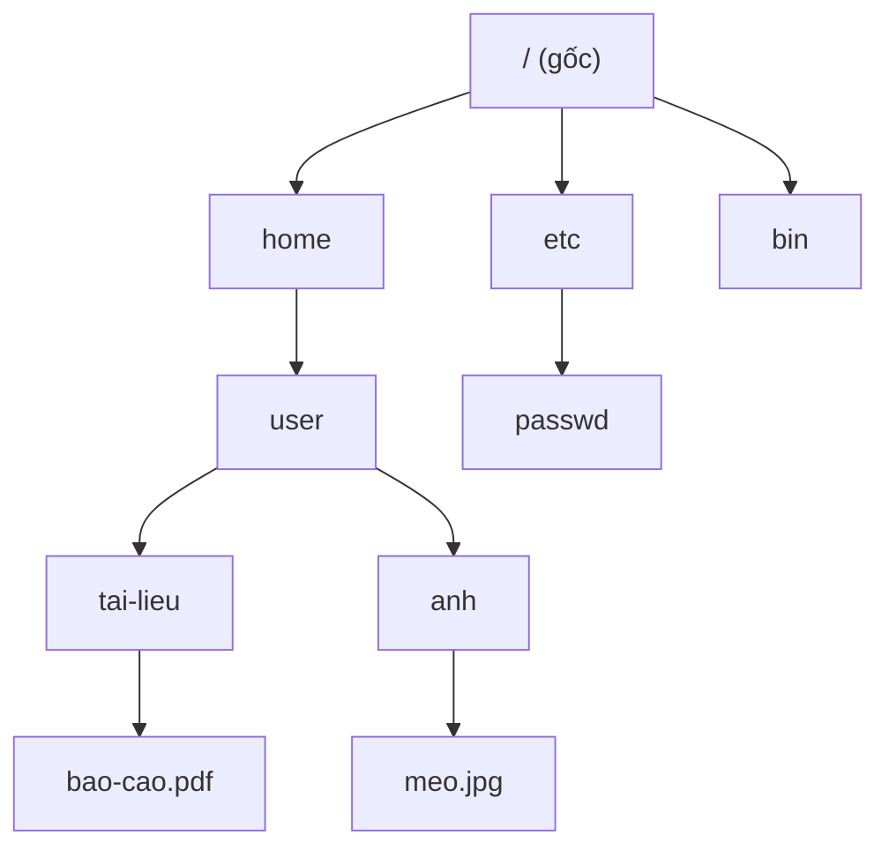

# Hệ thống tệp (File Systems)

## Khái niệm
**Hệ thống tệp (file system)** là cách hệ điều hành tổ chức, lưu trữ, đặt tên và truy xuất dữ liệu trên thiết bị lưu trữ. Nó ánh xạ khái niệm trừu tượng "tệp và thư mục" xuống các khối (block) vật lý trên đĩa, đồng thời quản lý siêu dữ liệu (metadata): quyền truy cập, thời gian, kích thước, vị trí khối.

Cây thư mục tổ chức tệp theo thứ bậc từ thư mục gốc:



## Khi nào dùng / Vì sao quan trọng
Mọi dữ liệu bền vững đều đi qua hệ thống tệp. Thiết kế của nó quyết định độ tin cậy (không mất dữ liệu khi mất điện), hiệu năng (tuần tự vs ngẫu nhiên), khả năng chia sẻ qua mạng và khả năng mở rộng lên hàng petabyte trong hệ phân tán.

## Cách hoạt động

### Cấu trúc cơ bản: inode và khối
Trên các hệ Unix, mỗi tệp gắn với một **inode** — cấu trúc lưu metadata và con trỏ tới các khối dữ liệu (trực tiếp, gián tiếp một/hai/ba cấp). Thư mục là bảng ánh xạ tên → số inode. Không gian trống được theo dõi bằng bitmap hoặc danh sách.

### Journaling (nhật ký) — ext3/ext4
Nếu mất điện giữa lúc ghi, hệ tệp có thể rơi vào trạng thái không nhất quán. **Journaling** ghi trước ý định thay đổi vào một **nhật ký (journal)** trước khi áp lên vùng chính; khi khởi động lại chỉ cần phát lại (replay) nhật ký thay vì quét toàn đĩa (fsck) tốn thời gian.

Ba chế độ của ext3/ext4:
- **journal:** ghi cả metadata lẫn dữ liệu vào journal — an toàn nhất, chậm nhất.
- **ordered (mặc định):** chỉ journal metadata, nhưng ghi dữ liệu xuống đĩa trước khi commit metadata — cân bằng tốt.
- **writeback:** chỉ journal metadata, không đảm bảo thứ tự dữ liệu — nhanh nhất, rủi ro cao nhất.

**ext4** cải tiến ext3: **extent** (mô tả dải khối liên tục thay vì từng khối, giảm metadata cho tệp lớn), cấp phát trì hoãn (delayed allocation), hỗ trợ dung lượng và số tệp lớn hơn.

### Hệ thống tệp mạng
- **NFS (Network File System):** giao thức của Unix/Linux, chia sẻ thư mục qua mạng, ban đầu **stateless** (máy chủ không giữ trạng thái client) giúp phục hồi đơn giản; dùng RPC. Phổ biến trong môi trường Unix, HPC.
- **SMB/CIFS (Server Message Block):** giao thức chia sẻ tệp của Windows (còn gọi Samba khi cài trên Linux), **stateful**, hỗ trợ khoá tệp, phân quyền phong phú, in ấn qua mạng. Phổ biến trong môi trường doanh nghiệp Windows.

### Mã hoá (encryption)
- **Mã hoá toàn đĩa (full-disk encryption):** LUKS/dm-crypt (Linux), BitLocker (Windows), FileVault (macOS) — mã hoá toàn bộ thiết bị, trong suốt với ứng dụng.
- **Mã hoá mức hệ tệp:** eCryptfs, EncFS, hoặc `fscrypt` của ext4/F2FS — mã hoá theo từng thư mục/tệp, mỗi người dùng khoá riêng.
Đánh đổi: bảo mật khi mất thiết bị vs chi phí CPU cho mã hoá/giải mã.

### Hệ tệp phân tán (distributed file systems)
Lưu dữ liệu trải trên nhiều máy chủ, chịu lỗi và mở rộng theo chiều ngang:

- **HDFS (Hadoop Distributed File System):** thiết kế cho tệp rất lớn, ghi-một-lần-đọc-nhiều (write-once-read-many). Một **NameNode** giữ metadata, nhiều **DataNode** lưu các khối (mặc định 128 MB) và **nhân bản (replication)** thường 3 bản để chịu lỗi. Tối ưu cho xử lý dữ liệu lớn theo lô (batch), không hợp với ghi ngẫu nhiên.
- **Ceph:** lưu trữ phân tán hợp nhất (object, block, file). Dùng thuật toán **CRUSH** để phân bố dữ liệu không cần bảng tra tập trung → tránh nút cổ chai và điểm hỏng đơn (single point of failure). CephFS cung cấp giao diện POSIX; nền tảng RADOS đảm bảo tự cân bằng và tự phục hồi.

### So sánh nhanh

| Hệ | Loại | Điểm mạnh |
|----|------|-----------|
| ext4 | Cục bộ, journaling | Ổn định, phổ biến trên Linux |
| NFS | Mạng (Unix) | Đơn giản, chuẩn Unix |
| SMB | Mạng (Windows) | Khoá tệp, phân quyền, tương thích Windows |
| HDFS | Phân tán | Tệp rất lớn, xử lý batch |
| Ceph | Phân tán | Không SPOF, đa giao diện, tự phục hồi |

## Ví dụ
```python
import os, stat

# Đọc metadata (siêu dữ liệu) của tệp — tương tự thông tin trong inode
duong_dan = "vidu.txt"
with open(duong_dan, "w") as f:
    f.write("Xin chào hệ thống tệp")

st = os.stat(duong_dan)
print("Kích thước (byte):", st.st_size)
print("Số inode:", st.st_ino)
print("Số liên kết cứng:", st.st_nlink)
print("Quyền:", stat.filemode(st.st_mode))   # ví dụ -rw-r--r--
print("Sửa lần cuối:", st.st_mtime)

# Tạo liên kết cứng (hard link): tên mới trỏ cùng inode
os.link(duong_dan, "vidu_lien_ket.txt")
print("Sau hard link, nlink =", os.stat(duong_dan).st_nlink)  # tăng lên 2
os.remove("vidu_lien_ket.txt"); os.remove(duong_dan)
```

### RAID và độ tin cậy lưu trữ
**RAID (Redundant Array of Independent Disks)** kết hợp nhiều ổ đĩa để tăng hiệu năng và/hoặc chịu lỗi — nền tảng bên dưới nhiều hệ tệp:
- **RAID 0 (striping):** trải dữ liệu, nhanh nhưng không chịu lỗi.
- **RAID 1 (mirroring):** nhân đôi, chịu lỗi tốt, tốn 50% dung lượng.
- **RAID 5/6:** dùng chẵn lẻ (parity) phân tán, chịu 1–2 ổ hỏng, cân bằng dung lượng và an toàn.

### Hệ tệp hiện đại: copy-on-write
Các hệ như **ZFS** và **Btrfs** dùng **copy-on-write (COW):** không ghi đè dữ liệu cũ mà ghi ra vị trí mới rồi cập nhật con trỏ, cho phép **snapshot** tức thời, checksum toàn vẹn dữ liệu, và tự phục hồi lỗi. Đây là hướng thay thế journaling truyền thống.

## Độ phức tạp (nếu có)
| Thao tác | Ghi chú |
|----------|---------|
| Tra tên tệp trong thư mục | O(1)–O(log n) tuỳ cấu trúc (hash/B-tree) |
| Phục hồi journaling | O(kích thước journal), nhanh hơn fsck O(cả đĩa) |
| Đọc/ghi khối HDFS | Tối ưu tuần tự, kém với ngẫu nhiên |

### Liên kết cứng và liên kết mềm
- **Hard link:** nhiều tên cùng trỏ một inode; tệp chỉ thực sự bị xoá khi số liên kết (nlink) về 0. Không vượt qua ranh giới hệ tệp.
- **Symbolic link (symlink/soft link):** một tệp đặc biệt chứa đường dẫn tới tệp khác; nếu tệp đích bị xoá thì symlink "gãy" (dangling). Vượt được ranh giới hệ tệp và trỏ tới thư mục.

## Ưu / nhược điểm
- **Ưu (journaling):** phục hồi nhanh sau sự cố, giữ nhất quán metadata.
- **Nhược (journaling):** thêm chi phí ghi kép (chế độ journal).
- **Ưu (phân tán):** mở rộng ngang, chịu lỗi qua nhân bản, dung lượng khổng lồ.
- **Nhược (phân tán):** phức tạp vận hành, độ trễ mạng, nhất quán cuối (eventual consistency) trong một số hệ.

## Câu hỏi phỏng vấn thường gặp
1. Inode lưu gì? Thư mục lưu trữ như thế nào?
2. Journaling ngăn mất nhất quán ra sao? Ba chế độ của ext4?
3. ext4 cải tiến gì so với ext3 (extent, delayed allocation)?
4. NFS và SMB khác nhau thế nào? Stateless vs stateful?
5. HDFS lưu dữ liệu và chịu lỗi bằng cách nào (NameNode, replication)?
6. Ceph tránh single point of failure ra sao (CRUSH)?
7. Hard link khác symbolic link chỗ nào?
8. Đánh đổi giữa mã hoá toàn đĩa và mã hoá mức hệ tệp?
9. So sánh các mức RAID 0/1/5/6.
10. Copy-on-write file system (ZFS/Btrfs) khác journaling ra sao?

### Định vị tệp trên đĩa (allocation methods)
Cách hệ tệp lưu các khối của một tệp:
- **Cấp phát liền kề (contiguous):** các khối liền nhau — đọc tuần tự nhanh nhưng khó mở rộng, gây phân mảnh.
- **Cấp phát liên kết (linked):** mỗi khối trỏ tới khối kế — linh hoạt nhưng truy cập ngẫu nhiên chậm (FAT là biến thể).
- **Cấp phát chỉ mục (indexed):** một khối chỉ mục chứa con trỏ tới mọi khối dữ liệu — hỗ trợ truy cập ngẫu nhiên tốt; inode của Unix theo hướng này.

### Bộ đệm và độ bền
Hệ tệp dùng **page cache** trong RAM để tăng tốc đọc/ghi; lệnh `fsync()` buộc ghi dữ liệu xuống đĩa thật, đảm bảo độ bền (durability) trước khi báo thành công — quan trọng với cơ sở dữ liệu và giao dịch.

## Tham khảo
- Operating System Concepts (Silberschatz) — File-System Interface & Implementation
- The Hadoop Distributed File System (Shvachko et al.)
- Ceph: A Scalable, High-Performance Distributed File System (Weil et al.)
