# Thuật toán lập lịch CPU (CPU Scheduling)

## Khái niệm
**Lập lịch CPU (CPU scheduling)** là việc bộ lập lịch (scheduler) của hệ điều hành chọn tiến trình/luồng nào trong hàng đợi sẵn sàng (ready queue) được cấp CPU tiếp theo và trong bao lâu. Mục tiêu là tối ưu các chỉ số như thông lượng, thời gian phản hồi và độ công bằng.

## Khi nào dùng / Vì sao quan trọng
CPU là tài nguyên khan hiếm; nhiều tác vụ tranh nhau. Chọn thuật toán lập lịch phù hợp quyết định trải nghiệm hệ thống: máy chủ web cần thông lượng cao, máy để bàn cần phản hồi tương tác nhanh, hệ thời gian thực (real-time) cần đáp ứng đúng hạn (deadline).

### Các chỉ số đánh giá
- **Thời gian chờ (waiting time):** tổng thời gian nằm trong ready queue.
- **Thời gian hoàn thành / quay vòng (turnaround time):** từ lúc đến đến lúc xong.
- **Thời gian phản hồi (response time):** từ lúc đến đến lần đầu được chạy.

Ví dụ biểu đồ Gantt cho lập lịch Round Robin (3 tiến trình, mỗi lượt 2 đơn vị):

```mermaid
gantt
    title Lập lịch Round Robin (lượng tử = 2)
    dateFormat X
    axisFormat %s
    section CPU
    P1 :0, 2
    P2 :2, 4
    P3 :4, 6
    P1 :6, 8
    P2 :8, 9
    P3 :9, 11
```


- **Thông lượng (throughput):** số tiến trình hoàn thành mỗi đơn vị thời gian.
- **Hiệu suất CPU (utilization)** và **độ công bằng (fairness)**.

**Preemptive (có tước quyền):** hệ có thể lấy lại CPU giữa chừng. **Non-preemptive:** tiến trình giữ CPU cho tới khi tự nhường hoặc kết thúc.

## Cách hoạt động

### FCFS — First-Come, First-Served
Non-preemptive, hàng đợi FIFO. Đơn giản nhưng gặp **hiệu ứng đoàn tàu (convoy effect):** một tiến trình dài chặn nhiều tiến trình ngắn phía sau, làm thời gian chờ trung bình tăng vọt.

### SJF — Shortest Job First
Chọn tiến trình có thời gian bùng nổ CPU (CPU burst) ngắn nhất. **Tối ưu** về thời gian chờ trung bình. Bản preemptive gọi là **SRTF (Shortest Remaining Time First)**. Nhược: cần biết trước độ dài burst (phải ước lượng), dễ gây **bỏ đói (starvation)** tiến trình dài.

### Round Robin (RR)
Preemptive, mỗi tiến trình được một **lượng tử thời gian (time quantum)** rồi bị đẩy về cuối hàng đợi. Công bằng, phản hồi tốt cho hệ tương tác. Chọn quantum:
- Quá nhỏ → quá nhiều context switch, tốn overhead.
- Quá lớn → thoái hoá thành FCFS.

### Ưu tiên (Priority scheduling)
Mỗi tiến trình có mức ưu tiên; chọn cái ưu tiên cao nhất. Có bản preemptive và non-preemptive. Nguy cơ starvation tiến trình ưu tiên thấp → khắc phục bằng **lão hoá (aging):** tăng dần ưu tiên theo thời gian chờ.

### Fair-share & MLFQ
- **Fair-share:** phân bổ CPU theo nhóm người dùng/tiến trình, đảm bảo mỗi nhóm nhận phần công bằng (ví dụ CFS — Completely Fair Scheduler của Linux dùng vruntime).
- **MLFQ (Multi-Level Feedback Queue):** nhiều hàng đợi với mức ưu tiên khác nhau; tiến trình dùng nhiều CPU bị hạ xuống hàng thấp, tiến trình I/O-bound giữ ở hàng cao → tự động ưu ái tác vụ tương tác.

### EDF — Earliest Deadline First
Thuật toán thời gian thực: luôn chạy tác vụ có **hạn chót (deadline) gần nhất**. Tối ưu cho hệ real-time đơn xử lý; nếu tổng tải ≤ 100% thì mọi deadline được đảm bảo. Dùng trong hệ nhúng, điều khiển.

### So sánh

So sánh trực quan ba thuật toán trên cùng bộ tiến trình P1=8, P2=4, P3=2 (đều đến t=0). FCFS chạy theo thứ tự đến; SJF chạy ngắn trước; RR (quantum=2) luân phiên:

```mermaid
gantt
    title FCFS - thu tu den
    dateFormat X
    axisFormat %s
    section CPU
    P1 :0, 8
    P2 :8, 12
    P3 :12, 14
```

```mermaid
gantt
    title SJF - ngan nhat truoc
    dateFormat X
    axisFormat %s
    section CPU
    P3 :0, 2
    P2 :2, 6
    P1 :6, 14
```

```mermaid
gantt
    title Round Robin - quantum 2
    dateFormat X
    axisFormat %s
    section CPU
    P1 :0, 2
    P2 :2, 4
    P3 :4, 6
    P1 :6, 8
    P2 :8, 10
    P1 :10, 12
    P1 :12, 14
```







| Thuật toán | Preemptive | Ưu điểm | Nhược điểm |
|------------|-----------|---------|------------|
| FCFS | Không | Đơn giản, công bằng theo thứ tự đến | Convoy effect |
| SJF/SRTF | Có/Không | Tối ưu thời gian chờ TB | Cần ước lượng burst, starvation |
| Round Robin | Có | Phản hồi tốt, công bằng | Overhead nếu quantum nhỏ |
| Priority | Có/Không | Linh hoạt theo tầm quan trọng | Starvation (cần aging) |
| MLFQ | Có | Tự thích nghi tác vụ | Cấu hình phức tạp |
| EDF | Có | Đảm bảo deadline real-time | Sụp đổ khi quá tải |

!!! question "Tại sao Round Robin công bằng nhưng tốn nhiều context switch?"
    **Công bằng đến từ chính cơ chế lượng tử + xoay vòng.** RR cắt CPU thành các lát thời gian đều nhau (quantum) và phát cho từng tiến trình theo vòng tròn. Không ai được giữ CPU quá một quantum trước khi bị đẩy về cuối hàng đợi, nên **mọi tiến trình đều tiến triển** và không tiến trình dài nào độc chiếm CPU chặn những cái phía sau (khác hẳn FCFS bị convoy effect). Trực giác: như thầy giáo cho mỗi học sinh giơ tay đúng 2 phút phát biểu rồi chuyển người kế — ai cũng có lượt, phản hồi đầu tiên đến nhanh.

    **Nhưng cái giá của "cắt nhỏ và xoay vòng" chính là context switch.** Mỗi khi hết quantum mà tiến trình chưa xong, hệ phải **chuyển ngữ cảnh** sang tiến trình kế: lưu/nạp thanh ghi, có thể xả TLB và làm nguội cache — toàn chi phí thuần không sinh việc hữu ích. Số lần chuyển tỉ lệ nghịch với độ lớn quantum:

    - **Quantum quá nhỏ** → tiến trình bị cắt liên tục → **rất nhiều** context switch → phần lớn thời gian CPU dành để "dọn bàn" thay vì tính. Ví dụ burst 100ms với quantum 1ms phải chuyển ~100 lần; nếu mỗi lần tốn 0.1ms thì mất 10% CPU cho overhead thuần.
    - **Quantum quá lớn** → ít chuyển hơn nhưng RR **thoái hoá thành FCFS**, mất luôn ưu điểm phản hồi nhanh.

    Đánh đổi cốt lõi: RR đổi **thông lượng/hiệu suất** (do overhead chuyển ngữ cảnh) lấy **công bằng và độ phản hồi thấp** — chọn quantum là nghệ thuật cân bằng hai thứ đó (thường 10–100ms).

!!! question "Tại sao SJF tối ưu thời gian chờ trung bình nhưng có thể gây đói (starvation)?"
    **Tối ưu — chứng minh bằng trực giác "việc ngắn trước".** Thời gian chờ trung bình = tổng thời gian chờ của mọi tiến trình chia đều. Khi xếp một tiến trình lên trước, **burst của nó bị cộng vào thời gian chờ của TẤT CẢ tiến trình đứng sau**. Vậy muốn tổng chờ nhỏ nhất, hãy để tiến trình có burst **ngắn nhất** lên trước — vì nó "đè" chi phí chờ ít nhất lên số đông phía sau. Đây đúng là bài toán sắp xếp cổ điển: xử lý theo thứ tự tăng dần độ dài luôn cho tổng thời gian chờ nhỏ nhất, và SJF làm chính xác điều đó → **tối ưu về mặt toán học** (với tập tiến trình đến cùng lúc).

    Ví dụ P1=8, P2=4, P3=2: chạy SJF (2→4→8) cho chờ TB `(0+2+6)/3 = 2.67`; chạy theo thứ tự đến (8→4→2) cho `(0+8+12)/3 = 6.67`. Đưa việc ngắn lên trước cứu được rất nhiều thời gian chờ tích luỹ.

    **Nhưng cùng logic "ngắn trước" lại là nguồn gốc của đói.** Vì SJF **luôn** ưu tiên burst ngắn, một tiến trình **dài** có thể bị các tiến trình ngắn mới đến liên tục **chen lên trước mãi mãi**. Trong hệ bận rộn với dòng công việc ngắn không ngừng, tiến trình dài **không bao giờ tới lượt** → **starvation (bỏ đói)**. Trực giác: ở phòng cấp cứu ưu tiên ca nhanh, một bệnh nhân cần điều trị lâu cứ bị đẩy lùi mỗi khi có ca nhẹ mới vào. Đánh đổi: SJF đổi **công bằng** lấy **thời gian chờ trung bình tối ưu**; cách chữa thực dụng là **lão hoá (aging)** — tăng dần ưu tiên của tiến trình theo thời gian nó đã chờ, để rốt cuộc nó cũng được chạy.

## Ví dụ
```python
# Tính thời gian chờ và hoàn thành trung bình cho FCFS và SJF (non-preemptive)
def fcfs(tien_trinh):
    # tien_trinh: [(ten, burst)], giả sử đến cùng lúc t=0
    t = 0; cho = {}; hoan_thanh = {}
    for ten, burst in tien_trinh:
        cho[ten] = t                 # bắt đầu chờ = thời điểm hiện tại
        t += burst
        hoan_thanh[ten] = t
    return cho, hoan_thanh

def sjf(tien_trinh):
    # sắp xếp theo burst ngắn nhất trước
    return fcfs(sorted(tien_trinh, key=lambda x: x[1]))

tt = [("P1", 8), ("P2", 4), ("P3", 2)]
cho_f, ht_f = fcfs(tt)
cho_s, ht_s = sjf(tt)
print("FCFS chờ TB:", sum(cho_f.values())/3)   # (0+8+12)/3 = 6.67
print("SJF  chờ TB:", sum(cho_s.values())/3)   # (0+2+6)/3  = 2.67 (tốt hơn)
```

### Ví dụ tính toán Round Robin
Với quantum = 4 và các burst P1=8, P2=4, P3=2 (đến t=0), thứ tự thực thi:
```
P1(0-4) P2(4-8) P3(8-10) P1(10-14)
```
- P1 hoàn thành t=14, P2 t=8, P3 t=10. Round Robin cho thời gian phản hồi đầu tiên nhỏ cho mọi tiến trình (không ai chờ quá một vòng), đổi lại turnaround của tiến trình dài (P1) tăng.

### Bộ lập lịch nhiều cấp
Hệ điều hành thực tế phân loại tác vụ và dùng nhiều bộ lập lịch:
- **Long-term scheduler (job scheduler):** quyết định tiến trình nào được nạp vào bộ nhớ, kiểm soát mức đa chương (degree of multiprogramming).
- **Short-term scheduler (CPU scheduler):** chọn tiến trình chạy tiếp, gọi rất thường xuyên nên phải nhanh.
- **Medium-term scheduler:** hoán đổi (swap) tiến trình ra/vào đĩa để giải phóng RAM.

### Playground: so sánh thời gian chờ FCFS vs RR
Tính thời gian chờ và hoàn thành cho từng tiến trình, in bảng và thời gian chờ trung bình của hai thuật toán trên cùng bộ dữ liệu.

<div class="js-demo" data-title="FCFS vs Round Robin: bảng thời gian chờ">
<textarea class="js-demo-src">
// Giả sử tất cả tiến trình đến t=0. waiting = turnaround - burst.
const tt = [
  { ten: 'P1', burst: 8 },
  { ten: 'P2', burst: 4 },
  { ten: 'P3', burst: 2 },
  { ten: 'P4', burst: 6 },
];

function fcfs(proc) {
  let t = 0; const ht = {};
  for (const p of proc) { t += p.burst; ht[p.ten] = t; }  // thời điểm hoàn thành
  return ht;
}

function roundRobin(proc, quantum) {
  const conLai = {}, ht = {};
  proc.forEach(p => conLai[p.ten] = p.burst);
  let hangDoi = proc.map(p => p.ten), t = 0;
  while (hangDoi.length) {
    const ten = hangDoi.shift();
    const chay = Math.min(quantum, conLai[ten]);
    t += chay; conLai[ten] -= chay;
    if (conLai[ten] > 0) hangDoi.push(ten);
    else ht[ten] = t;                                      // vừa hoàn thành
  }
  return ht;
}

function inBang(nhan, proc, ht) {
  let tongCho = 0;
  print(`\n=== ${nhan} ===`);
  print('Tiến trình | Burst | Hoàn thành | Chờ');
  for (const p of proc) {
    const cho = ht[p.ten] - p.burst;                       // turnaround - burst
    tongCho += cho;
    print(`${p.ten.padEnd(10)} | ${String(p.burst).padEnd(5)} | ${String(ht[p.ten]).padEnd(10)} | ${cho}`);
  }
  print('Thời gian chờ trung bình:', (tongCho / proc.length).toFixed(2));
}

inBang('FCFS', tt, fcfs(tt));
inBang('Round Robin (quantum=3)', tt, roundRobin(tt, 3));
</textarea>
</div>

## Độ phức tạp (nếu có)
| Thuật toán | Chọn tiến trình kế |
|------------|--------------------|
| FCFS / RR | O(1) với hàng đợi |
| SJF (heap) | O(log n) |
| Priority (heap) | O(log n) |
| EDF (heap theo deadline) | O(log n) |

### Lưu ý khi so sánh và chọn thuật toán
- **Hệ tương tác (desktop, di động):** ưu tiên thời gian phản hồi → RR, MLFQ, CFS.
- **Hệ máy chủ/batch:** ưu tiên thông lượng và turnaround → SJF/SRTF, priority.
- **Hệ thời gian thực cứng (hard real-time):** phải đảm bảo deadline → EDF, Rate-Monotonic.
- Đa số hệ hiện đại **lai ghép** nhiều chiến lược thay vì dùng một thuật toán thuần.

## Ưu / nhược điểm
- **Ưu:** không có thuật toán tốt nhất tuyệt đối — mỗi loại tối ưu một chỉ số; hệ hiện đại lai ghép (MLFQ, CFS).
- **Nhược:** đánh đổi giữa thông lượng, độ trễ và công bằng; các thuật toán "tối ưu" như SJF/EDF cần thông tin khó có chính xác trong thực tế.

## Câu hỏi phỏng vấn thường gặp
1. Phân biệt preemptive và non-preemptive scheduling.
2. Vì sao SJF tối ưu thời gian chờ trung bình? Nhược điểm là gì?
3. Chọn time quantum cho Round Robin thế nào?
4. Convoy effect là gì, thuật toán nào gặp phải?
5. Starvation xảy ra ở đâu và aging khắc phục ra sao?
6. MLFQ hoạt động thế nào, vì sao ưu ái tác vụ I/O-bound?
7. EDF dùng cho hệ nào và giới hạn của nó?
8. Phân biệt long-term, short-term và medium-term scheduler.
9. CFS của Linux đảm bảo công bằng bằng cơ chế nào (vruntime)?

## Tham khảo
- Operating System Concepts (Silberschatz) — chương CPU Scheduling
- Operating Systems: Three Easy Pieces (OSTEP) — chương Scheduling & MLFQ
- Liu & Layland (1973) — cơ sở lý thuyết Rate-Monotonic và EDF
- Tài liệu kernel Linux — Completely Fair Scheduler (CFS)
