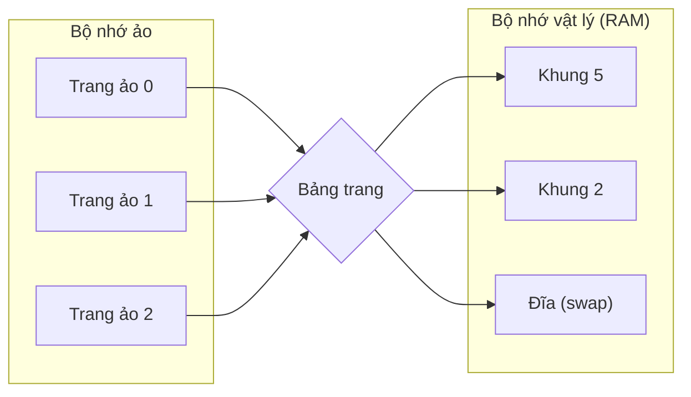
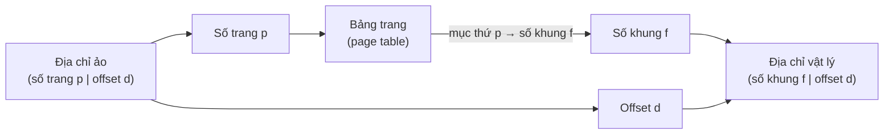
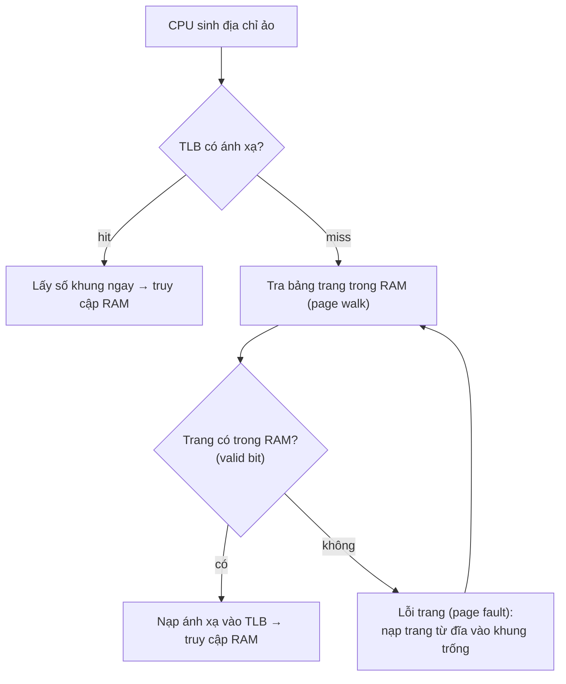

# Quản lý bộ nhớ (Memory Management)

## Khái niệm
**Quản lý bộ nhớ (memory management)** là chức năng của hệ điều hành cấp phát, thu hồi và ánh xạ bộ nhớ cho các tiến trình, đồng thời tạo ảo giác mỗi tiến trình có một không gian địa chỉ liên tục và riêng biệt lớn hơn RAM vật lý. Hai trụ cột là **phân trang (paging)** và **bộ nhớ ảo (virtual memory)**.

Phân trang ánh xạ trang ảo sang khung vật lý qua bảng trang:



## Khi nào dùng / Vì sao quan trọng
RAM hữu hạn nhưng chương trình ngày càng lớn và chạy đồng thời nhiều. Quản lý bộ nhớ tốt cho phép: cách ly tiến trình (bảo mật), chạy chương trình lớn hơn RAM, chia sẻ vùng nhớ chung (thư viện dùng chung), và tận dụng đĩa làm phần mở rộng của RAM.

## Cách hoạt động

### Phân trang (paging)
Không gian địa chỉ ảo chia thành các **trang (page)** kích thước cố định (thường 4 KB); bộ nhớ vật lý chia thành các **khung (frame)** cùng kích thước. **Bảng trang (page table)** ánh xạ mỗi trang ảo → khung vật lý.

Địa chỉ ảo = (số trang, offset). MMU (Memory Management Unit) tra bảng trang để dịch sang địa chỉ vật lý. Paging **loại bỏ phân mảnh ngoài (external fragmentation)** nhưng còn phân mảnh trong (internal fragmentation) ở trang cuối.

Chi tiết quá trình dịch một địa chỉ ảo sang địa chỉ vật lý: tách địa chỉ thành số trang + offset, tra bảng trang lấy số khung, rồi ghép khung với offset:



Trên thực tế MMU tra TLB trước; chỉ khi TLB miss mới đi qua bảng trang trong RAM, và nếu trang không có trong RAM thì sinh lỗi trang để nạp từ đĩa:



### TLB (Translation Lookaside Buffer)
Bộ nhớ đệm tốc độ cao lưu các ánh xạ trang gần đây để tránh tra bảng trang trong RAM mỗi lần truy cập. **TLB hit** → dịch nhanh; **TLB miss** → phải đi qua bảng trang (page walk), chậm hơn.

### Bộ nhớ ảo (virtual memory)
Chỉ nạp phần trang cần dùng vào RAM, phần còn lại để trên đĩa (swap/paging file). Khi truy cập trang không có trong RAM xảy ra **lỗi trang (page fault)**: hệ điều hành nạp trang từ đĩa vào một khung trống (hoặc thay một trang ra). **Demand paging** chỉ nạp khi cần.

**Thrashing:** khi RAM quá ít so với tập trang đang dùng tích cực (**working set**), hệ liên tục page fault, dành hầu hết thời gian tráo trang thay vì tính toán → hiệu năng sụp đổ.

### Thuật toán thay trang (page replacement)
Khi cần nạp trang mới mà không còn khung trống, phải chọn "nạn nhân" để đẩy ra:

- **FIFO:** thay trang vào sớm nhất. Đơn giản nhưng gặp **nghịch lý Belady** (thêm khung có thể làm tăng số page fault).
- **Optimal (OPT/MIN):** thay trang sẽ không dùng lâu nhất trong tương lai. Tối ưu lý thuyết nhưng không cài đặt được (cần biết tương lai), dùng làm mốc so sánh.
- **LRU (Least Recently Used):** thay trang lâu nhất không dùng. Xấp xỉ tốt Optimal nhưng tốn chi phí theo dõi thời điểm truy cập.
- **Clock (Second Chance):** xấp xỉ LRU rẻ hơn: các trang xếp thành vòng, mỗi trang có bit tham chiếu (reference bit); kim quét, gặp bit=1 thì cho "cơ hội thứ hai" (xoá bit về 0), gặp bit=0 thì thay.

!!! question "Tại sao phân trang (paging) giải quyết được phân mảnh ngoài?"
    **Gốc rễ của phân mảnh ngoài là đòi hỏi "một khối liền kề".** Trong cấp phát liền khối, mỗi tiến trình cần một dải bộ nhớ **liên tục**. Sau nhiều lần cấp/thu hồi, vùng trống bị xé thành nhiều mảnh nhỏ rải rác — tổng dung lượng trống có thể thừa, nhưng **không mảnh nào đủ lớn liền một khối** để chứa tiến trình mới. Đó là phân mảnh ngoài. Trực giác: bãi đỗ xe còn trống 5 chỗ nhưng nằm rải rác, không có 5 chỗ liền nhau cho một xe buýt.

    **Paging xoá bỏ đòi hỏi liền kề đó.** Nó cắt không gian địa chỉ ảo thành các **trang** kích thước cố định (thường 4 KB) và cắt RAM thành các **khung** cùng kích thước. Vì mọi trang và khung **cùng một cỡ**, bất kỳ trang nào cũng nhét vừa bất kỳ khung trống nào — không cần chúng liền kề nhau trong RAM. **Bảng trang** lo việc ánh xạ từng trang ảo → khung vật lý rải rác, còn tiến trình vẫn "thấy" không gian địa chỉ liên tục. Nhờ mọi ô trống đều dùng được (không có mảnh "quá nhỏ vô dụng"), phân mảnh ngoài biến mất. Đánh đổi: vẫn còn **phân mảnh trong** ở trang cuối (trang nửa rỗng vẫn chiếm trọn một khung), nhưng phần phí này nhỏ và có giới hạn (< 1 trang mỗi tiến trình).

!!! question "Tại sao TLB tăng tốc truy cập bộ nhớ?"
    **Vì nếu không có TLB, mỗi lần truy cập bộ nhớ phải tra bảng trang trong RAM — mà bảng trang cũng nằm trong RAM.** Với bảng trang nhiều cấp (ví dụ 4 cấp trên x86-64), một lần dịch địa chỉ ảo → vật lý phải đọc RAM **4 lần** (page walk) chỉ để biết địa chỉ thật, rồi mới đọc RAM lần thứ 5 lấy dữ liệu → mỗi truy cập logic hoá ra 5 lần chạm RAM, chậm khủng khiếp.

    **TLB là bộ nhớ đệm siêu nhanh (nằm trong MMU/CPU) lưu các ánh xạ trang→khung vừa dùng.** Khi CPU sinh địa chỉ ảo, MMU tra TLB trước:

    - **TLB hit:** tìm thấy ánh xạ ngay trong TLB (thời gian gần như 0, song song với truy cập cache) → nhảy thẳng tới khung, **bỏ qua toàn bộ page walk**. Đây là O(1).
    - **TLB miss:** mới phải đi page walk chậm, rồi **nạp kết quả vào TLB** cho lần sau.

    Điều làm TLB hiệu quả là **nguyên lý cục bộ**: chương trình truy cập đi truy cập lại một số ít trang trong khoảng thời gian ngắn, nên chỉ vài chục–vài trăm mục TLB cũng đạt **tỉ lệ hit trên 99%**. Trực giác: thay vì mỗi lần tìm nhà lại giở cả cuốn danh bạ dày (bảng trang trong RAM), bạn ghi vài địa chỉ hay dùng lên tờ giấy nhớ dán trên bàn (TLB) — liếc là thấy.

!!! question "Tại sao thay trang LRU cho kết quả tốt?"
    **Vì LRU đánh cược vào nguyên lý cục bộ thời gian (temporal locality) — và cược này gần như luôn thắng.** Chương trình thực có xu hướng: trang **vừa mới dùng** thì **sắp dùng lại** (vòng lặp, biến cục bộ, ngăn xếp lời gọi hàm...). Vậy khi buộc phải đẩy một trang ra, ứng viên **ít rủi ro nhất** là trang **lâu nhất không đụng tới** — vì theo cục bộ, nó cũng ít khả năng được dùng trong tương lai gần nhất.

    So sánh trực giác:
    - **Optimal** thay trang "lâu nhất mới dùng lại trong **tương lai**" — tốt nhất nhưng cần biết trước tương lai, bất khả thi.
    - **LRU** dùng **quá khứ gần để dự đoán tương lai gần** — thay trang "lâu nhất **đã** dùng". Vì cục bộ khiến quá khứ và tương lai tương quan mạnh, LRU **xấp xỉ rất sát** Optimal.
    - **FIFO** chỉ nhìn "vào sớm nhất", bỏ qua việc trang đó có đang được dùng liên tục hay không → dễ đẩy nhầm trang nóng, còn dính **nghịch lý Belady** (thêm khung mà page fault lại tăng).

    Ví dụ: một trang chứa mã của vòng lặp đang chạy sẽ liên tục được "chạm", nên LRU luôn giữ nó lại; trong khi trang khởi tạo dùng một lần lúc đầu sẽ dần trở thành "lâu nhất không dùng" và bị thay ra đúng lúc — chính xác điều ta muốn. Đánh đổi: LRU tốt nhưng **tốn chi phí theo dõi** thời điểm truy cập từng trang, nên thực tế hay dùng xấp xỉ rẻ hơn như **Clock** (chỉ cần 1 bit tham chiếu).

### Buddy allocation (cấp phát bạn hữu)
Kỹ thuật cấp phát bộ nhớ theo lũy thừa của 2: bộ nhớ chia đôi liên tục thành các khối "bạn hữu" (buddy) cho tới khi vừa yêu cầu. Khi giải phóng, nếu khối bạn hữu cũng rảnh thì gộp (coalesce) lại thành khối lớn hơn. Nhanh, giảm phân mảnh ngoài, nhưng gây phân mảnh trong (làm tròn lên lũy thừa 2). Linux dùng buddy system cho cấp phát khung trang.

## Ví dụ
```python
from collections import OrderedDict

# Mô phỏng thay trang LRU, đếm số lỗi trang
def lru(chuoi_truy_cap, so_khung):
    cache = OrderedDict()          # giữ thứ tự dùng, cũ nhất ở đầu
    loi_trang = 0
    for trang in chuoi_truy_cap:
        if trang in cache:
            cache.move_to_end(trang)          # vừa dùng -> chuyển về cuối
        else:
            loi_trang += 1                     # page fault
            if len(cache) >= so_khung:
                cache.popitem(last=False)      # bỏ trang LRU (cũ nhất)
            cache[trang] = True
    return loi_trang

chuoi = [7,0,1,2,0,3,0,4,2,3,0,3,2]
print("Số lỗi trang (LRU, 3 khung):", lru(chuoi, 3))   # 8
```

### Phân đoạn (segmentation)
Ngoài paging, một số hệ dùng **phân đoạn (segmentation)**: chia không gian địa chỉ theo đơn vị logic có kích thước thay đổi (đoạn mã, đoạn dữ liệu, ngăn xếp). Địa chỉ = (số đoạn, offset). Phân đoạn phản ánh cấu trúc chương trình tốt hơn nhưng gây phân mảnh ngoài. Nhiều kiến trúc kết hợp **phân đoạn + phân trang** (segmented paging) để lấy ưu điểm cả hai.

### Bảng trang nhiều cấp và bảng trang nghịch đảo
Với không gian địa chỉ 64-bit, bảng trang một cấp sẽ khổng lồ. Giải pháp:
- **Bảng trang nhiều cấp (multi-level page table):** chia bảng thành cây nhiều tầng, chỉ cấp phát nhánh thực sự dùng → tiết kiệm bộ nhớ.
- **Bảng trang nghịch đảo (inverted page table):** một mục cho mỗi khung vật lý thay vì mỗi trang ảo, kích thước tỉ lệ RAM thật; tra bằng băm.

### Working set và nguyên lý cục bộ (locality)
Chương trình có xu hướng truy cập theo **nguyên lý cục bộ**: cục bộ thời gian (vừa dùng sẽ dùng lại) và cục bộ không gian (dùng ô lân cận). **Working set** là tập trang được truy cập tích cực trong một cửa sổ thời gian; nếu RAM giữ đủ working set thì page fault thấp — đây là cơ sở để chống thrashing bằng cách điều chỉnh mức đa chương.

### Playground: LRU vs FIFO đếm page fault
Chạy cùng một chuỗi truy cập trang trên hai thuật toán thay trang và đếm số lỗi trang (page fault) của mỗi thuật toán.

<div class="js-demo" data-title="LRU vs FIFO: đếm page fault">
<textarea class="js-demo-src">
const chuoi = [7,0,1,2,0,3,0,4,2,3,0,3,2,1,2,0,1,7,0,1];
const soKhung = 3;

function fifo(chuoi, k) {
  const trongKhung = new Set();
  const hangDoi = [];          // thứ tự nạp vào
  let loi = 0;
  for (const t of chuoi) {
    if (!trongKhung.has(t)) {
      loi++;
      if (trongKhung.size >= k) {
        const cu = hangDoi.shift();   // nạn nhân = vào sớm nhất
        trongKhung.delete(cu);
      }
      trongKhung.add(t); hangDoi.push(t);
    }
  }
  return loi;
}

function lru(chuoi, k) {
  const gan = [];              // thứ tự dùng gần đây, cũ nhất ở đầu
  let loi = 0;
  for (const t of chuoi) {
    const idx = gan.indexOf(t);
    if (idx === -1) {
      loi++;
      if (gan.length >= k) gan.shift();   // nạn nhân = lâu nhất không dùng
    } else {
      gan.splice(idx, 1);       // vừa dùng -> bỏ vị trí cũ
    }
    gan.push(t);                // đưa về cuối (mới nhất)
  }
  return loi;
}

print('Chuỗi truy cập:', chuoi.join(' '));
print('Số khung:', soKhung);
print('FIFO page fault:', fifo(chuoi, soKhung));
print('LRU  page fault:', lru(chuoi, soKhung));
</textarea>
</div>

## Độ phức tạp (nếu có)
| Thao tác | Thời gian |
|----------|-----------|
| Dịch địa chỉ (TLB hit) | O(1) |
| Page walk (TLB miss, bảng nhiều cấp) | O(số cấp bảng) |
| LRU với hash + list liên kết đôi | O(1) mỗi truy cập |
| Buddy cấp phát/giải phóng | O(log n) |

### So sánh nhanh các thuật toán thay trang

| Thuật toán | Khả thi thực tế | Chất lượng | Ghi chú |
|-----------|-----------------|-----------|---------|
| Optimal | Không | Tốt nhất (mốc lý thuyết) | Cần biết tương lai |
| LRU | Có (chi phí cao) | Rất tốt | Theo dõi thời điểm dùng |
| Clock | Có (rẻ) | Gần LRU | Dùng reference bit |
| FIFO | Có (rẻ nhất) | Kém | Có nghịch lý Belady |

### Cấp phát khung cho tiến trình
Khi có nhiều tiến trình, hệ phải chia số khung (frame):
- **Cấp phát cố định đều (equal):** mỗi tiến trình số khung như nhau.
- **Cấp phát theo tỉ lệ (proportional):** theo kích thước tiến trình.
- **Cấp phát cục bộ vs toàn cục:** thay trang chỉ trong khung của chính tiến trình, hay lấy từ bất kỳ tiến trình nào — ảnh hưởng tới sự công bằng và thrashing.

## Ưu / nhược điểm
- **Ưu (paging + virtual memory):** loại bỏ phân mảnh ngoài, cách ly tiến trình, chạy chương trình lớn hơn RAM, chia sẻ trang dễ.
- **Nhược:** phân mảnh trong, chi phí tra bảng trang, page fault đắt, nguy cơ thrashing.
- **Ưu (LRU/Clock):** giảm page fault tốt; Clock rẻ mà hiệu quả gần LRU.
- **Nhược (FIFO):** kém, có nghịch lý Belady; Optimal không khả thi thực tế.

## Câu hỏi phỏng vấn thường gặp
1. Phân trang giải quyết vấn đề gì so với cấp phát liền khối?
2. Bộ nhớ ảo và demand paging hoạt động ra sao?
3. TLB là gì? TLB miss ảnh hưởng thế nào?
4. So sánh FIFO, LRU, Optimal, Clock. Nghịch lý Belady là gì?
5. Cài đặt LRU cache đạt O(1) như thế nào?
6. Thrashing xảy ra khi nào và cách khắc phục?
7. Buddy allocation gộp và tách khối ra sao?
8. Phân biệt phân mảnh trong và phân mảnh ngoài.
9. Vì sao cần bảng trang nhiều cấp cho không gian địa chỉ lớn?
10. Nguyên lý cục bộ (locality) và working set liên quan gì tới hiệu năng?
11. Phân đoạn khác phân trang thế nào?

### Cấp phát bộ nhớ liền khối và phân mảnh
Trước paging, hệ dùng **cấp phát liền khối (contiguous allocation)** với các chiến lược đặt vùng:
- **First-fit:** chọn khối trống đầu tiên đủ lớn — nhanh.
- **Best-fit:** chọn khối vừa khít nhất — giảm lãng phí nhưng tạo nhiều mảnh nhỏ.
- **Worst-fit:** chọn khối lớn nhất — giữ mảnh còn lại đủ dùng.

Cả ba đều bị **phân mảnh ngoài**; khắc phục bằng **nén (compaction)** dồn vùng trống lại, nhưng tốn chi phí di chuyển dữ liệu — đây chính là lý do paging ra đời.

## Tham khảo
- Operating System Concepts (Silberschatz) — Memory Management, Virtual Memory
- Operating Systems: Three Easy Pieces (OSTEP) — Paging, Swapping
