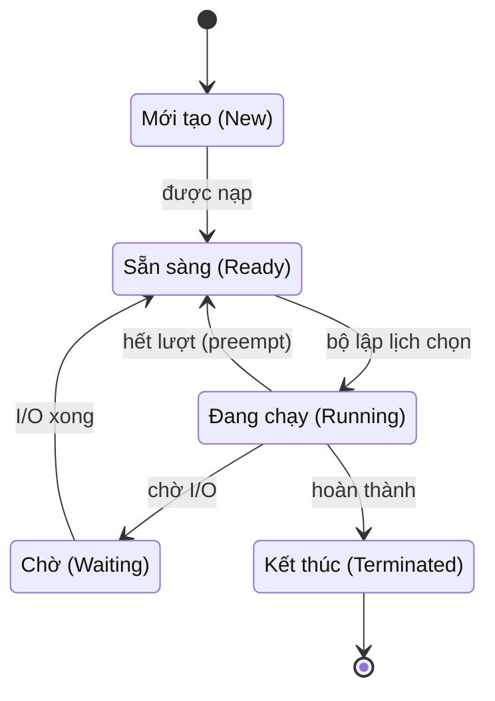

# Tiến trình & Luồng (Process & Thread)

## Khái niệm
**Tiến trình (process)** là một chương trình đang chạy, kèm theo toàn bộ tài nguyên hệ điều hành cấp cho nó: không gian địa chỉ bộ nhớ riêng, bảng file mở, bộ đếm chương trình (program counter), thanh ghi và ngăn xếp (stack). **Luồng (thread)** là đơn vị thực thi nhỏ nhất bên trong một tiến trình; nhiều luồng cùng tiến trình **chia sẻ** không gian địa chỉ và tài nguyên nhưng mỗi luồng có ngăn xếp và bộ đếm chương trình riêng.

Vòng đời một tiến trình đi qua các trạng thái sau:



## Khi nào dùng / Vì sao quan trọng
Hiểu sự khác biệt tiến trình – luồng là nền tảng để thiết kế phần mềm đồng thời (concurrent) và song song (parallel):

- **Đa tiến trình (multiprocessing):** cách ly lỗi tốt, một tiến trình sập không kéo theo tiến trình khác; phù hợp tác vụ nặng CPU trong Python (do có GIL — Global Interpreter Lock).
- **Đa luồng (multithreading):** tạo/chuyển đổi nhẹ hơn, chia sẻ dữ liệu dễ dàng; phù hợp tác vụ I/O-bound (chờ mạng, đĩa) và giao diện phản hồi nhanh.

## Cách hoạt động

### Cấu trúc bộ nhớ của một tiến trình
```
+-----------------------+  địa chỉ cao
|        Stack          |  <- ngăn xếp, mỗi luồng một stack riêng
|          |            |
|          v            |
|          ^            |
|          |            |
|        Heap           |  <- cấp phát động (malloc/new)
+-----------------------+
|   Data (biến toàn cục)|
+-----------------------+
|   Text (mã lệnh)      |
+-----------------------+  địa chỉ thấp
```

### Khác biệt cốt lõi

| Tiêu chí | Tiến trình (process) | Luồng (thread) |
|----------|----------------------|----------------|
| Không gian địa chỉ | Riêng biệt | Chia sẻ trong cùng tiến trình |
| Chi phí tạo | Nặng | Nhẹ |
| Giao tiếp | IPC (pipe, socket, shared memory) | Biến chung trong bộ nhớ |
| Cách ly lỗi | Cao | Thấp (một luồng lỗi có thể sập cả tiến trình) |
| Chuyển ngữ cảnh | Chậm (đổi bảng trang) | Nhanh hơn |

### Trạng thái tiến trình (process states)
Một tiến trình chuyển qua các trạng thái: **New → Ready → Running → Waiting (blocked) → Terminated**. Bộ lập lịch (scheduler) đưa tiến trình từ Ready lên Running; khi chờ I/O nó về Waiting; xong I/O quay lại Ready.

### Chuyển ngữ cảnh (context switch)
Khi CPU đổi từ tiến trình/luồng này sang cái khác, nhân (kernel) phải:

1. Lưu ngữ cảnh hiện tại (thanh ghi, PC, con trỏ stack) vào **PCB (Process Control Block)** hoặc **TCB (Thread Control Block)**.
2. Nạp ngữ cảnh của đối tượng kế tiếp.
3. Với tiến trình: còn phải đổi bảng trang → làm mất hiệu lực (flush) một phần **TLB (Translation Lookaside Buffer)**, nên đắt hơn chuyển luồng.

Chuyển ngữ cảnh là chi phí thuần (overhead) — CPU không làm việc hữu ích trong lúc đó, nên lập lịch phải cân bằng giữa phản hồi nhanh và giảm số lần chuyển.

### Mô hình đa luồng (threading models)
Ánh xạ luồng người dùng (user thread) sang luồng nhân (kernel thread):

- **Many-to-One:** nhiều user thread ↔ một kernel thread. Nhẹ nhưng một luồng chặn (block) sẽ chặn cả tiến trình; không tận dụng đa lõi.
- **One-to-One:** mỗi user thread ↔ một kernel thread. Song song thật trên đa lõi; đa số hệ hiện đại (Linux, Windows) dùng mô hình này.
- **Many-to-Many:** nhiều user thread ↔ nhiều kernel thread (ít hơn hoặc bằng). Linh hoạt, dùng trong các runtime như goroutine của Go (mô hình M:N).

## Ví dụ
```python
import threading
import multiprocessing
import time

# --- Đa luồng: tốt cho I/O-bound ---
def tai_du_lieu(ten):
    print(f"Luồng {ten} bắt đầu tải...")
    time.sleep(1)          # mô phỏng chờ mạng (I/O)
    print(f"Luồng {ten} xong.")

luongs = [threading.Thread(target=tai_du_lieu, args=(i,)) for i in range(3)]
for l in luongs: l.start()   # 3 luồng chạy chồng lấn, tổng ~1s thay vì 3s
for l in luongs: l.join()    # chờ tất cả kết thúc

# --- Đa tiến trình: tốt cho CPU-bound (vượt qua GIL) ---
def tinh_nang(n):
    return sum(i * i for i in range(n))   # tác vụ nặng CPU

if __name__ == "__main__":
    with multiprocessing.Pool(4) as p:
        # phân phối công việc cho 4 tiến trình chạy song song thật
        ket_qua = p.map(tinh_nang, [10**6] * 4)
        print("Tổng:", sum(ket_qua))
```

## Độ phức tạp (nếu có)
| Thao tác | Chi phí tương đối |
|----------|-------------------|
| Tạo tiến trình | Cao (sao chép/khởi tạo không gian địa chỉ) |
| Tạo luồng | Thấp |
| Context switch giữa luồng | Thấp – trung bình |
| Context switch giữa tiến trình | Cao (đổi bảng trang, flush TLB) |

## Ưu / nhược điểm
- **Ưu (luồng):** nhẹ, chia sẻ dữ liệu dễ, chuyển ngữ cảnh nhanh, tận dụng đa lõi (one-to-one).
- **Nhược (luồng):** dễ gặp lỗi tranh chấp (race condition), cần đồng bộ hoá; một luồng lỗi có thể sập cả tiến trình.
- **Ưu (tiến trình):** cách ly mạnh, an toàn hơn.
- **Nhược (tiến trình):** tốn tài nguyên, giao tiếp phức tạp (IPC).

### Giao tiếp liên tiến trình (IPC — Inter-Process Communication)
Vì tiến trình không chia sẻ bộ nhớ mặc định, hệ điều hành cung cấp nhiều cơ chế IPC:

- **Pipe / named pipe (FIFO):** kênh một chiều truyền byte, thường giữa các tiến trình cha–con.
- **Message queue:** hàng đợi thông điệp có cấu trúc, gửi/nhận không đồng bộ.
- **Shared memory (bộ nhớ chia sẻ):** nhanh nhất — nhiều tiến trình ánh xạ cùng một vùng vật lý, nhưng cần đồng bộ hoá thủ công.
- **Socket:** giao tiếp qua mạng hoặc cục bộ (Unix domain socket), nền tảng cho mô hình client–server.
- **Signal (tín hiệu):** thông báo bất đồng bộ ngắn (ví dụ SIGTERM, SIGKILL).

### Tiến trình mồ côi và zombie
- **Tiến trình zombie:** tiến trình con đã kết thúc nhưng cha chưa gọi `wait()` để thu mã thoát; mục trong bảng tiến trình vẫn tồn tại.
- **Tiến trình mồ côi (orphan):** cha kết thúc trước con; con được tiến trình `init`/`systemd` (PID 1) nhận nuôi và dọn dẹp.

### Fork và exec
Trên Unix, `fork()` tạo bản sao tiến trình con (dùng **copy-on-write** — chỉ sao chép trang khi có ghi để tiết kiệm), còn `exec()` thay ảnh chương trình hiện tại bằng chương trình mới. Mô hình fork–exec là cách shell khởi chạy chương trình.

## Câu hỏi phỏng vấn thường gặp
1. Phân biệt tiến trình và luồng? Cái nào chia sẻ bộ nhớ?
2. Vì sao context switch giữa tiến trình đắt hơn giữa luồng?
3. GIL trong Python là gì và nó ảnh hưởng thế nào tới đa luồng CPU-bound?
4. Khi nào chọn multithreading, khi nào chọn multiprocessing?
5. Trình bày các mô hình ánh xạ luồng (many-to-one, one-to-one, many-to-many).
7. PCB và TCB lưu những thông tin gì?
8. Các trạng thái của một tiến trình và điều kiện chuyển trạng thái?
9. Liệt kê các cơ chế IPC và so sánh tốc độ của chúng.
10. Copy-on-write trong fork() hoạt động ra sao và vì sao tiết kiệm?
11. Tiến trình zombie và orphan là gì, ai dọn dẹp chúng?

## Tham khảo
- Operating System Concepts (Silberschatz, Galvin, Gagne)
- Modern Operating Systems (Tanenbaum)
