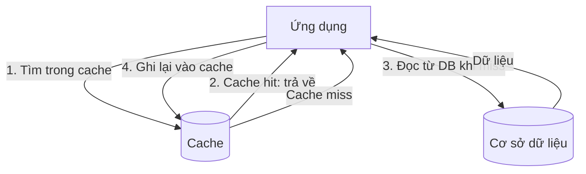
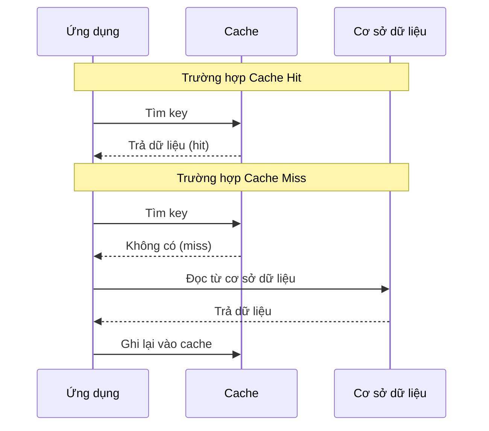

# Chiến lược bộ nhớ đệm (Caching Strategies)

## Khái niệm

**Bộ nhớ đệm (Cache)** là một lớp lưu trữ tốc độ cao (thường trong RAM) giữ lại kết quả của các thao tác tốn kém hoặc dữ liệu hay được truy cập, nhằm phục vụ các yêu cầu tiếp theo nhanh hơn thay vì tính toán lại hoặc truy vấn nguồn gốc (cơ sở dữ liệu, API). **Chiến lược cache (caching strategy)** quy định cách đọc, ghi và cập nhật dữ liệu giữa cache và nguồn dữ liệu chính.

## Khi nào dùng / Vì sao quan trọng

- Giảm **độ trễ (latency)** và tăng tốc phản hồi cho người dùng.
- Giảm **tải (load)** lên cơ sở dữ liệu và dịch vụ backend.
- Tiết kiệm chi phí tính toán và băng thông.

Cache đặc biệt hiệu quả khi dữ liệu **đọc nhiều hơn ghi** (read-heavy) và có tính cục bộ (locality) — một phần nhỏ dữ liệu được truy cập rất thường xuyên.

## Các chiến lược cache

### 1. Cache-Aside (Lazy Loading)

Ứng dụng tự quản lý cache. Đây là chiến lược phổ biến nhất.

```
Đọc: 1. Tìm trong cache
     2. Nếu có (cache hit) -> trả về
     3. Nếu không (cache miss) -> đọc DB, ghi vào cache, trả về
Ghi: cập nhật DB rồi xoá (invalidate) key trong cache
```

Sơ đồ dưới đây minh hoạ luồng đọc theo chiến lược cache-aside (xử lý cả hit và miss):



Sơ đồ tuần tự dưới đây tách riêng hai kịch bản **cache hit** (có trong cache, trả về ngay) và **cache miss** (không có, phải đọc DB rồi ghi lại cache):



- **Ưu:** Chỉ cache dữ liệu thực sự được dùng (lazy); cache lỗi/sập không làm sập hệ thống (vẫn đọc được DB); cài đặt đơn giản.
- **Nhược:** Lần miss đầu chậm (3 bước); có thể xảy ra dữ liệu cũ (stale) nếu invalidate sai; logic cache nằm rải trong mã ứng dụng.
- **Khi nào dùng:** Tải đọc nặng (read-heavy), chấp nhận dữ liệu hơi cũ, ví dụ hồ sơ người dùng, danh mục sản phẩm. Đây là mặc định của Redis/Memcached.

### 2. Write-Through (Ghi xuyên qua)

Mọi thao tác ghi đi qua cache: ghi vào cache **và** DB đồng thời (đồng bộ).

- **Ưu:** Cache luôn nhất quán với DB; đọc luôn có dữ liệu mới; không mất dữ liệu.
- **Nhược:** Ghi chậm hơn (phải ghi hai nơi, đồng bộ); cache có thể chứa dữ liệu không bao giờ được đọc (lãng phí bộ nhớ).
- **Khi nào dùng:** Cần nhất quán cao và đọc lại ngay sau khi ghi; thường kết hợp với read-through. Ví dụ: dữ liệu tài khoản, cấu hình.

### 3. Write-Behind (Write-Back, Ghi trễ)

Ghi vào cache ngay, sau đó ghi xuống DB **bất đồng bộ** (theo lô/độ trễ).

- **Ưu:** Ghi rất nhanh (chỉ chạm cache); giảm tải DB khi ghi nhiều nhờ gộp lô (batching), hợp nhất nhiều lần ghi cùng key.
- **Nhược:** Nguy cơ **mất dữ liệu** nếu cache sập trước khi ghi xuống DB; phức tạp hơn; DB có thể tạm thời không nhất quán với cache.
- **Khi nào dùng:** Tải ghi rất nặng, chấp nhận rủi ro mất một phần dữ liệu gần nhất; ví dụ đếm lượt xem, ghi log/metrics, bảng xếp hạng.

### 4. Read-Through

Cache đứng giữa ứng dụng và DB; khi miss, chính cache (không phải ứng dụng) chịu trách nhiệm nạp dữ liệu từ DB. Ứng dụng chỉ nói chuyện với cache.

- **Ưu:** Logic nạp dữ liệu tập trung ở lớp cache, ứng dụng gọn; luôn đọc qua một giao diện thống nhất.
- **Nhược:** Cần thư viện/provider cache hỗ trợ; lần miss đầu vẫn chậm.
- **Khi nào dùng:** Khi muốn tách hoàn toàn logic cache khỏi ứng dụng; thường ghép với write-through.

| Chiến lược | Đường đọc | Đường ghi | Rủi ro chính | Phù hợp |
|------------|-----------|-----------|--------------|---------|
| Cache-Aside | App tự nạp khi miss | Ghi DB + invalidate cache | Dữ liệu cũ | Đọc nặng, phổ quát |
| Write-Through | Luôn từ cache | Cache + DB đồng bộ | Ghi chậm | Cần nhất quán cao |
| Write-Behind | Luôn từ cache | Cache ngay, DB sau (async) | Mất dữ liệu | Ghi nặng, chịu rủi ro |
| Read-Through | Cache tự nạp khi miss | Thường kết hợp write-through | Ghi chậm | Tách logic cache |

## Vô hiệu hóa cache & TTL

- **TTL (Time To Live)**: Thời gian sống của một mục cache; hết hạn thì bị loại bỏ.
- **Chính sách loại bỏ (eviction policy)**: Khi cache đầy, chọn mục để xóa.

### Các chính sách loại bỏ (eviction policy) chi tiết

- **LRU (Least Recently Used)** — loại mục **lâu nhất chưa được truy cập**. Giả định "cục bộ theo thời gian" (temporal locality): dữ liệu vừa dùng dễ được dùng lại. Cài đặt hiệu quả bằng **hash map + danh sách liên kết đôi (doubly linked list)** cho thao tác O(1): mỗi lần truy cập đưa mục lên đầu; khi đầy xóa mục ở cuối. Đây là chính sách mặc định phổ biến nhất.
- **LFU (Least Frequently Used)** — loại mục **ít được dùng nhất (đếm tần suất)**. Tốt khi có nhóm dữ liệu "nóng" ổn định lâu dài, nhưng nhược điểm là mục cũ từng rất nóng có thể "chiếm chỗ" mãi (cần cơ chế lão hóa - aging).
- **FIFO (First In First Out)** — loại mục **vào sớm nhất** bất kể tần suất truy cập. Đơn giản nhưng không phản ánh mức độ dùng, thường kém hơn LRU.
- **Random / MRU / TTL-based** — loại ngẫu nhiên, hoặc loại mục vừa dùng nhất (MRU, hiếm), hoặc theo hết hạn TTL.

| Chính sách | Loại bỏ mục | Ưu | Nhược |
|-----------|-------------|-----|-------|
| LRU | Lâu nhất chưa dùng | Bám sát cục bộ thời gian, O(1) | Kém khi quét tuần tự toàn bộ (scan) |
| LFU | Ít dùng nhất | Giữ được "hot data" dài hạn | Mục nóng cũ khó bị loại (cần aging) |
| FIFO | Vào sớm nhất | Đơn giản | Không xét tần suất, dễ loại nhầm |
| Random | Ngẫu nhiên | Rất rẻ, không cần metadata | Không tối ưu tỉ lệ hit |

## Chống Cache Stampede (giẫm đạp cache)

**Cache stampede** (còn gọi là dogpile / thundering herd) xảy ra khi một key phổ biến hết hạn cùng lúc, khiến hàng loạt yêu cầu đồng thời cùng miss và cùng dồn xuống DB, gây quá tải.

Các kỹ thuật giảm thiểu:

- **Khóa/mutex (locking)**: Chỉ cho một yêu cầu nạp lại DB; các yêu cầu khác chờ hoặc dùng giá trị cũ.
- **Làm mới sớm (early recomputation / probabilistic early expiration)**: Làm mới cache ngẫu nhiên trước khi hết hạn để tránh hết hạn đồng loạt.
- **Random jitter cho TTL**: Thêm độ lệch ngẫu nhiên vào TTL để các key không hết hạn cùng lúc.
- **Stale-while-revalidate**: Trả về giá trị cũ trong khi nạp giá trị mới ở nền.

```python
# Minh hoạ cache-aside kèm khóa chống stampede (giản lược)
import threading, time

cache = {}
locks = {}

def lay_du_lieu(key):
    muc = cache.get(key)
    if muc and muc["het_han"] > time.time():
        return muc["gia_tri"]                 # cache hit

    lock = locks.setdefault(key, threading.Lock())
    with lock:                                # chỉ 1 luồng nạp lại DB
        muc = cache.get(key)
        if muc and muc["het_han"] > time.time():
            return muc["gia_tri"]             # luồng khác đã nạp xong
        gia_tri = truy_van_db(key)            # thao tác tốn kém
        cache[key] = {"gia_tri": gia_tri, "het_han": time.time() + 60}
        return gia_tri

def truy_van_db(key):
    time.sleep(0.1)                           # giả lập truy vấn chậm
    return f"du_lieu_cua_{key}"
```

## Playground: Cache LRU đếm hit/miss

Demo dưới đây cài đặt một **LRU cache** dung lượng giới hạn dùng `Map` của JavaScript (giữ thứ tự chèn). Mỗi lần truy cập đưa key lên "mới nhất"; khi đầy sẽ loại key **lâu nhất chưa dùng**. Kết quả in ra số lần **hit/miss** và tỉ lệ hit.

<div class="js-demo" data-title="LRU cache: đếm hit/miss">
<textarea class="js-demo-src">
// LRU cache dùng Map (Map giữ thứ tự chèn key)
class LRUCache {
  constructor(capacity) {
    this.cap = capacity;
    this.map = new Map();
    this.hits = 0; this.misses = 0;
  }
  get(key) {
    if (!this.map.has(key)) { this.misses++; return null; }
    const val = this.map.get(key);
    this.map.delete(key); this.map.set(key, val);  // đưa lên mới nhất
    this.hits++;
    return val;
  }
  put(key, val) {
    if (this.map.has(key)) this.map.delete(key);
    else if (this.map.size >= this.cap) {
      const cu = this.map.keys().next().value;     // key cũ nhất
      this.map.delete(cu);
      print(`  loại bỏ (LRU): ${cu}`);
    }
    this.map.set(key, val);
  }
}

const cache = new LRUCache(3);           // sức chứa 3
// Nạp dữ liệu
['A','B','C'].forEach(k => cache.put(k, `data_${k}`));

// Chuỗi truy cập mô phỏng
const truyCap = ['A','B','A','D','C','A','E','B'];
for (const k of truyCap) {
  const v = cache.get(k);
  if (v === null) {                       // miss -> nạp vào cache
    print(`truy cập ${k}: MISS`);
    cache.put(k, `data_${k}`);
  } else {
    print(`truy cập ${k}: HIT`);
  }
}

const tong = cache.hits + cache.misses;
print('--- Thống kê ---');
print(`Hit: ${cache.hits}, Miss: ${cache.misses}`);
print(`Tỉ lệ hit: ${(cache.hits / tong * 100).toFixed(1)}%`);
print(`Còn trong cache: ${[...cache.map.keys()].join(', ')}`);
</textarea>
</div>

## CDN (Content Delivery Network)

**CDN (Mạng phân phối nội dung)** là hệ thống các máy chủ biên (edge servers) phân bố theo địa lý, lưu cache nội dung tĩnh (ảnh, CSS, JS, video) gần người dùng cuối.

- Giảm độ trễ do phục vụ từ máy chủ gần nhất.
- Giảm tải cho máy chủ gốc (origin server).
- Chống chịu đỉnh tải và một phần tấn công DDoS.
- Dùng TTL và cache invalidation (purge) để cập nhật nội dung mới.

## Ưu / nhược điểm

- **Ưu:** Tăng tốc phản hồi, giảm tải backend, tiết kiệm chi phí, tăng khả năng chịu tải.
- **Nhược:** Nguy cơ dữ liệu cũ (stale), thêm độ phức tạp (invalidation là bài toán khó), tốn bộ nhớ, cần xử lý stampede và tính nhất quán.

## Câu hỏi phỏng vấn thường gặp

1. **So sánh cache-aside, write-through và write-behind.**
   - Cache-aside: app tự nạp khi miss, ghi DB rồi invalidate. Write-through: ghi cache và DB đồng bộ, nhất quán nhưng chậm. Write-behind: ghi cache trước, DB sau (async), nhanh nhưng rủi ro mất dữ liệu.
2. **Cache stampede là gì và cách phòng chống?**
   - Là hiện tượng nhiều yêu cầu cùng miss khi key hết hạn, dồn tải xuống DB. Phòng bằng khóa, làm mới sớm, jitter cho TTL, hoặc stale-while-revalidate.
3. **Các chính sách loại bỏ cache phổ biến?**
   - LRU (ít dùng gần đây nhất), LFU (ít dùng thường xuyên nhất), FIFO.
4. **Làm sao xử lý dữ liệu cũ (stale) trong cache?**
   - Đặt TTL hợp lý, invalidate khi ghi, hoặc dùng write-through để giữ nhất quán.
5. **CDN giúp ích gì và khác gì cache phía server?**
   - CDN cache nội dung tĩnh tại biên gần người dùng, giảm độ trễ mạng; cache phía server (như Redis) giảm tải tính toán/truy vấn DB.

## Tham khảo

- AWS — Caching Best Practices
- Redis Documentation — Caching patterns
