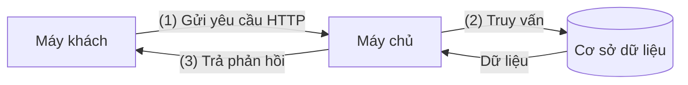
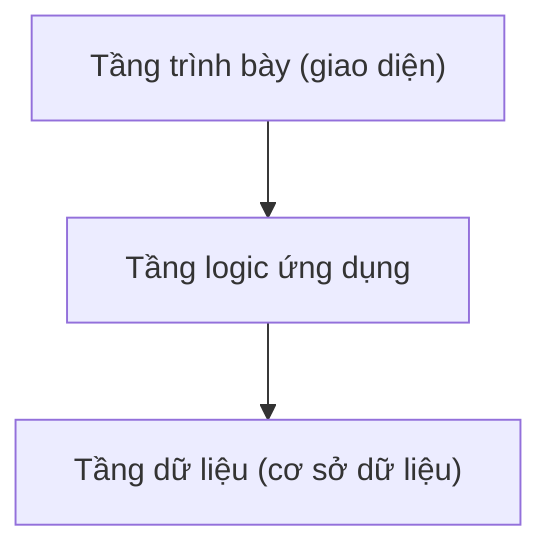
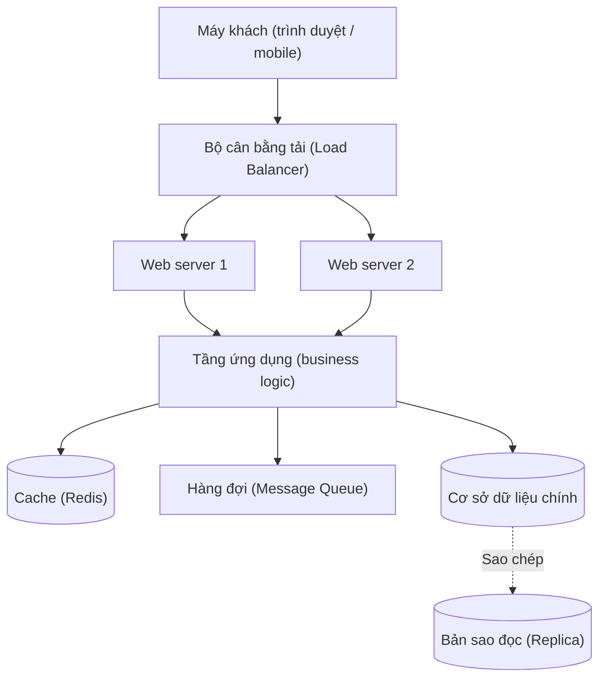

# Kiến trúc Client-Server (Client-Server Architecture)

## Khái niệm

**Kiến trúc Client-Server (Client-Server Architecture)** là một mô hình tính toán phân tán (distributed computing) trong đó các tác vụ được phân chia giữa hai vai trò: **client (máy khách)** — bên gửi yêu cầu (request) và tiêu thụ dịch vụ, và **server (máy chủ)** — bên nhận yêu cầu, xử lý và trả về phản hồi (response). Client và server thường chạy trên các máy khác nhau và giao tiếp qua mạng.

Mô hình này là nền tảng của gần như toàn bộ ứng dụng web hiện đại: trình duyệt (client) gửi yêu cầu HTTP, máy chủ web (server) trả về HTML/JSON.

## Khi nào dùng / Vì sao quan trọng

- **Tập trung hóa tài nguyên**: Dữ liệu và logic nghiệp vụ (business logic) được đặt tại server, dễ quản lý, sao lưu và bảo mật.
- **Chia sẻ tài nguyên cho nhiều client**: Một server phục vụ hàng nghìn client cùng lúc (ví dụ: một API backend phục vụ web, mobile, desktop).
- **Tách biệt mối quan tâm (separation of concerns)**: Giao diện người dùng (client) tách khỏi xử lý dữ liệu (server), cho phép hai phía phát triển độc lập.

Hầu hết các hệ thống doanh nghiệp, ứng dụng web, cơ sở dữ liệu (database) và email đều dựa trên mô hình này.

## Cách hoạt động

Luồng giao tiếp cơ bản theo mô hình **yêu cầu - phản hồi (request-response)**:

```
[Client]  --- (1) Gửi request --->  [Server]
                                        |
                                   (2) Xử lý:
                                   - Xác thực
                                   - Logic nghiệp vụ
                                   - Truy vấn DB
                                        |
[Client]  <--- (3) Trả response ---  [Server]
```

Sơ đồ dưới đây minh hoạ luồng yêu cầu - phản hồi giữa máy khách và máy chủ:



1. Client mở kết nối tới server (thường qua TCP/IP).
2. Client gửi yêu cầu theo một giao thức (protocol) đã thống nhất.
3. Server xử lý yêu cầu, có thể truy vấn cơ sở dữ liệu hoặc gọi các dịch vụ khác.
4. Server trả về phản hồi; client hiển thị hoặc xử lý kết quả.

### Các tầng (tier) phổ biến

| Mô hình | Mô tả |
|---------|-------|
| 2 tầng (2-tier) | Client giao tiếp trực tiếp với server chứa cả logic và dữ liệu. |
| 3 tầng (3-tier) | Tách thành tầng trình bày (presentation), tầng logic (application), và tầng dữ liệu (data). |
| N tầng (N-tier) | Nhiều tầng trung gian: cân bằng tải, cache, hàng đợi... |

Mô hình 3 tầng phân tách rõ trách nhiệm giữa trình bày, logic và dữ liệu:



#### Mô hình nhiều tầng (multi-tier) chi tiết

**Mô hình 1 tầng (1-tier / monolithic):** Toàn bộ trình bày, logic và dữ liệu nằm trên cùng một máy (ví dụ ứng dụng desktop cũ đọc trực tiếp file dữ liệu cục bộ). Đơn giản nhưng không chia sẻ được cho nhiều người dùng và khó mở rộng.

**Mô hình 2 tầng (client ↔ server):** "Fat client" chứa cả giao diện lẫn phần lớn logic nghiệp vụ, gọi trực tiếp tới máy chủ cơ sở dữ liệu. Ví dụ kinh điển: ứng dụng Windows Forms nối trực tiếp tới SQL Server. Triển khai nhanh cho hệ thống nhỏ, nhưng logic nằm rải rác ở client khó cập nhật đồng loạt, và mỗi client mở một kết nối DB nên khó mở rộng quá vài trăm người dùng.

**Mô hình 3 tầng:** Chèn thêm một **tầng ứng dụng (application server)** ở giữa. Client trở thành "thin client" chỉ lo hiển thị; toàn bộ logic nghiệp vụ tập trung ở tầng giữa; tầng dữ liệu chỉ lo lưu trữ. Đây là mô hình chuẩn của web hiện đại (trình duyệt → web/app server → database).

**Mô hình N tầng:** Chia nhỏ tầng giữa thành nhiều tầng chuyên biệt để mở rộng và chịu tải tốt hơn:



Bảng so sánh nhanh:

| Tiêu chí | 2 tầng | 3 tầng | N tầng |
|----------|--------|--------|--------|
| Vị trí logic nghiệp vụ | Ở client (fat client) | Ở tầng ứng dụng | Trải trên nhiều tầng chuyên biệt |
| Khả năng mở rộng | Thấp | Trung bình | Cao (mở rộng từng tầng riêng) |
| Bảo trì / cập nhật | Khó (phải cập nhật mọi client) | Dễ (cập nhật tầng giữa) | Dễ nhưng vận hành phức tạp |
| Độ trễ | Thấp (ít chặng) | Trung bình | Cao hơn (nhiều chặng mạng) |
| Phù hợp | Ứng dụng nội bộ nhỏ | Đa số web app | Hệ thống quy mô lớn, lưu lượng cao |

### Các giao thức giao tiếp (communication protocols)

- **HTTP/HTTPS**: Giao thức phổ biến nhất cho web, không trạng thái (stateless), dựa trên request-response. HTTPS bổ sung mã hóa TLS. HTTP/1.1 mở nhiều kết nối, HTTP/2 ghép luồng (multiplexing) trên một kết nối, HTTP/3 chạy trên QUIC/UDP giảm độ trễ.
- **TCP/IP**: Giao thức truyền tải tin cậy, có thứ tự, có kiểm soát tắc nghẽn; nền tảng cho hầu hết các giao thức tầng trên. Cần bắt tay ba bước (three-way handshake) nên tốn một vòng khứ hồi (round trip) khi mở kết nối.
- **UDP**: Không tin cậy, không đảm bảo thứ tự nhưng nhanh và ít overhead, dùng cho streaming, game thời gian thực, DNS, VoIP.
- **WebSocket**: Nâng cấp từ HTTP thành kết nối hai chiều (full-duplex) liên tục, phù hợp cho ứng dụng thời gian thực (chat, thông báo, bảng giá).
- **gRPC**: Giao thức hiệu năng cao dựa trên HTTP/2 và Protocol Buffers (nhị phân), hỗ trợ streaming hai chiều, dùng nhiều trong giao tiếp giữa các dịch vụ (service-to-service).
- **REST vs gRPC vs GraphQL**: REST đơn giản, phổ biến, dễ cache theo URL; gRPC nhanh và gọn nhờ nhị phân nhưng khó gỡ lỗi bằng mắt; GraphQL cho client chọn đúng trường cần lấy, tránh over/under-fetching nhưng phức tạp phía server.

| Giao thức | Kết nối | Định dạng | Điểm mạnh | Điểm yếu |
|-----------|---------|-----------|-----------|----------|
| HTTP/REST | Request-response | Text (JSON) | Đơn giản, cache tốt, phổ biến | Nhiều vòng khứ hồi, over-fetch |
| WebSocket | Hai chiều liên tục | Text/nhị phân | Thời gian thực, độ trễ thấp | Tốn kết nối giữ mở, khó cân bằng tải |
| gRPC | HTTP/2, streaming | Nhị phân (protobuf) | Nhanh, gọn, đa ngôn ngữ | Khó debug thủ công, hạn chế trên trình duyệt |
| GraphQL | Request-response | JSON | Client chọn trường, một endpoint | Cache khó, query phức tạp có thể tốn kém |

## Ví dụ

```python
# Ví dụ tối giản một client và server dùng thư viện chuẩn của Python

# --- server.py ---
from http.server import BaseHTTPRequestHandler, HTTPServer

class MyHandler(BaseHTTPRequestHandler):
    def do_GET(self):
        # Server nhận yêu cầu GET và trả về phản hồi
        self.send_response(200)                 # Mã trạng thái 200 OK
        self.send_header("Content-Type", "application/json")
        self.end_headers()
        self.wfile.write(b'{"message": "Xin chao tu server"}')

# Khởi động server lắng nghe tại cổng 8000
HTTPServer(("localhost", 8000), MyHandler).serve_forever()


# --- client.py ---
import urllib.request

# Client gửi yêu cầu tới server và nhận phản hồi
with urllib.request.urlopen("http://localhost:8000") as resp:
    print(resp.read().decode())   # In ra: {"message": "Xin chao tu server"}
```

## Ưu / nhược điểm

- **Ưu:**
  - **Quản lý tập trung**: Dễ bảo trì, cập nhật, sao lưu và bảo mật dữ liệu tại server. Vá lỗi một lần ở server có hiệu lực với mọi client.
  - **Khả năng mở rộng (scalability)**: Mở rộng theo chiều dọc (nâng cấp phần cứng server) hoặc chiều ngang (thêm nhiều server sau bộ cân bằng tải).
  - **Tách biệt vai trò**: Client và server phát triển, triển khai độc lập; cùng một backend phục vụ web, mobile, desktop.
  - **Chia sẻ tài nguyên**: Nhiều client dùng chung một server, tiết kiệm chi phí, tận dụng tài nguyên tốt hơn.
  - **Bảo mật tập trung**: Kiểm soát truy cập, mã hóa, kiểm toán tại một điểm.
- **Nhược:**
  - **Điểm lỗi đơn (single point of failure)**: Nếu server ngừng hoạt động, toàn bộ client bị ảnh hưởng — cần dự phòng (failover), cân bằng tải, triển khai đa vùng.
  - **Nghẽn cổ chai (bottleneck)**: Server quá tải khi lượng client tăng đột biến; cần cache, hàng đợi, auto-scaling.
  - **Phụ thuộc mạng**: Chất lượng dịch vụ phụ thuộc vào độ trễ (latency) và độ ổn định của mạng; client offline không dùng được.
  - **Chi phí vận hành**: Cần hạ tầng, giám sát, bảo trì, đội vận hành cho server.
  - **Độ trễ do nhiều tầng**: Mỗi tầng trung gian thêm một chặng mạng; cần cân đối giữa tách biệt và hiệu năng.

### So sánh chi tiết ưu/nhược theo tình huống

| Tình huống | Ưu thế của Client-Server | Rủi ro cần lưu ý |
|-----------|--------------------------|------------------|
| Lưu lượng tăng đột biến | Thêm server phía sau load balancer | Nghẽn ở DB nếu không cache |
| Dữ liệu nhạy cảm | Kiểm soát và mã hóa tập trung | Server là mục tiêu tấn công tập trung |
| Nhiều loại client | Một API phục vụ tất cả | Phải quản lý versioning API |
| Yêu cầu thời gian thực | Dùng WebSocket/gRPC streaming | Giữ nhiều kết nối tốn tài nguyên |

## Playground: Mô phỏng cân bằng tải nhiều server

Demo dưới đây mô phỏng nhiều client gửi yêu cầu qua một bộ cân bằng tải (load balancer) theo thuật toán **round-robin**, phân phối lần lượt cho các server và đếm số yêu cầu mỗi server xử lý.

<div class="js-demo" data-title="Cân bằng tải round-robin">
<textarea class="js-demo-src">
// Mô phỏng bộ cân bằng tải phân phối yêu cầu cho các server
class LoadBalancer {
  constructor(servers) {
    this.servers = servers;       // danh sách server
    this.idx = 0;                 // con trỏ round-robin
    this.dem = {};                // đếm số request mỗi server
    servers.forEach(s => this.dem[s] = 0);
  }
  route(reqId) {
    const server = this.servers[this.idx];      // chọn server hiện tại
    this.idx = (this.idx + 1) % this.servers.length; // xoay vòng
    this.dem[server]++;
    print(`Yêu cầu #${reqId} -> ${server}`);
    return server;
  }
}

const lb = new LoadBalancer(['Server-A', 'Server-B', 'Server-C']);
for (let i = 1; i <= 8; i++) lb.route(i);

print('--- Thống kê ---');
for (const s of Object.keys(lb.dem)) {
  print(`${s} xử lý ${lb.dem[s]} yêu cầu`);
}
</textarea>
</div>

## So sánh với mô hình ngang hàng (Peer-to-Peer)

| Tiêu chí | Client-Server | Peer-to-Peer (P2P) |
|----------|---------------|--------------------|
| Vai trò | Phân biệt rõ client và server | Mọi nút vừa là client vừa là server |
| Quản lý | Tập trung | Phân tán |
| Điểm lỗi đơn | Có (tại server) | Không |
| Ví dụ | Web, email, database | BitTorrent, blockchain |

## Câu hỏi phỏng vấn thường gặp

1. **Kiến trúc client-server là gì và nêu các thành phần chính?**
   - Là mô hình trong đó client gửi yêu cầu và server xử lý, trả về phản hồi. Thành phần gồm client, server và mạng kết nối cùng một giao thức chung.
2. **Phân biệt kiến trúc 2 tầng và 3 tầng.**
   - 2 tầng: client nối trực tiếp với server chứa cả logic lẫn dữ liệu. 3 tầng: tách tầng trình bày, tầng logic ứng dụng và tầng dữ liệu, giúp mở rộng và bảo trì tốt hơn.
3. **Làm sao xử lý điểm lỗi đơn của server?**
   - Dùng nhiều server sau bộ cân bằng tải, cơ chế chuyển đổi dự phòng (failover), sao chép dữ liệu (replication) và triển khai đa vùng.
4. **Sự khác biệt giữa client-server và peer-to-peer?**
   - Client-server phân biệt rõ vai trò và quản lý tập trung; P2P thì mọi nút bình đẳng, không có điểm điều khiển trung tâm.
5. **Khi nào chọn WebSocket thay vì HTTP thông thường?**
   - Khi cần giao tiếp hai chiều theo thời gian thực với độ trễ thấp như chat, bảng giá chứng khoán, thông báo đẩy.

## Tham khảo

- MDN Web Docs — Client-Server overview
- Tanenbaum, *Distributed Systems: Principles and Paradigms*
