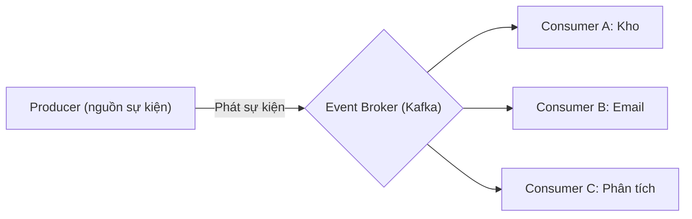
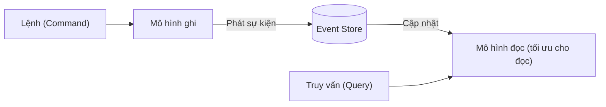
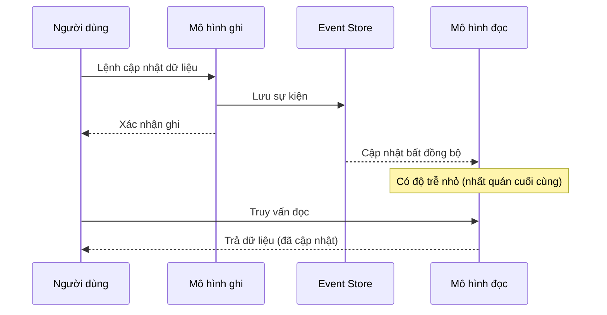

# Kiến trúc hướng sự kiện (EDA - Event-Driven Architecture)

## Khái niệm

**Kiến trúc hướng sự kiện (EDA - Event-Driven Architecture)** là một phong cách thiết kế phần mềm trong đó các thành phần giao tiếp với nhau bằng cách sản sinh và phản ứng với các **sự kiện (events)**. Một sự kiện là bản ghi bất biến (immutable) mô tả một điều gì đó **đã xảy ra** trong hệ thống (ví dụ: "ĐơnHàngĐãĐặt", "ThanhToánThànhCông"). Thay vì gọi trực tiếp lẫn nhau, các dịch vụ phát sự kiện và các dịch vụ khác quan tâm sẽ lắng nghe và phản ứng.

## Khi nào dùng / Vì sao quan trọng

- Khi cần **liên kết lỏng lẻo (loose coupling)** cao giữa các thành phần: bên phát không cần biết ai tiêu thụ sự kiện.
- Khi hệ thống cần **phản ứng theo thời gian thực** với các thay đổi trạng thái.
- Khi cần **mở rộng độc lập** và bổ sung tính năng mới bằng cách thêm consumer mới mà không sửa producer.
- Trong microservices, IoT, hệ thống phân tích thời gian thực, và các luồng dữ liệu lớn.

## Thành phần

1. **Nguồn sự kiện / Producer (Event Producer)**: Thành phần phát ra sự kiện khi có điều gì xảy ra.
2. **Sự kiện (Event)**: Thông điệp bất biến mô tả sự việc đã xảy ra kèm dữ liệu liên quan.
3. **Bộ định tuyến / Kênh sự kiện (Event Broker / Channel)**: Trung gian nhận, lưu và chuyển sự kiện (ví dụ: Kafka, AWS EventBridge).
4. **Bên tiêu thụ / Consumer (Event Consumer)**: Thành phần lắng nghe và phản ứng với sự kiện.

```
[Producer] --phát sự kiện--> [ EVENT BROKER (Kafka) ] --> [Consumer A: Kho]
                                        |                --> [Consumer B: Email]
                                        \                --> [Consumer C: Phân tích]
```

Sơ đồ dưới đây minh hoạ một producer phát sự kiện qua event broker tới nhiều consumer độc lập:



## Các mô hình xử lý sự kiện

- **Đơn sự kiện (Simple Event Processing)**: Mỗi sự kiện kích hoạt một hành động trực tiếp.
- **Xử lý luồng/phức hợp (Complex Event Processing - CEP)**: Phân tích nhiều sự kiện theo thời gian để phát hiện mẫu (pattern), ví dụ phát hiện gian lận.

## Event Sourcing

**Event Sourcing** là mẫu thiết kế lưu trữ trạng thái của hệ thống dưới dạng một **chuỗi sự kiện tuần tự** thay vì chỉ lưu trạng thái hiện tại. Trạng thái hiện tại được tái dựng bằng cách phát lại (replay) toàn bộ sự kiện từ đầu.

- **Ưu điểm**: Có lịch sử đầy đủ (audit log), có thể tái dựng trạng thái tại bất kỳ thời điểm nào, dễ gỡ lỗi và phân tích.
- **Nhược điểm**: Phức tạp hơn, cần xử lý việc phát lại và **snapshot (ảnh chụp)** để tối ưu hiệu năng.

### Cách hoạt động chi tiết

Thay vì cập nhật "tại chỗ" (in-place) một bản ghi, mỗi thay đổi được lưu thành một **sự kiện bất biến (append-only)**. Ví dụ tài khoản ngân hàng:

```
TaiKhoanMo(so_du=0)
TienDaNap(+100000)
TienDaRut(-30000)
TienDaNap(+50000)
=> Trạng thái hiện tại: số dư = 120000 (tái dựng bằng cách cộng dồn các sự kiện)
```

**Các khái niệm cốt lõi:**

- **Event Store**: Kho lưu chuỗi sự kiện, chỉ ghi thêm (append-only), không sửa/xóa.
- **Tái dựng (rehydration)**: Nạp lại trạng thái một thực thể (aggregate) bằng cách phát lại các sự kiện của nó.
- **Snapshot (ảnh chụp)**: Lưu định kỳ trạng thái tại một thời điểm để không phải phát lại từ đầu — chỉ phát lại các sự kiện sau snapshot gần nhất.
- **Projection (phép chiếu)**: Xây dựng các "khung nhìn" đọc (read view) từ luồng sự kiện, phục vụ truy vấn nhanh.

**Ưu điểm bổ sung:** Có thể "du hành thời gian" (time-travel) để xem trạng thái quá khứ, dễ phân tích hành vi, hỗ trợ tự nhiên cho CQRS. **Rủi ro:** lược đồ sự kiện (event schema) thay đổi theo thời gian cần **versioning sự kiện**; phát lại lâu nếu không snapshot; đường cong học tập dốc.

## CQRS (Command Query Responsibility Segregation)

**CQRS (Command Query Responsibility Segregation)** là mẫu tách riêng đường **ghi (command)** và đường **đọc (query)** thành hai mô hình khác nhau.

- **Lệnh (Command)**: Thay đổi trạng thái (ghi), thường phát sinh sự kiện.
- **Truy vấn (Query)**: Chỉ đọc, dùng mô hình dữ liệu được tối ưu riêng cho đọc.

CQRS thường kết hợp với Event Sourcing: lệnh sinh sự kiện, sự kiện cập nhật mô hình đọc (read model). Điều này cho phép tối ưu độc lập hai phía và mở rộng phần đọc riêng biệt.

### Vì sao tách đọc/ghi

Trong nhiều hệ thống, đặc điểm đọc và ghi rất khác nhau: đọc thường nhiều gấp hàng chục–trăm lần ghi, cần mô hình phi chuẩn hóa (denormalized) để nhanh; ghi cần đảm bảo quy tắc nghiệp vụ và tính toàn vẹn. Tách hai đường cho phép:

- **Mở rộng độc lập**: nhân bản nhiều read model để chịu tải đọc, giữ write model gọn nhẹ.
- **Mô hình dữ liệu tối ưu riêng**: write model chuẩn hóa cho tính đúng đắn; read model phi chuẩn hóa/nhiều khung nhìn cho tốc độ.
- **Bảo mật rõ ràng**: phân quyền ghi và đọc riêng biệt.

**Cái giá phải trả:** phức tạp hơn, và vì read model cập nhật bất đồng bộ nên chấp nhận **nhất quán cuối cùng (eventual consistency)** — người dùng có thể thấy dữ liệu trễ một chút sau khi ghi.

| Tiêu chí | Không CQRS | Có CQRS |
|----------|-----------|---------|
| Mô hình dữ liệu | Một mô hình cho cả đọc/ghi | Hai mô hình riêng |
| Mở rộng | Đọc và ghi chung tài nguyên | Mở rộng độc lập |
| Độ phức tạp | Thấp | Cao hơn |
| Nhất quán | Thường tức thời | Thường nhất quán cuối cùng |
| Phù hợp | CRUD đơn giản | Đọc nhiều, logic ghi phức tạp |

```
[Command] --> [Write Model] --phát sự kiện--> [Event Store]
                                                    |
                                          cập nhật read model
                                                    v
[Query]   <-- [Read Model (tối ưu cho đọc)] <-------
```

Sơ đồ dưới đây minh hoạ luồng tách ghi/đọc trong CQRS kết hợp Event Sourcing:



Sơ đồ tuần tự dưới đây làm rõ vì sao CQRS dẫn tới **nhất quán cuối cùng**: sau khi ghi, mô hình đọc được cập nhật bất đồng bộ nên truy vấn ngay lập tức có thể thấy dữ liệu cũ:



## Triển khai với Kafka

```python
# Minh hoạ producer/consumer sự kiện với Kafka dùng thư viện kafka-python
from kafka import KafkaProducer, KafkaConsumer
import json

# --- Producer: phát sự kiện "ĐơnHàngĐãĐặt" ---
producer = KafkaProducer(
    bootstrap_servers="localhost:9092",
    value_serializer=lambda v: json.dumps(v).encode(),  # tuần tự hóa sang JSON
)
su_kien = {"loai": "DonHangDaDat", "ma_don": "DH001", "so_tien": 500000}
producer.send("don-hang", su_kien)   # phát vào topic "don-hang"
producer.flush()

# --- Consumer: lắng nghe và phản ứng ---
consumer = KafkaConsumer(
    "don-hang",
    bootstrap_servers="localhost:9092",
    group_id="dich-vu-kho",          # nhóm consumer để chia tải
    value_deserializer=lambda b: json.loads(b.decode()),
    auto_offset_reset="earliest",     # đọc lại từ đầu nếu chưa có offset
)
for msg in consumer:
    su_kien = msg.value
    print("Kho nhan su kien:", su_kien)  # phản ứng: trừ tồn kho...
```

## Playground: Event bus đơn giản (emit / subscribe)

Demo dưới đây cài đặt một **event bus** tối giản: các consumer đăng ký (subscribe) một loại sự kiện, producer phát (emit) sự kiện và mọi subscriber quan tâm đều được gọi — minh hoạ liên kết lỏng lẻo của EDA.

<div class="js-demo" data-title="Event bus emit/subscribe">
<textarea class="js-demo-src">
// Event bus tối giản: nhiều subscriber phản ứng độc lập với một sự kiện
class EventBus {
  constructor() { this.handlers = {}; }        // loại sự kiện -> danh sách handler
  subscribe(loai, handler) {                   // đăng ký lắng nghe
    (this.handlers[loai] = this.handlers[loai] || []).push(handler);
  }
  emit(loai, data) {                           // phát sự kiện tới mọi subscriber
    print(`>> Phát sự kiện: ${loai}`);
    (this.handlers[loai] || []).forEach(h => h(data));
  }
}

const bus = new EventBus();
// Ba consumer độc lập cùng quan tâm sự kiện "DonHangDaDat"
bus.subscribe('DonHangDaDat', d => print(`  [Kho] trừ tồn kho cho đơn ${d.ma}`));
bus.subscribe('DonHangDaDat', d => print(`  [Email] gửi xác nhận cho ${d.khach}`));
bus.subscribe('DonHangDaDat', d => print(`  [Phân tích] ghi nhận doanh thu ${d.so_tien}`));
bus.subscribe('ThanhToanThatBai', d => print(`  [Cảnh báo] đơn ${d.ma} thanh toán lỗi`));

bus.emit('DonHangDaDat', { ma: 'DH001', khach: 'An', so_tien: 500000 });
bus.emit('ThanhToanThatBai', { ma: 'DH002' });
</textarea>
</div>

## Playground: Event Sourcing tái dựng trạng thái

Demo minh hoạ Event Sourcing: trạng thái tài khoản không được lưu trực tiếp mà **tái dựng bằng cách phát lại** chuỗi sự kiện.

<div class="js-demo" data-title="Event Sourcing: phát lại sự kiện">
<textarea class="js-demo-src">
// Lưu chuỗi sự kiện và tái dựng số dư bằng cách phát lại
const eventStore = [];
function ghiSuKien(loai, soTien) {
  eventStore.push({ loai, soTien });
  print(`Ghi sự kiện: ${loai} (${soTien})`);
}

// Tái dựng trạng thái bằng cách cộng dồn (reduce) toàn bộ sự kiện
function taiDungSoDu() {
  return eventStore.reduce((soDu, e) => {
    if (e.loai === 'TienDaNap') return soDu + e.soTien;
    if (e.loai === 'TienDaRut') return soDu - e.soTien;
    return soDu;
  }, 0);
}

ghiSuKien('TienDaNap', 100000);
ghiSuKien('TienDaRut', 30000);
ghiSuKien('TienDaNap', 50000);

print('--- Phát lại toàn bộ sự kiện ---');
print('Số dư hiện tại:', taiDungSoDu());   // 120000
</textarea>
</div>

## Ưu / nhược điểm

- **Ưu:**
  - **Liên kết lỏng lẻo** tối đa: producer và consumer độc lập hoàn toàn.
  - **Khả năng mở rộng**: thêm consumer mới không ảnh hưởng producer.
  - **Phản ứng thời gian thực** với thay đổi trạng thái.
  - Chịu lỗi tốt: sự kiện được lưu bền vững, có thể phát lại.
- **Nhược:**
  - **Khó theo dõi luồng** (khó biết toàn bộ hệ quả của một sự kiện).
  - **Nhất quán cuối cùng (eventual consistency)** thay vì nhất quán tức thời.
  - Gỡ lỗi và kiểm thử phức tạp.
  - Cần xử lý sự kiện trùng lặp (idempotency) và thứ tự.

## Câu hỏi phỏng vấn thường gặp

1. **EDA là gì và khác gì so với kiến trúc gọi trực tiếp (request-response)?**
   - EDA giao tiếp qua sự kiện bất đồng bộ, liên kết lỏng lẻo; request-response gọi trực tiếp và đồng bộ, gắn kết chặt hơn.
2. **Event Sourcing là gì?**
   - Là mẫu lưu trạng thái dưới dạng chuỗi sự kiện; trạng thái hiện tại được tái dựng bằng cách phát lại các sự kiện.
3. **CQRS giải quyết vấn đề gì?**
   - Tách đường đọc và ghi thành hai mô hình để tối ưu và mở rộng độc lập, thường kết hợp với Event Sourcing.
4. **Nhất quán cuối cùng (eventual consistency) là gì và vì sao xuất hiện trong EDA?**
   - Do sự kiện được xử lý bất đồng bộ nên các thành phần đạt trạng thái nhất quán sau một khoảng trễ, không tức thời.
5. **Vì sao consumer trong EDA cần idempotent?**
   - Vì sự kiện có thể được giao lại nhiều lần; xử lý bất biến tránh tác dụng phụ trùng lặp.

## Tham khảo

- Martin Fowler — Event Sourcing, CQRS
- Confluent — Event-Driven Architecture with Kafka
