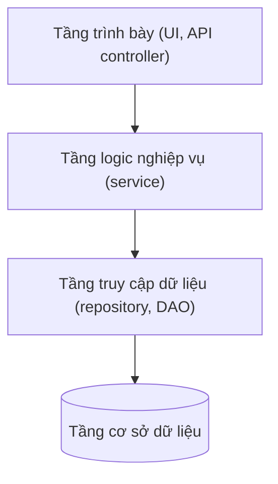
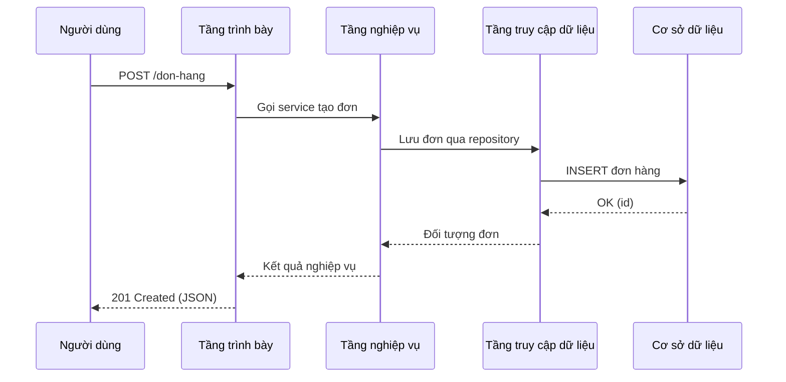
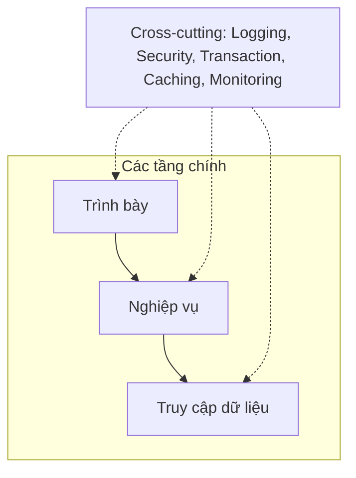

# Kiến trúc phân tầng (Layered Architecture)

## Khái niệm

**Kiến trúc phân tầng (Layered Architecture)**, còn gọi là kiến trúc n-tier, tổ chức phần mềm thành các **tầng (layers)** xếp chồng lên nhau, mỗi tầng đảm nhận một nhóm trách nhiệm riêng và chỉ giao tiếp với tầng ngay kề nó. Đây là một trong những mẫu kiến trúc phổ biến và lâu đời nhất, là lựa chọn mặc định cho nhiều ứng dụng doanh nghiệp.

## Khi nào dùng / Vì sao quan trọng

- Khi muốn **tách biệt mối quan tâm (separation of concerns)** rõ ràng, giúp mã dễ hiểu, dễ bảo trì.
- Khi cần cho phép **thay thế một tầng** mà ít ảnh hưởng đến các tầng khác (ví dụ đổi cơ sở dữ liệu).
- Trong các ứng dụng CRUD, hệ thống doanh nghiệp, ứng dụng web truyền thống.

## Các tầng cơ bản

```
┌─────────────────────────────────────┐
│  Tầng trình bày (Presentation)       │  ← UI, API controller
├─────────────────────────────────────┤
│  Tầng logic nghiệp vụ (Business)     │  ← quy tắc nghiệp vụ, service
├─────────────────────────────────────┤
│  Tầng truy cập dữ liệu (Data Access) │  ← repository, DAO, ORM
├─────────────────────────────────────┤
│  Tầng cơ sở dữ liệu (Database)       │  ← DB, hệ lưu trữ
└─────────────────────────────────────┘
```

Sơ đồ dưới đây minh hoạ các tầng xếp chồng với phụ thuộc một chiều từ trên xuống:



1. **Tầng trình bày (Presentation Layer)**: Xử lý tương tác với người dùng hoặc client — giao diện, controller, API endpoint. Nhận đầu vào, trả kết quả, không chứa logic nghiệp vụ. Trách nhiệm cụ thể: xác thực định dạng đầu vào (validation cú pháp), chuyển đổi DTO ↔ request/response, xử lý mã trạng thái HTTP, phân trang, định dạng dữ liệu trả về. **Không nên**: chứa quy tắc nghiệp vụ hay truy vấn DB trực tiếp.
2. **Tầng logic nghiệp vụ (Business Logic Layer)**: Chứa các quy tắc nghiệp vụ (business rules), điều phối luồng xử lý, kiểm tra hợp lệ theo nghiệp vụ, quản lý giao dịch (transaction boundary). Đây là "bộ não" của ứng dụng, độc lập với công nghệ giao diện lẫn cơ sở dữ liệu. Ví dụ: tính chiết khấu, kiểm tra hạn mức tín dụng, điều phối nhiều repository trong một giao dịch.
3. **Tầng truy cập dữ liệu (Data Access Layer)**: Trừu tượng hóa việc đọc/ghi dữ liệu, ẩn chi tiết cơ sở dữ liệu qua các repository/DAO (Data Access Object). Trách nhiệm: ánh xạ đối tượng ↔ bảng (ORM), xây dựng truy vấn, quản lý kết nối, phân trang cấp DB. Nhờ tầng này, đổi từ PostgreSQL sang MongoDB chỉ cần thay cài đặt repository mà không đụng tới tầng nghiệp vụ.
4. **Tầng cơ sở dữ liệu (Database Layer)**: Nơi lưu trữ dữ liệu bền vững — hệ quản trị CSDL (RDBMS, NoSQL), các thủ tục lưu sẵn (stored procedure), ràng buộc toàn vẹn, chỉ mục.

### Luồng đi qua các tầng (ví dụ một request)



Mỗi tầng chỉ gọi tầng ngay dưới nó; kết quả trả ngược lên theo chiều ngược lại. Dữ liệu thường được chuyển đổi qua các đối tượng phù hợp từng tầng (Entity ở tầng dữ liệu, Domain model ở tầng nghiệp vụ, DTO ở tầng trình bày).

### Mối quan tâm xuyên suốt (Cross-Cutting Concerns)

Một số mối quan tâm không thuộc riêng tầng nào mà xuyên suốt mọi tầng, thường được cài đặt qua middleware, AOP (Aspect-Oriented Programming) hoặc thư viện dùng chung:

- **Ghi nhật ký (Logging)**: Ghi lại hoạt động, lỗi, dấu vết (trace) để gỡ lỗi và kiểm toán.
- **Bảo mật (Security)**: xác thực (authentication), phân quyền (authorization), mã hóa.
- **Xử lý lỗi (Error handling)**: Bắt và chuyển đổi lỗi thành phản hồi phù hợp, tránh rò rỉ chi tiết nội bộ.
- **Giao dịch (Transaction management)**: Đảm bảo tính nguyên tử (atomicity) khi một thao tác đụng nhiều bảng/tầng.
- **Bộ nhớ đệm (Caching)**: Lưu tạm kết quả tốn kém để tăng tốc.
- **Giám sát (Monitoring)**: Thu thập chỉ số (metrics), theo dõi sức khỏe hệ thống.

Vì các mối quan tâm này lặp lại ở nhiều tầng, cài đặt rải rác sẽ gây trùng lặp và khó bảo trì. Giải pháp phổ biến:

- **Middleware / Interceptor / Filter**: Chèn logic (log, auth) vào đường đi của request trước/sau khi tới controller.
- **AOP (Aspect-Oriented Programming)**: Tách các mối quan tâm xuyên suốt thành "aspect" áp dụng theo khai báo (ví dụ annotation `@Transactional`, `@Cacheable`).
- **Thư viện/decorator dùng chung**: Bọc hàm nghiệp vụ bằng decorator thêm hành vi (đo thời gian, retry).



## Cách hoạt động

Nguyên tắc chính là **phụ thuộc một chiều từ trên xuống**: tầng trên gọi tầng dưới, không có chiều ngược lại. Có hai biến thể:

- **Tầng đóng (Closed layer)**: Yêu cầu phải đi qua từng tầng theo thứ tự — đây là mẫu chuẩn, gọi là **cô lập tầng (layers of isolation)**, giúp thay đổi một tầng không lan sang tầng khác.
- **Tầng mở (Open layer)**: Cho phép bỏ qua (bypass) một số tầng để tối ưu, nhưng làm giảm tính cô lập.

## Ví dụ

```python
# Minh hoạ 3 tầng: presentation -> business -> data access

# --- Tầng truy cập dữ liệu ---
class NguoiDungRepository:
    def tim_theo_id(self, uid: int) -> dict:
        # Ẩn chi tiết truy vấn DB sau lớp repository
        return {"id": uid, "ten": "An", "vip": False}

# --- Tầng logic nghiệp vụ ---
class NguoiDungService:
    def __init__(self, repo: NguoiDungRepository):
        self.repo = repo

    def lay_uu_dai(self, uid: int) -> str:
        nd = self.repo.tim_theo_id(uid)          # gọi tầng dưới
        # Quy tắc nghiệp vụ nằm ở tầng này
        return "Giam 20%" if nd["vip"] else "Giam 5%"

# --- Tầng trình bày ---
def xu_ly_request(uid: int):
    service = NguoiDungService(NguoiDungRepository())
    print("Uu dai:", service.lay_uu_dai(uid))    # chỉ điều phối, không chứa logic

xu_ly_request(1)   # In: Uu dai: Giam 5%
```

## Ưu / nhược điểm

- **Ưu:**
  - **Dễ hiểu, dễ tổ chức**: cấu trúc quen thuộc, phù hợp với đội ngũ mới.
  - **Tách biệt mối quan tâm** rõ ràng, dễ bảo trì và kiểm thử từng tầng.
  - **Thay thế tầng** (ví dụ đổi DB, đổi UI) ít ảnh hưởng tầng khác.
- **Nhược:**
  - **Nguy cơ "kiến trúc bánh sandwich"**: thay đổi nhỏ phải sửa qua nhiều tầng.
  - **Hiệu năng**: mỗi yêu cầu đi qua nhiều tầng gây overhead.
  - **Khó mở rộng độc lập**: thường triển khai như một khối (monolith), khó tách để mở rộng riêng phần.
  - Dễ biến thành "hố phân tầng" nếu một tầng chỉ chuyển tiếp mà không thêm giá trị.

## Playground: Request đi qua các tầng + middleware

Demo dưới đây mô phỏng một request đi qua 3 tầng (trình bày → nghiệp vụ → dữ liệu) với một **middleware ghi nhật ký** (cross-cutting concern) bọc quanh, in ra trình tự các tầng được gọi.

<div class="js-demo" data-title="Luồng qua các tầng + logging">
<textarea class="js-demo-src">
// Mô phỏng 3 tầng + middleware logging (mối quan tâm xuyên suốt)
const dataLayer = {
  timTheoId(id) {                       // tầng truy cập dữ liệu
    print('  [Data] truy vấn DB cho id', id);
    return { id, ten: 'An', vip: id === 1 };
  }
};
const businessLayer = {
  layUuDai(id) {                        // tầng nghiệp vụ
    print('  [Business] áp dụng quy tắc ưu đãi');
    const nd = dataLayer.timTheoId(id);
    return nd.vip ? 'Giảm 20%' : 'Giảm 5%';
  }
};
// Middleware logging bọc quanh hàm xử lý (cross-cutting)
function withLogging(name, fn) {
  return (...args) => {
    print(`[LOG] >> vào ${name}`);
    const kq = fn(...args);
    print(`[LOG] << ra ${name} = ${kq}`);
    return kq;
  };
}
const presentation = withLogging('Presentation', (id) => {
  print('  [Presentation] nhận request cho id', id);
  return businessLayer.layUuDai(id);   // chỉ điều phối
});

print('=== Request 1 (VIP) ===');
presentation(1);
print('=== Request 2 (thường) ===');
presentation(2);
</textarea>
</div>

## Câu hỏi phỏng vấn thường gặp

1. **Kể tên các tầng phổ biến và trách nhiệm mỗi tầng.**
   - Trình bày (UI/API), logic nghiệp vụ (quy tắc), truy cập dữ liệu (repository/DAO), và cơ sở dữ liệu (lưu trữ).
2. **Cross-cutting concerns là gì và xử lý thế nào?**
   - Là các mối quan tâm xuyên suốt như logging, bảo mật, giao dịch; xử lý qua middleware/AOP/thư viện dùng chung.
3. **Phân biệt tầng đóng và tầng mở.**
   - Tầng đóng buộc đi qua từng tầng theo thứ tự (cô lập tốt); tầng mở cho phép bỏ qua tầng để tối ưu nhưng giảm cô lập.
4. **Nhược điểm chính của kiến trúc phân tầng là gì?**
   - Overhead khi đi qua nhiều tầng, khó mở rộng độc lập do thường là monolith, và nguy cơ thay đổi lan qua nhiều tầng.
5. **Vì sao tầng logic nghiệp vụ không nên phụ thuộc vào tầng trình bày?**
   - Để giữ phụ thuộc một chiều từ trên xuống, giúp logic tái sử dụng và kiểm thử độc lập với giao diện.

## Tham khảo

- Mark Richards, *Software Architecture Patterns* (O'Reilly)
- Martin Fowler — *Patterns of Enterprise Application Architecture*
