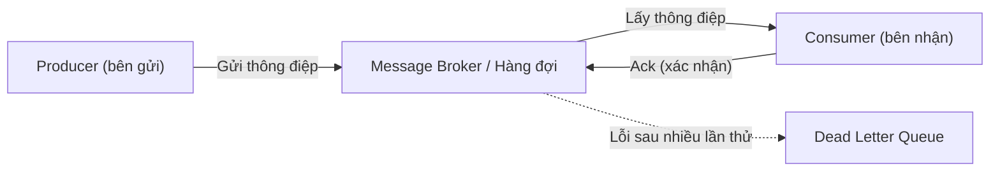

# Hàng đợi thông điệp (Message Queue)

## Khái niệm

**Hàng đợi thông điệp (Message Queue)** là một cơ chế giao tiếp bất đồng bộ (asynchronous communication) giữa các thành phần trong hệ thống phân tán. Bên gửi (producer) đặt thông điệp (message) vào hàng đợi, và bên nhận (consumer) lấy thông điệp ra để xử lý sau đó. Producer và consumer không cần hoạt động cùng lúc, cũng không cần biết đến nhau — chúng được **tách rời (decoupled)** thông qua một hệ thống trung gian gọi là **message broker (bộ môi giới thông điệp)**.

## Khi nào dùng / Vì sao quan trọng

- **Tách rời các dịch vụ (decoupling)**: Producer và consumer phát triển, mở rộng và triển khai độc lập.
- **Cân bằng tải và điều tiết (load leveling)**: Hàng đợi hấp thụ đỉnh tải (burst), consumer xử lý theo nhịp độ của mình.
- **Xử lý bất đồng bộ**: Tác vụ tốn thời gian (gửi email, xử lý ảnh, xuất báo cáo) được đẩy vào hàng đợi để xử lý nền, người dùng không phải chờ.
- **Độ tin cậy (reliability)**: Thông điệp được lưu bền vững (persistence), không mất khi consumer tạm ngừng.

### Use case tiêu biểu

- Xử lý đơn hàng thương mại điện tử (đặt hàng → hàng đợi → kho, thanh toán, giao vận).
- Gửi thông báo/email hàng loạt.
- Thu thập và xử lý nhật ký (log), sự kiện (event), dữ liệu IoT.
- Truyền dữ liệu giữa các microservice.

## Cách hoạt động

```
[Producer] --gửi msg--> [ MESSAGE BROKER / QUEUE ] --lấy msg--> [Consumer]
                              |  msg1 | msg2 | msg3 |
```

Sơ đồ dưới đây minh hoạ luồng bất đồng bộ producer → hàng đợi → consumer:



1. Producer gửi thông điệp tới broker.
2. Broker lưu thông điệp (có thể bền vững trên đĩa).
3. Consumer lấy thông điệp ra (pull) hoặc được đẩy (push) và xử lý.
4. Sau khi xử lý xong, consumer gửi **xác nhận (acknowledgement / ack)**; broker mới xóa thông điệp. Nếu không có ack, thông điệp được giao lại (redelivery).

### Hai mô hình phân phối

| Mô hình | Mô tả |
|---------|-------|
| **Point-to-Point (hàng đợi)** | Mỗi thông điệp được đúng **một** consumer xử lý. Dùng để phân chia công việc. |
| **Publish/Subscribe (pub/sub)** | Mỗi thông điệp được gửi tới **tất cả** subscriber đăng ký một chủ đề (topic). Dùng để phát tán sự kiện. |

### Các khái niệm quan trọng

- **Ack / Nack**: Xác nhận xử lý thành công/thất bại.
- **Dead Letter Queue (DLQ)**: Hàng đợi chứa thông điệp lỗi/không xử lý được sau nhiều lần thử.
- **At-least-once / At-most-once / Exactly-once**: Các mức đảm bảo giao nhận.
- **Idempotency (tính bất biến)**: Consumer nên xử lý an toàn khi cùng một thông điệp bị giao lại.

## Ví dụ

```python
# Minh hoạ producer/consumer với RabbitMQ dùng thư viện pika

import pika

# --- Producer: gửi thông điệp ---
conn = pika.BlockingConnection(pika.ConnectionParameters("localhost"))
ch = conn.channel()
ch.queue_declare(queue="don_hang", durable=True)  # hàng đợi bền vững

ch.basic_publish(
    exchange="",
    routing_key="don_hang",
    body="DON_HANG_001",
    properties=pika.BasicProperties(delivery_mode=2),  # lưu bền vững msg
)
print("Da gui don hang vao hang doi")

# --- Consumer: nhận và xử lý ---
def xu_ly(ch, method, props, body):
    print("Dang xu ly:", body.decode())
    ch.basic_ack(delivery_tag=method.delivery_tag)  # xác nhận sau khi xong

ch.basic_qos(prefetch_count=1)  # mỗi lần chỉ nhận 1 msg để cân bằng tải
ch.basic_consume(queue="don_hang", on_message_callback=xu_ly)
ch.start_consuming()
```

## RabbitMQ vs Kafka

| Tiêu chí | RabbitMQ | Apache Kafka |
|----------|----------|--------------|
| Bản chất | Message broker truyền thống (hàng đợi) | Nền tảng streaming/log phân tán (distributed log) |
| Mô hình | Đẩy (push) tới consumer, xóa sau khi ack | Consumer tự đọc theo offset, log được giữ lại |
| Lưu trữ | Xóa msg sau khi xử lý | Giữ msg theo thời gian/kích thước, cho phép đọc lại (replay) |
| Định tuyến | Linh hoạt (exchange: direct, topic, fanout) | Theo topic + partition |
| Thông lượng | Trung bình đến cao | Rất cao (hàng triệu msg/giây) |
| Thứ tự | Theo hàng đợi | Đảm bảo trong từng partition |
| Use case | Tác vụ nền, RPC, định tuyến phức tạp | Log, event streaming, phân tích dữ liệu lớn, event sourcing |

**Tóm tắt lựa chọn:** Dùng **RabbitMQ** khi cần định tuyến linh hoạt và mô hình tác vụ truyền thống với độ trễ thấp. Dùng **Kafka** khi cần thông lượng cực cao, lưu và phát lại luồng sự kiện, hoặc xây dựng đường ống dữ liệu (data pipeline).

## Ưu / nhược điểm

- **Ưu:**
  - Tách rời dịch vụ, tăng khả năng chịu lỗi và mở rộng.
  - Hấp thụ đỉnh tải, làm mượt lưu lượng.
  - Xử lý bất đồng bộ, cải thiện trải nghiệm người dùng.
- **Nhược:**
  - Tăng độ phức tạp vận hành (thêm một hệ thống phải giám sát).
  - Khó đảm bảo thứ tự và "exactly-once" tuyệt đối.
  - Khó gỡ lỗi luồng bất đồng bộ; cần giám sát DLQ và độ trễ.

## Câu hỏi phỏng vấn thường gặp

1. **Message queue giải quyết vấn đề gì?**
   - Tách rời producer/consumer, cho phép giao tiếp bất đồng bộ, hấp thụ đỉnh tải và tăng độ tin cậy.
2. **Phân biệt point-to-point và pub/sub.**
   - Point-to-point: mỗi msg tới đúng một consumer. Pub/sub: mỗi msg tới tất cả subscriber của topic.
3. **RabbitMQ khác Kafka thế nào?**
   - RabbitMQ là broker hàng đợi truyền thống, xóa msg sau ack; Kafka là log phân tán giữ msg lại, cho phép phát lại, thông lượng rất cao.
4. **Đảm bảo giao nhận "at-least-once" nghĩa là gì và hệ quả?**
   - Msg có thể được giao lại nhiều lần; consumer phải xử lý bất biến (idempotent) để tránh xử lý trùng.
5. **Dead Letter Queue dùng làm gì?**
   - Chứa các thông điệp lỗi/không xử lý được để phân tích và xử lý riêng, tránh chặn hàng đợi chính.

## Tham khảo

- RabbitMQ Documentation — Tutorials
- Apache Kafka Documentation — Design
