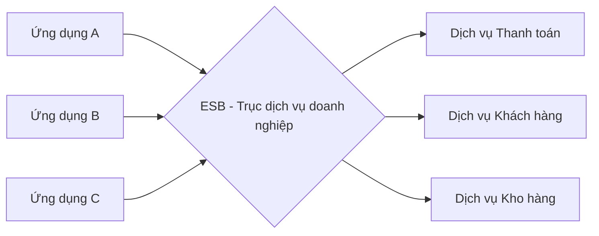
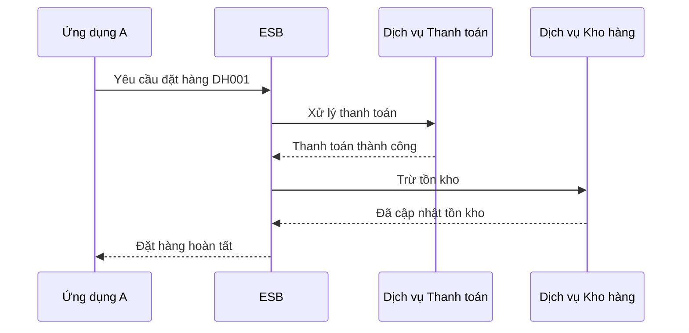

# Kiến trúc hướng dịch vụ (SOA - Service-Oriented Architecture)

## Khái niệm

**Kiến trúc hướng dịch vụ (SOA - Service-Oriented Architecture)** là một phong cách thiết kế phần mềm trong đó các chức năng nghiệp vụ (business functions) được đóng gói thành các **dịch vụ (services)** độc lập, có thể tái sử dụng (reusable) và giao tiếp với nhau qua mạng thông qua các giao thức chuẩn. Mỗi dịch vụ thực hiện một khả năng nghiệp vụ hoàn chỉnh (ví dụ: xử lý thanh toán, quản lý khách hàng) và có thể được nhiều ứng dụng khác nhau sử dụng chung.

## Khi nào dùng / Vì sao quan trọng

- Khi doanh nghiệp lớn có nhiều hệ thống rời rạc (legacy) cần **tích hợp (integration)** với nhau.
- Khi muốn **tái sử dụng** các chức năng nghiệp vụ giữa nhiều ứng dụng thay vì viết lại.
- Khi cần **tách biệt (decoupling)** giữa nhà cung cấp dịch vụ (service provider) và bên tiêu thụ (service consumer) để mỗi bên phát triển độc lập.

SOA phổ biến trong các hệ thống doanh nghiệp lớn (ngân hàng, viễn thông) từ những năm 2000, và là tiền thân về mặt tư tưởng của kiến trúc microservices.

## Nguyên lý cốt lõi

1. **Đóng gói dịch vụ (Service encapsulation)**: Mỗi dịch vụ che giấu chi tiết cài đặt bên trong, chỉ lộ ra giao diện (interface).
2. **Liên kết lỏng lẻo (Loose coupling)**: Dịch vụ giảm thiểu phụ thuộc lẫn nhau; thay đổi bên trong một dịch vụ không ảnh hưởng các dịch vụ khác.
3. **Hợp đồng dịch vụ (Service contract)**: Dịch vụ tuân theo một hợp đồng chuẩn mô tả cách gọi (ví dụ: WSDL đối với SOAP).
4. **Trừu tượng hóa (Abstraction)**: Bên tiêu thụ không cần biết dịch vụ được cài đặt thế nào.
5. **Khả năng tái sử dụng (Reusability)**: Một dịch vụ được nhiều ứng dụng dùng lại.
6. **Khả năng kết hợp (Composability)**: Nhiều dịch vụ nhỏ ghép lại thành quy trình nghiệp vụ lớn hơn.
7. **Khả năng khám phá (Discoverability)**: Dịch vụ được đăng ký trong một sổ đăng ký (service registry) để bên khác tìm thấy.

## Cách hoạt động

SOA truyền thống thường dựa vào một **trục dịch vụ doanh nghiệp (ESB - Enterprise Service Bus)** làm trung gian định tuyến, biến đổi và điều phối thông điệp giữa các dịch vụ.

```
[Ứng dụng A] ---\                              /--- [Dịch vụ Thanh toán]
                 \                            /
[Ứng dụng B] -----> [ ESB - Enterprise Bus ] -----> [Dịch vụ Khách hàng]
                 /                            \
[Ứng dụng C] ---/                              \--- [Dịch vụ Kho hàng]
```

Sơ đồ dưới đây minh hoạ vai trò trung tâm của ESB trong việc định tuyến giữa các ứng dụng và dịch vụ:



- **Nhà cung cấp dịch vụ (Service Provider)**: Triển khai và đăng ký dịch vụ.
- **Sổ đăng ký dịch vụ (Service Registry)**: Nơi lưu thông tin và địa chỉ dịch vụ (ví dụ: UDDI).
- **Bên tiêu thụ dịch vụ (Service Consumer)**: Tìm dịch vụ trong registry và gọi nó.
- **ESB**: Xử lý định tuyến, chuyển đổi định dạng, giao thức, và các mối quan tâm xuyên suốt.

Giao thức phổ biến trong SOA truyền thống: **SOAP (Simple Object Access Protocol)** dùng XML, cùng các chuẩn WS-* (WS-Security, WS-ReliableMessaging).

### ESB (Enterprise Service Bus) chi tiết

ESB là "xương sống" của SOA truyền thống, đóng vai trò trung gian thông minh giữa các dịch vụ. Các chức năng cốt lõi của ESB:

- **Định tuyến thông điệp (routing)**: Định tuyến theo nội dung (content-based routing) — quyết định gửi thông điệp tới dịch vụ nào dựa trên dữ liệu bên trong.
- **Biến đổi định dạng (transformation)**: Chuyển đổi dữ liệu giữa các định dạng khác nhau (XML ↔ JSON, XSLT), để các hệ thống dùng chuẩn khác nhau vẫn nói chuyện được.
- **Chuyển đổi giao thức (protocol bridging)**: Cầu nối giữa các giao thức (HTTP, JMS, FTP, SOAP) để hệ thống cũ và mới tích hợp.
- **Điều phối (orchestration)**: Ghép nhiều lời gọi dịch vụ thành một quy trình nghiệp vụ (thường qua BPEL - Business Process Execution Language).
- **Mối quan tâm xuyên suốt**: Bảo mật, ghi nhật ký, giám sát, xử lý lỗi và giao dịch tập trung tại ESB.

**Rủi ro của ESB:** Vì mọi thứ đi qua ESB nên nó dễ trở thành **điểm nghẽn (bottleneck)** và **điểm lỗi tập trung (single point of failure)**. ESB cũng thường tích tụ quá nhiều logic nghiệp vụ ("ESB béo"), khiến việc thay đổi trở nên rủi ro và tập trung quyền lực vào đội quản trị ESB.

Sơ đồ tuần tự dưới đây minh hoạ ESB điều phối (orchestration) một quy trình nghiệp vụ "đặt hàng" bằng cách gọi lần lượt nhiều dịch vụ và tổng hợp kết quả:



### SOAP và WSDL chi tiết

**SOAP (Simple Object Access Protocol)** là giao thức trao đổi thông điệp dựa trên XML. Một thông điệp SOAP gồm:

- **Envelope (phong bì)**: Bao ngoài toàn bộ thông điệp.
- **Header (tùy chọn)**: Chứa metadata như thông tin bảo mật (WS-Security), giao dịch, định tuyến.
- **Body**: Chứa nội dung thực (lời gọi hàm và tham số, hoặc dữ liệu trả về).
- **Fault**: Khối mô tả lỗi khi xử lý thất bại.

```xml
<!-- Ví dụ thông điệp SOAP gọi dịch vụ thanh toán -->
<soap:Envelope xmlns:soap="http://www.w3.org/2003/05/soap-envelope">
  <soap:Header>
    <!-- Thông tin bảo mật WS-Security có thể đặt ở đây -->
  </soap:Header>
  <soap:Body>
    <XuLyThanhToan xmlns="http://example.com/thanhtoan">
      <MaDon>DH001</MaDon>
      <SoTien>500000</SoTien>
    </XuLyThanhToan>
  </soap:Body>
</soap:Envelope>
```

**WSDL (Web Services Description Language)** là tài liệu XML mô tả **hợp đồng** của một web service — như một "bản kê khai giao diện" máy có thể đọc được. WSDL định nghĩa:

- **`types`**: Kiểu dữ liệu (dùng XML Schema).
- **`message`**: Cấu trúc các thông điệp trao đổi.
- **`portType`** (hay `interface`): Tập hợp các thao tác (operations) mà dịch vụ cung cấp.
- **`binding`**: Cách các thao tác ánh xạ sang giao thức cụ thể (thường SOAP over HTTP).
- **`service`**: Địa chỉ endpoint thực tế của dịch vụ.

Từ WSDL, công cụ có thể tự sinh mã client (stub) để gọi dịch vụ mà không cần viết tay. **UDDI (Universal Description, Discovery and Integration)** là chuẩn cho sổ đăng ký dịch vụ nơi các WSDL được công bố và tra cứu.

### Chồng chuẩn WS-* (WS-* standards)

SOA truyền thống đi kèm một bộ chuẩn "WS-*" giải quyết các mối quan tâm cấp doanh nghiệp:

| Chuẩn | Mục đích |
|-------|----------|
| WS-Security | Mã hóa, ký số, xác thực ở cấp thông điệp |
| WS-ReliableMessaging | Đảm bảo giao nhận tin cậy (không mất, không trùng) |
| WS-AtomicTransaction | Giao dịch phân tán (two-phase commit) |
| WS-Addressing | Định tuyến và địa chỉ hóa thông điệp độc lập giao thức |
| WS-Policy | Mô tả yêu cầu/năng lực của dịch vụ |

Sức mạnh của WS-* là chuẩn hóa cao và tính năng doanh nghiệp đầy đủ, nhưng đổi lại là **độ phức tạp lớn và overhead XML nặng nề**.

## Ví dụ

```python
# Minh hoạ khái niệm: một dịch vụ tự chứa với hợp đồng rõ ràng.
# Trong SOA thực tế, dịch vụ này sẽ lộ ra qua SOAP/WSDL hoặc REST.

class DichVuThanhToan:
    """Dịch vụ độc lập, đóng gói toàn bộ logic thanh toán."""

    def xu_ly_thanh_toan(self, ma_don: str, so_tien: float) -> dict:
        # Bên tiêu thụ chỉ thấy giao diện này, không thấy chi tiết bên trong
        # (kết nối cổng thanh toán, ghi sổ, chống gian lận...)
        return {"ma_don": ma_don, "trang_thai": "THANH_CONG", "so_tien": so_tien}

# Bên tiêu thụ gọi dịch vụ mà không cần biết cài đặt bên trong
dich_vu = DichVuThanhToan()
ket_qua = dich_vu.xu_ly_thanh_toan("DH001", 500000)
print(ket_qua)  # {'ma_don': 'DH001', 'trang_thai': 'THANH_CONG', 'so_tien': 500000}
```

## Ưu / nhược điểm

- **Ưu:**
  - **Tái sử dụng** dịch vụ giữa nhiều ứng dụng, giảm trùng lặp.
  - **Tích hợp** các hệ thống cũ và mới, đa nền tảng.
  - **Liên kết lỏng lẻo** giúp thay đổi cục bộ dễ dàng.
  - Phù hợp với các quy trình nghiệp vụ phức tạp trong doanh nghiệp lớn.
- **Nhược:**
  - **ESB là điểm nghẽn và điểm lỗi tập trung** nếu thiết kế sai.
  - **Độ phức tạp cao** do các chuẩn WS-*, XML nặng nề.
  - **Hiệu năng thấp hơn** do overhead của SOAP/XML.
  - Quản trị (governance) và versioning dịch vụ khó khăn.

## So sánh với Microservices

| Tiêu chí | SOA | Microservices |
|----------|-----|---------------|
| Phạm vi dịch vụ | Thô, cấp doanh nghiệp (coarse-grained) | Nhỏ, tập trung một chức năng (fine-grained) |
| Giao tiếp | Thường qua ESB, SOAP/XML | Nhẹ: REST/JSON, gRPC, message queue |
| Chia sẻ dữ liệu | Thường dùng chung cơ sở dữ liệu | Mỗi dịch vụ có DB riêng |
| Liên kết | Có xu hướng tập trung qua ESB | Phi tập trung, "smart endpoints, dumb pipes" |
| Triển khai | Thường đóng gói lớn | Độc lập từng dịch vụ, thường qua container |
| Trọng tâm | Tái sử dụng, tích hợp doanh nghiệp | Tính độc lập, tốc độ triển khai |

Có thể coi microservices là một cách tiếp cận chi tiết hơn (fine-grained) và phi tập trung hơn so với SOA, loại bỏ ESB nặng nề.

### Điểm giống và khác cốt lõi

**Điểm giống:** Cả hai đều chia hệ thống thành các dịch vụ, đề cao liên kết lỏng lẻo, tái sử dụng và tách biệt mối quan tâm.

**Khác biệt về tư tưởng:**

- **Chia sẻ dữ liệu**: SOA thường dùng chung một cơ sở dữ liệu doanh nghiệp; microservices áp dụng nguyên tắc "database per service" — mỗi dịch vụ sở hữu dữ liệu riêng, giao tiếp qua API.
- **Trung gian giao tiếp**: SOA đặt logic vào ESB thông minh ("smart pipes"); microservices dùng "smart endpoints, dumb pipes" — logic ở dịch vụ, hạ tầng truyền tin chỉ chuyển thông điệp.
- **Kích thước dịch vụ**: SOA có dịch vụ thô, cấp doanh nghiệp; microservices nhỏ, mỗi dịch vụ một khả năng nghiệp vụ (bounded context theo DDD).
- **Triển khai**: SOA thường đóng gói và triển khai lớn; microservices triển khai độc lập, thường qua container/Kubernetes, hỗ trợ CI/CD nhanh.
- **Quản trị**: SOA quản trị tập trung, chuẩn hóa toàn doanh nghiệp; microservices quản trị phi tập trung, mỗi đội tự chọn công nghệ (polyglot).

### Khi nào chọn cái nào

| Chọn SOA khi... | Chọn Microservices khi... |
|-----------------|---------------------------|
| Cần tích hợp nhiều hệ thống legacy đa nền tảng | Cần tốc độ triển khai và mở rộng độc lập cao |
| Doanh nghiệp lớn cần quản trị/chuẩn hóa tập trung | Đội ngũ nhỏ, tự chủ, theo mô hình DevOps |
| Đã đầu tư vào ESB và chuẩn WS-* | Xây dựng hệ thống cloud-native mới |
| Giao dịch phân tán phức tạp cần WS-* | Chấp nhận nhất quán cuối cùng để đổi lấy tính độc lập |

## Playground: Mô phỏng định tuyến qua ESB

Demo dưới đây mô phỏng một ESB đơn giản định tuyến thông điệp theo nội dung (content-based routing) tới đúng dịch vụ đăng ký xử lý, minh hoạ vai trò trung gian của ESB.

<div class="js-demo" data-title="ESB định tuyến theo nội dung">
<textarea class="js-demo-src">
// Mô phỏng ESB định tuyến thông điệp tới dịch vụ phù hợp
class ESB {
  constructor() { this.routes = {}; }        // bản đồ loại -> dịch vụ
  register(loai, handler) {                  // đăng ký dịch vụ
    this.routes[loai] = handler;
    print(`Đã đăng ký dịch vụ cho loại "${loai}"`);
  }
  send(msg) {                                // ESB nhận và định tuyến
    const handler = this.routes[msg.loai];
    if (!handler) { print(`Không có dịch vụ cho "${msg.loai}"`); return; }
    print(`ESB định tuyến "${msg.loai}" -> dịch vụ tương ứng`);
    handler(msg);
  }
}

const esb = new ESB();
esb.register('thanh_toan', m => print(`  [Thanh toán] xử lý đơn ${m.ma} số tiền ${m.so_tien}`));
esb.register('kho_hang',  m => print(`  [Kho hàng] trừ tồn kho cho đơn ${m.ma}`));

print('--- Bắt đầu gửi thông điệp ---');
esb.send({ loai: 'thanh_toan', ma: 'DH001', so_tien: 500000 });
esb.send({ loai: 'kho_hang', ma: 'DH001' });
esb.send({ loai: 'giao_van', ma: 'DH001' });  // không có dịch vụ đăng ký
</textarea>
</div>

## Câu hỏi phỏng vấn thường gặp

1. **SOA là gì và các nguyên lý chính?**
   - Là kiến trúc đóng gói chức năng nghiệp vụ thành dịch vụ độc lập, tái sử dụng, liên kết lỏng lẻo, giao tiếp qua giao thức chuẩn theo hợp đồng.
2. **ESB đóng vai trò gì trong SOA?**
   - ESB là trung gian định tuyến, biến đổi thông điệp và điều phối giao tiếp giữa các dịch vụ; nhưng dễ trở thành điểm nghẽn và điểm lỗi tập trung.
3. **SOA khác microservices ở điểm nào?**
   - SOA thô hơn, thường dùng ESB và chia sẻ DB; microservices nhỏ hơn, phi tập trung, mỗi dịch vụ có DB riêng và giao tiếp nhẹ.
4. **Liên kết lỏng lẻo (loose coupling) mang lại lợi ích gì?**
   - Cho phép thay đổi một dịch vụ mà không ảnh hưởng dịch vụ khác, tăng khả năng bảo trì và tái sử dụng.
5. **Nhược điểm lớn nhất của SOA truyền thống?**
   - Độ phức tạp và overhead của các chuẩn WS-*/SOAP, cùng rủi ro ESB trở thành nghẽn cổ chai.

## Tham khảo

- Thomas Erl, *SOA: Principles of Service Design*
- Martin Fowler — Microservices vs SOA
