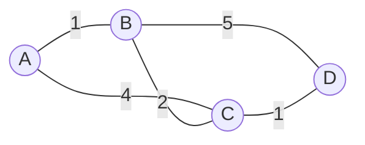
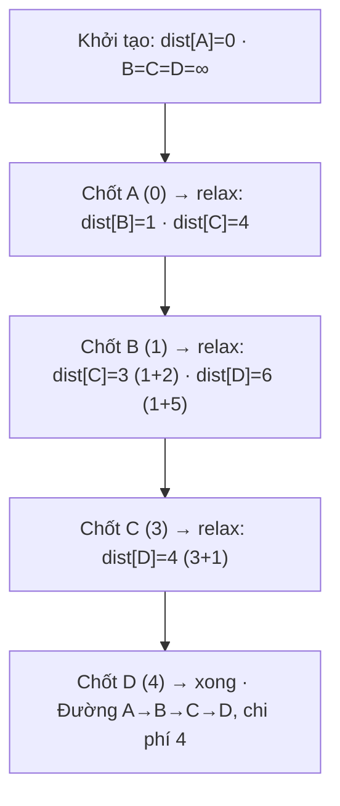

# Thuật toán định tuyến (Routing Algorithms)

## Khái niệm
Định tuyến (routing) là quá trình chọn đường đi cho gói tin (packet) qua
mạng từ nguồn tới đích. Bộ định tuyến (router) dùng thuật toán định tuyến để
xây dựng bảng định tuyến (routing table), trong đó cốt lõi là các thuật toán
tìm đường đi ngắn nhất (shortest path) như Dijkstra và Bellman-Ford.

## Khi nào dùng / Vì sao quan trọng
- Là cơ chế nền cho việc chuyển gói tin trên Internet.
- Quyết định hiệu năng (độ trễ, băng thông) và độ tin cậy của mạng.
- Hiểu định tuyến giúp trả lời câu hỏi phỏng vấn về giao thức OSPF, RIP,
  BGP và về đồ thị (graph) trong giải thuật.

## Cách hoạt động
Mạng được mô hình hoá thành đồ thị (graph): nút (node) là router, cạnh
(edge) là liên kết với trọng số (cost) thể hiện độ trễ, băng thông hay số
chặng (hop).

Sơ đồ dưới là một đồ thị mạng đơn giản; nhãn trên mỗi cạnh là chi phí. Từ A
tới D, Dijkstra chọn đường A→B→C→D (tổng chi phí 4) thay vì A→C→D (5):



### Dijkstra
Tìm đường đi ngắn nhất từ một nguồn tới mọi đích với trọng số **không âm**.
- Duy trì tập nút đã "chốt" khoảng cách ngắn nhất; mỗi bước chọn nút chưa
  chốt có khoảng cách nhỏ nhất rồi cập nhật (relax) các hàng xóm.
- Dùng hàng đợi ưu tiên (priority queue / min-heap) để tăng tốc.
- Là cơ sở của thuật toán link state (ví dụ giao thức OSPF).

**Các bước chi tiết (dùng đồ thị ở trên, nguồn A):**

1. Khởi tạo: `dist[A]=0`, mọi nút khác `= ∞`. Tập chưa chốt = {A,B,C,D}.
2. Chọn A (nhỏ nhất, dist=0), chốt A. Relax hàng xóm: `dist[B]=1`, `dist[C]=4`.
3. Chọn B (dist=1, nhỏ nhất trong chưa chốt), chốt B. Relax: qua B tới C là
   `1+2=3 < 4` → `dist[C]=3`; tới D là `1+5=6` → `dist[D]=6`.
4. Chọn C (dist=3), chốt C. Relax: qua C tới D là `3+1=4 < 6` → `dist[D]=4`.
5. Chọn D (dist=4), chốt D. Hết nút. Kết quả: A=0, B=1, C=3, D=4.

Đường đi ngắn nhất A→D được truy vết qua "nút cha" (predecessor): D←C←B←A,
tức **A→B→C→D** với tổng chi phí 4.

Sơ đồ dưới tóm tắt từng bước chốt nút và relax các đỉnh của Dijkstra:



!!! warning "Vì sao Dijkstra sai với trọng số âm"
    Dijkstra "chốt" một nút ngay khi lấy ra khỏi hàng đợi, giả định rằng không
    có đường nào rẻ hơn xuất hiện sau. Với cạnh âm, một đường đi qua nút chốt
    muộn hơn có thể rẻ hơn → giả định bị phá vỡ. Khi đó phải dùng Bellman-Ford.

### Bellman-Ford
Tìm đường đi ngắn nhất từ một nguồn, **cho phép trọng số âm** và phát hiện
chu trình âm (negative cycle).
- Lặp lại `V-1` lần, mỗi lần relax tất cả các cạnh.
- Chậm hơn Dijkstra nhưng linh hoạt hơn; là cơ sở của thuật toán distance
  vector (ví dụ giao thức RIP).

**Vì sao lặp đúng `V-1` lần?** Một đường đi ngắn nhất (không có chu trình) có
tối đa `V-1` cạnh. Sau vòng lặp thứ `k`, mọi đường đi ngắn nhất dùng ≤ `k`
cạnh đã được tính đúng. Do đó sau `V-1` vòng, mọi khoảng cách đã ổn định.
**Phát hiện chu trình âm:** nếu ở vòng thứ `V` (thêm một vòng nữa) vẫn còn cạnh
relax được, tức tồn tại chu trình âm — khoảng cách sẽ giảm mãi không đáy.

### So sánh hai thuật toán
| Tiêu chí | Dijkstra | Bellman-Ford |
|----------|----------|--------------|
| Trọng số âm | Không hỗ trợ | Hỗ trợ |
| Phát hiện chu trình âm | Không | Có |
| Độ phức tạp | O((V+E) log V) với heap | O(V·E) |
| Ý tưởng | Tham lam (greedy) | Quy hoạch động (dynamic programming) |
| Ứng dụng định tuyến | Link state (OSPF) | Distance vector (RIP) |

### Distance Vector vs Link State
Hai họ giao thức định tuyến chính:

| Tiêu chí | Distance Vector | Link State |
|----------|-----------------|------------|
| Thông tin mỗi router biết | Chỉ khoảng cách tới hàng xóm | Toàn bộ topology mạng |
| Cách chia sẻ | Gửi bảng định tuyến cho hàng xóm định kỳ | Phát tán (flooding) trạng thái liên kết cho mọi router |
| Thuật toán | Bellman-Ford | Dijkstra |
| Hội tụ (convergence) | Chậm, dễ lỗi count-to-infinity | Nhanh, ổn định |
| Tài nguyên | Ít CPU/bộ nhớ | Tốn CPU/bộ nhớ hơn |
| Ví dụ giao thức | RIP | OSPF, IS-IS |

- **Distance vector:** "định tuyến theo tin đồn" – router chỉ biết chi phí
  qua hàng xóm, dễ gặp vấn đề đếm tới vô cực (count-to-infinity), khắc phục
  bằng split horizon, poison reverse.
- **Link state:** mỗi router có bản đồ đầy đủ nên tự tính đường ngắn nhất
  bằng Dijkstra; hội tụ nhanh và ít vòng lặp hơn.

## Ví dụ
```python
import heapq

def dijkstra(do_thi, nguon):
    # do_thi: dict {nut: [(hang_xom, trong_so), ...]}
    khoang_cach = {nut: float("inf") for nut in do_thi}
    khoang_cach[nguon] = 0
    hang_doi = [(0, nguon)]                 # (khoảng cách, nút)
    while hang_doi:
        d, u = heapq.heappop(hang_doi)
        if d > khoang_cach[u]:
            continue                        # bỏ qua bản ghi cũ
        for v, w in do_thi[u]:              # relax các cạnh
            if khoang_cach[u] + w < khoang_cach[v]:
                khoang_cach[v] = khoang_cach[u] + w
                heapq.heappush(hang_doi, (khoang_cach[v], v))
    return khoang_cach

do_thi = {
    "A": [("B", 1), ("C", 4)],
    "B": [("C", 2), ("D", 5)],
    "C": [("D", 1)],
    "D": [],
}
print(dijkstra(do_thi, "A"))   # {'A': 0, 'B': 1, 'C': 3, 'D': 4}
```

!!! tip "Chạy được ngay — Dijkstra in đường đi ngắn nhất"
    Đoạn dưới chạy Dijkstra trên đúng đồ thị ở sơ đồ trên, in khoảng cách nhỏ
    nhất tới mọi nút **và truy vết đường đi** từ A tới D. Bấm **▶ Chạy**; đổi
    `graph`, `source` hoặc `target` để thử đồ thị/đích khác.

<div class="js-demo" data-title="Dijkstra — đường đi ngắn nhất trên đồ thị nhỏ">
<textarea class="js-demo-src">
// Đồ thị vô hướng: nút -> [[hàng xóm, trọng số], ...]
const graph = {
  A: [['B', 1], ['C', 4]],
  B: [['A', 1], ['C', 2], ['D', 5]],
  C: [['A', 4], ['B', 2], ['D', 1]],
  D: [['B', 5], ['C', 1]],
};
const source = 'A', target = 'D';

function dijkstra(graph, source) {
  const dist = {}, prev = {}, visited = {};
  for (const n in graph) dist[n] = Infinity;
  dist[source] = 0;

  // Hàng đợi ưu tiên "nghèo" (đồ thị nhỏ nên quét tuyến tính là đủ)
  while (true) {
    let u = null, best = Infinity;
    for (const n in graph) {
      if (!visited[n] && dist[n] < best) { best = dist[n]; u = n; }
    }
    if (u === null) break;          // hết nút tới được
    visited[u] = true;
    for (const [v, w] of graph[u]) {  // relax các cạnh
      if (dist[u] + w < dist[v]) {
        dist[v] = dist[u] + w;
        prev[v] = u;
        print(`  relax ${u}→${v}: dist[${v}] = ${dist[v]}`);
      }
    }
  }
  return { dist, prev };
}

const { dist, prev } = dijkstra(graph, source);
print('');
print('Khoảng cách ngắn nhất từ ' + source + ':');
for (const n in dist) print('  ' + n + ' = ' + dist[n]);

// Truy vết đường đi source -> target qua mảng prev
let path = [], cur = target;
while (cur !== undefined) { path.unshift(cur); cur = prev[cur]; }
print('');
if (path[0] === source)
  print('Đường đi ngắn nhất ' + source + '→' + target + ': ' +
        path.join(' → ') + '  (chi phí ' + dist[target] + ')');
else
  print('Không có đường đi tới ' + target);
</textarea>
</div>

```python
def bellman_ford(canh, so_nut, nguon):
    # canh: list [(u, v, trong_so)] – cho phép trọng số âm
    kc = [float("inf")] * so_nut
    kc[nguon] = 0
    for _ in range(so_nut - 1):            # lặp V-1 lần
        for u, v, w in canh:
            if kc[u] + w < kc[v]:
                kc[v] = kc[u] + w
    for u, v, w in canh:                   # phát hiện chu trình âm
        if kc[u] + w < kc[v]:
            raise ValueError("Có chu trình âm")
    return kc
```

## Độ phức tạp
| Thuật toán | Thời gian | Bộ nhớ |
|------------|-----------|--------|
| Dijkstra (min-heap) | O((V+E) log V) | O(V) |
| Bellman-Ford | O(V·E) | O(V) |

## Ưu / nhược điểm
- **Dijkstra – Ưu:** nhanh; **Nhược:** không xử lý được trọng số âm.
- **Bellman-Ford – Ưu:** xử lý trọng số âm, phát hiện chu trình âm;
  **Nhược:** chậm hơn.
- **Link state – Ưu:** hội tụ nhanh, ổn định; **Nhược:** tốn tài nguyên.
- **Distance vector – Ưu:** đơn giản, nhẹ; **Nhược:** hội tụ chậm, dễ vòng lặp.

## Câu hỏi phỏng vấn thường gặp
1. So sánh Dijkstra và Bellman-Ford. Khi nào phải dùng Bellman-Ford?
2. Vì sao Dijkstra không hoạt động đúng với trọng số âm?
3. Phân biệt định tuyến distance vector và link state.
4. Vấn đề count-to-infinity là gì và cách khắc phục?
5. OSPF và RIP dùng thuật toán nào? Khác nhau ra sao?
6. Độ phức tạp của Dijkstra khi dùng min-heap là bao nhiêu?

## Tham khảo
- Kurose & Ross — Computer Networking (Chương Network Layer)
- Cormen (CLRS) — Introduction to Algorithms (Shortest Paths)
