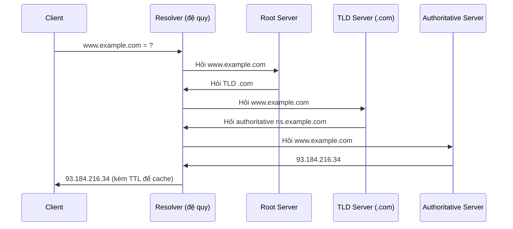

# Hệ thống tên miền (DNS – Domain Name System)

## Khái niệm
DNS (Domain Name System) là hệ thống phân tán, phân cấp giúp chuyển đổi tên
miền dễ nhớ (ví dụ `example.com`) thành địa chỉ IP mà máy tính dùng để kết
nối (ví dụ `93.184.216.34`). DNS được ví như "danh bạ điện thoại" của
Internet.

## Khi nào dùng / Vì sao quan trọng
- Con người nhớ tên miền dễ hơn nhớ dãy số IP; DNS làm cầu nối này.
- Cho phép đổi địa chỉ IP máy chủ mà không cần đổi tên miền.
- Hỗ trợ cân bằng tải (load balancing), CDN, và định tuyến theo vùng địa lý.
- Hiểu DNS giúp gỡ lỗi kết nối và tối ưu độ trễ (latency) truy cập web.

## Cách hoạt động

### Cấu trúc phân cấp (Hierarchy)
Không gian tên miền có dạng cây, đọc từ phải sang trái:
```
                    . (Root)
                    |
      ┌─────────────┼─────────────┐
     .com          .org          .vn        <- TLD (Top-Level Domain)
      |
   example.com                              <- Domain
      |
   www.example.com                          <- Subdomain
```

### Các loại máy chủ DNS
| Loại | Vai trò |
|------|---------|
| DNS Resolver (đệ quy) | Nhận truy vấn từ client, đi hỏi thay và trả kết quả |
| Root Name Server | Trỏ tới máy chủ TLD tương ứng |
| TLD Name Server | Quản lý `.com`, `.vn`... trỏ tới máy chủ có thẩm quyền |
| Authoritative Name Server | Nắm bản ghi chính thức của tên miền |

### Quy trình phân giải (Resolution) `www.example.com`
```
Client -> Resolver: www.example.com = ?
Resolver -> Root:   -> "hỏi TLD .com tại a.gtld-servers.net"
Resolver -> TLD:    -> "hỏi authoritative ns.example.com"
Resolver -> Auth:   -> "93.184.216.34"
Resolver -> Client: 93.184.216.34  (kèm TTL để cache)
```
Đầu tiên hệ thống luôn kiểm tra bộ đệm (cache) ở nhiều cấp trước khi đi hỏi.

Sơ đồ tuần tự minh hoạ phân giải đệ quy (client) kết hợp lặp (resolver):



### Các loại bản ghi (Record Types)
| Bản ghi | Ý nghĩa |
|---------|---------|
| A | Ánh xạ tên miền sang địa chỉ IPv4 |
| AAAA | Ánh xạ tên miền sang địa chỉ IPv6 |
| CNAME | Bí danh (alias) trỏ tên này tới tên khác |
| MX | Mail Exchange – máy chủ nhận email cho tên miền |
| NS | Name Server – khai báo máy chủ tên có thẩm quyền |
| TXT | Văn bản tuỳ ý (SPF, xác minh miền, DKIM) |
| SOA | Start of Authority – thông tin quản trị vùng (zone) |
| PTR | Phân giải ngược IP -> tên miền (reverse DNS) |
| SRV | Định vị dịch vụ (host + port) |

### Caching và TTL
- Mỗi bản ghi có TTL (Time To Live) tính bằng giây, quy định thời gian được
  lưu cache trước khi phải truy vấn lại.
- Cache tồn tại ở nhiều tầng: trình duyệt, hệ điều hành, resolver của ISP.
- TTL thấp: cập nhật nhanh nhưng tải truy vấn cao. TTL cao: giảm tải nhưng
  chậm phản ánh thay đổi.

### DNS đệ quy vs lặp (Recursive vs Iterative)
| Tiêu chí | Truy vấn đệ quy (Recursive) | Truy vấn lặp (Iterative) |
|----------|-----------------------------|--------------------------|
| Ai làm việc | Resolver đi hỏi hết thay client | Client/resolver tự hỏi từng máy chủ |
| Phản hồi | Trả thẳng kết quả cuối cùng | Trả về "hỏi tiếp máy chủ này" (referral) |
| Chủ thể dùng | Client -> Resolver | Resolver -> Root/TLD/Auth |
| Gánh nặng | Dồn về resolver | Chia đều, nhẹ cho máy chủ gốc |

Thực tế: client gửi truy vấn **đệ quy** tới resolver; resolver dùng truy vấn
**lặp** để lần lượt hỏi Root, TLD rồi Authoritative.

## Ví dụ
```python
import socket

# Phân giải cơ bản: tên miền -> IP (dùng resolver của hệ điều hành)
ip = socket.gethostbyname("example.com")
print(ip)   # ví dụ: 93.184.216.34

# Lấy nhiều thông tin địa chỉ (hỗ trợ cả IPv4 và IPv6)
for info in socket.getaddrinfo("example.com", 443):
    print(info[4])   # (địa chỉ, cổng)
```
```bash
# Công cụ dòng lệnh thông dụng để tra cứu DNS
dig www.example.com A       # tra bản ghi A
dig example.com MX +short   # tra máy chủ mail
nslookup example.com        # tra cứu nhanh
```

## Ưu / nhược điểm
- **Ưu:** phân tán và có cache nên chịu tải và độ trễ tốt; phân cấp giúp
  quản lý dễ dàng.
- **Nhược:** cache khiến thay đổi lan chậm (theo TTL); dễ bị tấn công như
  DNS spoofing/cache poisoning nếu không dùng DNSSEC.

## Câu hỏi phỏng vấn thường gặp
1. Mô tả quy trình phân giải DNS khi gõ một tên miền vào trình duyệt.
2. Phân biệt truy vấn đệ quy và truy vấn lặp.
3. Bản ghi A khác AAAA và CNAME thế nào? Khi nào dùng MX?
4. TTL trong DNS là gì? Cache DNS xảy ra ở những đâu?
5. DNS dùng TCP hay UDP? Vì sao (cổng 53)?
6. DNS spoofing là gì và DNSSEC giải quyết ra sao?

## Tham khảo
- RFC 1034, RFC 1035 (DNS)
- Cloudflare Learning — What is DNS?
