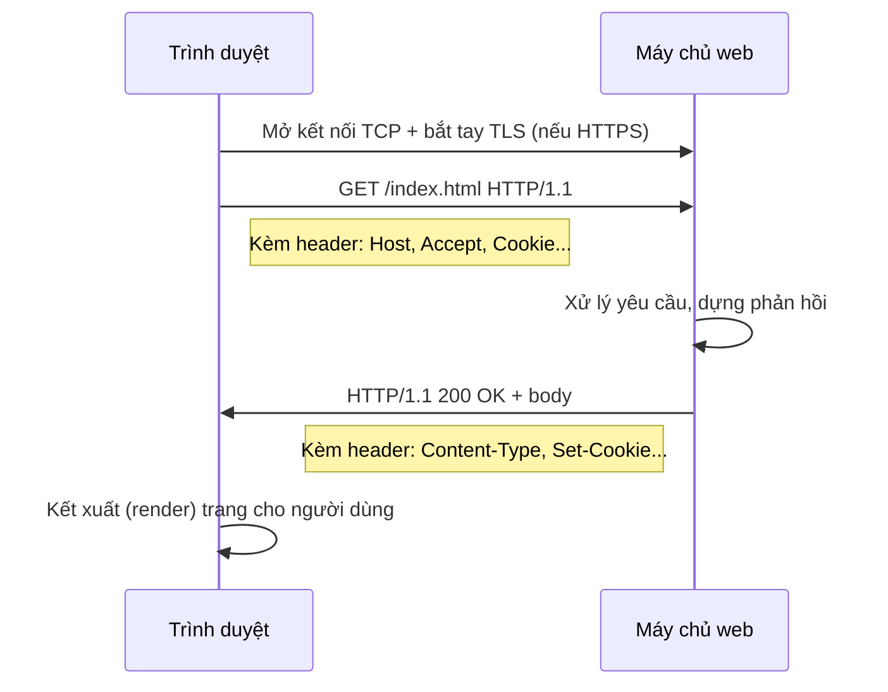

# Giao thức HTTP (HyperText Transfer Protocol)

## Khái niệm
HTTP (HyperText Transfer Protocol) là giao thức tầng ứng dụng theo mô hình
yêu cầu - phản hồi (request - response) dùng để truyền tài nguyên (trang
web, ảnh, API...) giữa máy khách (client, thường là trình duyệt) và máy chủ
(server). HTTP là giao thức phi trạng thái (stateless): mỗi yêu cầu độc lập,
server không tự nhớ các yêu cầu trước.

## Khi nào dùng / Vì sao quan trọng
- Nền tảng của World Wide Web và hầu hết các API hiện đại (REST API).
- Hiểu HTTP giúp thiết kế API đúng chuẩn, gỡ lỗi bằng công cụ như DevTools,
  curl, Postman, và tối ưu hiệu năng web.

## Cách hoạt động
Một giao dịch HTTP gồm client gửi yêu cầu (request) và server trả về phản
hồi (response), mỗi bên có dòng khởi đầu, các tiêu đề (header) và phần thân
(body) tuỳ chọn.
```
GET /index.html HTTP/1.1        <- dòng yêu cầu (method, path, version)
Host: example.com               <- header
Accept: text/html
                                <- dòng trống ngăn cách header và body

HTTP/1.1 200 OK                 <- dòng trạng thái (version, code, lý do)
Content-Type: text/html
Content-Length: 128

<html>...</html>                <- body
```

Sơ đồ tuần tự vòng đời một yêu cầu/phản hồi HTTP (qua HTTPS):



### Các phương thức (HTTP Methods)
| Phương thức | Ý nghĩa | An toàn (Safe) | Idempotent |
|-------------|---------|----------------|------------|
| GET | Lấy tài nguyên | Có | Có |
| POST | Tạo mới / gửi dữ liệu | Không | Không |
| PUT | Thay thế toàn bộ tài nguyên | Không | Có |
| PATCH | Cập nhật một phần | Không | Không |
| DELETE | Xoá tài nguyên | Không | Có |
| HEAD | Như GET nhưng chỉ lấy header | Có | Có |
| OPTIONS | Hỏi các phương thức được hỗ trợ | Có | Có |

- **Safe:** không làm thay đổi dữ liệu trên server.
- **Idempotent:** gọi nhiều lần cho kết quả giống gọi một lần.

Ghi chú thực dụng: GET không nên mang body và có thể bị cache; POST **không**
idempotent nên nếu gửi lại (F5, retry) có thể tạo trùng bản ghi — dùng
**idempotency key** để chống trùng. PUT gửi **toàn bộ** biểu diễn tài nguyên,
PATCH chỉ gửi phần thay đổi. DELETE idempotent vì xoá lần 2 vẫn cho trạng thái
"đã xoá" (dù có thể trả 404).

### Mã trạng thái (Status Code)
| Nhóm | Ý nghĩa | Ví dụ tiêu biểu |
|------|---------|-----------------|
| 1xx | Thông tin (Informational) | 100 Continue, 101 Switching Protocols |
| 2xx | Thành công (Success) | 200 OK, 201 Created, 204 No Content |
| 3xx | Chuyển hướng (Redirection) | 301 Moved Permanently, 302 Found, 304 Not Modified |
| 4xx | Lỗi phía client | 400 Bad Request, 401 Unauthorized, 403 Forbidden, 404 Not Found, 429 Too Many Requests |
| 5xx | Lỗi phía server | 500 Internal Server Error, 502 Bad Gateway, 503 Service Unavailable |

Vài phân biệt hay hỏi:

- **301 vs 302 vs 307/308:** 301 = chuyển hẳn (permanent, trình duyệt/SEO nhớ
  URL mới); 302 = tạm thời; 307/308 giữ nguyên method + body khi chuyển hướng
  (302/301 có thể đổi POST thành GET).
- **304 Not Modified:** dùng với cache có điều kiện (`If-None-Match`/ETag,
  `If-Modified-Since`); server không gửi lại body, tiết kiệm băng thông.
- **401 vs 403:** 401 = **chưa xác thực** (thiếu/hết hạn token → cần đăng nhập);
  403 = **đã xác thực nhưng không đủ quyền** (đăng nhập rồi vẫn bị cấm).
- **400 vs 422:** 400 = cú pháp yêu cầu sai; 422 = cú pháp đúng nhưng dữ liệu
  không hợp lệ về mặt nghiệp vụ (thường dùng khi validate form/JSON).
- **429 Too Many Requests:** vượt giới hạn tần suất (rate limit), thường kèm
  header `Retry-After`.
- **502 vs 503 vs 504:** 502 = gateway/proxy nhận phản hồi hỏng từ upstream;
  503 = server quá tải/bảo trì; 504 = gateway chờ upstream quá lâu (timeout).

### HTTP/1.1 vs HTTP/2 vs HTTP/3
| Tiêu chí | HTTP/1.1 | HTTP/2 | HTTP/3 |
|----------|----------|--------|--------|
| Năm | 1997 | 2015 | 2022 |
| Giao thức nền | TCP | TCP | QUIC (trên UDP) |
| Định dạng | Văn bản (text) | Nhị phân (binary) | Nhị phân |
| Đa luồng (Multiplexing) | Không (mỗi kết nối 1 request) | Có, trên 1 kết nối | Có |
| Head-of-line blocking | Có (tầng ứng dụng) | Còn ở tầng TCP | Loại bỏ (mỗi stream độc lập) |
| Nén header | Không | HPACK | QPACK |
| Server Push | Không | Có (ít dùng) | Có |

- **HTTP/1.1:** dùng keep-alive để tái sử dụng kết nối; vẫn bị nghẽn đầu
  hàng (head-of-line blocking).
- **HTTP/2:** ghép nhiều luồng (stream) trên một kết nối TCP, nén header.
- **HTTP/3:** chạy trên QUIC (UDP), thiết lập kết nối nhanh, không bị nghẽn
  do mất gói ở tầng TCP.

### HTTPS và TLS
HTTPS là HTTP chạy trên TLS (Transport Layer Security), mã hoá dữ liệu để
đảm bảo bảo mật (confidentiality), toàn vẹn (integrity) và xác thực
(authentication) server qua chứng chỉ số (certificate).
- **Bắt tay TLS (TLS handshake):** client và server thoả thuận phiên bản,
  bộ mã hoá (cipher suite), trao đổi khoá và xác minh chứng chỉ.
- Dùng mã hoá bất đối xứng (asymmetric) để trao khoá, rồi chuyển sang mã
  hoá đối xứng (symmetric) cho dữ liệu vì nhanh hơn.

### Cookie và Session
Vì HTTP phi trạng thái, cần cơ chế để duy trì trạng thái đăng nhập:
- **Cookie:** đoạn dữ liệu nhỏ server gửi qua header `Set-Cookie`, trình
  duyệt lưu lại và tự gửi kèm trong các yêu cầu sau (`Cookie` header).
- **Session:** server lưu trạng thái người dùng (giỏ hàng, đăng nhập) và
  gắn với một session ID; ID này thường được lưu trong cookie.
- Thuộc tính bảo mật cookie: `HttpOnly` (chống JS đọc), `Secure` (chỉ gửi
  qua HTTPS), `SameSite` (chống CSRF).

### CORS (Cross-Origin Resource Sharing)
Trình duyệt áp **Same-Origin Policy**: mã JS chỉ được đọc phản hồi từ cùng
"origin" (giao thức + tên miền + cổng). CORS là cơ chế server dùng header để
**cho phép** origin khác truy cập tài nguyên:
- **Origin:** ví dụ `https://app.com:443` khác `http://app.com` (khác giao
  thức) và khác `https://api.app.com` (khác tên miền).
- **Yêu cầu đơn giản (simple request):** GET/POST/HEAD với header/kiểu nội
  dung cơ bản → gửi thẳng, server trả `Access-Control-Allow-Origin`.
- **Preflight:** với method/header "không đơn giản" (PUT, DELETE, header tuỳ
  biến, `Content-Type: application/json`), trình duyệt gửi trước một yêu cầu
  `OPTIONS` hỏi quyền; server trả `Access-Control-Allow-Methods`,
  `Access-Control-Allow-Headers`. Nếu đạt, yêu cầu thật mới được gửi.
- Để gửi kèm cookie qua origin khác: client đặt `credentials: 'include'`,
  server phải trả `Access-Control-Allow-Credentials: true` và **không** dùng
  `Allow-Origin: *`.
- Lưu ý: CORS **không phải** cơ chế bảo mật server — nó chỉ ràng buộc trình
  duyệt. Công cụ như curl/Postman bỏ qua CORS.

!!! tip "Chạy được ngay — phân tích URL & tra ý nghĩa mã trạng thái"
    Đoạn dưới tự viết một hàm phân tích URL (không dùng thư viện ngoài) và một
    bảng tra mã trạng thái HTTP. Bấm **▶ Chạy**; đổi `url` hoặc mảng `codes` để
    thử URL/mã khác.

<div class="js-demo" data-title="Phân tích URL + tra mã trạng thái HTTP">
<textarea class="js-demo-src">
// --- Phần 1: tự phân tích URL bằng regex (không dùng URL API) ---
function parseUrl(url) {
  const re = /^(\w+):\/\/([^/:?#]+)(?::(\d+))?([^?#]*)(?:\?([^#]*))?(?:#(.*))?$/;
  const m = url.match(re);
  if (!m) return null;
  const [, scheme, host, port, path, query, hash] = m;
  const params = {};
  if (query) for (const kv of query.split('&')) {
    const [k, v = ''] = kv.split('=');
    params[decodeURIComponent(k)] = decodeURIComponent(v);
  }
  return {
    scheme, host,
    port: port || (scheme === 'https' ? '443' : '80'),
    path: path || '/',
    params, hash: hash || ''
  };
}

const url = 'https://shop.example.com:8443/san-pham/list?danh_muc=sach&trang=2#top';
const p = parseUrl(url);
print('== Phân tích URL ==');
print('URL   :', url);
print('Scheme:', p.scheme);
print('Host  :', p.host);
print('Port  :', p.port);
print('Path  :', p.path);
print('Query :', JSON.stringify(p.params));
print('Hash  :', p.hash);

// --- Phần 2: map mã trạng thái -> ý nghĩa tiếng Việt ---
const STATUS = {
  200: 'OK — thành công',
  201: 'Created — đã tạo tài nguyên',
  204: 'No Content — thành công, không có body',
  301: 'Moved Permanently — chuyển hẳn',
  302: 'Found — chuyển tạm thời',
  304: 'Not Modified — dùng lại bản cache',
  400: 'Bad Request — yêu cầu sai cú pháp',
  401: 'Unauthorized — chưa xác thực',
  403: 'Forbidden — không đủ quyền',
  404: 'Not Found — không tìm thấy',
  429: 'Too Many Requests — quá nhiều yêu cầu',
  500: 'Internal Server Error — lỗi máy chủ',
  502: 'Bad Gateway — gateway nhận phản hồi hỏng',
  503: 'Service Unavailable — máy chủ quá tải/bảo trì',
};
function nhomCua(code) {
  const g = Math.floor(code / 100);
  return {1:'Thông tin',2:'Thành công',3:'Chuyển hướng',4:'Lỗi client',5:'Lỗi server'}[g] || '?';
}

print('');
print('== Tra mã trạng thái ==');
const codes = [200, 301, 404, 403, 500, 503];
for (const c of codes) {
  print(c + ' [' + nhomCua(c) + '] → ' + (STATUS[c] || 'không rõ'));
}
</textarea>
</div>

## Ví dụ
```python
import requests

# Gửi yêu cầu GET và đọc mã trạng thái, header, body
r = requests.get("https://httpbin.org/get", params={"q": "http"})
print(r.status_code)          # 200
print(r.headers["Content-Type"])
print(r.json()["args"])       # {'q': 'http'}

# Gửi POST kèm dữ liệu JSON
r2 = requests.post("https://httpbin.org/post", json={"ten": "an"})
print(r2.status_code)         # 200

# Cookie được lưu và tự gửi lại nhờ Session
s = requests.Session()
s.get("https://httpbin.org/cookies/set/sid/abc123")
print(s.get("https://httpbin.org/cookies").json())  # {'sid': 'abc123'}
```

## Ưu / nhược điểm
- **Ưu:** đơn giản, phổ biến, dễ mở rộng qua header; stateless giúp dễ
  scale ngang (horizontal scaling).
- **Nhược:** stateless nên phải tự quản lý trạng thái (cookie/session);
  HTTP/1.1 kém hiệu quả với nhiều tài nguyên nhỏ.

## Câu hỏi phỏng vấn thường gặp
1. HTTP là stateless nghĩa là gì? Làm sao duy trì trạng thái đăng nhập?
2. Phân biệt GET và POST; PUT và PATCH. Idempotent là gì?
3. Kể ý nghĩa các nhóm mã trạng thái. 301 khác 302 ra sao? 401 khác 403?
4. HTTP/2 cải tiến gì so với HTTP/1.1? HTTP/3 dùng giao thức nền nào?
5. HTTPS hoạt động thế nào? Bắt tay TLS gồm những bước gì?
6. Cookie khác session ra sao? SameSite dùng để làm gì?

## Tham khảo
- RFC 9110 (HTTP Semantics), RFC 9114 (HTTP/3)
- MDN Web Docs — HTTP
