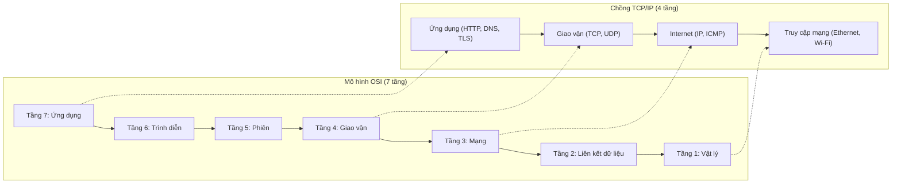
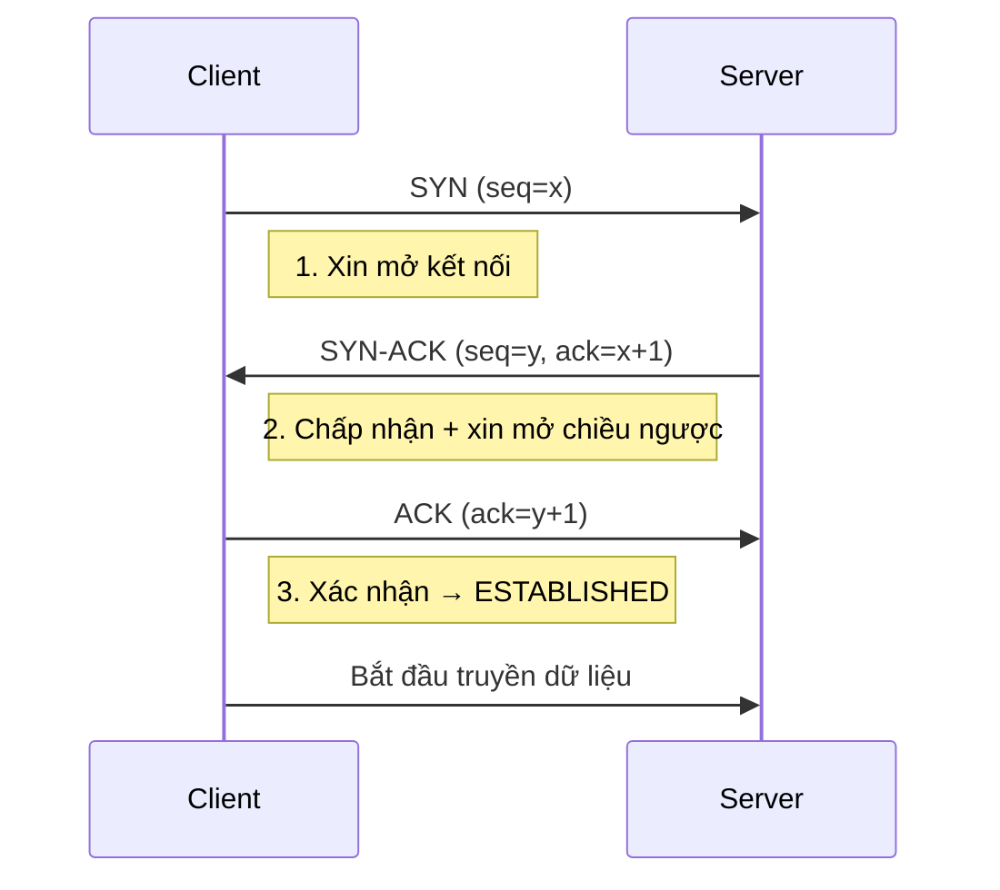

# Chồng giao thức TCP/IP & mô hình OSI (TCP/IP Suite & OSI Model)

## Khái niệm
Mô hình OSI (Open Systems Interconnection) là mô hình tham chiếu 7 tầng
chuẩn hoá cách các hệ thống mạng giao tiếp với nhau. Chồng giao thức TCP/IP
(TCP/IP Suite) là bộ giao thức thực tế đang vận hành Internet, thường được
gom lại thành 4 tầng. Cả hai đều mô tả cách dữ liệu di chuyển từ ứng dụng
này tới ứng dụng khác qua mạng.

## Khi nào dùng / Vì sao quan trọng
- Là "ngôn ngữ chung" để mô tả và gỡ lỗi (debug) sự cố mạng: xác định lỗi
  nằm ở tầng nào (dây cáp, IP, hay ứng dụng).
- Giúp phân tách trách nhiệm (separation of concerns): mỗi tầng chỉ lo một
  nhiệm vụ và giao tiếp với tầng kề qua giao diện rõ ràng.
- Là kiến thức nền tảng cho mọi câu hỏi phỏng vấn về mạng.

## Cách hoạt động

### 7 tầng OSI (từ trên xuống)
| # | Tầng (Layer) | Nhiệm vụ chính | Đơn vị dữ liệu (PDU) | Ví dụ |
|---|--------------|----------------|----------------------|-------|
| 7 | Ứng dụng (Application) | Giao diện cho ứng dụng người dùng | Data | HTTP, FTP, DNS, SMTP |
| 6 | Trình diễn (Presentation) | Mã hoá, nén, chuyển đổi định dạng | Data | TLS/SSL, JPEG, ASCII |
| 5 | Phiên (Session) | Thiết lập, duy trì, kết thúc phiên | Data | NetBIOS, RPC |
| 4 | Giao vận (Transport) | Truyền dữ liệu end-to-end, tin cậy | Segment/Datagram | TCP, UDP |
| 3 | Mạng (Network) | Định tuyến (routing), địa chỉ logic | Packet | IP, ICMP |
| 2 | Liên kết dữ liệu (Data Link) | Truyền frame trong cùng mạng, MAC | Frame | Ethernet, ARP, Switch |
| 1 | Vật lý (Physical) | Truyền bit qua môi trường vật lý | Bit | Cáp, sóng, Hub |

Mẹo nhớ: "All People Seem To Need Data Processing" (từ tầng 7 xuống 1).

Sơ đồ dưới minh hoạ chồng 7 tầng OSI và cách ánh xạ sang 4 tầng TCP/IP:



### Ánh xạ sang mô hình TCP/IP 4 tầng
| TCP/IP (4 tầng) | Tương ứng OSI | Giao thức tiêu biểu |
|-----------------|---------------|---------------------|
| Ứng dụng (Application) | Tầng 5-6-7 | HTTP, DNS, TLS |
| Giao vận (Transport) | Tầng 4 | TCP, UDP |
| Internet | Tầng 3 | IP, ICMP |
| Truy cập mạng (Network Access / Link) | Tầng 1-2 | Ethernet, Wi-Fi |

### Đóng gói dữ liệu (Encapsulation)
Khi đi xuống các tầng, mỗi tầng thêm phần tiêu đề (header) riêng:
```
[Data]                                   <- Application
[TCP Header | Data]                      <- Transport  (Segment)
[IP Header | TCP Header | Data]          <- Network    (Packet)
[Frame Header | IP | TCP | Data | FCS]   <- Data Link  (Frame)
```
Bên nhận sẽ gỡ bỏ (de-encapsulation) tiêu đề theo chiều ngược lại.

### So sánh TCP và UDP
TCP (Transmission Control Protocol) và UDP (User Datagram Protocol) đều là
giao thức tầng Giao vận nhưng khác nhau căn bản:

| Tiêu chí | TCP | UDP |
|----------|-----|-----|
| Hướng kết nối (Connection) | Có, cần bắt tay trước | Không (connectionless) |
| Độ tin cậy (Reliability) | Đảm bảo giao đủ, đúng thứ tự | Không đảm bảo |
| Kiểm soát lỗi | ACK, truyền lại (retransmission) | Chỉ có checksum |
| Kiểm soát tắc nghẽn (Congestion) | Có | Không |
| Thứ tự gói tin | Sắp xếp lại đúng thứ tự | Không đảm bảo |
| Tốc độ / độ trễ | Chậm hơn, overhead lớn | Nhanh, overhead thấp |
| Kích thước header | 20-60 byte | 8 byte |
| Ứng dụng | Web (HTTP), email, truyền file | Video call, game, DNS, streaming |

### Bắt tay 3 bước (Three-way Handshake)
Để mở một kết nối TCP tin cậy, hai bên thực hiện 3 bước trao đổi:
```
Client                                Server
   |------- SYN (seq=x) -------------->|   1. Client xin mở kết nối
   |<-- SYN-ACK (seq=y, ack=x+1) ------|   2. Server chấp nhận + xin mở chiều ngược
   |------- ACK (ack=y+1) ------------>|   3. Client xác nhận -> kết nối thiết lập
```
- **SYN** (Synchronize): đồng bộ số thứ tự (sequence number) khởi tạo.
- **ACK** (Acknowledgment): xác nhận đã nhận.
- Sau 3 bước, kết nối chuyển sang trạng thái ESTABLISHED và bắt đầu truyền
  dữ liệu.

Sơ đồ tuần tự (sequence diagram) của bắt tay 3 bước:



Đóng kết nối dùng cơ chế 4 bước (four-way handshake) với cờ FIN và ACK.

## Ví dụ
```python
# Minh hoạ client TCP đơn giản bằng socket của Python
import socket

# AF_INET = IPv4, SOCK_STREAM = TCP (dùng bắt tay 3 bước)
s = socket.socket(socket.AF_INET, socket.SOCK_STREAM)
s.connect(("example.com", 80))   # tự động thực hiện three-way handshake
s.sendall(b"GET / HTTP/1.1\r\nHost: example.com\r\n\r\n")
print(s.recv(1024).decode(errors="ignore"))
s.close()                        # kích hoạt four-way handshake để đóng

# So sánh: UDP không cần connect() vì không có kết nối
u = socket.socket(socket.AF_INET, socket.SOCK_DGRAM)
u.sendto(b"ping", ("8.8.8.8", 53))
```

## Ưu / nhược điểm
- **Ưu (mô hình phân tầng):** dễ chuẩn hoá, dễ gỡ lỗi, mỗi tầng thay đổi
  độc lập mà không ảnh hưởng tầng khác.
- **Nhược:** overhead do đóng gói nhiều lớp header; mô hình OSI mang tính
  lý thuyết, thực tế Internet chạy theo TCP/IP.
- **Ưu TCP:** tin cậy, đúng thứ tự. **Nhược TCP:** chậm, tốn tài nguyên.
- **Ưu UDP:** nhanh, nhẹ. **Nhược UDP:** có thể mất/lộn gói tin.

## Câu hỏi phỏng vấn thường gặp
1. So sánh mô hình OSI và TCP/IP? Kể tên 7 tầng OSI.
2. TCP khác UDP như thế nào? Khi nào chọn UDP thay vì TCP?
3. Giải thích chi tiết bắt tay 3 bước của TCP. Vì sao cần 3 bước mà không
   phải 2?
4. Đóng kết nối TCP diễn ra thế nào (four-way handshake)? Trạng thái
   TIME_WAIT là gì?
5. Encapsulation là gì? Đơn vị dữ liệu (PDU) ở mỗi tầng gọi là gì?
6. TCP đảm bảo độ tin cậy bằng những cơ chế nào?

## Tham khảo
- RFC 793 (TCP), RFC 768 (UDP)
- Kurose & Ross — Computer Networking: A Top-Down Approach
