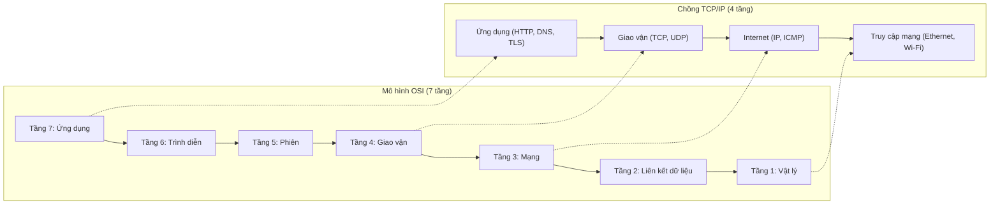
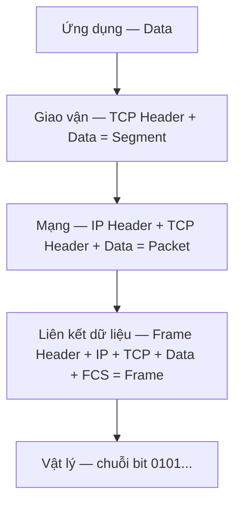
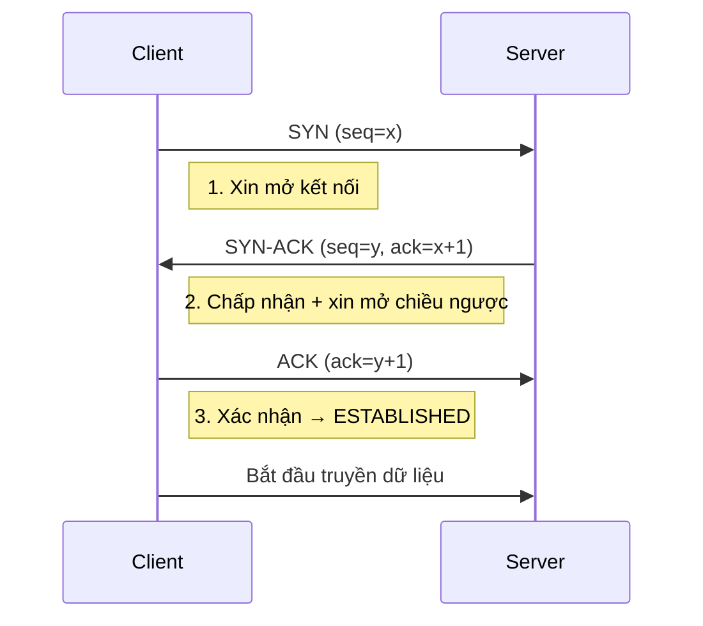
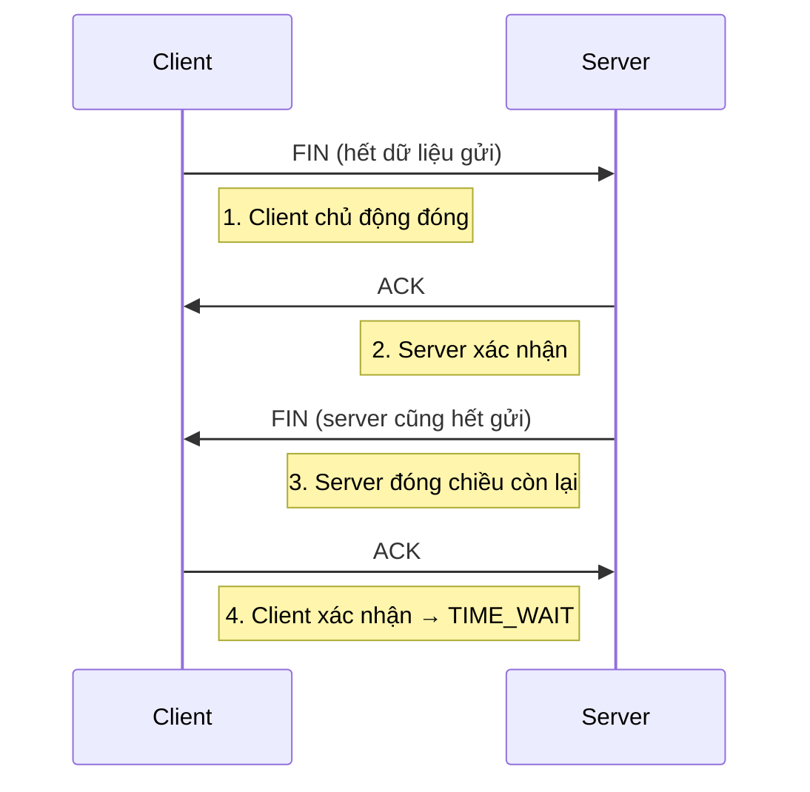

# Chồng giao thức TCP/IP & mô hình OSI (TCP/IP Suite & OSI Model)

## Khái niệm
Mô hình OSI (Open Systems Interconnection) là mô hình tham chiếu 7 tầng
chuẩn hoá cách các hệ thống mạng giao tiếp với nhau. Chồng giao thức TCP/IP
(TCP/IP Suite) là bộ giao thức thực tế đang vận hành Internet, thường được
gom lại thành 4 tầng. Cả hai đều mô tả cách dữ liệu di chuyển từ ứng dụng
này tới ứng dụng khác qua mạng.

## Khi nào dùng / Vì sao quan trọng
- Là "ngôn ngữ chung" để mô tả và gỡ lỗi (debug) sự cố mạng: xác định lỗi
  nằm ở tầng nào (dây cáp, IP, hay ứng dụng).
- Giúp phân tách trách nhiệm (separation of concerns): mỗi tầng chỉ lo một
  nhiệm vụ và giao tiếp với tầng kề qua giao diện rõ ràng.
- Là kiến thức nền tảng cho mọi câu hỏi phỏng vấn về mạng.

## Cách hoạt động

### 7 tầng OSI (từ trên xuống)
| # | Tầng (Layer) | Nhiệm vụ chính | Đơn vị dữ liệu (PDU) | Ví dụ |
|---|--------------|----------------|----------------------|-------|
| 7 | Ứng dụng (Application) | Giao diện cho ứng dụng người dùng | Data | HTTP, FTP, DNS, SMTP |
| 6 | Trình diễn (Presentation) | Mã hoá, nén, chuyển đổi định dạng | Data | TLS/SSL, JPEG, ASCII |
| 5 | Phiên (Session) | Thiết lập, duy trì, kết thúc phiên | Data | NetBIOS, RPC |
| 4 | Giao vận (Transport) | Truyền dữ liệu end-to-end, tin cậy | Segment/Datagram | TCP, UDP |
| 3 | Mạng (Network) | Định tuyến (routing), địa chỉ logic | Packet | IP, ICMP |
| 2 | Liên kết dữ liệu (Data Link) | Truyền frame trong cùng mạng, MAC | Frame | Ethernet, ARP, Switch |
| 1 | Vật lý (Physical) | Truyền bit qua môi trường vật lý | Bit | Cáp, sóng, Hub |

Mẹo nhớ: "All People Seem To Need Data Processing" (từ tầng 7 xuống 1).

#### Chi tiết từng tầng OSI

- **Tầng 7 – Ứng dụng (Application):** cung cấp giao diện cho phần mềm người
  dùng truy cập dịch vụ mạng. Không phải bản thân trình duyệt/mail client, mà
  là các giao thức chúng dùng: HTTP/HTTPS (web), DNS (phân giải tên), SMTP/IMAP
  (email), FTP (truyền file). Đây là nơi dữ liệu "có nghĩa" với ứng dụng.
- **Tầng 6 – Trình diễn (Presentation):** chuẩn hoá cách biểu diễn dữ liệu để
  hai bên hiểu nhau: mã hoá ký tự (ASCII, UTF-8), nén (JPEG, GIF), và mã hoá
  bảo mật (TLS/SSL nằm bắc cầu giữa tầng 6 và 4). Ví dụ: chuyển số nguyên
  big-endian ↔ little-endian, serialize/deserialize.
- **Tầng 5 – Phiên (Session):** thiết lập, duy trì, đồng bộ và kết thúc phiên
  hội thoại giữa hai ứng dụng. Đặt "checkpoint" để khôi phục khi đứt (ví dụ
  tải file lớn có thể tiếp tục). Ví dụ: RPC, NetBIOS, phiên SQL.
- **Tầng 4 – Giao vận (Transport):** truyền dữ liệu end-to-end giữa hai tiến
  trình, phân biệt bằng **số cổng (port)**. TCP đảm bảo tin cậy (đúng thứ tự,
  không mất, kiểm soát luồng và tắc nghẽn); UDP nhanh, nhẹ, không đảm bảo.
  Chia dữ liệu lớn thành các segment.
- **Tầng 3 – Mạng (Network):** định tuyến gói tin (packet) qua nhiều mạng dựa
  trên **địa chỉ IP logic**. Chọn đường đi (routing), phân mảnh (fragmentation)
  khi vượt MTU. Ví dụ: IP, ICMP (ping/traceroute), giao thức định tuyến OSPF/BGP.
- **Tầng 2 – Liên kết dữ liệu (Data Link):** truyền frame giữa các nút **trong
  cùng một mạng cục bộ**, dùng **địa chỉ MAC vật lý**. Phát hiện lỗi bằng CRC/FCS,
  điều khiển truy cập môi trường (MAC). Ví dụ: Ethernet, Wi-Fi (802.11), ARP,
  switch. Chia thành hai lớp con LLC và MAC.
- **Tầng 1 – Vật lý (Physical):** truyền chuỗi bit thô qua môi trường: điện áp
  trên cáp đồng, xung ánh sáng trong cáp quang, sóng vô tuyến. Quy định đầu nối,
  tốc độ, mã đường truyền. Ví dụ: cáp UTP, cáp quang, hub, bộ lặp (repeater).

Sơ đồ dưới minh hoạ chồng 7 tầng OSI và cách ánh xạ sang 4 tầng TCP/IP:



### Ánh xạ sang mô hình TCP/IP 4 tầng
| TCP/IP (4 tầng) | Tương ứng OSI | Giao thức tiêu biểu |
|-----------------|---------------|---------------------|
| Ứng dụng (Application) | Tầng 5-6-7 | HTTP, DNS, TLS |
| Giao vận (Transport) | Tầng 4 | TCP, UDP |
| Internet | Tầng 3 | IP, ICMP |
| Truy cập mạng (Network Access / Link) | Tầng 1-2 | Ethernet, Wi-Fi |

### Đóng gói dữ liệu (Encapsulation)
Khi đi xuống các tầng, mỗi tầng thêm phần tiêu đề (header) riêng:
```
[Data]                                   <- Application
[TCP Header | Data]                      <- Transport  (Segment)
[IP Header | TCP Header | Data]          <- Network    (Packet)
[Frame Header | IP | TCP | Data | FCS]   <- Data Link  (Frame)
```
Bên nhận sẽ gỡ bỏ (de-encapsulation) tiêu đề theo chiều ngược lại.

Sơ đồ dưới minh hoạ dữ liệu bị đóng gói qua từng tầng, mỗi tầng thêm header:



### So sánh TCP và UDP
TCP (Transmission Control Protocol) và UDP (User Datagram Protocol) đều là
giao thức tầng Giao vận nhưng khác nhau căn bản:

| Tiêu chí | TCP | UDP |
|----------|-----|-----|
| Hướng kết nối (Connection) | Có, cần bắt tay trước | Không (connectionless) |
| Độ tin cậy (Reliability) | Đảm bảo giao đủ, đúng thứ tự | Không đảm bảo |
| Kiểm soát lỗi | ACK, truyền lại (retransmission) | Chỉ có checksum |
| Kiểm soát tắc nghẽn (Congestion) | Có | Không |
| Thứ tự gói tin | Sắp xếp lại đúng thứ tự | Không đảm bảo |
| Tốc độ / độ trễ | Chậm hơn, overhead lớn | Nhanh, overhead thấp |
| Kích thước header | 20-60 byte | 8 byte |
| Truyền quảng bá (broadcast/multicast) | Không hỗ trợ | Hỗ trợ |
| Kiểm soát luồng (Flow control) | Có (cửa sổ trượt) | Không |
| Đơn vị dữ liệu (PDU) | Segment | Datagram |
| Ứng dụng | Web (HTTP), email, truyền file | Video call, game, DNS, streaming |

**Chọn TCP khi:** cần dữ liệu đến đủ và đúng thứ tự (tải trang, tải file,
giao dịch ngân hàng). **Chọn UDP khi:** ưu tiên độ trễ thấp và chấp nhận mất
gói lẻ tẻ (thoại/video thời gian thực, game online, DNS truy vấn nhỏ).

!!! question "Tại sao TCP tin cậy còn UDP thì không?"
    Độ tin cậy của TCP **không** phải phép màu — nó được xây bằng ba cơ chế cụ
    thể mà UDP cố tình bỏ đi để đổi lấy tốc độ:

    - **Bắt tay trước khi gửi:** TCP mở kết nối bằng bắt tay 3 bước, tạo ra một
      "trạng thái" chung ở cả hai bên (số thứ tự khởi tạo, kích thước cửa sổ).
      Nhờ có trạng thái này, hai bên mới biết gói nào đã tới, gói nào còn thiếu.
      UDP **không bắt tay** — cứ thế bắn datagram đi, không bên nào giữ trạng
      thái, nên không thể biết gói có tới không.
    - **Số thứ tự (sequence number) + ACK:** mỗi byte TCP gửi đi mang một số thứ
      tự; bên nhận gửi lại **ACK** báo "đã nhận tới byte thứ N". Đây là cơ chế
      "gửi thư bảo đảm có ký nhận". Nhờ số thứ tự, bên nhận **sắp xếp lại đúng
      thứ tự** dù các gói tới lộn xộn, và **loại gói trùng**. UDP không đánh số,
      không ACK → gói tới sai thứ tự thì cứ để vậy, mất thì mất luôn.
    - **Truyền lại (retransmission) khi mất gói:** nếu bên gửi chờ quá lâu không
      thấy ACK (timeout) hoặc nhận 3 ACK trùng, nó **tự gửi lại** gói nghi bị
      mất. Đây là điều biến "mạng không đáng tin" thành "kênh đáng tin". UDP
      không có timeout, không truyền lại → mất là mất.

    **Trực giác:** TCP giống gửi bưu phẩm bảo đảm — chậm hơn vì phải ký nhận,
    đánh số kiện, gửi lại kiện thất lạc; UDP giống thả tờ rơi qua cửa sổ — cực
    nhanh nhưng không ai bảo đảm tờ nào tới. **Cái giá của độ tin cậy là độ
    trễ:** mỗi lần chờ ACK và truyền lại đều tốn ít nhất một vòng khứ hồi (RTT).
    Đó là lý do thoại/video thời gian thực chọn UDP: với chúng, một khung hình
    tới **trễ** còn tệ hơn một khung hình **mất** — nghe vấp còn khó chịu hơn
    nghe sót một âm.

### Bắt tay 3 bước (Three-way Handshake)
Để mở một kết nối TCP tin cậy, hai bên thực hiện 3 bước trao đổi:
```
Client                                Server
   |------- SYN (seq=x) -------------->|   1. Client xin mở kết nối
   |<-- SYN-ACK (seq=y, ack=x+1) ------|   2. Server chấp nhận + xin mở chiều ngược
   |------- ACK (ack=y+1) ------------>|   3. Client xác nhận -> kết nối thiết lập
```
- **SYN** (Synchronize): đồng bộ số thứ tự (sequence number) khởi tạo.
- **ACK** (Acknowledgment): xác nhận đã nhận.
- Sau 3 bước, kết nối chuyển sang trạng thái ESTABLISHED và bắt đầu truyền
  dữ liệu.

!!! question "Tại sao phải bắt tay 3 bước, không phải 2?"
    Cốt lõi: TCP là kênh **song công (full-duplex)** — dữ liệu chảy cả hai
    chiều — nên **mỗi chiều** cần đồng bộ số thứ tự khởi tạo (ISN) riêng. Đồng
    bộ một chiều cần đúng 2 gói: một bên gửi số thứ tự của mình (SYN), bên kia
    xác nhận (ACK). Có **hai** chiều → tưởng chừng cần 4 gói, nhưng bước giữa
    **gộp** ACK của chiều này với SYN của chiều kia (SYN-ACK) → còn 3:

    1. **SYN (Client → Server):** "Tôi bắt đầu đánh số từ x." (đồng bộ chiều đi)
    2. **SYN-ACK (Server → Client):** "Nhận được x rồi (ack=x+1); và tôi bắt đầu
       đánh số từ y." (xác nhận chiều đi **+** đồng bộ chiều về, gộp làm một)
    3. **ACK (Client → Server):** "Nhận được y rồi (ack=y+1)." (xác nhận chiều về)

    **Vì sao 2 bước không đủ?** Với 2 bước, server gửi ISN `y` của mình nhưng
    **không bao giờ biết** client có nhận được `y` hay không → chiều server→client
    chưa được đồng bộ chắc chắn. Bước thứ 3 chính là cái ACK cho `y` đó.

    **Trực giác (gọi điện thoại):** (1) "Alô, anh nghe rõ không?" (2) "Nghe rõ,
    thế **anh** nghe rõ **tôi** không?" (3) "Rõ luôn." — chỉ sau câu thứ 3 thì
    **cả hai** mới chắc rằng đường truyền **cả hai chiều** đều thông. Lợi ích
    phụ: bước 3 giúp chống gói SYN **cũ lạc lối** từ kết nối trước vô tình mở
    nhầm một kết nối ma — client sẽ không gửi ACK cuối cho một SYN nó không hề
    khởi xướng.

Sơ đồ tuần tự (sequence diagram) của bắt tay 3 bước:



Đóng kết nối dùng cơ chế 4 bước (four-way handshake) với cờ FIN và ACK.

### Đóng kết nối 4 bước (Four-way Handshake)
Vì TCP là song công (full-duplex), mỗi chiều truyền phải được đóng riêng:
```
Client                                Server
   |------- FIN ---------------------->|   1. Client hết dữ liệu gửi
   |<------ ACK -----------------------|   2. Server xác nhận
   |<------ FIN -----------------------|   3. Server cũng hết dữ liệu gửi
   |------- ACK ---------------------->|   4. Client xác nhận
   | (đợi TIME_WAIT ~2·MSL rồi đóng)   |
```
- **TIME_WAIT:** sau khi gửi ACK cuối, bên chủ động đóng đợi khoảng `2·MSL`
  (Maximum Segment Lifetime) để: (1) đảm bảo ACK cuối tới nơi, (2) tránh gói
  cũ lạc vào kết nối mới cùng cặp cổng. Đây là lý do server bận có thể tích
  luỹ nhiều socket ở trạng thái TIME_WAIT.
- **Half-close:** một bên có thể gửi FIN (hết gửi) nhưng vẫn nhận dữ liệu từ
  bên kia cho đến khi bên kia cũng FIN.

Sơ đồ tuần tự của đóng kết nối 4 bước:



### Cửa sổ trượt (Sliding Window) & kiểm soát luồng
TCP không gửi từng byte rồi chờ ACK (quá chậm) mà cho phép gửi trước một
"cửa sổ" nhiều byte chưa được xác nhận:
- **Cửa sổ nhận (receive window – rwnd):** bên nhận báo còn bao nhiêu chỗ
  trống trong bộ đệm qua trường Window Size. Đây là **kiểm soát luồng (flow
  control)** — tránh bên gửi làm tràn bộ đệm bên nhận.
- Cửa sổ "trượt" về phía trước khi các byte đầu cửa sổ đã được ACK, cho phép
  gửi tiếp các byte mới. Nhờ vậy nhiều gói "bay" đồng thời trên đường truyền.
- **Cumulative ACK:** một ACK xác nhận tất cả byte tới số đó. **SACK
  (Selective ACK)** cho phép báo nhận các đoạn rời rạc để truyền lại chính xác.

```
Đã ACK  | Đang bay (chưa ACK)  | Được phép gửi | Chưa gửi được
[=======|======================|===============]················
        ^ mép trái            ^ mép phải = trái + kích thước cửa sổ
        cửa sổ trượt phải khi mép trái nhận thêm ACK
```

### Kiểm soát tắc nghẽn (Congestion Control)
Ngoài rwnd (bảo vệ bên nhận), TCP còn giữ **cửa sổ tắc nghẽn (congestion
window – cwnd)** để không làm nghẽn mạng. Lượng gửi thực tế = `min(rwnd, cwnd)`.
Các pha kinh điển (TCP Reno/NewReno):
- **Slow Start (khởi động chậm):** cwnd bắt đầu nhỏ (1–10 MSS), **nhân đôi mỗi
  RTT** (tăng theo hàm mũ) cho tới khi đạt ngưỡng `ssthresh`.
- **Congestion Avoidance (tránh tắc nghẽn):** khi cwnd ≥ ssthresh, tăng **tuyến
  tính** (+1 MSS mỗi RTT) để dò băng thông thận trọng.
- **Phát hiện mất gói:**
    - **3 ACK trùng (duplicate ACK):** nghi mất 1 gói → **Fast Retransmit**
      (truyền lại ngay) + **Fast Recovery** (giảm cwnd còn một nửa, không về 1).
    - **Timeout (RTO):** nghẽn nặng → đặt ssthresh = cwnd/2, cwnd về 1, quay
      lại Slow Start.
- Mô hình "răng cưa" (AIMD – Additive Increase, Multiplicative Decrease): tăng
  cộng dồn từ từ, giảm nhân khi mất gói → công bằng và ổn định giữa các luồng.
  Thuật toán hiện đại như **CUBIC** (mặc định trên Linux) và **BBR** (Google)
  cải thiện thông lượng trên đường truyền độ trễ cao.

!!! tip "Chạy được ngay — mô phỏng Slow Start & Congestion Avoidance"
    Đoạn dưới mô phỏng `cwnd` qua từng RTT: nhân đôi trong pha Slow Start, tăng
    tuyến tính khi vượt `ssthresh`, và giảm nửa khi "mất gói" tại RTT số 8.
    Bấm **▶ Chạy**; đổi `ssthresh` hay `lossAtRTT` để xem hành vi khác.

<div class="js-demo" data-title="Mô phỏng cửa sổ tắc nghẽn TCP (cwnd)">
<textarea class="js-demo-src">
let cwnd = 1;            // cửa sổ tắc nghẽn (đơn vị MSS)
let ssthresh = 16;       // ngưỡng chuyển sang tránh tắc nghẽn
const lossAtRTT = 8;     // giả lập mất gói tại RTT này
const rounds = 14;

print('RTT | cwnd | pha');
print('----+------+----------------------');
for (let rtt = 1; rtt <= rounds; rtt++) {
  let pha;
  if (rtt === lossAtRTT) {
    // Phát hiện mất gói (3 ACK trùng): giảm nửa, Fast Recovery
    ssthresh = Math.max(2, Math.floor(cwnd / 2));
    cwnd = ssthresh;
    pha = 'MẤT GÓI → cwnd = cwnd/2';
  } else if (cwnd < ssthresh) {
    cwnd = cwnd * 2;                 // Slow Start: tăng theo hàm mũ
    pha = 'Slow Start (x2)';
  } else {
    cwnd = cwnd + 1;                 // Congestion Avoidance: tuyến tính
    pha = 'Congestion Avoidance (+1)';
  }
  print(String(rtt).padStart(3) + ' | ' + String(cwnd).padStart(4) + ' | ' + pha);
}
print('');
print('ssthresh cuối:', ssthresh);
</textarea>
</div>

## Ví dụ
```python
# Minh hoạ client TCP đơn giản bằng socket của Python
import socket

# AF_INET = IPv4, SOCK_STREAM = TCP (dùng bắt tay 3 bước)
s = socket.socket(socket.AF_INET, socket.SOCK_STREAM)
s.connect(("example.com", 80))   # tự động thực hiện three-way handshake
s.sendall(b"GET / HTTP/1.1\r\nHost: example.com\r\n\r\n")
print(s.recv(1024).decode(errors="ignore"))
s.close()                        # kích hoạt four-way handshake để đóng

# So sánh: UDP không cần connect() vì không có kết nối
u = socket.socket(socket.AF_INET, socket.SOCK_DGRAM)
u.sendto(b"ping", ("8.8.8.8", 53))
```

## Ưu / nhược điểm
- **Ưu (mô hình phân tầng):** dễ chuẩn hoá, dễ gỡ lỗi, mỗi tầng thay đổi
  độc lập mà không ảnh hưởng tầng khác.
- **Nhược:** overhead do đóng gói nhiều lớp header; mô hình OSI mang tính
  lý thuyết, thực tế Internet chạy theo TCP/IP.
- **Ưu TCP:** tin cậy, đúng thứ tự. **Nhược TCP:** chậm, tốn tài nguyên.
- **Ưu UDP:** nhanh, nhẹ. **Nhược UDP:** có thể mất/lộn gói tin.

## Câu hỏi phỏng vấn thường gặp
1. So sánh mô hình OSI và TCP/IP? Kể tên 7 tầng OSI.
2. TCP khác UDP như thế nào? Khi nào chọn UDP thay vì TCP?
3. Giải thích chi tiết bắt tay 3 bước của TCP. Vì sao cần 3 bước mà không
   phải 2?
4. Đóng kết nối TCP diễn ra thế nào (four-way handshake)? Trạng thái
   TIME_WAIT là gì?
5. Encapsulation là gì? Đơn vị dữ liệu (PDU) ở mỗi tầng gọi là gì?
6. TCP đảm bảo độ tin cậy bằng những cơ chế nào?

## Tham khảo
- RFC 793 (TCP), RFC 768 (UDP)
- Kurose & Ross — Computer Networking: A Top-Down Approach
