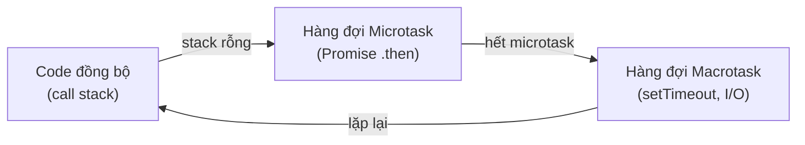
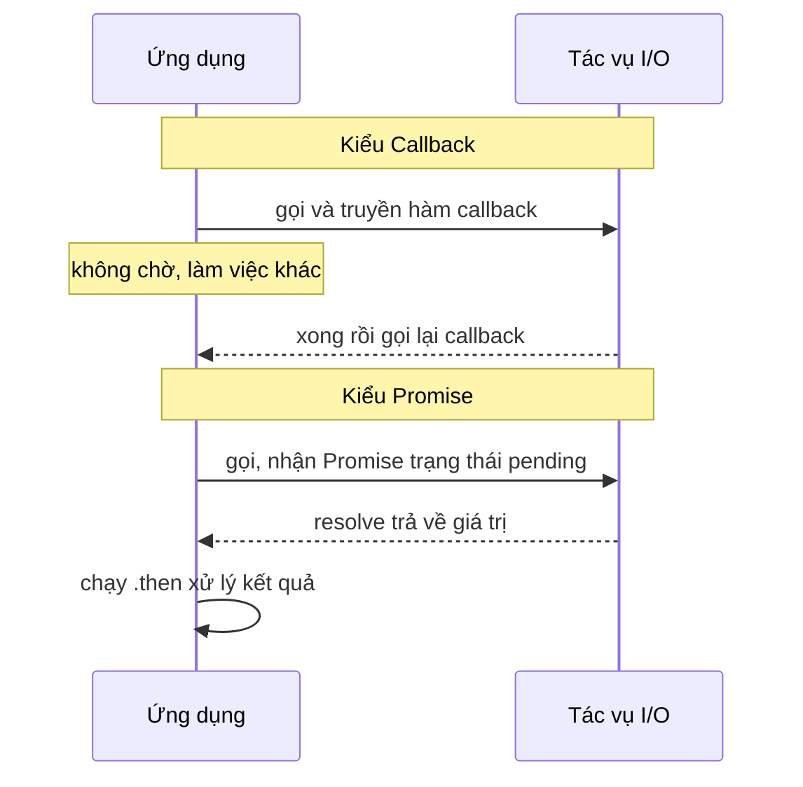

# Lập trình bất đồng bộ (Asynchronous Programming)

## Khái niệm

Lập trình bất đồng bộ (asynchronous programming) cho phép chương trình bắt đầu một
tác vụ tốn thời gian (đọc file, gọi mạng) rồi **tiếp tục làm việc khác** thay vì
đứng chờ, và xử lý kết quả khi nó sẵn sàng. Khác với đa luồng, bất đồng bộ thường
chạy trên một luồng duy nhất với vòng lặp sự kiện (event loop), xen kẽ các tác vụ
tại các điểm chờ (`await`).

Điểm mấu chốt: **đồng bộ (synchronous)** nghĩa là mỗi lệnh chặn (block) cho tới khi
xong mới chạy lệnh kế; **bất đồng bộ (asynchronous)** cho phép "giao việc rồi quay
lại lấy kết quả sau".

## Khi nào dùng / Vì sao quan trọng

Rất hợp cho tác vụ **giới hạn bởi I/O** (I/O-bound): server web xử lý hàng nghìn kết
nối, ứng dụng gọi nhiều API, đọc/ghi ổ đĩa hay cơ sở dữ liệu. Nó giữ ứng dụng phản
hồi mà không tốn chi phí tạo nhiều luồng. Đây là kiến thức bắt buộc cho backend hiện
đại (Node.js, Python asyncio, C# `async`, Rust `tokio`).

Ngược lại, với tác vụ **giới hạn bởi CPU** (CPU-bound: tính toán nặng, nén ảnh, mã
hóa) thì async **không** giúp gì — bạn cần đa tiến trình (multiprocessing) hoặc đa
luồng thật.

## Cách hoạt động

### Tiến hóa các mô hình

- **Callback (hàm gọi lại):** Truyền một hàm để chạy khi tác vụ xong. Lồng nhiều
  callback gây "callback hell" (kim tự tháp khó đọc, khó xử lý lỗi).
- **Promise / Future (lời hứa / tương lai):** Đối tượng đại diện cho kết quả **sẽ
  có** trong tương lai, với các trạng thái `pending → fulfilled/rejected`. Cho phép
  nối chuỗi `.then()` phẳng hơn callback và gộp lỗi vào một `.catch()`.
- **Async/await:** Cú pháp giúp code bất đồng bộ trông như đồng bộ. `await` tạm dừng
  coroutine cho tới khi kết quả sẵn sàng, nhường quyền cho event loop chạy việc khác.
- **Coroutine (đồng thủ tục):** Hàm có thể tạm dừng và tiếp tục — nền tảng của
  async/await.

### Event loop và hàng đợi

Vòng lặp sự kiện điều phối: chạy các coroutine tới điểm `await`, đăng ký chờ I/O,
rồi tiếp tục coroutine khi dữ liệu về. Trong JavaScript có hai hàng đợi:

- **Microtask queue** (Promise callback, `queueMicrotask`) — ưu tiên cao, chạy hết
  sau mỗi tác vụ đồng bộ.
- **Macrotask queue** (`setTimeout`, `setInterval`, I/O) — ưu tiên thấp hơn.

Đây là lý do một Promise đã resolve luôn chạy **trước** `setTimeout(..., 0)`.

!!! question "Tại sao async không chặn (non-blocking) lại tăng throughput?"
    Chìa khoá nằm ở bản chất của tác vụ I/O: khi bạn gọi mạng hay đọc đĩa, phần lớn thời
    gian là **CHỜ** phần cứng khác trả lời (mạng, ổ cứng, cơ sở dữ liệu) — CPU không làm gì
    trong lúc đó. Cách **đồng bộ (blocking)** bắt cả luồng đứng im ôm cái chờ này: gọi 1000
    API tuần tự, mỗi cái chờ 100ms thì mất ~100 giây, còn CPU rảnh rỗi 99% thời gian.

    **Cơ chế của async:** khi gặp `await` một tác vụ I/O, coroutine **không đứng chờ** mà
    đăng ký một "khi nào xong thì báo tôi" với hệ điều hành rồi **nhường quyền cho event
    loop**. Event loop lập tức lấy việc khác ra chạy. Khi dữ liệu I/O về (sau đó), hệ điều
    hành báo lại và event loop tiếp tục coroutine đang dở tại đúng điểm `await`. Nhờ vậy
    **một luồng duy nhất "nhồi" được hàng nghìn tác vụ đang chờ chồng lên nhau** — thời gian
    chờ của việc này được lấp bằng công việc của việc kia. 1000 API giờ chỉ tốn ~thời gian
    của cái chậm nhất thay vì tổng cộng. Đó là vì sao throughput tăng vọt cho tải I/O-bound.

    Loại suy: một đầu bếp giỏi không đứng nhìn nồi nước sôi — anh ta bắc nồi lên rồi đi thái
    rau, đảo chảo khác; khi nước sôi mới quay lại. Cùng một người mà làm được nhiều món song
    song, vì mỗi món có những quãng "chờ" xen kẽ. Nhưng nếu công việc là **băm thịt liên tục
    (CPU-bound)** — không có quãng chờ nào để lấp — thì một người vẫn chỉ làm được một việc,
    async không giúp gì.

!!! question "Tại sao lại chuyển từ callback sang promise/async?"
    Callback giải quyết được việc "chạy khi xong", nhưng khi các tác vụ **phụ thuộc tuần
    tự** (lấy user → lấy đơn hàng của user → lấy chi tiết đơn), mỗi bước phải nằm **bên
    trong** callback của bước trước, tạo ra **kim tự tháp lồng sâu (callback hell)** như ví
    dụ bên dưới. Ba vấn đề cốt lõi:

    - **Xử lý lỗi rải rác:** mỗi tầng callback phải tự bắt lỗi riêng (`loi => xuLyLoi(loi)`
      lặp đi lặp lại), không có chỗ bắt lỗi tập trung — dễ sót.
    - **Đảo ngược quyền kiểm soát (inversion of control):** bạn giao hàm của mình cho thư
      viện gọi lại, phải tin nó gọi đúng một lần, đúng lúc — khó bảo đảm.
    - **Khó đọc, khó ghép:** luồng thực thi chạy "vào trong" thay vì đi xuống, ngược với
      cách ta đọc code.

    **Promise** sửa điều này bằng cách biến kết quả tương lai thành một **giá trị (object)**
    có thể truyền đi, nối chuỗi `.then()` **phẳng** thay vì lồng, và gộp mọi lỗi vào **một
    `.catch()`**. **async/await** đi thêm một bước: cho phép viết code bất đồng bộ **trông
    như đồng bộ** — đọc từ trên xuống, dùng `try/catch` quen thuộc — trong khi bên dưới vẫn
    là non-blocking. Bản chất không đổi, nhưng cấu trúc code khớp với cách con người tư duy.



## Sơ đồ: callback vs promise

Hai kiểu xử lý bất đồng bộ phổ biến. Với callback, ta truyền hàm để dịch vụ gọi lại khi xong. Với Promise, ta nhận ngay một đối tượng đại diện cho kết quả tương lai rồi nối `.then()` khi nó resolve.



## Ví dụ đa ngôn ngữ

=== "JavaScript"

    ```js
    // Promise + async/await: chạy hai tác vụ ĐỒNG THỜI
    function taiDuLieu(ten, ms) {
      return new Promise(resolve => {
        setTimeout(() => resolve(`dữ liệu ${ten}`), ms);
      });
    }

    async function main() {
      // Promise.all chờ tất cả xong; tổng thời gian ~ tác vụ dài nhất
      const kq = await Promise.all([
        taiDuLieu("A", 2000),
        taiDuLieu("B", 1000),
      ]);
      console.log(kq); // ["dữ liệu A", "dữ liệu B"]
    }
    main();
    ```

=== "Python"

    ```python
    import asyncio

    async def tai_du_lieu(ten, giay):
        print(f"Bắt đầu tải {ten}")
        await asyncio.sleep(giay)        # giả lập I/O; nhường event loop
        print(f"Xong {ten}")
        return f"dữ liệu {ten}"

    async def main():
        # Chạy ĐỒNG THỜI: tổng thời gian ~ tác vụ dài nhất (2s), không phải 3s
        ket_qua = await asyncio.gather(
            tai_du_lieu("A", 2),
            tai_du_lieu("B", 1),
        )
        print(ket_qua)

    asyncio.run(main())
    ```

### Từ callback hell tới async/await

=== "Callback hell"

    ```js
    layUser(id, (u) => {
      layDonHang(u, (d) => {
        layChiTiet(d, (ct) => {
          console.log(ct);           // lồng sâu, xử lý lỗi rối rắm
        }, loi => xuLyLoi(loi));
      }, loi => xuLyLoi(loi));
    }, loi => xuLyLoi(loi));
    ```

=== "async/await"

    ```js
    async function xem(id) {
      try {
        const u  = await layUser(id);
        const d  = await layDonHang(u);
        const ct = await layChiTiet(d);
        console.log(ct);             // phẳng, dễ đọc
      } catch (loi) {
        xuLyLoi(loi);                // một chỗ bắt lỗi duy nhất
      }
    }
    ```

## Thứ tự thực thi — playground

Thử đoán thứ tự in ra **trước** khi chạy. Đây là câu hỏi phỏng vấn kinh điển về
microtask vs macrotask:

<div class="js-demo" data-title="Thứ tự thực thi: đồng bộ, Promise, setTimeout">
<textarea class="js-demo-src">
print('1: đồng bộ (chạy ngay)');

setTimeout(() => print('4: setTimeout (macrotask)'), 0);

Promise.resolve()
  .then(() => print('3: Promise .then (microtask)'));

print('2: đồng bộ (chạy ngay)');

// Kết quả: 1, 2, 3, 4
// Giải thích: code đồng bộ chạy trước (1,2). Khi call stack rỗng,
// microtask (Promise) chạy trước macrotask (setTimeout).
</textarea>
</div>

## Bảng so sánh các mô hình

| Mô hình | Độ dễ đọc | Xử lý lỗi | Nối chuỗi | Ghi chú |
|---------|-----------|-----------|-----------|---------|
| Callback | Kém (lồng sâu) | Rải rác từng callback | Khó | "callback hell" |
| Promise | Trung bình | Gộp `.catch()` | `.then()` phẳng | Nền tảng của async |
| async/await | Tốt nhất | `try/catch` quen thuộc | Tuần tự tự nhiên | Chuẩn hiện đại |

## Ưu / nhược điểm

- **Ưu:** Xử lý nhiều tác vụ I/O đồng thời với ít tài nguyên; giữ ứng dụng phản hồi;
  async/await dễ đọc hơn callback.
- **Nhược:** Không tăng tốc tác vụ nặng CPU (CPU-bound); code "lây nhiễm" async (hàm
  gọi async phải là async — "function coloring"); gỡ lỗi khó hơn code tuần tự.

## Câu hỏi phỏng vấn thường gặp

1. Phân biệt bất đồng bộ và đa luồng.
2. Callback hell là gì? Promise và async/await giải quyết ra sao?
3. Event loop hoạt động thế nào? Microtask khác macrotask ở đâu?
4. Vì sao `Promise.then` chạy trước `setTimeout(fn, 0)`?
5. Vì sao async phù hợp I/O-bound nhưng không giúp CPU-bound?
6. Coroutine là gì và liên hệ với async/await?
7. Khác nhau giữa `Promise.all`, `Promise.race`, `Promise.allSettled`?

## Tham khảo

- Tài liệu `asyncio` của Python
- MDN: Promises, async/await, Event loop
