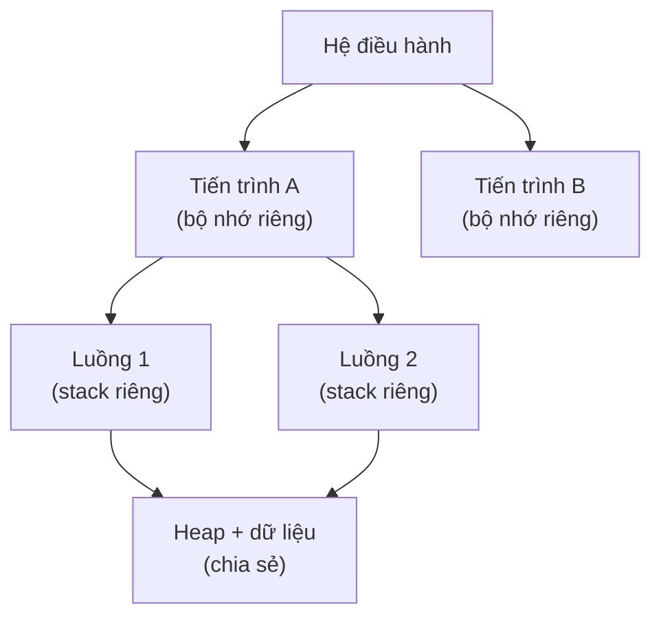

# Lập trình đồng thời (Concurrency)

## Khái niệm

Lập trình đồng thời (concurrency) là kỹ thuật thiết kế chương trình để nhiều tác vụ có thể tiến triển trong cùng khoảng thời gian. Đồng thời (concurrency) nói về **cấu trúc** — xử lý nhiều việc đan xen; song song (parallelism) nói về **thực thi** — chạy nhiều việc thật sự cùng lúc trên nhiều lõi CPU. Một chương trình có thể đồng thời mà không song song (một lõi luân phiên) và ngược lại.

## Khi nào dùng / Vì sao quan trọng

Dùng khi cần tận dụng nhiều lõi CPU, giữ giao diện phản hồi, hoặc xử lý nhiều kết nối mạng cùng lúc. Đây là nguồn gốc của nhiều bug khó tái hiện nhất, nên là chủ đề phỏng vấn nặng ký cho vị trí backend/hệ thống.

## Cách hoạt động

### Thread vs Process

- **Tiến trình (process):** Có không gian địa chỉ bộ nhớ riêng, cô lập. Giao tiếp qua IPC. Tạo/chuyển đổi tốn kém hơn nhưng an toàn hơn.
- **Luồng (thread):** Nằm trong một tiến trình, **chia sẻ** vùng nhớ heap. Nhẹ, tạo nhanh, nhưng chia sẻ dữ liệu dễ sinh xung đột.

### Các nguy cơ

- **Race condition (điều kiện tranh chấp):** Kết quả phụ thuộc thứ tự thực thi không xác định của nhiều luồng cùng truy cập dữ liệu chung.
- **Deadlock (khóa chết):** Nhiều luồng chờ nhau vô hạn để giải phóng khóa.
- **Thread safety (an toàn luồng):** Một đoạn code an toàn luồng cho kết quả đúng khi nhiều luồng chạy đồng thời.

### Cơ chế đồng bộ

- **Mutex (khóa loại trừ tương hỗ):** Chỉ một luồng giữ khóa vào vùng tới hạn (critical section) tại một thời điểm.
- **Semaphore (đèn báo):** Bộ đếm cho phép tối đa N luồng vào cùng lúc.
- **Lock/Monitor:** Trừu tượng hóa việc khóa quanh dữ liệu chung.
- **Atomic operation:** Thao tác không thể bị ngắt giữa chừng.

## Ví dụ

```python
import threading

bo_dem = 0
khoa = threading.Lock()          # mutex bảo vệ biến chung

def tang(n):
    global bo_dem
    for _ in range(n):
        with khoa:               # chỉ một luồng vào vùng tới hạn
            bo_dem += 1          # tránh race condition

luong = [threading.Thread(target=tang, args=(100000,)) for _ in range(4)]
for t in luong: t.start()
for t in luong: t.join()
print(bo_dem)                    # 400000 — đúng nhờ có khóa
```

```python
# Nếu BỎ khóa, kết quả sẽ nhỏ hơn 400000 do các luồng
# đọc-sửa-ghi 'bo_dem' đè lên nhau (race condition).
```

> Lưu ý: CPython có GIL (Global Interpreter Lock) nên luồng không cho song song CPU thật; muốn song song tính toán hãy dùng `multiprocessing`.

## Ưu / nhược điểm

- **Ưu:** Tận dụng đa lõi, tăng thông lượng, giữ ứng dụng phản hồi tốt.
- **Nhược:** Khó viết đúng; bug (race, deadlock) khó tái hiện và gỡ; khóa quá nhiều làm giảm hiệu năng.

## Câu hỏi phỏng vấn thường gặp

1. Phân biệt concurrency và parallelism.
2. Thread và process khác nhau ở điểm nào?
3. Race condition xảy ra khi nào? Cách phòng tránh?
4. Deadlock là gì? Bốn điều kiện Coffman để xảy ra deadlock?
5. Mutex khác semaphore ra sao? GIL trong Python là gì?

## Sơ đồ tiến trình và luồng

Một tiến trình (process) có không gian bộ nhớ riêng; bên trong có thể chạy nhiều luồng (thread) chia sẻ chung bộ nhớ heap và dữ liệu, nhưng mỗi luồng có ngăn xếp (stack) riêng.



- **Tiến trình:** cô lập, an toàn hơn, tốn tài nguyên khi giao tiếp (IPC).
- **Luồng:** nhẹ, chia sẻ bộ nhớ nên giao tiếp nhanh nhưng cần đồng bộ hoá (khoá) để tránh race condition.

## Tham khảo

- *Operating System Concepts* (Silberschatz)
- Tài liệu `threading`, `multiprocessing` của Python
