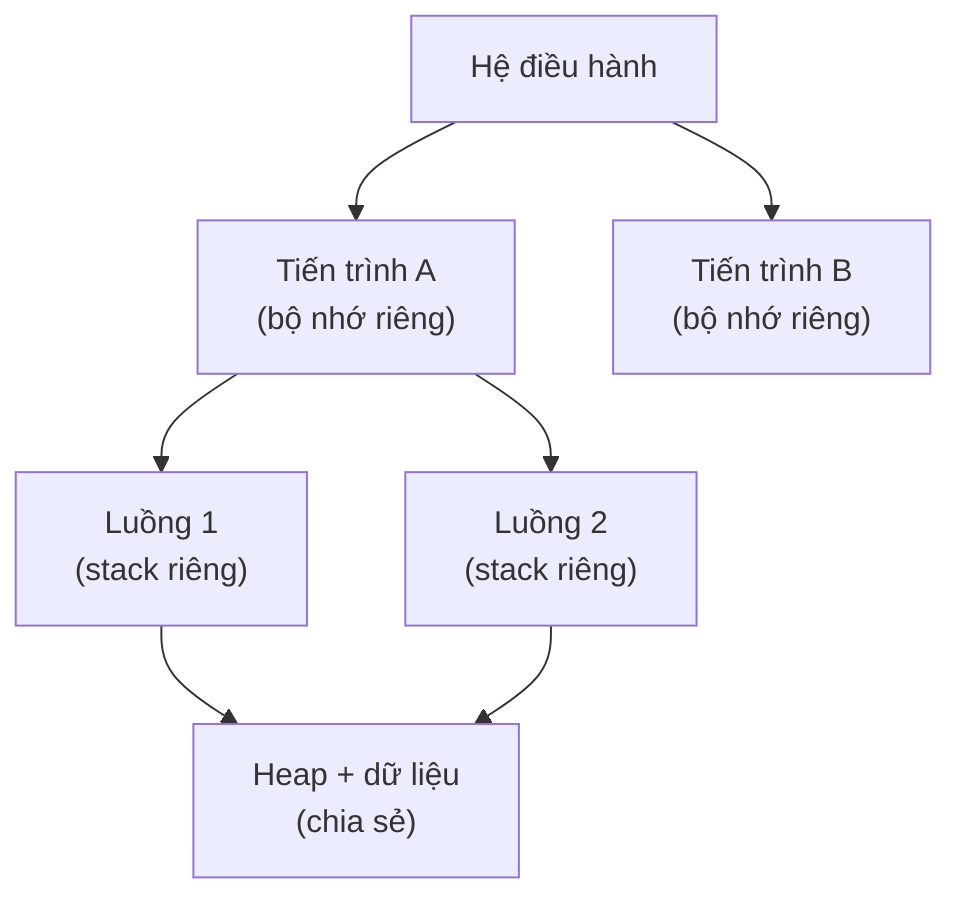
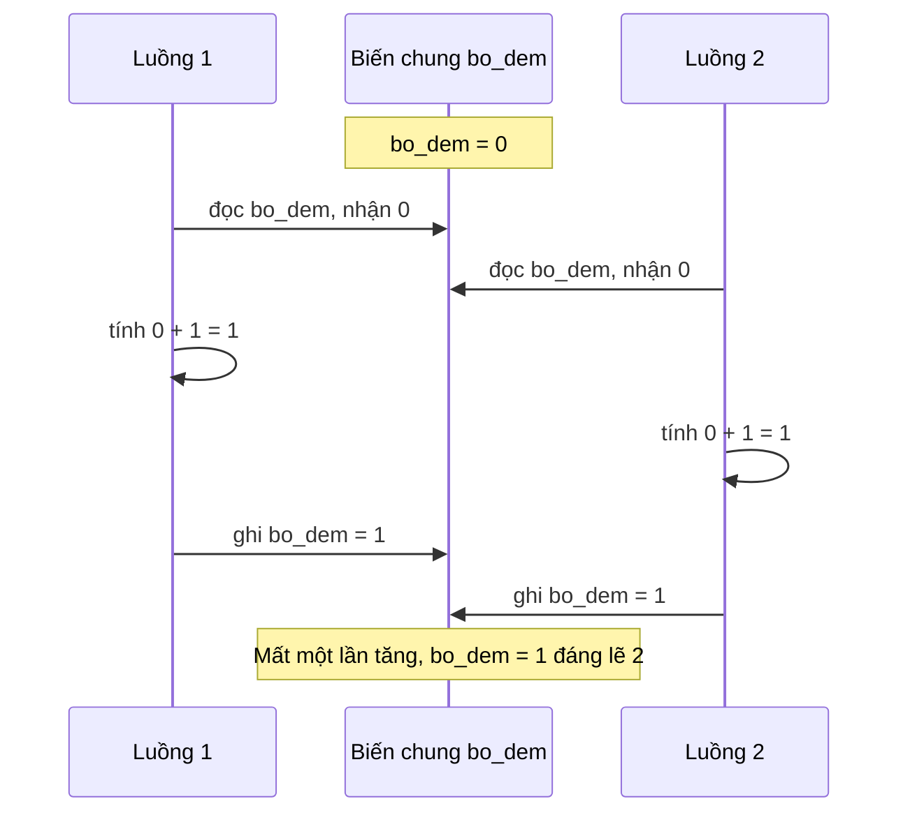

# Lập trình đồng thời (Concurrency)

## Khái niệm

Lập trình đồng thời (concurrency) là kỹ thuật thiết kế chương trình để nhiều tác vụ có thể tiến triển trong cùng khoảng thời gian. Đồng thời (concurrency) nói về **cấu trúc** — xử lý nhiều việc đan xen; song song (parallelism) nói về **thực thi** — chạy nhiều việc thật sự cùng lúc trên nhiều lõi CPU. Một chương trình có thể đồng thời mà không song song (một lõi luân phiên) và ngược lại.

## Khi nào dùng / Vì sao quan trọng

Dùng khi cần tận dụng nhiều lõi CPU, giữ giao diện phản hồi, hoặc xử lý nhiều kết nối mạng cùng lúc. Đây là nguồn gốc của nhiều bug khó tái hiện nhất, nên là chủ đề phỏng vấn nặng ký cho vị trí backend/hệ thống.

## Cách hoạt động

### Thread vs Process vs Async

- **Tiến trình (process):** Có không gian địa chỉ bộ nhớ riêng, cô lập. Giao tiếp qua IPC. Tạo/chuyển đổi tốn kém hơn nhưng an toàn hơn.
- **Luồng (thread):** Nằm trong một tiến trình, **chia sẻ** vùng nhớ heap. Nhẹ, tạo nhanh, nhưng chia sẻ dữ liệu dễ sinh xung đột.
- **Bất đồng bộ (async):** Một luồng đơn dùng vòng lặp sự kiện (event loop) luân phiên giữa các tác vụ tại các điểm `await`. Không có song song thật, nhưng cực hiệu quả với tác vụ I/O-bound (chờ mạng, đĩa) vì không tốn chi phí tạo luồng.

| Mô hình | Bộ nhớ | Chi phí tạo | Song song CPU | Hợp với |
|---------|--------|-------------|---------------|---------|
| Process | Riêng | Cao | Có | CPU-bound (tính toán nặng) |
| Thread | Chia sẻ | Trung bình | Có (trừ GIL Python) | Trộn I/O & CPU nhẹ |
| Async | Chia sẻ | Rất thấp | Không | I/O-bound (nhiều kết nối) |

### Các nguy cơ

- **Race condition (điều kiện tranh chấp):** Kết quả phụ thuộc thứ tự thực thi không xác định của nhiều luồng cùng truy cập dữ liệu chung.
- **Deadlock (khóa chết):** Nhiều luồng chờ nhau vô hạn để giải phóng khóa.
- **Thread safety (an toàn luồng):** Một đoạn code an toàn luồng cho kết quả đúng khi nhiều luồng chạy đồng thời.

### Cơ chế đồng bộ

- **Mutex (khóa loại trừ tương hỗ):** Chỉ một luồng giữ khóa vào vùng tới hạn (critical section) tại một thời điểm.
- **Semaphore (đèn báo):** Bộ đếm cho phép tối đa N luồng vào cùng lúc.
- **Lock/Monitor:** Trừu tượng hóa việc khóa quanh dữ liệu chung.
- **Atomic operation:** Thao tác không thể bị ngắt giữa chừng.

!!! question "Tại sao race condition lại xảy ra?"
    Gốc rễ: một thao tác trông có vẻ "một dòng" như `bo_dem += 1` thực chất **KHÔNG nguyên
    tử (atomic)** — CPU chia nó thành ba bước riêng: (1) **đọc** giá trị hiện tại từ bộ nhớ
    vào thanh ghi, (2) **cộng thêm 1** trong thanh ghi, (3) **ghi** kết quả trở lại bộ nhớ.
    Hệ điều hành có thể **ngắt và chuyển luồng ở bất kỳ điểm nào giữa ba bước này**. Nếu
    luồng 1 vừa đọc `bo_dem = 0` rồi bị ngắt, luồng 2 cũng đọc `0`, cả hai cùng tính `0+1=1`
    rồi lần lượt ghi `1` — hai lần tăng nhưng kết quả chỉ là `1`, **mất một lần tăng**. Race
    condition xảy ra chính vì các bước con của nhiều luồng **đan xen (interleave)** theo
    thứ tự không đoán trước. Đây là lý do bug này khó tái hiện: nó chỉ lộ ra khi lịch định
    thời (scheduling) rơi đúng vào "khe" xấu, mỗi lần chạy một khác.

!!! question "Tại sao khoá giải quyết được race nhưng lại gây deadlock và làm chậm?"
    **Vì sao khoá chữa được race:** khoá (mutex) buộc cả cụm đọc-sửa-ghi trở thành **một
    khối không thể chia cắt** đối với các luồng khác. Khi một luồng giữ khoá vào vùng tới
    hạn, mọi luồng khác **phải chờ** ở cửa; nhờ đó không còn cảnh đan xen giữa chừng — thao
    tác trở nên "nguyên tử về mặt logic".

    **Nhưng khoá sinh ra hai cái giá:**

    - **Deadlock:** khi cần nhiều khoá, hai luồng có thể **giữ chéo và chờ nhau vĩnh viễn**.
      Luồng 1 giữ khoá A rồi xin khoá B; luồng 2 giữ khoá B rồi xin khoá A — không ai nhả,
      không ai đi tiếp. Đây là kết quả tự nhiên khi thứ tự xin khoá không nhất quán (một
      trong bốn điều kiện Coffman). Cách phòng: luôn **xin khoá theo cùng một thứ tự**.
    - **Chậm đi:** khoá **tuần tự hoá (serialize)** đoạn được bảo vệ — chỉ một luồng chạy
      trong đó tại một thời điểm, nên phần này **mất khả năng song song**, các luồng khác
      ngồi chờ không làm gì. Khoá càng "to" (bao nhiều code) hoặc giữ càng lâu thì mức song
      song thực tế càng giảm, có khi đa luồng còn chậm hơn đơn luồng vì tốn thêm chi phí
      chuyển ngữ cảnh và tranh khoá (lock contention). Đây là đánh đổi: **đổi tính song song
      lấy tính đúng đắn**.

## Ví dụ: khóa bảo vệ biến chung

=== "JavaScript"
    ```js
    // Node.js: mô phỏng bất đồng bộ với async/await (đơn luồng, event loop)
    function taiVe(ten, ms) {
      return new Promise(resolve =>
        setTimeout(() => resolve(`${ten} xong sau ${ms}ms`), ms));
    }

    async function main() {
      // Chạy ĐỒNG THỜI: cả ba cùng khởi động, chờ tất cả hoàn tất
      const kq = await Promise.all([
        taiVe("A", 300), taiVe("B", 100), taiVe("C", 200),
      ]);
      console.log(kq);  // ['A xong sau 300ms', 'B ...', 'C ...']
    }
    main();
    ```

=== "Python"
    ```python
    import threading

    bo_dem = 0
    khoa = threading.Lock()          # mutex bảo vệ biến chung

    def tang(n):
        global bo_dem
        for _ in range(n):
            with khoa:               # chỉ một luồng vào vùng tới hạn
                bo_dem += 1          # tránh race condition

    luong = [threading.Thread(target=tang, args=(100000,)) for _ in range(4)]
    for t in luong: t.start()
    for t in luong: t.join()
    print(bo_dem)                    # 400000 — đúng nhờ có khóa
    ```

Nếu **bỏ khóa** ở ví dụ Python, kết quả sẽ nhỏ hơn 400000 do các luồng đọc-sửa-ghi `bo_dem` đè lên nhau (race condition).

## Ví dụ: async I/O

=== "JavaScript"
    ```js
    // async/await là cách tự nhiên của JS để xử lý I/O đồng thời
    async function xuLy(url) {
      const res = await fetch(url);      // nhường CPU khi chờ mạng
      return (await res.text()).length;
    }
    ```

=== "Python"
    ```python
    import asyncio

    async def tai_ve(ten, giay):
        await asyncio.sleep(giay)        # nhường event loop khi chờ
        return f"{ten} xong"

    async def main():
        # Ba coroutine chạy đan xen trên MỘT luồng
        kq = await asyncio.gather(
            tai_ve("A", 0.3), tai_ve("B", 0.1), tai_ve("C", 0.2))
        print(kq)

    asyncio.run(main())
    ```

> Lưu ý: CPython có GIL (Global Interpreter Lock) nên luồng không cho song song CPU thật; muốn song song tính toán hãy dùng `multiprocessing`.

## Sơ đồ tiến trình và luồng

Một tiến trình (process) có không gian bộ nhớ riêng; bên trong có thể chạy nhiều luồng (thread) chia sẻ chung bộ nhớ heap và dữ liệu, nhưng mỗi luồng có ngăn xếp (stack) riêng.



- **Tiến trình:** cô lập, an toàn hơn, tốn tài nguyên khi giao tiếp (IPC).
- **Luồng:** nhẹ, chia sẻ bộ nhớ nên giao tiếp nhanh nhưng cần đồng bộ hoá (khoá) để tránh race condition.

## Sơ đồ race condition

Khi hai luồng cùng đọc-sửa-ghi một biến chung mà không có khóa, các thao tác đan xen nhau khiến một lần tăng bị mất. Sơ đồ dưới đây minh họa hai luồng cùng tăng `bo_dem` nhưng kết quả sai.



## Ưu / nhược điểm

- **Ưu:** Tận dụng đa lõi, tăng thông lượng, giữ ứng dụng phản hồi tốt.
- **Nhược:** Khó viết đúng; bug (race, deadlock) khó tái hiện và gỡ; khóa quá nhiều làm giảm hiệu năng.

## Câu hỏi phỏng vấn thường gặp

1. Phân biệt concurrency và parallelism.
2. Thread và process khác nhau ở điểm nào? Khi nào dùng async thay vì thread?
3. Race condition xảy ra khi nào? Cách phòng tránh?
4. Deadlock là gì? Bốn điều kiện Coffman để xảy ra deadlock?
5. Mutex khác semaphore ra sao? GIL trong Python là gì?

## Tham khảo

- *Operating System Concepts* (Silberschatz)
- Tài liệu `threading`, `multiprocessing`, `asyncio` của Python
