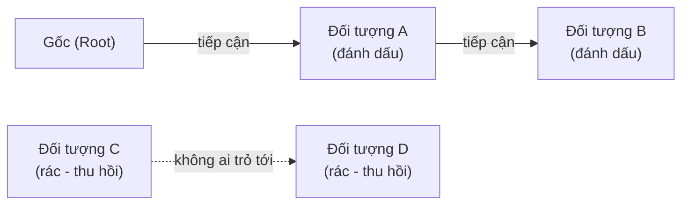
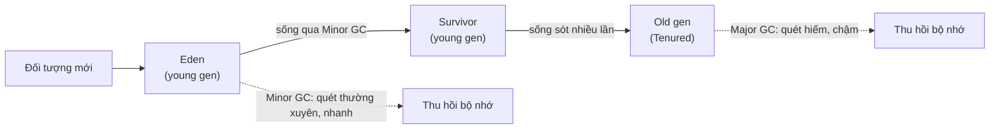

# Thu gom rác (Garbage Collection)

## Khái niệm

Thu gom rác (garbage collection — GC) là cơ chế tự động thu hồi vùng nhớ mà chương
trình không còn dùng tới, giải phóng lập trình viên khỏi việc giải phóng thủ công.
Bộ thu gom rác xác định đối tượng nào không còn "sống" (không thể truy cập được nữa)
rồi trả bộ nhớ đó về cho hệ thống.

## Khi nào dùng / Vì sao quan trọng

GC là mặc định trong Java, C#, Python, JavaScript, Go. Hiểu nó giúp bạn viết code
tránh giữ tham chiếu thừa, giải thích được các đợt "khựng" (GC pause) và tối ưu hiệu
năng — câu hỏi thường gặp cho vị trí backend/hệ thống.

## Cách hoạt động

### Đếm tham chiếu (Reference Counting)

Mỗi đối tượng giữ một bộ đếm số tham chiếu trỏ tới nó. Khi bộ đếm về 0, giải phóng
ngay lập tức.

- **Ưu:** Thu hồi tức thì, dễ đoán, phân tán chi phí (không có pause lớn).
- **Nhược:** Không xử lý được **tham chiếu vòng (cycle)** — A trỏ B, B trỏ A nhưng
  cả hai không ai dùng; cập nhật bộ đếm tốn chi phí và không thân thiện với đa luồng.
  CPython dùng cách này kèm một bộ dò chu trình bổ sung.

### Truy vết (Tracing GC)

Bắt đầu từ tập "gốc" (roots — biến toàn cục, ngăn xếp), lần theo tham chiếu để đánh
dấu mọi đối tượng còn tiếp cận được; phần còn lại là rác.

- **Mark-and-Sweep (đánh dấu và quét):** Pha *mark* đánh dấu đối tượng sống; pha
  *sweep* quét thu hồi đối tượng không đánh dấu. Xử lý được cycle nhưng có thể gây
  khựng và phân mảnh.
- **Mark-Compact:** Sau khi đánh dấu, dồn các đối tượng sống lại để chống phân mảnh.
- **Copying:** Chia heap hai nửa, chép đối tượng sống sang nửa kia (nhanh nhưng phí
  một nửa bộ nhớ).

### GC theo thế hệ (Generational GC)

Dựa trên giả thuyết "hầu hết đối tượng chết trẻ" (weak generational hypothesis): chia
heap thành thế hệ trẻ (young) và già (old). Thu gom thế hệ trẻ thường xuyên và nhanh;
đối tượng sống sót được "thăng cấp" (promote) lên thế hệ già, ít bị quét hơn. Giảm
đáng kể tổng chi phí GC (Java HotSpot, .NET, CPython đều dùng).

!!! question "Tại sao generational GC lại hiệu quả?"
    Nền tảng là một quan sát thực nghiệm gọi là **giả thuyết thế hệ yếu (weak generational
    hypothesis): hầu hết đối tượng chết rất trẻ.** Trong chương trình điển hình, đa số đối
    tượng là thứ tạm bợ — biến trung gian trong vòng lặp, chuỗi vừa nối, object trả về rồi
    vứt ngay. Chỉ một số ít (cấu hình, cache, kết nối) sống lâu.

    **Tại sao điều đó giúp tiết kiệm:** chi phí của tracing GC tỉ lệ với **số đối tượng SỐNG
    phải đánh dấu và di chuyển**, không phải số rác. Nếu cứ mỗi lần dọn lại quét toàn bộ heap
    thì ta phí công lần theo đám đối tượng già nua vốn gần như chẳng bao giờ chết. Generational
    GC tách vùng "trẻ" nhỏ ra và **chỉ quét vùng này thật thường xuyên**: vì hầu hết ở đây đã
    chết, số đối tượng sống sót cần xử lý rất ít → mỗi đợt Minor GC nhanh và rẻ. Đám hiếm hoi
    sống dai được **thăng cấp** lên vùng già để **khỏi phải kiểm tra đi kiểm tra lại**; vùng
    già chỉ bị quét (Major GC) khi thật cần. Loại suy: thay vì tổng vệ sinh cả toà nhà mỗi
    ngày, ta chỉ đổ thùng rác cạnh bàn — nơi rác dồn nhanh nhất — còn kho lưu trữ thì lâu lâu
    mới dọn.

!!! question "Tại sao đếm tham chiếu không xử lý được tham chiếu vòng?"
    Đếm tham chiếu chỉ dựa vào một quy tắc **cục bộ**: "khi bộ đếm về 0 thì giải phóng". Bộ
    đếm về 0 nghĩa là **không còn ai trỏ tới**. Nhưng với một **chu trình** — A trỏ B và B
    trỏ A — thì ngay cả khi chương trình đã bỏ hết tham chiếu từ bên ngoài vào chúng, A vẫn
    còn "một người hâm mộ" là B, và B vẫn còn A. Bộ đếm của cả hai **luôn ≥ 1**, không bao
    giờ chạm 0, nên không đối tượng nào được giải phóng — dù cả cụm đã thành **rác không thể
    truy cập** từ chương trình. Đây là rò rỉ bộ nhớ kinh điển của reference counting.

    Vấn đề nằm ở chỗ đếm tham chiếu hỏi sai câu hỏi: nó hỏi "**có ai trỏ tới không?**" trong
    khi câu hỏi đúng là "**có còn tiếp cận được từ gốc (root) không?**". Tracing GC hỏi đúng
    câu này: nó xuất phát từ tập gốc và lần theo tham chiếu; cụm A–B không nằm trên đường đi
    nào từ gốc nên bị bỏ lại và thu hồi — bất kể chúng trỏ lẫn nhau bao nhiêu. Đó là lý do
    CPython phải bổ sung một **bộ dò chu trình (cycle detector)** chạy bên cạnh cơ chế đếm
    tham chiếu.

## Ví dụ đa ngôn ngữ

=== "Python"

    ```python
    import gc, sys

    class Nut:
        def __init__(self): self.ke = None

    a = Nut(); b = Nut()
    a.ke = b; b.ke = a        # tham chiếu VÒNG: a<->b
    print(sys.getrefcount(a)) # >0 do vòng, đếm tham chiếu không giải phóng được

    del a; del b              # đếm tham chiếu vẫn không về 0 vì cycle
    thu_hoi = gc.collect()    # bộ dò chu trình (tracing) mới dọn được
    print("Đối tượng đã thu hồi:", thu_hoi)
    ```

=== "JavaScript"

    ```js
    // V8 (Node/trình duyệt) dùng tracing GC theo thế hệ.
    // Không có API 'free'; chỉ cần bỏ mọi tham chiếu là đủ.
    let cache = { du_lieu: new Array(1e6).fill(0) };
    cache = null;   // mất tham chiếu -> đủ điều kiện bị thu hồi

    // WeakMap/WeakRef không giữ đối tượng sống -> tránh rò rỉ do cache
    const wm = new WeakMap();
    let khoa = {};
    wm.set(khoa, "meta");
    khoa = null;    // cặp trong WeakMap tự biến mất khi GC chạy
    ```

=== "Java"

    ```java
    // JVM: tracing + generational (young: Eden+Survivor, old: Tenured)
    Object o = new Object();  // cấp phát ở Eden (young gen)
    o = null;                 // trở thành rác; Minor GC sẽ dọn young gen
    System.gc();              // GỢI Ý chạy GC (không bảo đảm), tránh dùng thật
    // Đối tượng sống qua nhiều lần Minor GC -> thăng cấp lên Old gen
    ```

## So sánh các chiến lược GC

| Chiến lược | Xử lý cycle? | Độ trễ | Phân mảnh | Ví dụ |
|------------|-------------|--------|-----------|-------|
| Reference counting | Không (cần bổ trợ) | Thấp, đều | Có thể | CPython, Swift ARC |
| Mark-and-Sweep | Có | Có pause | Có | GC cổ điển |
| Mark-Compact | Có | Có pause | Không | JVM Old gen |
| Copying | Có | Ngắn | Không | JVM Young gen |
| Generational | Có | Thấp trung bình | Ít | JVM, .NET, V8 |

## Ưu / nhược điểm

- **Ưu:** Loại bỏ nhiều lớp lỗi bộ nhớ (leak do quên free, dangling pointer,
  double-free); tăng năng suất.
- **Nhược:** Chi phí CPU và độ trễ khó đoán (GC pause / stop-the-world); tiêu tốn
  thêm bộ nhớ; ít kiểm soát thời điểm giải phóng — không lý tưởng cho hệ thống thời
  gian thực cứng.

## Câu hỏi phỏng vấn thường gặp

1. Reference counting và tracing GC khác nhau thế nào?
2. Vì sao đếm tham chiếu không tự xử lý được tham chiếu vòng?
3. Mark-and-sweep hoạt động ra sao?
4. Generational GC dựa trên giả thuyết nào và vì sao hiệu quả?
5. "Stop-the-world" pause là gì? Cách giảm thiểu?
6. `WeakMap`/`WeakRef` giúp tránh rò rỉ bộ nhớ thế nào?
7. Vì sao không nên gọi `System.gc()` / `gc.collect()` trong code thật?

## Sơ đồ thuật toán Mark-and-Sweep

Thuật toán đánh dấu và quét (mark-and-sweep) gồm hai pha: từ tập gốc (root) đánh dấu
mọi đối tượng còn tiếp cận được, sau đó quét và thu hồi các đối tượng chưa được đánh
dấu.



- **Pha Mark:** duyệt từ root, đánh dấu mọi đối tượng còn tham chiếu (A, B).
- **Pha Sweep:** quét toàn bộ heap, giải phóng các đối tượng không được đánh dấu (C, D).

## Sơ đồ GC theo thế hệ

Heap được chia thành thế hệ trẻ (young: Eden + Survivor) và thế hệ già (old). Đối tượng mới sinh ở Eden; nếu sống sót qua các đợt Minor GC sẽ được thăng cấp dần lên Old gen — nơi ít bị quét hơn.



## Tham khảo

- *The Garbage Collection Handbook* (Jones et al.)
- Tài liệu module `gc` của Python; tài liệu GC của JVM
