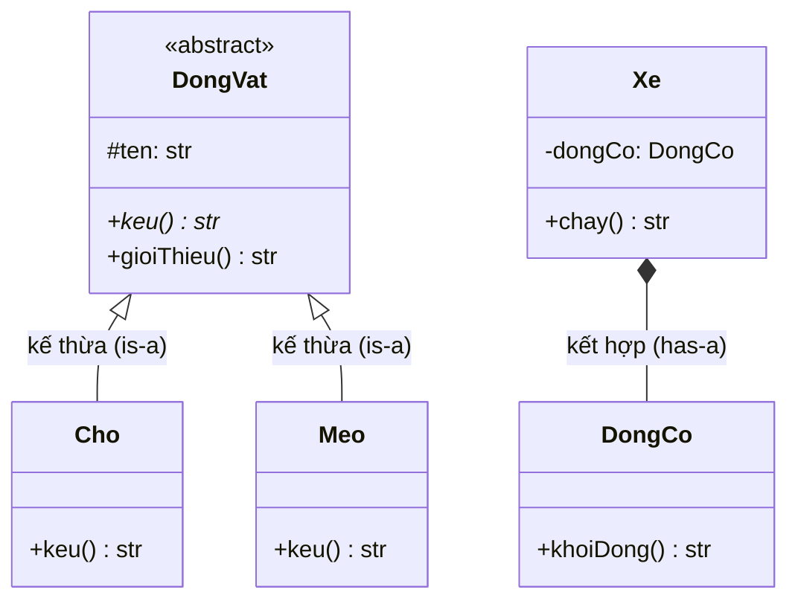

# Lập trình hướng đối tượng (OOP)

## Khái niệm

Lập trình hướng đối tượng (Object-Oriented Programming) tổ chức chương trình quanh các **đối tượng (object)** — thực thể gói chung dữ liệu (thuộc tính) và hành vi (phương thức). Lớp (class) là khuôn mẫu để tạo đối tượng. Mục tiêu là mô hình hóa thế giới thực và quản lý độ phức tạp qua bốn trụ cột: đóng gói, kế thừa, đa hình, trừu tượng.

## Khi nào dùng / Vì sao quan trọng

OOP thống trị phần mềm doanh nghiệp vì giúp chia hệ thống lớn thành các phần độc lập, dễ bảo trì và mở rộng. Đây là chủ đề phỏng vấn phổ biến nhất về thiết kế.

## Bốn trụ cột

- **Đóng gói (Encapsulation):** Ẩn dữ liệu bên trong đối tượng, chỉ cho truy cập qua giao diện công khai. Bảo vệ trạng thái khỏi thay đổi bừa bãi.
- **Kế thừa (Inheritance):** Lớp con thừa hưởng thuộc tính/phương thức của lớp cha, tái sử dụng và mở rộng.
- **Đa hình (Polymorphism):** Cùng một lời gọi cho hành vi khác nhau tùy kiểu thật của đối tượng.
- **Trừu tượng (Abstraction):** Ẩn chi tiết cài đặt, chỉ phơi bày những gì cần thiết qua lớp/giao diện trừu tượng.

## Sơ đồ lớp



### Overriding vs Overloading

- **Ghi đè (Overriding):** Lớp con định nghĩa lại phương thức cùng chữ ký của lớp cha — quyết định lúc chạy (runtime, dynamic dispatch).
- **Nạp chồng (Overloading):** Nhiều phương thức cùng tên nhưng khác danh sách tham số — quyết định lúc biên dịch. Python không hỗ trợ overloading kiểu Java, thường mô phỏng bằng tham số mặc định.

### Composition vs Inheritance

- **Kế thừa (is-a):** Chó *là một* Động vật.
- **Kết hợp (has-a):** Xe *có một* Động cơ. Nguyên tắc "ưu tiên composition hơn inheritance" giúp giảm ràng buộc chặt và tránh hệ thống phân cấp cứng nhắc.

## Ví dụ: kế thừa, trừu tượng, đa hình

=== "JavaScript"
    ```js
    // Lớp "trừu tượng" mô phỏng: chặn khởi tạo trực tiếp
    class DongVat {
      constructor(ten) { this._ten = ten; }   // đóng gói (quy ước _)
      keu() { throw new Error("Phải override keu()"); }
    }
    class Cho extends DongVat {                 // kế thừa
      keu() { return `${this._ten}: Gâu gâu`; } // ghi đè
    }
    class Meo extends DongVat {
      keu() { return `${this._ten}: Meo meo`; }
    }
    // Đa hình: cùng vòng lặp gọi keu(), hành vi khác theo kiểu thật
    for (const con of [new Cho("Vàng"), new Meo("Miu")]) {
      console.log(con.keu());
    }
    ```

=== "Python"
    ```python
    from abc import ABC, abstractmethod

    class DongVat(ABC):              # trừu tượng
        def __init__(self, ten):
            self._ten = ten          # đóng gói (quy ước _ = protected)

        @abstractmethod
        def keu(self): ...           # phương thức trừu tượng

    class Cho(DongVat):              # kế thừa
        def keu(self):               # ghi đè (override)
            return f"{self._ten}: Gâu gâu"

    class Meo(DongVat):
        def keu(self):
            return f"{self._ten}: Meo meo"

    # Đa hình: cùng vòng lặp gọi keu(), hành vi khác nhau theo kiểu thật
    for con in [Cho("Vàng"), Meo("Miu")]:
        print(con.keu())
    ```

## Ví dụ: composition (has-a)

=== "JavaScript"
    ```js
    class DongCo {
      khoiDong() { return "Động cơ chạy"; }
    }
    class Xe {
      constructor() { this.dongCo = new DongCo(); }  // kết hợp
      chay() { return this.dongCo.khoiDong(); }
    }
    console.log(new Xe().chay());  // Động cơ chạy
    ```

=== "Python"
    ```python
    # Composition: Xe CÓ một Động cơ (has-a) thay vì kế thừa
    class DongCo:
        def khoi_dong(self): return "Động cơ chạy"

    class Xe:
        def __init__(self):
            self.dong_co = DongCo()   # kết hợp
        def chay(self):
            return self.dong_co.khoi_dong()
    ```

## Playground: kế thừa & đa hình

Chạy thử để thấy cùng lời gọi `keu()` cho kết quả khác nhau theo kiểu thật của đối tượng.

<div class="js-demo" data-title="Kế thừa & đa hình">
<textarea class="js-demo-src">
class DongVat {
  constructor(ten) { this.ten = ten; }
  keu() { return `${this.ten}: (âm thanh chung)`; }
  gioiThieu() { return `Tôi là ${this.ten}, và ${this.keu()}`; }
}
class Cho extends DongVat {
  keu() { return `Gâu gâu`; }         // ghi đè
}
class Meo extends DongVat {
  keu() { return `Meo meo`; }
}
class Vit extends DongVat {
  keu() { return `Cạp cạp`; }
}

const bay = [new Cho("Vàng"), new Meo("Miu"), new Vit("Donald")];
print("=== Đa hình: cùng gọi keu() ===");
for (const con of bay) {
  print(con.ten, "->", con.keu());
}
print("");
print("=== gioiThieu() dùng lại keu() đã ghi đè ===");
for (const con of bay) print(con.gioiThieu());
</textarea>
</div>

## Ưu / nhược điểm

- **Ưu:** Mô hình gần thực tế, tái sử dụng qua kế thừa, dễ mở rộng, đóng gói bảo vệ dữ liệu.
- **Nhược:** Lạm dụng kế thừa gây ràng buộc chặt và phân cấp phức tạp; có thể "over-engineer"; hiệu năng kém hơn thủ tục thuần trong vài trường hợp.

## Câu hỏi phỏng vấn thường gặp

1. Kể và giải thích bốn trụ cột của OOP.
2. Phân biệt overriding và overloading.
3. Vì sao "ưu tiên composition hơn inheritance"?
4. Đa hình thời chạy được cài đặt thế nào (vtable/dynamic dispatch)?
5. Lớp trừu tượng khác interface ở điểm nào?

## Tham khảo

- *Design Patterns* (Gang of Four)
- *Head First Object-Oriented Analysis and Design*
