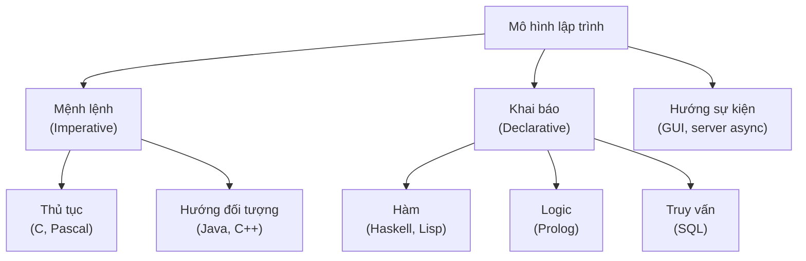
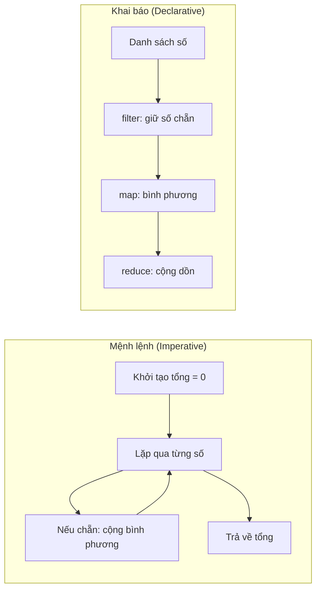

# Các mô hình lập trình (Programming Paradigms)

## Khái niệm

Mô hình lập trình (programming paradigm) là một phong cách, một cách tư duy cơ bản để tổ chức và cấu trúc mã nguồn. Mỗi mô hình đặt ra những quy tắc và khái niệm riêng về cách biểu diễn logic, quản lý trạng thái và điều khiển luồng thực thi. Một ngôn ngữ có thể hỗ trợ nhiều mô hình (đa mô hình — multi-paradigm), ví dụ Python hay JavaScript.

## Khi nào dùng / Vì sao quan trọng

Hiểu các mô hình giúp bạn chọn cách tiếp cận phù hợp với bài toán: xử lý dữ liệu dạng luồng hợp với hàm (functional), mô hình hóa thực thể phức tạp hợp với hướng đối tượng (OOP), còn giao diện người dùng hợp với hướng sự kiện (event-driven). Trong phỏng vấn, đây là kiến thức nền để giải thích vì sao bạn viết code theo một cách nhất định.

## Bản đồ các mô hình



## Cách hoạt động

### Mệnh lệnh (Imperative)

Mô tả **cách** máy tính làm việc thông qua chuỗi câu lệnh thay đổi trạng thái. Bạn chỉ rõ từng bước.

- **Thủ tục (Procedural):** Tổ chức code thành các thủ tục/hàm gọi lẫn nhau (C, Pascal).
- **Hướng đối tượng (Object-Oriented):** Gói dữ liệu và hành vi vào đối tượng (Java, C++).

### Khai báo (Declarative)

Mô tả **kết quả mong muốn** mà không nói rõ từng bước thực hiện.

- **Hàm (Functional):** Tính toán bằng cách áp dụng và kết hợp các hàm, tránh trạng thái biến đổi (Haskell, Lisp).
- **Logic (Logic):** Mô tả sự kiện và luật, để máy suy diễn (Prolog).
- **Truy vấn:** SQL mô tả dữ liệu cần lấy, không mô tả cách lấy.

### Các mô hình khác

- **Hướng sự kiện (Event-Driven):** Luồng chương trình được điều khiển bởi sự kiện (click chuột, gói tin mạng) và các hàm xử lý (event handler). Phổ biến trong GUI và server bất đồng bộ.
- **Hướng khía cạnh (Aspect-Oriented):** Tách các mối quan tâm cắt ngang (cross-cutting concerns) như logging, bảo mật ra khỏi logic nghiệp vụ, rồi "đan" (weave) chúng vào lúc biên dịch/chạy.

## Ví dụ: mệnh lệnh vs khai báo

Cùng bài toán "tổng bình phương các số chẵn", hai phong cách khác nhau rõ rệt. Sơ đồ dưới đây cho thấy luồng tư duy khác biệt: mệnh lệnh mô tả từng bước lặp, còn khai báo mô tả chuỗi phép biến đổi dữ liệu.



=== "JavaScript"
    ```js
    // Mệnh lệnh: mô tả TỪNG BƯỚC bằng vòng lặp
    function tongMenhLenh(so) {
      let tong = 0;
      for (const x of so) {
        if (x % 2 === 0) tong += x * x;   // lọc chẵn rồi cộng dồn
      }
      return tong;
    }

    // Khai báo (kiểu hàm): mô tả KẾT QUẢ bằng chuỗi phép biến đổi
    function tongHam(so) {
      return so.filter(x => x % 2 === 0)
               .map(x => x * x)
               .reduce((a, b) => a + b, 0);
    }

    console.log(tongMenhLenh([1, 2, 3, 4]));  // 20
    console.log(tongHam([1, 2, 3, 4]));       // 20
    ```

=== "Python"
    ```python
    # Mệnh lệnh: mô tả TỪNG BƯỚC tính tổng bình phương số chẵn
    def tong_menh_lenh(so):
        tong = 0
        for x in so:
            if x % 2 == 0:      # lọc số chẵn
                tong += x * x   # cộng dồn bình phương
        return tong

    # Khai báo (kiểu hàm): mô tả KẾT QUẢ, không mô tả vòng lặp
    def tong_ham(so):
        return sum(x * x for x in so if x % 2 == 0)

    print(tong_menh_lenh([1, 2, 3, 4]))  # 20
    print(tong_ham([1, 2, 3, 4]))        # 20
    ```

## Ví dụ: hướng sự kiện

=== "JavaScript"
    ```js
    // Hướng sự kiện: đăng ký handler cho một sự kiện
    const xuLy = {};
    function dangKy(suKien, ham) {
      (xuLy[suKien] ||= []).push(ham);
    }
    function phatSuKien(suKien, duLieu) {
      (xuLy[suKien] || []).forEach(ham => ham(duLieu));
    }

    dangKy("click", d => console.log("Đã click tại", d));
    phatSuKien("click", [10, 20]);  // Đã click tại [10, 20]
    ```

=== "Python"
    ```python
    # Hướng sự kiện: đăng ký hàm xử lý cho một sự kiện
    xu_ly = {}
    def dang_ky(su_kien, ham):
        xu_ly.setdefault(su_kien, []).append(ham)

    def phat_su_kien(su_kien, du_lieu):
        for ham in xu_ly.get(su_kien, []):
            ham(du_lieu)

    dang_ky("click", lambda d: print("Đã click tại", d))
    phat_su_kien("click", (10, 20))  # Đã click tại (10, 20)
    ```

## Bảng so sánh các mô hình

| Mô hình | Tư duy cốt lõi | Trạng thái | Điển hình | Hợp với |
|---------|----------------|------------|-----------|---------|
| Thủ tục | Chuỗi lệnh, hàm | Biến đổi | C, Pascal | Script, hệ thống |
| Hướng đối tượng | Đối tượng + hành vi | Đóng gói trong object | Java, C++ | Hệ lớn, mô hình thực thể |
| Hàm | Kết hợp hàm | Bất biến | Haskell, Lisp | Xử lý dữ liệu, song song |
| Logic | Sự kiện + luật | Suy diễn | Prolog | AI, hệ chuyên gia |
| Truy vấn | Mô tả dữ liệu cần | Không | SQL | Cơ sở dữ liệu |
| Hướng sự kiện | Phản ứng với sự kiện | Qua handler | JS/Node | GUI, server async |

## Ưu / nhược điểm

- **Ưu:** Chọn đúng mô hình làm code ngắn gọn, dễ đọc, đúng bản chất bài toán; đa mô hình cho phép phối hợp linh hoạt.
- **Nhược:** Trộn nhiều mô hình tùy tiện gây rối; mỗi mô hình có đường cong học tập và bẫy riêng (ví dụ trạng thái biến đổi trong imperative dễ sinh lỗi).

## Câu hỏi phỏng vấn thường gặp

1. Phân biệt lập trình mệnh lệnh và khai báo? Cho ví dụ mỗi loại.
2. OOP và functional khác nhau ở điểm cốt lõi nào (trạng thái, tính bất biến)?
3. Vì sao ta nói SQL là ngôn ngữ khai báo?
4. Mô hình hướng sự kiện phù hợp với loại ứng dụng nào và vì sao?
5. Cross-cutting concern là gì? Aspect-oriented giải quyết nó ra sao?

## Tham khảo

- Robert W. Sebesta, *Concepts of Programming Languages*
- Wikipedia: Programming paradigm
