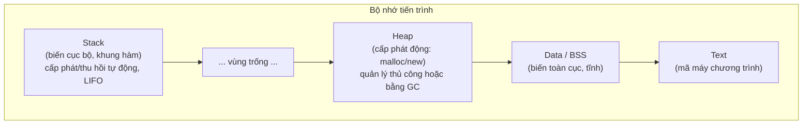

# Quản lý bộ nhớ (Memory Management)

## Khái niệm

Quản lý bộ nhớ (memory management) là quá trình cấp phát (allocate) và thu hồi (deallocate) vùng nhớ cho chương trình trong lúc chạy. Nó quyết định dữ liệu nằm ở đâu, tồn tại bao lâu và ai chịu trách nhiệm giải phóng. Quản lý sai gây rò rỉ bộ nhớ (memory leak), lỗi treo con trỏ (dangling pointer) hoặc tràn bộ nhớ.

## Khi nào dùng / Vì sao quan trọng

Mọi chương trình đều dùng bộ nhớ; hiểu cách nó được tổ chức giúp bạn viết code hiệu quả, tránh lỗi khó tìm và giải thích được hành vi hiệu năng. Đây là chủ đề phỏng vấn kinh điển cho C/C++ và cả các ngôn ngữ có bộ thu gom rác.

## Cách hoạt động

### Bố cục bộ nhớ của tiến trình (Memory layout)

Một tiến trình thường được chia thành các vùng:

| Vùng | Nội dung | Đặc điểm |
|------|----------|----------|
| Text/Code | Mã máy đã biên dịch | Chỉ đọc |
| Data | Biến toàn cục/tĩnh đã khởi tạo | Tồn tại suốt vòng đời |
| BSS | Biến toàn cục/tĩnh chưa khởi tạo | Khởi tạo 0 |
| Heap | Cấp phát động lúc chạy | Lớn lên hướng địa chỉ tăng |
| Stack | Khung hàm, biến cục bộ | Lớn lên hướng địa chỉ giảm |

### Stack vs Heap

- **Stack (ngăn xếp):** Lưu biến cục bộ và khung hàm (stack frame). Cấp phát/thu hồi tự động theo cơ chế LIFO khi hàm vào/ra. Rất nhanh, nhưng kích thước hạn chế; đệ quy quá sâu gây tràn ngăn xếp (stack overflow).
- **Heap (vùng nhớ động):** Lưu dữ liệu có kích thước hoặc vòng đời không biết trước lúc biên dịch. Cấp phát linh hoạt nhưng chậm hơn và cần quản lý (thủ công hoặc tự động).

### Thủ công vs Tự động

- **Thủ công (manual):** Lập trình viên tự cấp phát và giải phóng — `malloc`/`free` (C), `new`/`delete` (C++). Toàn quyền kiểm soát nhưng dễ gây leak và dangling pointer.
- **Tự động (automatic):** Bộ thu gom rác (garbage collector) hoặc cơ chế như RAII/con trỏ thông minh (smart pointer) tự giải phóng khi không còn tham chiếu. An toàn hơn, nhưng có chi phí thời gian chạy.

## Ví dụ

```python
# Trong Python, phân biệt biến trên "stack" (tham chiếu cục bộ)
# và đối tượng thực nằm trên heap
def tao_danh_sach():
    cuc_bo = [1, 2, 3]   # tên 'cuc_bo' ở khung hàm; list nằm trên heap
    return cuc_bo        # trả tham chiếu -> đối tượng sống tiếp

ds = tao_danh_sach()     # khung hàm mất đi, nhưng list vẫn sống nhờ 'ds'
print(ds)                # [1, 2, 3]
```

```c
/* C: cấp phát thủ công trên heap và phải tự giải phóng */
int *p = malloc(3 * sizeof(int)); /* xin bộ nhớ trên heap */
if (p) {
    p[0] = 1;
    free(p);   /* bắt buộc giải phóng, nếu không sẽ rò rỉ */
    p = NULL;  /* tránh dangling pointer */
}
```

## Ưu / nhược điểm

- **Ưu (thủ công):** Kiểm soát chính xác, không có chi phí GC — quan trọng cho hệ thống thời gian thực.
- **Nhược (thủ công):** Dễ sinh leak, double-free, dangling pointer.
- **Ưu (tự động):** An toàn, giảm bug, tăng tốc độ phát triển.
- **Nhược (tự động):** Chi phí CPU/độ trễ khó đoán khi GC chạy.

## Câu hỏi phỏng vấn thường gặp

1. Stack và heap khác nhau thế nào về tốc độ, vòng đời, cách cấp phát?
2. Memory leak là gì? Dangling pointer là gì? Cách phòng tránh?
3. Điều gì xảy ra khi đệ quy quá sâu?
4. RAII và smart pointer giúp gì trong C++?
5. Vì sao biến cục bộ mất đi khi hàm kết thúc nhưng đối tượng trả về vẫn sống?

## Sơ đồ Stack và Heap

Bộ nhớ tiến trình chia thành nhiều vùng; hai vùng quan trọng nhất là ngăn xếp (stack) và vùng nhớ động (heap), lớn dần về phía nhau.



- **Stack:** nhanh, kích thước nhỏ, tự giải phóng khi hàm kết thúc; tràn stack gây `stack overflow`.
- **Heap:** linh hoạt, lớn, sống lâu; quản lý sai gây rò rỉ bộ nhớ (memory leak).

## Tham khảo

- *Computer Systems: A Programmer's Perspective* (Bryant & O'Hallaron)
- Tài liệu C: malloc/free; C++: RAII, smart pointers
