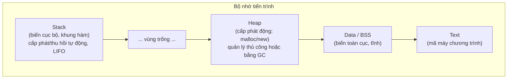

# Quản lý bộ nhớ (Memory Management)

## Khái niệm

Quản lý bộ nhớ (memory management) là quá trình cấp phát (allocate) và thu hồi
(deallocate) vùng nhớ cho chương trình trong lúc chạy. Nó quyết định dữ liệu nằm ở
đâu, tồn tại bao lâu và ai chịu trách nhiệm giải phóng. Quản lý sai gây rò rỉ bộ nhớ
(memory leak), lỗi treo con trỏ (dangling pointer) hoặc tràn bộ nhớ.

## Khi nào dùng / Vì sao quan trọng

Mọi chương trình đều dùng bộ nhớ; hiểu cách nó được tổ chức giúp bạn viết code hiệu
quả, tránh lỗi khó tìm và giải thích được hành vi hiệu năng. Đây là chủ đề phỏng vấn
kinh điển cho C/C++ và cả các ngôn ngữ có bộ thu gom rác.

## Cách hoạt động

### Bố cục bộ nhớ của tiến trình (Memory layout)

Một tiến trình thường được chia thành các vùng:

| Vùng | Nội dung | Đặc điểm |
|------|----------|----------|
| Text/Code | Mã máy đã biên dịch | Chỉ đọc |
| Data | Biến toàn cục/tĩnh đã khởi tạo | Tồn tại suốt vòng đời |
| BSS | Biến toàn cục/tĩnh chưa khởi tạo | Khởi tạo 0 |
| Heap | Cấp phát động lúc chạy | Lớn lên hướng địa chỉ tăng |
| Stack | Khung hàm, biến cục bộ | Lớn lên hướng địa chỉ giảm |

### Stack vs Heap — chi tiết

- **Stack (ngăn xếp):** Lưu biến cục bộ và khung hàm (stack frame). Cấp phát/thu hồi
  tự động theo cơ chế LIFO khi hàm vào/ra — chỉ cần dịch con trỏ ngăn xếp (stack
  pointer). Rất nhanh, dữ liệu gần nhau nên thân thiện với cache CPU; nhưng kích
  thước hạn chế (thường vài MB), đệ quy quá sâu gây tràn ngăn xếp (stack overflow).
- **Heap (vùng nhớ động):** Lưu dữ liệu có kích thước hoặc vòng đời không biết trước
  lúc biên dịch. Cấp phát linh hoạt (bộ cấp phát phải tìm khối trống phù hợp) nhưng
  chậm hơn, dễ phân mảnh, và cần quản lý (thủ công hoặc tự động).

| Tiêu chí | Stack | Heap |
|----------|-------|------|
| Tốc độ cấp phát | Rất nhanh (dịch con trỏ) | Chậm hơn (tìm khối trống) |
| Vòng đời | Theo phạm vi hàm (LIFO) | Do lập trình viên/GC quyết định |
| Kích thước | Nhỏ, cố định | Lớn, linh hoạt |
| Quản lý | Tự động | Thủ công hoặc GC |
| Lỗi điển hình | Stack overflow | Memory leak, fragmentation |
| Truy cập cache | Tốt (dữ liệu gần nhau) | Kém hơn (rải rác) |

!!! question "Tại sao stack nhanh còn heap chậm hơn?"
    **Cơ chế của stack:** ngăn xếp chỉ có MỘT con trỏ đỉnh (stack pointer). Cấp phát bộ
    nhớ cho một hàm mới = **dịch con trỏ đỉnh xuống** một đoạn bằng kích thước khung hàm;
    thu hồi = dịch nó ngược lại. Vì mọi thứ vào/ra theo trật tự **LIFO (vào sau ra trước)**,
    máy biết chính xác chỗ tiếp theo mà không cần suy nghĩ gì — chỉ một phép cộng/trừ vào
    con trỏ. Phép này tốn đúng **một lệnh CPU**, luôn cùng chi phí. Loại suy: xếp đĩa lên
    chồng — bạn chỉ thao tác ở đỉnh, không bao giờ phải tìm chỗ.

    **Vì sao heap chậm hơn:** heap cho phép cấp phát và giải phóng theo **thứ tự bất kỳ**,
    nên sau một hồi chạy nó trở thành một "tấm bản đồ" lỗ chỗ các vùng đang dùng xen kẽ
    vùng trống đủ mọi kích cỡ. Mỗi lần `malloc`/`new`, bộ cấp phát phải **đi dò danh sách
    các khối trống** để tìm một khối đủ lớn (first-fit, best-fit...), có khi phải tách khối
    hoặc gộp khối lân cận — nhiều bước hơn hẳn một phép cộng. Tệ hơn, giải phóng rải rác
    tạo **phân mảnh (fragmentation)**: tổng bộ nhớ trống còn nhiều nhưng bị chia vụn, không
    khối nào đủ liền để cấp phát → phải tìm lâu hơn hoặc thất bại. Loại suy: heap giống bãi
    đỗ xe công cộng — muốn đỗ phải chạy vòng tìm ô trống vừa xe.

!!! question "Tại sao biến cục bộ lại nằm trên stack?"
    Vì **vòng đời của biến cục bộ trùng khít với vòng đời lời gọi hàm**: nó sinh ra khi hàm
    được gọi và phải biến mất ngay khi hàm trả về. Đó đúng là bản chất LIFO của stack — hàm
    gọi sau sẽ trả về trước, khớp hoàn hảo với thứ tự vào/ra của ngăn xếp. Nhờ vậy việc dọn
    dẹp trở nên **tự động và miễn phí**: chỉ cần dịch con trỏ đỉnh về vị trí cũ là toàn bộ
    biến cục bộ của hàm biến mất, không cần lần theo từng biến để giải phóng. Đây là lý do
    ta không phải gọi `free` cho biến cục bộ. Đổi lại, chính vì nó "chết" theo hàm nên bạn
    **không được trả về con trỏ tới biến cục bộ** — vùng nhớ đó đã bị thu hồi (dangling
    pointer). Dữ liệu cần sống lâu hơn phạm vi hàm bắt buộc phải nằm trên heap.

### Thủ công vs Tự động

- **Thủ công (manual):** Lập trình viên tự cấp phát và giải phóng — `malloc`/`free`
  (C), `new`/`delete` (C++). Toàn quyền kiểm soát nhưng dễ gây leak và dangling
  pointer.
- **Tự động (automatic):** Bộ thu gom rác (garbage collector) hoặc cơ chế như
  RAII/con trỏ thông minh (smart pointer) tự giải phóng khi không còn tham chiếu.
  An toàn hơn, nhưng có chi phí thời gian chạy.

## Ví dụ đa ngôn ngữ

=== "Python"

    ```python
    # Trong Python, phân biệt biến trên "stack" (tham chiếu cục bộ)
    # và đối tượng thực nằm trên heap
    def tao_danh_sach():
        cuc_bo = [1, 2, 3]   # tên 'cuc_bo' ở khung hàm; list nằm trên heap
        return cuc_bo        # trả tham chiếu -> đối tượng sống tiếp

    ds = tao_danh_sach()     # khung hàm mất đi, nhưng list vẫn sống nhờ 'ds'
    print(ds)                # [1, 2, 3]
    ```

=== "JavaScript"

    ```js
    // Kiểu nguyên thủy (số, chuỗi, boolean) thường nằm ngăn xếp/giá trị;
    // đối tượng và mảng nằm trên heap, biến chỉ giữ tham chiếu.
    let a = { x: 1 };
    let b = a;          // b và a cùng trỏ MỘT đối tượng trên heap
    b.x = 99;
    console.log(a.x);   // 99  (vì chung tham chiếu)

    let m = 5, n = m;   // nguyên thủy: sao chép GIÁ TRỊ
    n = 99;
    console.log(m);     // 5   (không ảnh hưởng)
    ```

=== "C"

    ```c
    /* C: cấp phát thủ công trên heap và phải tự giải phóng */
    int *p = malloc(3 * sizeof(int)); /* xin bộ nhớ trên heap */
    if (p) {
        p[0] = 1;
        free(p);   /* bắt buộc giải phóng, nếu không sẽ rò rỉ */
        p = NULL;  /* tránh dangling pointer */
    }
    ```

=== "C++"

    ```cpp
    // C++ hiện đại: RAII + smart pointer, tự giải phóng khi ra khỏi phạm vi
    #include <memory>
    void f() {
        auto p = std::make_unique<int[]>(3); // cấp phát heap
        p[0] = 1;
        // KHÔNG cần delete: unique_ptr tự giải phóng khi hàm kết thúc
    }
    ```

## Playground: minh họa stack đầy dần khi đệ quy

<div class="js-demo" data-title="Đệ quy làm sâu ngăn xếp (mô phỏng)">
<textarea class="js-demo-src">
let doSau = 0;
function dequy(n) {
  doSau = Math.max(doSau, n);
  if (n === 0) return 0;      // điều kiện dừng: tránh stack overflow
  return n + dequy(n - 1);    // mỗi lần gọi thêm 1 khung vào ngăn xếp
}
print('Tổng 1..100 =', dequy(100));
print('Độ sâu ngăn xếp tối đa =', doSau, 'khung hàm');
print('Nếu thiếu điều kiện dừng -> tràn ngăn xếp (RangeError)');
</textarea>
</div>

## Ưu / nhược điểm

- **Ưu (thủ công):** Kiểm soát chính xác, không có chi phí GC — quan trọng cho hệ
  thống thời gian thực.
- **Nhược (thủ công):** Dễ sinh leak, double-free, dangling pointer.
- **Ưu (tự động):** An toàn, giảm bug, tăng tốc độ phát triển.
- **Nhược (tự động):** Chi phí CPU/độ trễ khó đoán khi GC chạy.

## Câu hỏi phỏng vấn thường gặp

1. Stack và heap khác nhau thế nào về tốc độ, vòng đời, cách cấp phát?
2. Memory leak là gì? Dangling pointer là gì? Cách phòng tránh?
3. Điều gì xảy ra khi đệ quy quá sâu?
4. RAII và smart pointer giúp gì trong C++?
5. Vì sao biến cục bộ mất đi khi hàm kết thúc nhưng đối tượng trả về vẫn sống?
6. Truyền tham trị (by value) khác truyền tham chiếu (by reference) thế nào về bộ nhớ?
7. Phân mảnh bộ nhớ (fragmentation) là gì?

## Sơ đồ Stack và Heap

Bộ nhớ tiến trình chia thành nhiều vùng; hai vùng quan trọng nhất là ngăn xếp
(stack) và vùng nhớ động (heap), lớn dần về phía nhau.



- **Stack:** nhanh, kích thước nhỏ, tự giải phóng khi hàm kết thúc; tràn stack gây
  `stack overflow`.
- **Heap:** linh hoạt, lớn, sống lâu; quản lý sai gây rò rỉ bộ nhớ (memory leak).

## Tham khảo

- *Computer Systems: A Programmer's Perspective* (Bryant & O'Hallaron)
- Tài liệu C: malloc/free; C++: RAII, smart pointers
