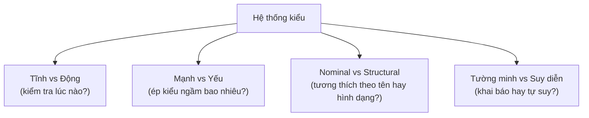
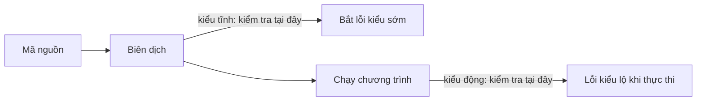

# Hệ thống kiểu (Type Systems)

## Khái niệm

Hệ thống kiểu (type system) là tập quy tắc gán "kiểu" (type) cho các giá trị và
biểu thức trong ngôn ngữ, nhằm ngăn những thao tác vô nghĩa (như cộng số với hàm).
Nó quyết định lỗi kiểu được phát hiện lúc nào (biên dịch hay chạy) và chặt chẽ đến
đâu.

## Khi nào dùng / Vì sao quan trọng

Hiểu hệ thống kiểu giúp bạn chọn ngôn ngữ phù hợp, viết code an toàn hơn và giải
thích được sự khác biệt giữa các ngôn ngữ. Chủ đề này hay được hỏi để đánh giá chiều
sâu về ngôn ngữ.

## Cách hoạt động

### Bốn trục phân loại

Người ta hay nói một ngôn ngữ "kiểu mạnh" hay "kiểu tĩnh", nhưng thật ra có **nhiều
trục độc lập**:



### Tĩnh vs Động (Static vs Dynamic)

- **Kiểu tĩnh (static typing):** Kiểu được kiểm tra lúc **biên dịch** (Java, C++,
  Rust, Go, TypeScript). Bắt lỗi sớm, hỗ trợ IDE tốt, tối ưu hiệu năng, nhưng cần
  khai báo/verbose hơn.
- **Kiểu động (dynamic typing):** Kiểu gắn với giá trị và kiểm tra lúc **chạy**
  (Python, JavaScript, Ruby). Linh hoạt, viết nhanh, nhưng lỗi kiểu chỉ lộ khi thực
  thi.

### Mạnh vs Yếu (Strong vs Weak)

- **Kiểu mạnh (strong typing):** Hạn chế chuyển kiểu ngầm; `"1" + 1` báo lỗi
  (Python).
- **Kiểu yếu (weak typing):** Cho phép nhiều chuyển kiểu ngầm (implicit coercion);
  `"1" + 1` cho `"11"` (JavaScript). Tiện nhưng dễ sinh lỗi bất ngờ.

> Lưu ý: tĩnh/động và mạnh/yếu là hai trục **độc lập**. Python là động + mạnh; C là
> tĩnh + tương đối yếu (ép kiểu con trỏ, số ngầm).

### Định danh vs Cấu trúc (Nominal vs Structural)

- **Nominal typing:** Tương thích kiểu dựa trên **tên**/khai báo tường minh (Java:
  phải `implements` interface).
- **Structural typing:** Tương thích dựa trên **hình dạng** (có đủ thuộc tính/phương
  thức là được — TypeScript, "duck typing" của Python).

### Suy diễn kiểu (Type inference)

Nhiều ngôn ngữ tĩnh không bắt khai báo mọi nơi mà **tự suy** kiểu: `auto` (C++),
`var` (Java/C#), `let x = 5` (Rust/TypeScript). Giữ an toàn tĩnh nhưng bớt dài dòng.

## Sơ đồ: kiểm tra kiểu diễn ra lúc nào

Trục tĩnh/động quyết định lỗi kiểu bị bắt ở giai đoạn nào: ngôn ngữ tĩnh kiểm tra lúc biên dịch (bắt sớm), ngôn ngữ động kiểm tra lúc chạy (lộ muộn).



## Ví dụ đa ngôn ngữ

=== "Python"

    ```python
    # Python: động + mạnh
    x = 10          # x là int
    x = "chuoi"     # hợp lệ: kiểu gắn với giá trị, không với biến

    # Kiểu mạnh: KHÔNG tự ép "1" + 1
    try:
        print("1" + 1)
    except TypeError as e:
        print("Lỗi kiểu:", e)   # can only concatenate str... to str

    # Structural / duck typing: "nếu kêu như vịt thì coi là vịt"
    class Vit:   quack = lambda self: "Quạc"
    class Nguoi: quack = lambda self: "Giả tiếng vịt"

    def cho_keu(x):
        print(x.quack())   # chỉ cần có 'quack', không quan tâm kiểu tên gì

    cho_keu(Vit()); cho_keu(Nguoi())
    ```

=== "JavaScript"

    ```js
    // JavaScript: động + YẾU (ép kiểu ngầm nhiều bất ngờ)
    console.log("1" + 1);   // "11"   (số -> chuỗi)
    console.log("5" - 1);   // 4      (chuỗi -> số)
    console.log([] + []);   // ""     (mảng -> chuỗi rỗng)
    console.log(true + 1);  // 2      (boolean -> số)

    // Vì ép kiểu yếu, so sánh nên dùng === (không ép kiểu)
    console.log(0 == "");   // true   (bất ngờ!)
    console.log(0 === "");  // false  (an toàn hơn)
    ```

=== "TypeScript"

    ```typescript
    // TypeScript: tĩnh + structural
    interface DiemXY { x: number; y: number; }
    function do_dai(p: DiemXY) { return Math.hypot(p.x, p.y); }
    do_dai({ x: 3, y: 4, z: 9 });  // OK: đủ x,y là hợp lệ (structural)
    // do_dai({ x: 3 });           // LỖI biên dịch: thiếu 'y'
    ```

## Playground: ép kiểu ngầm của JavaScript

Chạy để thấy "kiểu yếu" gây bất ngờ ra sao:

<div class="js-demo" data-title="Ép kiểu ngầm (implicit coercion)">
<textarea class="js-demo-src">
print('"1" + 1   =', "1" + 1);    // "11"  nối chuỗi
print('"5" - 1   =', "5" - 1);    // 4     trừ số
print('true + true =', true + true); // 2   boolean -> số
print('[] == false =', [] == false); // true
print('null == undefined =', null == undefined); // true
print('NaN === NaN =', NaN === NaN); // false (bẫy nổi tiếng)
print('Bài học: luôn dùng === thay vì ==');
</textarea>
</div>

## Bảng so sánh ngôn ngữ

| Ngôn ngữ | Tĩnh/Động | Mạnh/Yếu | Nominal/Structural | Suy diễn kiểu |
|----------|-----------|----------|--------------------|--------------|
| Python | Động | Mạnh | Structural (duck) | — (có type hint) |
| JavaScript | Động | Yếu | Structural | — |
| TypeScript | Tĩnh | Mạnh | Structural | Có |
| Java | Tĩnh | Mạnh | Nominal | Một phần (`var`) |
| C | Tĩnh | Yếu | Nominal | Không |
| C++ | Tĩnh | Trung bình | Nominal | Có (`auto`) |
| Rust | Tĩnh | Mạnh | Nominal (+trait) | Có |
| Go | Tĩnh | Mạnh | Structural (interface) | Có (`:=`) |

## Ưu / nhược điểm

- **Ưu (tĩnh):** Bắt lỗi sớm, tài liệu hóa qua kiểu, tối ưu hiệu năng, IDE thông minh.
- **Nhược (tĩnh):** Dài dòng hơn, kém linh hoạt khi thử nghiệm nhanh.
- **Ưu (động):** Viết nhanh, linh hoạt, ít khuôn mẫu.
- **Nhược (động):** Lỗi kiểu lộ muộn, khó refactor dự án lớn (giảm bớt nhờ type hint).

## Câu hỏi phỏng vấn thường gặp

1. Phân biệt static và dynamic typing; ưu nhược mỗi loại.
2. Strong và weak typing khác gì? Cho ví dụ chuyển kiểu ngầm.
3. Nominal và structural typing khác nhau ra sao?
4. Duck typing là gì?
5. Type hint trong Python có thực sự ép kiểu lúc chạy không? (Không — chỉ gợi ý cho
   công cụ như `mypy`.)
6. Vì sao JavaScript nên dùng `===` thay vì `==`?
7. Type inference là gì? Nó có phá vỡ an toàn tĩnh không?

## Tham khảo

- *Types and Programming Languages* (Pierce)
- Tài liệu `typing` của Python; sổ tay TypeScript
