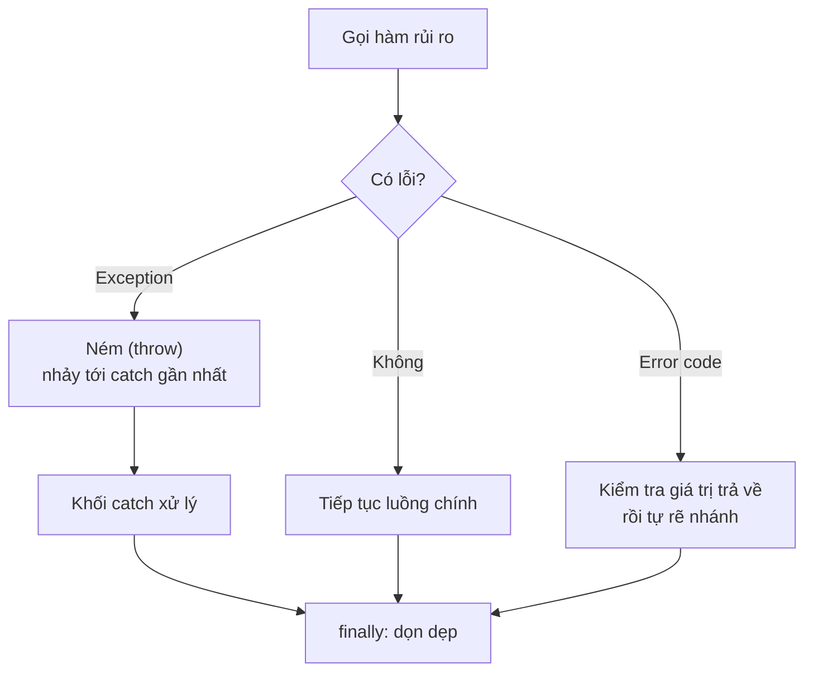

# Xử lý lỗi (Error Handling)

## Khái niệm

Xử lý lỗi (error handling) là tập các kỹ thuật giúp chương trình phát hiện, báo hiệu
và phản ứng với tình huống bất thường (đầu vào sai, hết bộ nhớ, mất mạng...) mà không
sụp đổ một cách khó hiểu. Hai trường phái chính là **mã lỗi (error code)** trả về từ
hàm và **ngoại lệ (exception)** được ném ra rồi bắt lại.

## Khi nào dùng / Vì sao quan trọng

Code thực tế phải sống trong môi trường không hoàn hảo. Xử lý lỗi tốt giúp hệ thống
bền vững, dễ chẩn đoán và không mất dữ liệu. Người phỏng vấn hay hỏi để đánh giá bạn
có viết code "chịu lỗi" hay không.

## Cách hoạt động

### Exception vs Error code

- **Mã lỗi (error code):** Hàm trả về giá trị đặc biệt báo lỗi (ví dụ `-1`, `NULL`,
  hoặc struct `(giá_trị, err)` trong Go). Rõ ràng ở luồng trả về nhưng dễ bị **quên
  kiểm tra** và làm code nghiệp vụ lẫn với code kiểm lỗi.
- **Ngoại lệ (exception):** Khi lỗi xảy ra, hệ thống "ném" (throw) một đối tượng
  ngoại lệ, luồng thực thi nhảy lên khối `catch` gần nhất phù hợp. Tách bạch đường
  xử lý lỗi khỏi luồng chính.



### Cơ chế try/catch/finally

- `try`: bao quanh đoạn có thể sinh lỗi.
- `catch`/`except`: bắt và xử lý loại ngoại lệ tương ứng.
- `finally`: **luôn** chạy để dọn dẹp tài nguyên (đóng file, giải phóng khóa) — kể
  cả khi có `return` hay ngoại lệ chưa bắt.

### Lan truyền lỗi (Error propagation)

Nếu một hàm không bắt ngoại lệ, nó **lan lên** hàm gọi (unwind ngăn xếp) cho tới khi
gặp handler. Bạn cũng có thể bắt, bổ sung ngữ cảnh, rồi ném lại (re-throw).

### An toàn ngoại lệ (Exception safety)

Đảm bảo trạng thái chương trình vẫn nhất quán khi có ngoại lệ. Các mức: **no-throw**,
**strong** (thất bại thì như chưa làm gì — rollback), **basic** (không leak, trạng
thái hợp lệ nhưng có thể đổi).

## Ví dụ đa ngôn ngữ

=== "Python"

    ```python
    class LoiRutTien(Exception):     # ngoại lệ tùy biến
        pass

    def rut_tien(so_du, so_tien):
        if so_tien > so_du:
            raise LoiRutTien("Số dư không đủ")  # ném ngoại lệ
        return so_du - so_tien

    try:
        con_lai = rut_tien(100, 150)
    except LoiRutTien as e:          # bắt đúng loại lỗi
        print("Giao dịch lỗi:", e)
    else:
        print("Còn lại:", con_lai)   # chạy khi KHÔNG có lỗi
    finally:
        print("Đã ghi log giao dịch") # LUÔN chạy để dọn dẹp
    ```

=== "JavaScript"

    ```js
    class LoiRutTien extends Error {}   // ngoại lệ tùy biến

    function rutTien(soDu, soTien) {
      if (soTien > soDu) throw new LoiRutTien("Số dư không đủ");
      return soDu - soTien;
    }

    try {
      const conLai = rutTien(100, 150);
      console.log("Còn lại:", conLai);
    } catch (e) {
      if (e instanceof LoiRutTien) console.log("Giao dịch lỗi:", e.message);
      else throw e;                    // không phải lỗi của ta -> ném tiếp
    } finally {
      console.log("Đã ghi log giao dịch"); // luôn chạy
    }
    ```

=== "Go (error code)"

    ```go
    // Go: trả về error tường minh, không dùng exception
    func rutTien(soDu, soTien int) (int, error) {
        if soTien > soDu {
            return 0, fmt.Errorf("số dư không đủ")
        }
        return soDu - soTien, nil
    }

    conLai, err := rutTien(100, 150)
    if err != nil {                  // BẮT BUỘC kiểm tra
        fmt.Println("Giao dịch lỗi:", err)
    } else {
        fmt.Println("Còn lại:", conLai)
    }
    ```

## Playground: bắt lỗi và finally

<div class="js-demo" data-title="try / catch / finally chạy thật">
<textarea class="js-demo-src">
function chia(a, b) {
  if (b === 0) throw new Error("Chia cho 0!");
  return a / b;
}

function thu(a, b) {
  try {
    const kq = chia(a, b);
    print(`${a} / ${b} =`, kq);
  } catch (e) {
    print(`Lỗi khi chia ${a}/${b}:`, e.message);
  } finally {
    print('  -> finally luôn chạy (dọn dẹp)');
  }
}

thu(10, 2);   // thành công
thu(10, 0);   // ném lỗi -> catch bắt
print('Chương trình KHÔNG sụp đổ nhờ đã bắt lỗi');
</textarea>
</div>

## Bảng so sánh Exception vs Error code

| Tiêu chí | Exception | Error code |
|----------|-----------|-----------|
| Tách luồng lỗi khỏi luồng chính | Có | Không (lẫn vào nhau) |
| Nguy cơ quên xử lý | Thấp (lan tới khi bắt) | Cao (dễ bỏ qua) |
| Chi phí khi có lỗi | Cao (unwind stack) | Thấp |
| Chi phí khi KHÔNG lỗi | Gần như 0 | Kiểm tra mỗi lần gọi |
| Mang ngữ cảnh (stack trace) | Có | Phải tự thêm |
| Ngôn ngữ tiêu biểu | Java, Python, C++, JS | C, Go, Rust (`Result`) |

## Ưu / nhược điểm

- **Ưu (exception):** Tách đường lỗi khỏi luồng chính; khó bị "nuốt" âm thầm; mang
  theo ngữ cảnh (stack trace).
- **Nhược (exception):** Có chi phí thời gian chạy; luồng điều khiển ẩn khó lần theo
  nếu lạm dụng.
- **Ưu (error code):** Rõ ràng, chi phí thấp, luồng tường minh.
- **Nhược (error code):** Dễ quên kiểm tra; code kiểm lỗi lặp lại nhiều.

## Câu hỏi phỏng vấn thường gặp

1. So sánh exception và error code. Khi nào chọn cái nào?
2. Vai trò của khối `finally`? Nó có luôn chạy không?
3. Exception safety là gì? Phân biệt strong và basic guarantee.
4. Nên bắt ngoại lệ ở tầng nào — sớm hay muộn?
5. Vì sao không nên bắt ngoại lệ chung chung (`except Exception`) rồi bỏ qua?
6. Go và Rust xử lý lỗi khác Java/Python thế nào (giá trị vs ngoại lệ)?
7. Re-throw (ném lại) dùng khi nào?

## Tham khảo

- *Effective Java* (Bloch) — mục về exceptions
- Tài liệu xử lý lỗi của Python, Go, Rust
