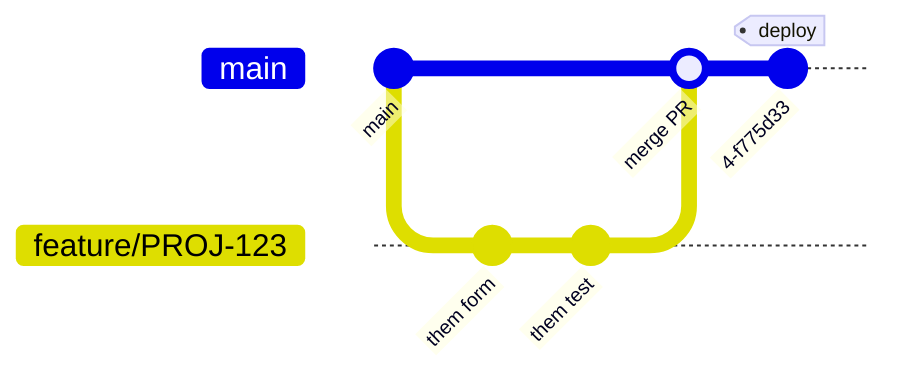

# Bitbucket

## Mục lục
1. [Khái niệm](#khai-niem)
2. [Khi nào dùng / Vì sao quan trọng](#khi-nao-dung-vi-sao-quan-trong)
3. [So sánh với GitHub và GitLab](#so-sanh-voi-github-va-gitlab)
4. [Ánh xạ thuật ngữ CI/CD giữa ba nền tảng](#anh-xa-thuat-ngu-cicd-giua-ba-nen-tang)
5. [Tính năng chính](#tinh-nang-chinh)
5. [Luồng làm việc cơ bản](#luong-lam-viec-co-ban)
6. [Câu hỏi phỏng vấn thường gặp](#cau-hoi-phong-van-thuong-gap)
7. [Tham khảo](#tham-khao)

## Khái niệm
**Bitbucket** là một nền tảng quản lý mã nguồn (source code management) dựa trên Git của **Atlassian**, dùng để lưu trữ, cộng tác và triển khai mã nguồn. Ngoài chức năng lưu trữ kho lưu trữ (repository) Git, Bitbucket còn cung cấp yêu cầu hợp nhất (pull request), đường ống CI/CD (CI/CD pipelines) tích hợp và khả năng liên kết chặt chẽ với các sản phẩm khác của Atlassian như Jira và Confluence.

Bitbucket có hai phiên bản chính:

1. **Bitbucket Cloud**: Dịch vụ được lưu trữ trên đám mây (cloud-hosted) do Atlassian vận hành, truy cập qua `bitbucket.org`.
2. **Bitbucket Data Center** (trước đây gồm cả Bitbucket Server): Phiên bản tự lưu trữ (self-hosted) chạy trên hạ tầng của chính doanh nghiệp, phù hợp với yêu cầu bảo mật và tuân thủ (compliance) nghiêm ngặt.

## Khi nào dùng / Vì sao quan trọng
Bitbucket đặc biệt phổ biến trong các doanh nghiệp đã sử dụng hệ sinh thái Atlassian. Bạn nên cân nhắc dùng Bitbucket khi:

- Nhóm của bạn đã dùng **Jira** để theo dõi công việc và muốn liên kết commit, nhánh (branch), pull request trực tiếp với các phiếu công việc (issue/ticket).
- Doanh nghiệp cần một giải pháp **tự lưu trữ** để kiểm soát dữ liệu hoàn toàn (Bitbucket Data Center).
- Bạn muốn CI/CD tích hợp sẵn (**Bitbucket Pipelines**) mà không cần thiết lập máy chủ build riêng.

## So sánh với GitHub và GitLab
| Tiêu chí | Bitbucket | GitHub | GitLab |
|----------|-----------|--------|--------|
| Nhà phát triển | Atlassian | Microsoft | GitLab Inc. |
| CI/CD tích hợp | Bitbucket Pipelines | GitHub Actions | GitLab CI/CD |
| Tệp cấu hình CI | `bitbucket-pipelines.yml` | `.github/workflows/*.yml` | `.gitlab-ci.yml` |
| Tích hợp Jira | Gốc, chặt chẽ | Qua ứng dụng bên thứ ba | Qua ứng dụng bên thứ ba |
| Tự lưu trữ | Data Center | GitHub Enterprise Server | Self-managed (rất mạnh) |
| Cộng đồng mã nguồn mở | Nhỏ hơn | Lớn nhất | Trung bình |
| Registry container | Không có sẵn (dùng ngoài) | GitHub Packages | Container Registry tích hợp |
| Quản lý gói (package) | Hạn chế | GitHub Packages | Package Registry đầy đủ |
| Wiki & tài liệu | Có (kèm Confluence) | Wiki gốc | Wiki gốc |
| Đơn vị tính giá CI | Số phút build/tháng | Số phút build/tháng | Số phút CI/tháng |
| Repo riêng tư miễn phí | Có (tối đa 5 người dùng) | Không giới hạn cộng tác viên | Có |
| Điểm mạnh | Hệ sinh thái Atlassian | Cộng đồng, social coding | DevOps trọn vòng đời |
| Phù hợp nhất cho | Doanh nghiệp dùng Jira/Confluence | Mã nguồn mở, cộng đồng | Nhóm cần DevOps end-to-end |

Tóm lại: **GitHub** mạnh nhất về cộng đồng và mã nguồn mở; **GitLab** thiên về nền tảng DevOps trọn vòng đời (end-to-end) với registry và package tích hợp; còn **Bitbucket** tỏa sáng khi tích hợp với Jira và các công cụ Atlassian trong môi trường doanh nghiệp.

### Ánh xạ thuật ngữ CI/CD giữa ba nền tảng
| Khái niệm | Bitbucket Pipelines | GitHub Actions | GitLab CI/CD |
|-----------|---------------------|----------------|--------------|
| Đơn vị chạy song song/tuần tự | `step` | `job` | `job` |
| Nhóm các bước theo giai đoạn | `stage` | (theo `needs`) | `stage` |
| Kích hoạt theo sự kiện | `pipelines:` (default, branches, pull-requests, tags) | `on:` | `rules:` / `only:` / `except:` |
| Máy chạy | Docker image mỗi step | `runs-on` (runner) | `image` + `tags` (runner) |
| Chạy nền phụ trợ (DB, cache…) | `services` | `services` | `services` |
| Biến bí mật | Repository/Deployment variables | Secrets | CI/CD Variables |

## Tính năng chính
1. **Pull request (yêu cầu hợp nhất)**: Cơ chế đề xuất, xem xét mã nguồn (code review) và thảo luận thay đổi trước khi hợp nhất vào nhánh chính. Hỗ trợ bình luận theo dòng (inline comment), người duyệt bắt buộc (required reviewers) và điều kiện hợp nhất (merge checks).
2. **Bitbucket Pipelines**: Đường ống CI/CD tích hợp, cấu hình bằng tệp `bitbucket-pipelines.yml` đặt ở gốc kho lưu trữ. Mỗi bước (step) chạy trong một container Docker, tự động build, kiểm thử và triển khai.
3. **Tích hợp Jira**: Liên kết tự động giữa commit/nhánh/pull request và các phiếu Jira. Chỉ cần đưa mã phiếu (ví dụ `PROJ-123`) vào thông điệp commit là Bitbucket sẽ hiển thị liên kết trong Jira, thậm chí tự chuyển trạng thái phiếu.
4. **Branch permissions (quyền trên nhánh)**: Bảo vệ các nhánh quan trọng như `main` khỏi bị đẩy (push) trực tiếp hoặc xóa.
5. **Code Insights**: Hiển thị kết quả phân tích chất lượng mã, mức độ bao phủ kiểm thử (test coverage) và lỗ hổng bảo mật ngay trong pull request.
6. **Snippets**: Chia sẻ các đoạn mã ngắn, tương tự GitHub Gist.

### Ví dụ tệp cấu hình Pipelines
Ví dụ tối giản cho một dự án Python:
```yaml
# bitbucket-pipelines.yml — cấu hình CI/CD cho Bitbucket
image: python:3.11        # môi trường Docker dùng để chạy

pipelines:
  default:                # chạy cho mọi lần đẩy (push)
    - step:
        name: Kiểm thử    # tên bước hiển thị trên giao diện
        script:
          - pip install -r requirements.txt
          - pytest        # chạy bộ kiểm thử
```

### Ví dụ Pipelines chi tiết (build → test → deploy)
Cấu hình thực tế thường phân luồng theo nhánh, dùng cache để tăng tốc, chạy dịch vụ phụ trợ (database) và triển khai theo môi trường:
```yaml
# bitbucket-pipelines.yml — pipeline nhiều giai đoạn
image: node:20

definitions:
  caches:
    npmcache: ~/.npm          # cache tùy biến cho npm
  services:
    postgres:                 # dịch vụ DB dùng khi chạy test tích hợp
      image: postgres:16
      variables:
        POSTGRES_DB: appdb
        POSTGRES_USER: app
        POSTGRES_PASSWORD: secret
  steps:
    - step: &build-test       # định nghĩa bước tái sử dụng (YAML anchor)
        name: Build và kiểm thử
        caches:
          - node
          - npmcache
        script:
          - npm ci            # cài đặt phụ thuộc sạch, ổn định
          - npm run lint      # kiểm tra chuẩn mã
          - npm test          # chạy unit test
        services:
          - postgres
        artifacts:
          - dist/**           # lưu sản phẩm build cho các bước sau

pipelines:
  # Chạy cho mọi nhánh không khớp quy tắc riêng bên dưới
  default:
    - step: *build-test

  # Chạy khi mở/ cập nhật pull request
  pull-requests:
    '**':
      - step: *build-test

  # Quy tắc riêng theo tên nhánh
  branches:
    main:
      - step: *build-test
      - step:
          name: Triển khai staging
          deployment: staging   # gắn với môi trường Deployment trên Bitbucket
          script:
            - pipe: atlassian/aws-s3-deploy:1.1.0
              variables:
                AWS_ACCESS_KEY_ID: $AWS_ACCESS_KEY_ID       # biến bí mật của repo
                AWS_SECRET_ACCESS_KEY: $AWS_SECRET_ACCESS_KEY
                AWS_DEFAULT_REGION: 'ap-southeast-1'
                S3_BUCKET: 'my-app-staging'
                LOCAL_PATH: 'dist'
      - step:
          name: Triển khai production
          deployment: production
          trigger: manual        # chỉ chạy khi bấm nút thủ công
          script:
            - echo "Đang triển khai lên production..."
            - ./scripts/deploy-prod.sh

  # Chạy khi tạo tag phiên bản, ví dụ v1.2.3
  tags:
    'v*':
      - step:
          name: Phát hành
          script:
            - echo "Đóng gói và phát hành cho tag $BITBUCKET_TAG"

  # Chạy theo lịch (cấu hình lịch trên giao diện Bitbucket)
  custom:
    kiem-tra-bao-mat:
      - step:
          name: Quét lỗ hổng phụ thuộc
          script:
            - npm audit --audit-level=high
```

Một số biến môi trường dựng sẵn hữu ích: `$BITBUCKET_BRANCH` (tên nhánh), `$BITBUCKET_COMMIT` (hash commit), `$BITBUCKET_TAG` (tên tag), `$BITBUCKET_BUILD_NUMBER` (số thứ tự build), `$BITBUCKET_PR_ID` (mã pull request).

## Luồng làm việc cơ bản
Luồng làm việc phổ biến với Bitbucket (feature branch workflow):



1. **Sao chép (clone)** kho lưu trữ: `git clone <bitbucket-url>`.
2. **Tạo nhánh tính năng** liên kết với phiếu Jira, ví dụ: `git checkout -b feature/PROJ-123-dang-nhap`.
3. **Commit và đẩy (push)** thay đổi lên Bitbucket, kèm mã phiếu trong thông điệp commit: `git commit -m "PROJ-123: thêm màn hình đăng nhập"`.
4. **Mở pull request** trên giao diện Bitbucket để yêu cầu xem xét mã nguồn.
5. **Pipelines chạy tự động**: build và kiểm thử; kết quả hiển thị ngay trong pull request.
6. **Người duyệt xem xét**, để lại bình luận; tác giả chỉnh sửa nếu cần.
7. **Hợp nhất (merge)** khi đã được duyệt và mọi kiểm tra (check) đều đạt. Bitbucket có thể tự động cập nhật trạng thái phiếu Jira.

## Câu hỏi phỏng vấn thường gặp
1. **Bitbucket là gì?**
   Bitbucket là nền tảng quản lý mã nguồn dựa trên Git của Atlassian, cung cấp lưu trữ kho lưu trữ, pull request, CI/CD (Pipelines) và tích hợp chặt chẽ với Jira, Confluence.

2. **Bitbucket khác GitHub và GitLab ở điểm nào?**
   Điểm khác biệt lớn nhất là tích hợp gốc (native) với hệ sinh thái Atlassian, đặc biệt là Jira. GitHub mạnh về cộng đồng mã nguồn mở, GitLab mạnh về nền tảng DevOps trọn vòng đời, còn Bitbucket phù hợp với doanh nghiệp đã dùng công cụ Atlassian.

3. **Bitbucket Cloud và Bitbucket Data Center khác nhau thế nào?**
   Bitbucket Cloud do Atlassian lưu trữ và vận hành trên đám mây; Bitbucket Data Center là phiên bản tự lưu trữ chạy trên hạ tầng riêng của doanh nghiệp, phù hợp với yêu cầu bảo mật và tuân thủ nghiêm ngặt.

4. **Bitbucket Pipelines là gì?**
   Là hệ thống CI/CD tích hợp sẵn của Bitbucket, cấu hình bằng tệp `bitbucket-pipelines.yml`. Mỗi bước chạy trong một container Docker để tự động build, kiểm thử và triển khai mã nguồn.

5. **Làm thế nào để liên kết một commit với phiếu Jira?**
   Chỉ cần đưa mã phiếu (ví dụ `PROJ-123`) vào thông điệp commit hoặc tên nhánh. Bitbucket sẽ tự động hiển thị liên kết trong phiếu Jira tương ứng.

6. **Pull request trong Bitbucket là gì?**
   Là cơ chế đề xuất thay đổi để được xem xét và thảo luận trước khi hợp nhất vào nhánh chính, hỗ trợ bình luận theo dòng, người duyệt bắt buộc và điều kiện hợp nhất (merge checks).

7. **Branch permissions dùng để làm gì?**
   Dùng để bảo vệ các nhánh quan trọng (ví dụ `main`) khỏi bị đẩy trực tiếp, xóa hoặc hợp nhất khi chưa đủ điều kiện, giúp đảm bảo chất lượng mã nguồn.

8. **Merge check (điều kiện hợp nhất) là gì?**
   Là các điều kiện bắt buộc phải thỏa mãn trước khi pull request được phép hợp nhất, ví dụ: số lượng người duyệt tối thiểu, tất cả pipeline phải thành công, không còn nhiệm vụ (task) chưa hoàn thành.

## Tham khảo
- [Tài liệu chính thức Bitbucket](https://support.atlassian.com/bitbucket-cloud/)
- [Bitbucket Pipelines](https://support.atlassian.com/bitbucket-cloud/docs/get-started-with-bitbucket-pipelines/)
