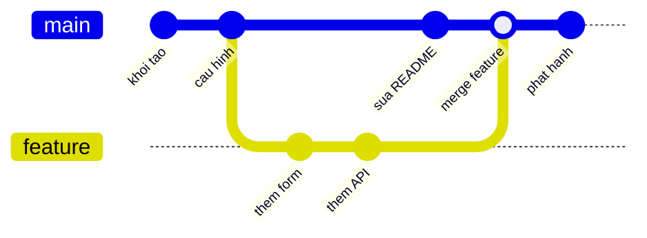
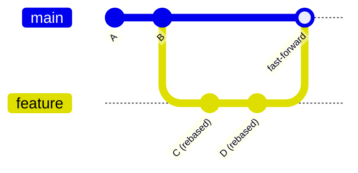
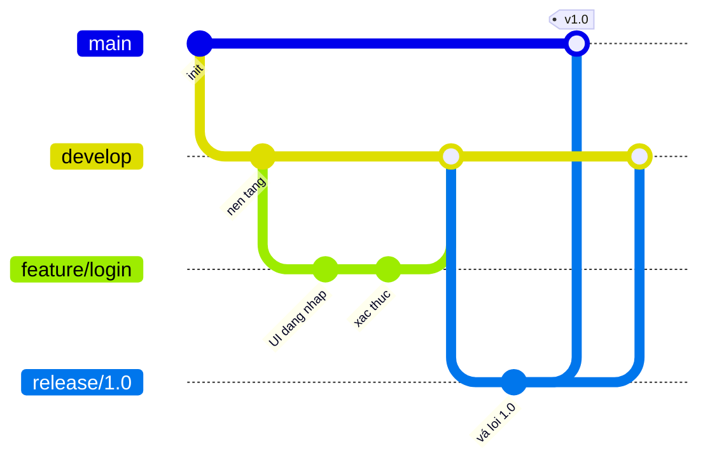

# Git, GitHub và GitOps

## Mục lục
1. [Git](#git)
2. [Minh hoạ nhánh và hợp nhất bằng sơ đồ](#minh-hoa-nhanh-va-hop-nhat-bang-so-do)
3. [Bảng lệnh Git theo nhóm](#bang-lenh-git-theo-nhom)
4. [Ví dụ workflow chi tiết](#vi-du-workflow-chi-tiet)
5. [GitHub](#github)
6. [GitOps](#gitops)
7. [75 câu hỏi phỏng vấn hàng đầu về Git, GitHub và GitOps](#75-cau-hoi-phong-van-hang-au-ve-git-github-va-gitops)

## Git
**Git** là một hệ thống quản lý phiên bản phân tán (distributed version control system) dùng để theo dõi các thay đổi trong mã nguồn trong quá trình phát triển phần mềm. Nó cho phép nhiều lập trình viên cùng làm việc trên một dự án đồng thời mà không gây ảnh hưởng đến thay đổi của nhau. Dưới đây là một số khái niệm và lệnh quan trọng:

1. **Kho lưu trữ (repository)**: Nơi lưu trữ mã nguồn và toàn bộ lịch sử phiên bản của nó.
2. **Nhánh (branch)**: Một phiên bản song song của kho lưu trữ, tách ra từ dự án chính đang làm việc.
3. **Xác nhận thay đổi (commit)**: Một bản ghi lại các thay đổi được thực hiện trên kho lưu trữ.
4. **Hợp nhất (merge)**: Kết hợp các thay đổi từ những nhánh khác nhau.
5. **Sao chép (clone)**: Tạo một bản sao của kho lưu trữ.
6. **Kéo về (pull)**: Lấy và hợp nhất các thay đổi từ kho lưu trữ từ xa (remote repository).
7. **Đẩy lên (push)**: Gửi các thay đổi cục bộ (local) lên kho lưu trữ từ xa.
8. **Lấy về (fetch)**: Tải các thay đổi từ kho lưu trữ từ xa mà không hợp nhất.
9. **Ghép lại nền (rebase)**: Áp dụng lại các commit lên trên một điểm nền khác.
10. **Cất tạm (stash)**: Tạm thời lưu lại những thay đổi chưa sẵn sàng để commit.

### Các lệnh Git thường dùng
- `git init`: Khởi tạo một kho lưu trữ Git mới.
- `git clone <url>`: Sao chép một kho lưu trữ từ máy chủ từ xa.
- `git add <file>`: Đưa các thay đổi vào vùng chờ (staging area) cho lần commit tiếp theo.
- `git commit -m "message"`: Ghi nhận (commit) các thay đổi đang chờ kèm theo một thông điệp.
- `git status`: Hiển thị trạng thái của các thay đổi: chưa theo dõi (untracked), đã sửa đổi (modified) hoặc đang chờ (staged).
- `git log`: Hiển thị lịch sử commit.
- `git branch`: Liệt kê, tạo hoặc xóa các nhánh.
- `git checkout <branch>`: Chuyển sang một nhánh khác.
- `git merge <branch>`: Hợp nhất một nhánh vào nhánh hiện tại.
- `git pull`: Lấy và hợp nhất các thay đổi từ kho lưu trữ từ xa.
- `git push`: Đẩy các thay đổi cục bộ lên kho lưu trữ từ xa.

## Minh hoạ nhánh và hợp nhất bằng sơ đồ

### Feature branch và merge
Một nhánh tính năng (`feature`) được tách ra từ `main`, phát triển vài commit rồi hợp nhất trở lại. Khi merge, Git tạo một **commit hợp nhất** (merge commit) nối hai dòng lịch sử:



### Rebase: viết lại lịch sử cho tuyến tính
Khác với merge, `git rebase` **áp dụng lại** các commit của nhánh tính năng lên trên đỉnh mới nhất của `main`, giúp lịch sử phẳng và tuyến tính (không có merge commit). Sơ đồ dưới minh hoạ nhánh `feature` sau khi rebase lên `main`:



!!! note "Merge hay Rebase?"
    - **Merge**: giữ nguyên lịch sử thật, có merge commit — an toàn cho nhánh dùng chung (`main`, `develop`).
    - **Rebase**: lịch sử phẳng, dễ đọc `git log` — chỉ nên rebase nhánh **cục bộ chưa đẩy lên** để tránh viết lại lịch sử người khác đã có (nguyên tắc *"không rebase nhánh công khai"*).

### Nhiều nhánh song song (Git Flow rút gọn)


## Bảng lệnh Git theo nhóm

### Nhóm 1 — Khởi tạo & cấu hình
| Lệnh | Công dụng |
|------|-----------|
| `git init` | Khởi tạo kho lưu trữ mới trong thư mục hiện tại |
| `git clone <url>` | Sao chép kho lưu trữ từ xa về máy |
| `git config --global user.name "Tên"` | Đặt tên tác giả cho commit (phạm vi toàn cục) |
| `git config --global user.email "email"` | Đặt email tác giả |
| `git config --list` | Xem toàn bộ cấu hình hiện tại |

### Nhóm 2 — Thay đổi hằng ngày (staging & commit)
| Lệnh | Công dụng |
|------|-----------|
| `git status` | Xem trạng thái tệp (untracked/modified/staged) |
| `git add <file>` | Đưa tệp vào vùng chờ (staging area) |
| `git add -p` | Chọn từng đoạn thay đổi để đưa vào vùng chờ |
| `git commit -m "msg"` | Ghi nhận thay đổi kèm thông điệp |
| `git commit --amend` | Sửa lại commit gần nhất (nội dung hoặc thông điệp) |
| `git restore <file>` | Bỏ thay đổi chưa staged của tệp |
| `git restore --staged <file>` | Đưa tệp ra khỏi vùng chờ |

### Nhóm 3 — Nhánh & hợp nhất
| Lệnh | Công dụng |
|------|-----------|
| `git branch` | Liệt kê nhánh |
| `git branch <tên>` | Tạo nhánh mới |
| `git switch <tên>` / `git checkout <tên>` | Chuyển nhánh |
| `git switch -c <tên>` / `git checkout -b <tên>` | Tạo và chuyển sang nhánh mới |
| `git merge <nhánh>` | Hợp nhất nhánh vào nhánh hiện tại |
| `git rebase <nhánh>` | Áp dụng lại commit lên nền của nhánh khác |
| `git branch -d <tên>` | Xóa nhánh đã hợp nhất |
| `git branch -D <tên>` | Xóa nhánh (kể cả chưa hợp nhất) |

### Nhóm 4 — Đồng bộ với kho từ xa (remote)
| Lệnh | Công dụng |
|------|-----------|
| `git remote -v` | Xem danh sách remote |
| `git remote add <tên> <url>` | Thêm một remote mới |
| `git fetch` | Tải thay đổi từ remote, chưa hợp nhất |
| `git pull` | Fetch + merge từ remote |
| `git pull --rebase` | Fetch + rebase (giữ lịch sử phẳng) |
| `git push` | Đẩy commit lên remote |
| `git push -u origin <nhánh>` | Đẩy và thiết lập nhánh theo dõi (tracking) |

### Nhóm 5 — Xem lịch sử & so sánh
| Lệnh | Công dụng |
|------|-----------|
| `git log --oneline --graph --all` | Xem lịch sử dạng đồ thị gọn |
| `git diff` | So sánh thư mục làm việc với vùng chờ |
| `git diff --staged` | So sánh vùng chờ với commit gần nhất |
| `git show <hash>` | Xem chi tiết một commit |
| `git blame <file>` | Xem ai sửa mỗi dòng và khi nào |

### Nhóm 6 — Hoàn tác & cứu nguy
| Lệnh | Công dụng |
|------|-----------|
| `git revert <hash>` | Tạo commit mới hủy tác dụng của commit cũ (an toàn) |
| `git reset --soft HEAD~1` | Bỏ commit gần nhất, giữ thay đổi ở vùng chờ |
| `git reset --mixed HEAD~1` | Bỏ commit gần nhất, giữ thay đổi ở thư mục làm việc |
| `git reset --hard HEAD~1` | Bỏ commit **và** xóa thay đổi (nguy hiểm) |
| `git stash` | Cất tạm thay đổi chưa commit |
| `git stash pop` | Lấy lại và xóa bản cất tạm |
| `git reflog` | Xem lịch sử di chuyển của HEAD — cứu commit "mất" |

## Ví dụ workflow chi tiết

### Workflow 1 — Phát triển một tính năng qua feature branch
```bash
# 1. Cập nhật main mới nhất trước khi tách nhánh
git switch main
git pull origin main

# 2. Tạo nhánh tính năng đặt tên rõ ràng
git switch -c feature/gio-hang

# 3. Viết code, kiểm tra thay đổi
git status
git add src/cart.js
git commit -m "feat: thêm chức năng giỏ hàng"

# 4. Đẩy nhánh lên remote lần đầu (thiết lập tracking)
git push -u origin feature/gio-hang

# 5. Tiếp tục commit thêm rồi đẩy như bình thường
git add tests/cart.test.js
git commit -m "test: bổ sung test cho giỏ hàng"
git push

# 6. Mở pull request trên GitHub/GitLab/Bitbucket để được review
# 7. Sau khi được duyệt và merge, dọn dẹp nhánh cục bộ
git switch main
git pull origin main
git branch -d feature/gio-hang
```

### Workflow 2 — Giữ nhánh tính năng cập nhật bằng rebase
```bash
# main đã có commit mới của người khác; đưa chúng vào nhánh của bạn
git switch feature/gio-hang
git fetch origin
git rebase origin/main          # áp dụng lại commit của bạn lên đỉnh main

# Nếu đã từng push nhánh này, cần force-push AN TOÀN
git push --force-with-lease     # không ghi đè commit người khác vừa đẩy
```

### Workflow 3 — Giải quyết xung đột khi merge
```bash
git switch main
git merge feature/thanh-toan
# → Git báo: CONFLICT (content): Merge conflict in src/payment.js
```

Mở tệp bị xung đột, bạn sẽ thấy các dấu phân định:
```text
<<<<<<< HEAD
const fee = 0.02;          // phiên bản ở nhánh main
=======
const fee = 0.015;         // phiên bản ở nhánh feature/thanh-toan
>>>>>>> feature/thanh-toan
```

```bash
# 1. Sửa thủ công: giữ lại đoạn đúng, xóa các dấu <<<<, ====, >>>>
# 2. Đánh dấu tệp đã giải quyết
git add src/payment.js

# 3. Kiểm tra còn tệp nào xung đột không
git status

# 4. Hoàn tất merge (mở sẵn thông điệp merge)
git commit

# Nếu muốn hủy toàn bộ và quay lại trạng thái trước merge:
git merge --abort
```

!!! tip "Mẹo giảm xung đột"
    - Commit nhỏ, thường xuyên; kéo (`git pull --rebase`) `main` về sớm và đều đặn.
    - Bật `git config --global rerere.enabled true` để Git ghi nhớ cách bạn giải quyết xung đột lặp lại.
    - Dùng công cụ trực quan: `git mergetool`.

### Workflow 4 — Cất tạm để chuyển việc gấp
```bash
# Đang làm dở nhưng cần vá gấp trên main
git stash push -m "dang lam form dang ky"
git switch main
git switch -c hotfix/loi-dang-nhap
# ... vá lỗi, commit, push, merge ...

# Quay lại công việc dang dở
git switch feature/dang-ky
git stash list                  # xem các bản cất tạm
git stash pop                   # lấy lại thay đổi và xóa khỏi stash
```

## GitHub
**GitHub** là một nền tảng dựa trên web sử dụng Git để quản lý phiên bản. Nó cung cấp nhiều tính năng cộng tác như:

1. **Kho lưu trữ (repositories)**: Lưu trữ và quản lý các kho Git.
2. **Rẽ nhánh dự án (forking)**: Tạo một bản sao cá nhân từ kho lưu trữ của người khác.
3. **Yêu cầu hợp nhất (pull requests)**: Đề xuất các thay đổi để được hợp nhất vào kho lưu trữ.
4. **Vấn đề (issues)**: Theo dõi lỗi và các yêu cầu tính năng.
5. **Actions**: Tự động hóa các quy trình làm việc với đường ống CI/CD (CI/CD pipelines).
6. **Wikis**: Ghi chép tài liệu cho dự án.
7. **Dự án (projects)**: Tổ chức và theo dõi công việc bằng các bảng kiểu Kanban.

## GitOps
**GitOps** là một phương pháp thực hành sử dụng Git làm nguồn thông tin đáng tin cậy duy nhất (single source of truth) cho hạ tầng (infrastructure) và ứng dụng theo hướng khai báo (declarative). Nó áp dụng các phương pháp DevOps vào việc tự động hóa hạ tầng. Các thành phần chính của GitOps bao gồm:

1. **Mô tả khai báo (declarative descriptions)**: Sử dụng các tệp cấu hình để định nghĩa trạng thái mong muốn của hệ thống.
2. **Có phiên bản và bất biến (versioned and immutable)**: Lưu trữ cấu hình trong Git để cung cấp lịch sử thay đổi và tạo điều kiện dễ dàng quay lui (rollback).
3. **Tự động áp dụng (automatically applied)**: Sử dụng các tác nhân phân phối liên tục (continuous delivery agents) để tự động áp dụng cấu hình vào hệ thống.
4. **Giám sát và tự sửa (monitored and corrected)**: Sử dụng các công cụ để giám sát trạng thái hệ thống và tự động khôi phục về trạng thái mong muốn nếu phát hiện sai lệch.

## 75 câu hỏi phỏng vấn hàng đầu về Git, GitHub và GitOps

### Câu hỏi về Git
1. **Git là gì?**
   Git là một hệ thống quản lý phiên bản phân tán (distributed version control system) cho phép các lập trình viên theo dõi thay đổi trong mã nguồn suốt quá trình phát triển phần mềm. Nó cho phép nhiều lập trình viên cùng làm việc trên một dự án đồng thời mà không xảy ra xung đột.

2. **Kho lưu trữ Git (Git repository) là gì?**
   Kho lưu trữ Git là nơi lưu trữ toàn bộ tệp và lịch sử chỉnh sửa của chúng. Nó có thể nằm cục bộ trên máy của lập trình viên hoặc được lưu trên một máy chủ từ xa.

3. **Làm thế nào để tạo một kho lưu trữ Git mới?**
   Để tạo một kho lưu trữ Git mới, bạn dùng lệnh `git init` trong thư mục mong muốn. Lệnh này khởi tạo một kho lưu trữ rỗng.

4. **Làm thế nào để sao chép (clone) một kho lưu trữ?**
   Bạn có thể sao chép một kho lưu trữ bằng lệnh `git clone <repository-url>`. Lệnh này tạo một bản sao cục bộ của kho lưu trữ từ máy chủ từ xa.

5. **Commit trong Git là gì?**
   Commit là một ảnh chụp (snapshot) các thay đổi được thực hiện trên kho lưu trữ. Nó ghi lại trạng thái của dự án tại một thời điểm cụ thể.

6. **Làm thế nào để thực hiện một commit?**
   Để thực hiện một commit, trước tiên bạn đưa các thay đổi vào vùng chờ (staging) bằng `git add <file>`, sau đó commit chúng bằng `git commit -m "commit message"`.

7. **Rẽ nhánh (branching) trong Git là gì?**
   Rẽ nhánh cho phép bạn tạo một phiên bản song song của kho lưu trữ để làm việc trên tính năng mới hoặc các thay đổi mà không ảnh hưởng đến dự án chính. Sau đó bạn có thể hợp nhất nhánh trở lại vào nhánh chính.

8. **Làm thế nào để tạo một nhánh mới?**
   Bạn có thể tạo một nhánh mới bằng `git branch <branch-name>`. Để chuyển sang nhánh mới, dùng `git checkout <branch-name>`.

9. **Hợp nhất (merging) trong Git là gì?**
   Hợp nhất là quá trình kết hợp các thay đổi từ một nhánh này vào một nhánh khác. Việc này thường được thực hiện để tích hợp các nhánh tính năng vào nhánh chính.

10. **Làm thế nào để hợp nhất các nhánh?**
    Để hợp nhất các nhánh, trước tiên hãy chuyển sang nhánh mà bạn muốn hợp nhất vào (ví dụ `git checkout main`), sau đó dùng `git merge <branch-name>`.

11. **Yêu cầu hợp nhất (pull request) là gì?**
    Pull request là một cách để đề xuất các thay đổi cho kho lưu trữ. Nó cho phép các lập trình viên khác xem xét và thảo luận về các thay đổi trước khi hợp nhất chúng.

12. **Xung đột (conflict) trong Git là gì?**
    Xung đột xảy ra khi các thay đổi từ những nhánh khác nhau không thể được hợp nhất tự động. Điều này thường xảy ra khi cùng những dòng mã bị chỉnh sửa trong cả hai nhánh.

13. **Làm thế nào để giải quyết xung đột trong Git?**
    Để giải quyết xung đột, bạn cần chỉnh sửa thủ công các tệp bị xung đột để xử lý những điểm khác biệt, sau đó commit các thay đổi.

14. **`git stash` là gì?**
    `git stash` tạm thời lưu lại các thay đổi chưa sẵn sàng để commit. Điều này cho phép bạn chuyển nhánh hoặc kéo về (pull) các cập nhật mà không làm mất thay đổi của mình.

15. **Làm thế nào để áp dụng lại các thay đổi đã cất tạm (stashed)?**
    Để áp dụng các thay đổi đã cất tạm, dùng `git stash apply`. Nếu bạn muốn xóa bản cất tạm sau khi áp dụng, dùng `git stash pop`.

16. **`git pull` là gì?**
    `git pull` lấy các thay đổi từ kho lưu trữ từ xa và hợp nhất chúng vào kho lưu trữ cục bộ.

17. **`git push` là gì?**
    `git push` tải các thay đổi cục bộ lên kho lưu trữ từ xa.

18. **`git fetch` là gì?**
    `git fetch` tải các thay đổi từ kho lưu trữ từ xa nhưng không hợp nhất chúng vào kho lưu trữ cục bộ.

19. **`git rebase` là gì?**
    `git rebase` di chuyển hoặc kết hợp một chuỗi các commit sang một commit nền mới. Nó thường được dùng để giữ cho một nhánh tính năng luôn cập nhật với nhánh chính.

20. **Trạng thái HEAD tách rời (detached HEAD) trong Git là gì?**
    Trạng thái HEAD tách rời xảy ra khi bạn checkout một commit không phải là một nhánh. Điều này có nghĩa là bạn đang không ở trên bất kỳ nhánh nào.

21. **Làm thế nào để xóa một nhánh?**
    Để xóa một nhánh, dùng `git branch -d <branch-name>`. Nếu nhánh chưa được hợp nhất, dùng `git branch -D <branch-name>`.

22. **`git diff` là gì?**
    `git diff` hiển thị những khác biệt giữa các commit, các nhánh, hoặc giữa thư mục làm việc (working directory) và kho lưu trữ.

23. **Làm thế nào để hoàn tác (revert) một commit?**
    Để hoàn tác một commit, dùng `git revert <commit-hash>`. Lệnh này tạo một commit mới để hủy bỏ các thay đổi từ commit được chỉ định.

24. **`git log` là gì?**
    `git log` hiển thị lịch sử commit của kho lưu trữ.

25. **`git blame` là gì?**
    `git blame` hiển thị commit gần nhất đã chỉnh sửa mỗi dòng của một tệp, kèm theo tác giả và dấu thời gian.

26. **Thẻ (tag) trong Git là gì?**
    Thẻ là một tham chiếu đến một commit cụ thể, thường được dùng để đánh dấu các phiên bản phát hành (release).

27. **Làm thế nào để tạo một thẻ?**
    Để tạo một thẻ, dùng `git tag <tag-name>`. Để tạo một thẻ có chú thích (annotated tag), dùng `git tag -a <tag-name> -m "message"`.

28. **`git checkout` là gì?**
    `git checkout` được dùng để chuyển đổi giữa các nhánh hoặc để khôi phục các tệp trong thư mục làm việc.

29. **Remote trong Git là gì?**
    Remote là một tham chiếu đến một kho lưu trữ được lưu trên máy chủ từ xa. Nó cho phép bạn cộng tác với các lập trình viên khác.

30. **Làm thế nào để thêm một remote?**
    Để thêm một remote, dùng `git remote add <name> <url>`.

### Câu hỏi về GitHub
31. **GitHub là gì?**
    GitHub là một nền tảng dựa trên web sử dụng Git để quản lý phiên bản. Nó cung cấp các công cụ cho việc cộng tác, xem xét mã nguồn (code review), theo dõi vấn đề (issue tracking) và quản lý dự án.

32. **Fork trong GitHub là gì?**
    Fork là một bản sao cá nhân từ kho lưu trữ của người khác. Nó cho phép bạn tự do thử nghiệm các thay đổi mà không ảnh hưởng đến kho lưu trữ gốc.

33. **Yêu cầu hợp nhất (pull request) trong GitHub là gì?**
    Pull request là một cách để đề xuất các thay đổi cho kho lưu trữ. Nó cho phép các lập trình viên khác xem xét và thảo luận về các thay đổi trước khi hợp nhất chúng.

34. **GitHub Issues là gì?**
    GitHub Issues là một tính năng để theo dõi lỗi, các yêu cầu tính năng và các công việc khác liên quan đến một dự án.

35. **GitHub Actions là gì?**
    GitHub Actions là một nền tảng CI/CD cho phép bạn tự động hóa các quy trình làm việc, chẳng hạn như kiểm thử và triển khai mã nguồn.

36. **Làm thế nào để tạo một kho lưu trữ GitHub?**
    Để tạo một kho lưu trữ GitHub, nhấp vào nút "New" trên trang repositories, điền các thông tin chi tiết của kho lưu trữ, rồi nhấp "Create repository".

37. **GitHub Wiki là gì?**
    GitHub Wiki là một kho lưu trữ dành cho tài liệu và các thông tin khác liên quan đến dự án. Nó cung cấp một nơi để viết tài liệu và hướng dẫn toàn diện.

38. **GitHub Project là gì?**
    GitHub Projects là một công cụ để tổ chức và theo dõi công việc bằng các bảng kiểu Kanban. Nó cho phép bạn tạo các thẻ cho công việc, gán chúng cho các thành viên trong nhóm và theo dõi tiến độ.

39. **Làm thế nào để đặt một kho lưu trữ ở chế độ công khai hoặc riêng tư trên GitHub?**
    Để thay đổi mức độ hiển thị của kho lưu trữ, vào phần cài đặt (settings) của kho lưu trữ, cuộn xuống "Danger Zone" và nhấp vào "Change repository visibility".

40. **GitHub Gist là gì?**
    GitHub Gist là một cách đơn giản để chia sẻ các đoạn mã, ghi chú hoặc bất kỳ mẩu thông tin nào khác. Gist có thể ở chế độ công khai hoặc riêng tư.

41. **GitHub Webhook là gì?**
    GitHub Webhook là một cách để thông báo cho các dịch vụ bên ngoài khi có những sự kiện nhất định xảy ra trong một kho lưu trữ. Webhook có thể được dùng để kích hoạt các đường ống CI/CD, thông báo hoặc các hành động tự động khác.

42. **Làm thế nào để bảo vệ các nhánh trên GitHub?**
    Để bảo vệ một nhánh, vào phần cài đặt của kho lưu trữ, chọn "Branches" và cấu hình các quy tắc bảo vệ nhánh (branch protection rules). Bạn có thể bắt buộc phải có đánh giá (review), kiểm tra trạng thái (status check) và nhiều điều kiện khác.

43. **GitHub Release là gì?**
    GitHub Release là một cách để đóng gói và phân phối phần mềm. Nó bao gồm ghi chú phát hành (release notes), các tệp nhị phân và các tài nguyên khác liên quan đến một phiên bản cụ thể của dự án.

44. **GitHub Sponsors là gì?**
    GitHub Sponsors là một chương trình cho phép các lập trình viên nhận được hỗ trợ tài chính từ cộng đồng. Nó cung cấp một cách để những người đóng góp cho mã nguồn mở được đền đáp cho công sức của họ.

45. **Làm thế nào để cấu hình GitHub Actions?**
    GitHub Actions được cấu hình bằng các tệp YAML nằm trong thư mục `.github/workflows` của kho lưu trữ. Mỗi tệp quy trình làm việc (workflow) định nghĩa một chuỗi các công việc (jobs) và các bước (steps) cần thực thi.

46. **GitHub Pages là gì?**
    GitHub Pages là một tính năng cho phép bạn lưu trữ các trang web tĩnh trực tiếp từ một kho lưu trữ GitHub. Nó hỗ trợ Jekyll để tạo các blog và trang tài liệu.

47. **Làm thế nào để thiết lập một trang GitHub Pages?**
    Để thiết lập một trang GitHub Pages, hãy tạo một kho lưu trữ với quy ước đặt tên cụ thể (`username.github.io`), thêm các tệp trang web của bạn và bật GitHub Pages trong phần cài đặt của kho lưu trữ.

48. **GitHub Organization là gì?**
    GitHub Organization là một tài khoản dùng chung cho phép nhiều người dùng cộng tác trên các kho lưu trữ và dự án. Organization cung cấp khả năng quản lý tập trung và kiểm soát truy cập.

49. **Làm thế nào để quản lý quyền của nhóm (team) trong một GitHub Organization?**
    Quyền của nhóm trong một GitHub Organization có thể được quản lý thông qua phần cài đặt của tổ chức. Bạn có thể tạo các nhóm, gán thành viên và thiết lập các mức truy cập kho lưu trữ (đọc, ghi, quản trị).

50. **GitHub App là gì?**
    GitHub App là một ứng dụng tương tác với API của GitHub để tự động hóa các tác vụ và tích hợp với các dịch vụ khác. GitHub App có thể được cài đặt trên các kho lưu trữ hoặc tổ chức.

### Câu hỏi về GitOps
51. **GitOps là gì?**
    GitOps là một phương pháp thực hành sử dụng Git làm nguồn thông tin đáng tin cậy duy nhất (single source of truth) cho hạ tầng và ứng dụng theo hướng khai báo. Nó áp dụng các phương pháp DevOps vào việc tự động hóa hạ tầng, cho phép phân phối liên tục (continuous delivery) và giám sát.

52. **GitOps hoạt động như thế nào?**
    Trong GitOps, các cấu hình hạ tầng và ứng dụng được lưu trong các kho lưu trữ Git. Các thay đổi được thực hiện thông qua pull request, và các tác nhân tự động (automated agents) áp dụng trạng thái mong muốn vào hệ thống.

53. **Những lợi ích của GitOps là gì?**
    Lợi ích của GitOps bao gồm cải thiện sự cộng tác, khả năng kiểm toán (auditability), khôi phục nhanh hơn, triển khai nhất quán và một nguồn thông tin đáng tin cậy duy nhất cho các cấu hình hạ tầng và ứng dụng.

54. **Hạ tầng khai báo (declarative infrastructure) là gì?**
    Hạ tầng khai báo định nghĩa trạng thái mong muốn của hệ thống bằng các tệp cấu hình. Các công cụ như Terraform, Kubernetes và Ansible sử dụng cách tiếp cận khai báo để quản lý hạ tầng.

55. **GitOps cải thiện quy trình triển khai như thế nào?**
    GitOps cải thiện quy trình triển khai bằng cách tự động hóa việc áp dụng cấu hình và đảm bảo tính nhất quán trên các môi trường. Các thay đổi được theo dõi trong Git, cho phép dễ dàng quay lui (rollback) và kiểm toán.

56. **Những công cụ nào thường được dùng trong GitOps?**
    Các công cụ thường dùng trong GitOps bao gồm Flux, ArgoCD, Terraform, Helm và Jenkins. Các công cụ này tự động hóa việc triển khai và quản lý hạ tầng cũng như ứng dụng.

57. **Tác nhân GitOps (GitOps agent) là gì?**
    Tác nhân GitOps là một công cụ liên tục giám sát trạng thái của hệ thống và đảm bảo nó khớp với trạng thái mong muốn được định nghĩa trong Git. Ví dụ về các tác nhân GitOps bao gồm Flux và ArgoCD.

58. **Sự khác biệt giữa GitOps và DevOps truyền thống là gì?**
    GitOps tập trung vào việc sử dụng Git làm nguồn thông tin đáng tin cậy duy nhất cho hạ tầng và ứng dụng theo hướng khai báo. DevOps truyền thống có thể sử dụng nhiều công cụ và phương pháp khác nhau mà không tập trung hóa cấu hình trong Git.

59. **Làm thế nào để triển khai GitOps trong một môi trường Kubernetes?**
    Để triển khai GitOps trong một môi trường Kubernetes, bạn có thể dùng các công cụ như Flux hoặc ArgoCD để quản lý các tệp manifest của Kubernetes được lưu trong Git. Tác nhân GitOps đảm bảo rằng cụm Kubernetes (Kubernetes cluster) khớp với trạng thái mong muốn được định nghĩa trong Git.

60. **Những thách thức khi áp dụng GitOps là gì?**
    Thách thức khi áp dụng GitOps bao gồm quản lý các cấu hình phức tạp, đảm bảo bảo mật và kiểm soát truy cập, tích hợp với các quy trình làm việc hiện có, và đào tạo các nhóm về các phương pháp thực hành GitOps.

61. **GitOps xử lý việc quay lui (rollback) như thế nào?**
    GitOps xử lý việc quay lui bằng cách sử dụng lịch sử phiên bản của Git. Nếu một lần triển khai gây ra vấn đề, bạn có thể quay về một commit trước đó để khôi phục trạng thái mong muốn.

62. **Phân phối liên tục (continuous delivery) trong GitOps là gì?**
    Phân phối liên tục trong GitOps liên quan đến việc tự động áp dụng các thay đổi vào hệ thống ngay khi chúng được hợp nhất vào kho lưu trữ Git. Điều này đảm bảo rằng hệ thống luôn được cập nhật với các cấu hình mới nhất.

63. **GitOps đảm bảo bảo mật và tuân thủ (compliance) như thế nào?**
    GitOps đảm bảo bảo mật và tuân thủ bằng cách theo dõi tất cả các thay đổi trong Git, cung cấp một dấu vết kiểm toán (audit trail) rõ ràng. Kiểm soát truy cập và xem xét mã nguồn giúp ngăn chặn các thay đổi trái phép.

64. **Vai trò của CI/CD trong GitOps là gì?**
    Các đường ống CI/CD trong GitOps tự động hóa quá trình xây dựng (build), kiểm thử và triển khai các thay đổi. Tích hợp liên tục (continuous integration) đảm bảo chất lượng mã nguồn, trong khi phân phối/triển khai liên tục áp dụng các thay đổi vào hệ thống.

65. **Các nguyên tắc của GitOps là gì?**
    Các nguyên tắc của GitOps bao gồm hạ tầng khai báo, cấu hình có phiên bản và bất biến, thay đổi được tự động áp dụng, và hệ thống được liên tục giám sát và tự sửa.

66. **GitOps xử lý việc quản lý bí mật (secrets management) như thế nào?**
    GitOps xử lý việc quản lý bí mật bằng cách sử dụng các công cụ như HashiCorp Vault, Kubernetes Secrets hoặc Sealed Secrets. Các công cụ này quản lý và tiêm (inject) các bí mật vào hệ thống một cách an toàn.

67. **Sự khác biệt giữa GitOps và Hạ tầng dưới dạng mã (Infrastructure as Code - IaC) là gì?**
    GitOps là một tập con của Hạ tầng dưới dạng mã (IaC) sử dụng Git làm nguồn thông tin đáng tin cậy duy nhất cho các cấu hình khai báo. IaC đề cập đến việc quản lý hạ tầng bằng mã, trong khi GitOps tập trung vào việc sử dụng Git cho mục đích này.

68. **Làm thế nào để giám sát một lần triển khai GitOps?**
    Giám sát một lần triển khai GitOps liên quan đến việc sử dụng các công cụ như Prometheus, Grafana và các giải pháp giám sát tích hợp sẵn của Kubernetes để theo dõi trạng thái của hệ thống và đảm bảo nó khớp với trạng thái mong muốn.

69. **Đường ống GitOps (GitOps pipeline) là gì?**
    Đường ống GitOps tự động hóa quá trình áp dụng các thay đổi vào hệ thống. Nó thường bao gồm các bước để lấy các cấu hình mới nhất từ Git, xác thực chúng và triển khai chúng vào hạ tầng.

70. **Làm thế nào để kiểm thử các cấu hình GitOps?**
    Kiểm thử các cấu hình GitOps liên quan đến việc sử dụng các công cụ như Terraform plan, Kubernetes dry-run và các đường ống CI/CD để xác thực các thay đổi trước khi chúng được áp dụng vào hệ thống.

71. **GitOps operator là gì?**
    GitOps operator là một công cụ liên tục áp dụng các cấu hình từ một kho lưu trữ Git vào một hệ thống. Ví dụ bao gồm Flux và ArgoCD, chúng quản lý các cụm Kubernetes bằng các nguyên tắc GitOps.

72. **GitOps cải thiện sự cộng tác như thế nào?**
    GitOps cải thiện sự cộng tác bằng cách sử dụng Git để quản lý phiên bản, cho phép nhiều thành viên trong nhóm làm việc trên các cấu hình, xem xét các thay đổi và theo dõi lịch sử triển khai.

73. **Vai trò của pull request trong GitOps là gì?**
    Pull request đóng vai trò quan trọng trong GitOps bằng cách cung cấp một cơ chế để đề xuất, xem xét và thảo luận các thay đổi trước khi chúng được hợp nhất vào kho lưu trữ cấu hình chính.

74. **Làm thế nào để xử lý nhiều môi trường trong GitOps?**
    Việc xử lý nhiều môi trường trong GitOps liên quan đến việc sử dụng các nhánh hoặc kho lưu trữ riêng biệt cho các môi trường khác nhau (ví dụ: dev, staging, production). Mỗi môi trường có các tệp cấu hình và quy trình triển khai riêng.

75. **Các phương pháp thực hành tốt nhất (best practices) cho GitOps là gì?**
    Các phương pháp thực hành tốt nhất cho GitOps bao gồm duy trì một nguồn thông tin đáng tin cậy duy nhất trong Git, sử dụng các cấu hình khai báo, tự động hóa việc triển khai bằng các tác nhân GitOps, đảm bảo bảo mật và kiểm soát truy cập, và giám sát trạng thái của hệ thống.
